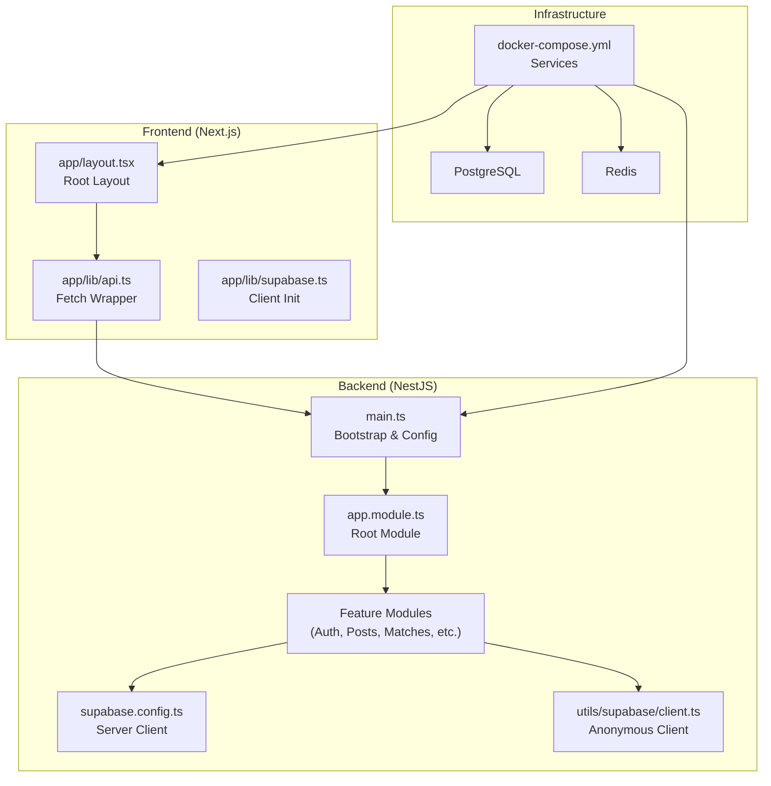
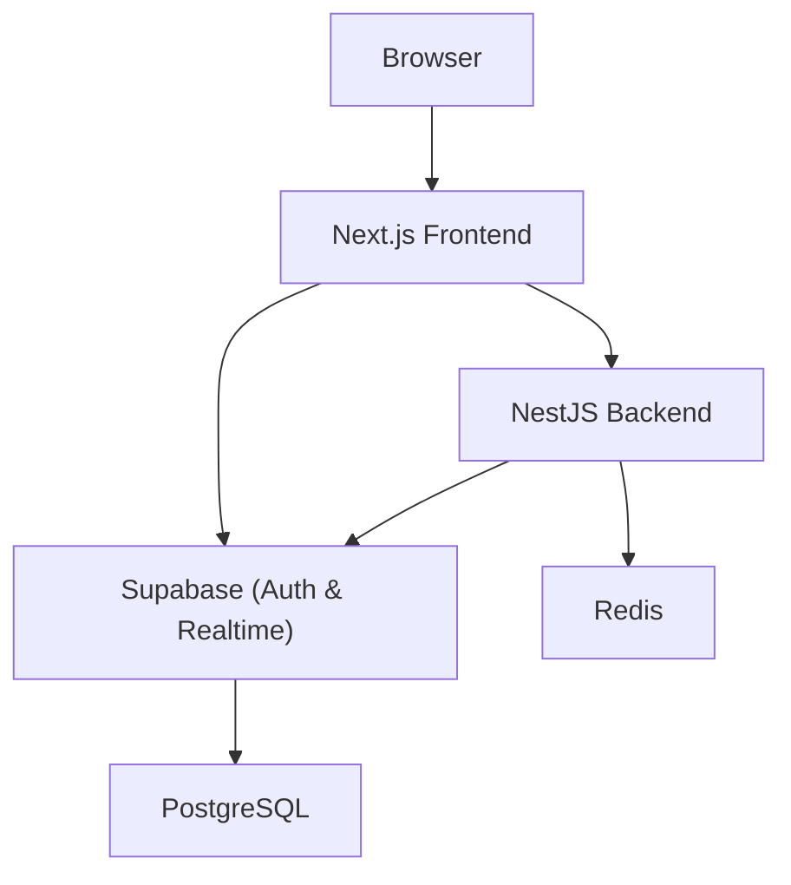
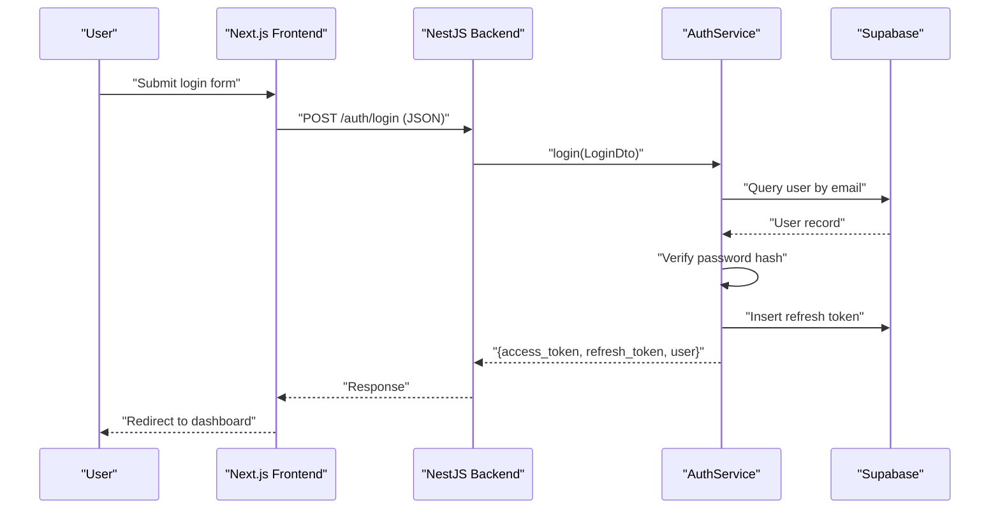
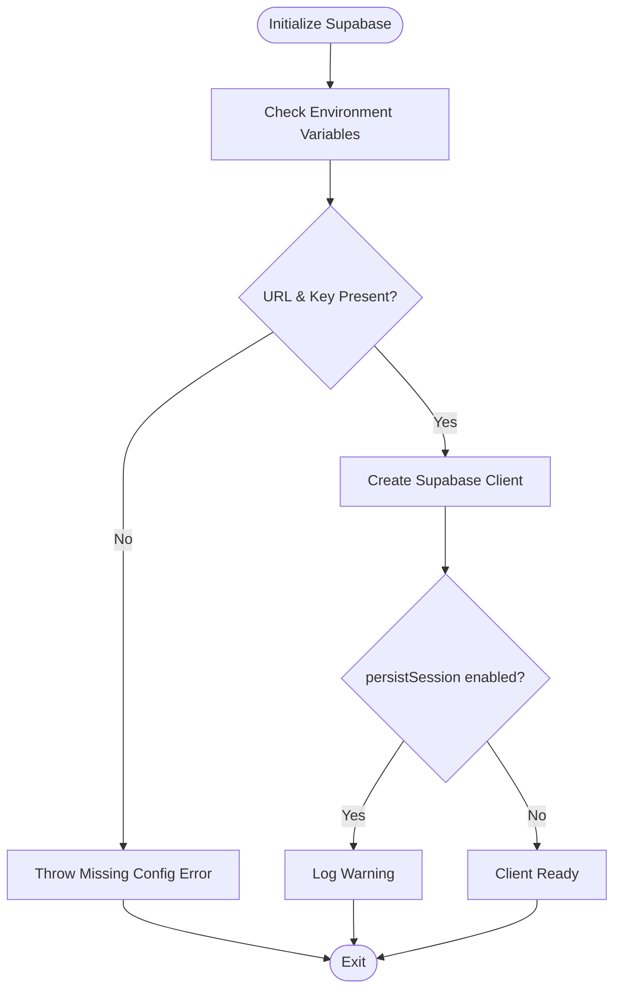
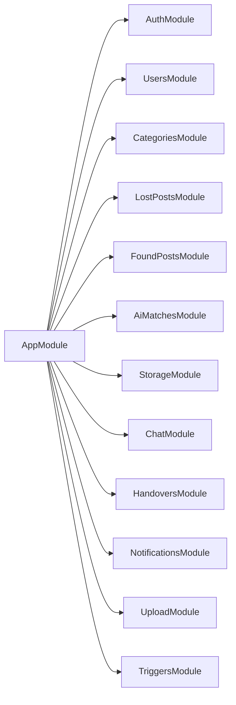
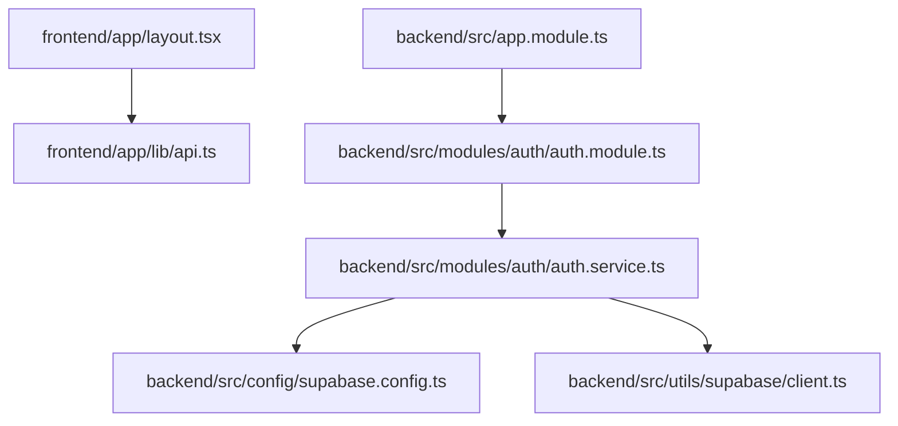

# Architecture Overview

<cite>
**Referenced Files in This Document**
- [backend/src/main.ts](file://backend/src/main.ts)
- [backend/src/app.module.ts](file://backend/src/app.module.ts)
- [backend/package.json](file://backend/package.json)
- [frontend/package.json](file://frontend/package.json)
- [docker-compose.yml](file://docker-compose.yml)
- [backend/Dockerfile](file://backend/Dockerfile)
- [frontend/Dockerfile](file://frontend/Dockerfile)
- [backend/src/config/supabase.config.ts](file://backend/src/config/supabase.config.ts)
- [backend/src/utils/supabase/client.ts](file://backend/src/utils/supabase/client.ts)
- [backend/src/modules/auth/auth.module.ts](file://backend/src/modules/auth/auth.module.ts)
- [backend/src/modules/auth/auth.service.ts](file://backend/src/modules/auth/auth.service.ts)
- [frontend/app/layout.tsx](file://frontend/app/layout.tsx)
- [frontend/app/lib/supabase.ts](file://frontend/app/lib/supabase.ts)
- [frontend/app/lib/api.ts](file://frontend/app/lib/api.ts)
</cite>

## Table of Contents
1. [Introduction](#introduction)
2. [Project Structure](#project-structure)
3. [Core Components](#core-components)
4. [Architecture Overview](#architecture-overview)
5. [Detailed Component Analysis](#detailed-component-analysis)
6. [Dependency Analysis](#dependency-analysis)
7. [Performance Considerations](#performance-considerations)
8. [Troubleshooting Guide](#troubleshooting-guide)
9. [Conclusion](#conclusion)

## Introduction
This document presents the architecture overview of the MissLost platform, a full-stack web application integrating a NestJS backend and a Next.js frontend. The system follows a modular architecture pattern, separating concerns across presentation, API, and persistence layers. It leverages Supabase for authentication and real-time capabilities, PostgreSQL for relational data, Redis for caching, and Docker for containerized deployment and orchestration. Cross-cutting concerns such as authentication, authorization, logging, and error handling are implemented consistently across the stack.

## Project Structure
The repository is organized into two primary applications:
- Backend: NestJS application bootstrapped in [backend/src/main.ts](file://backend/src/main.ts) and configured via [backend/src/app.module.ts](file://backend/src/app.module.ts). It exposes REST endpoints, integrates Supabase, and manages domain modules (authentication, posts, matches, storage, chat, etc.).
- Frontend: Next.js application configured in [frontend/next.config.ts](file://frontend/next.config.ts) and orchestrated via [frontend/app/layout.tsx](file://frontend/app/layout.tsx). It communicates with the backend using [frontend/app/lib/api.ts](file://frontend/app/lib/api.ts) and interacts with Supabase for client-side operations via [frontend/app/lib/supabase.ts](file://frontend/app/lib/supabase.ts).

Deployment is managed through [docker-compose.yml](file://docker-compose.yml), which defines services for backend, frontend, PostgreSQL, and Redis. Both applications include dedicated Dockerfiles for building and running in containers.

**Diagram sources**
- [backend/src/main.ts:1-45](file://backend/src/main.ts#L1-L45)
- [backend/src/app.module.ts:1-67](file://backend/src/app.module.ts#L1-L67)
- [backend/src/config/supabase.config.ts:1-25](file://backend/src/config/supabase.config.ts#L1-L25)
- [backend/src/utils/supabase/client.ts:1-19](file://backend/src/utils/supabase/client.ts#L1-L19)
- [frontend/app/layout.tsx:1-44](file://frontend/app/layout.tsx#L1-L44)
- [frontend/app/lib/api.ts:1-83](file://frontend/app/lib/api.ts#L1-L83)
- [frontend/app/lib/supabase.ts:1-18](file://frontend/app/lib/supabase.ts#L1-L18)
- [docker-compose.yml:1-61](file://docker-compose.yml#L1-L61)

**Section sources**
- [backend/src/main.ts:1-45](file://backend/src/main.ts#L1-L45)
- [backend/src/app.module.ts:1-67](file://backend/src/app.module.ts#L1-L67)
- [frontend/app/layout.tsx:1-44](file://frontend/app/layout.tsx#L1-L44)
- [frontend/app/lib/api.ts:1-83](file://frontend/app/lib/api.ts#L1-L83)
- [frontend/app/lib/supabase.ts:1-18](file://frontend/app/lib/supabase.ts#L1-L18)
- [docker-compose.yml:1-61](file://docker-compose.yml#L1-L61)

## Core Components
- Backend entrypoint and middleware:
  - Bootstraps the NestJS application, registers global validation, enables CORS, and exposes Swagger documentation.
  - References: [backend/src/main.ts:1-45](file://backend/src/main.ts#L1-L45)
- Root module composition:
  - Aggregates feature modules and registers global providers for exception filtering, response interception, and guards.
  - References: [backend/src/app.module.ts:1-67](file://backend/src/app.module.ts#L1-L67)
- Authentication module:
  - Configures JWT and Passport strategies, exposes registration, login, logout, email verification, and password reset flows.
  - References: [backend/src/modules/auth/auth.module.ts:1-35](file://backend/src/modules/auth/auth.module.ts#L1-L35), [backend/src/modules/auth/auth.service.ts:1-274](file://backend/src/modules/auth/auth.service.ts#L1-L274)
- Supabase integration:
  - Server-side client initialization and configuration for backend services.
  - References: [backend/src/config/supabase.config.ts:1-25](file://backend/src/config/supabase.config.ts#L1-L25), [backend/src/utils/supabase/client.ts:1-19](file://backend/src/utils/supabase/client.ts#L1-L19)
- Frontend integration:
  - Root layout composes theme provider, route guard, and client shell.
  - References: [frontend/app/layout.tsx:1-44](file://frontend/app/layout.tsx#L1-L44)
- Frontend API client:
  - Centralized fetch wrapper that injects Bearer tokens, handles credentials, and redirects on unauthorized responses.
  - References: [frontend/app/lib/api.ts:1-83](file://frontend/app/lib/api.ts#L1-L83)
- Frontend Supabase client:
  - Initializes Supabase client per request with configurable auth behavior and optional token header.
  - References: [frontend/app/lib/supabase.ts:1-18](file://frontend/app/lib/supabase.ts#L1-L18)

**Section sources**
- [backend/src/main.ts:1-45](file://backend/src/main.ts#L1-L45)
- [backend/src/app.module.ts:1-67](file://backend/src/app.module.ts#L1-L67)
- [backend/src/modules/auth/auth.module.ts:1-35](file://backend/src/modules/auth/auth.module.ts#L1-L35)
- [backend/src/modules/auth/auth.service.ts:1-274](file://backend/src/modules/auth/auth.service.ts#L1-L274)
- [backend/src/config/supabase.config.ts:1-25](file://backend/src/config/supabase.config.ts#L1-L25)
- [backend/src/utils/supabase/client.ts:1-19](file://backend/src/utils/supabase/client.ts#L1-L19)
- [frontend/app/layout.tsx:1-44](file://frontend/app/layout.tsx#L1-L44)
- [frontend/app/lib/api.ts:1-83](file://frontend/app/lib/api.ts#L1-L83)
- [frontend/app/lib/supabase.ts:1-18](file://frontend/app/lib/supabase.ts#L1-L18)

## Architecture Overview
The system is a full-stack web application structured around three layers:
- Presentation Layer (Next.js):
  - Handles UI rendering, routing, and user interactions. Integrates with Supabase for client-side auth and real-time features and communicates with the backend via a centralized fetch wrapper.
- API Layer (NestJS):
  - Exposes REST endpoints, enforces authentication and authorization, orchestrates business logic, and interacts with Supabase for user management and real-time events.
- Persistence Layer (PostgreSQL + Redis):
  - PostgreSQL stores relational data (users, posts, tokens, etc.). Redis provides caching for performance-sensitive operations.

**Diagram sources**
- [backend/src/main.ts:1-45](file://backend/src/main.ts#L1-L45)
- [frontend/app/lib/api.ts:1-83](file://frontend/app/lib/api.ts#L1-L83)
- [frontend/app/lib/supabase.ts:1-18](file://frontend/app/lib/supabase.ts#L1-L18)
- [backend/src/config/supabase.config.ts:1-25](file://backend/src/config/supabase.config.ts#L1-L25)

## Detailed Component Analysis

### Authentication Flow (Login)
This sequence illustrates the login flow from the frontend to the backend and Supabase.

**Diagram sources**
- [frontend/app/lib/api.ts:1-83](file://frontend/app/lib/api.ts#L1-L83)
- [backend/src/modules/auth/auth.service.ts:72-110](file://backend/src/modules/auth/auth.service.ts#L72-L110)
- [backend/src/config/supabase.config.ts:1-25](file://backend/src/config/supabase.config.ts#L1-L25)

**Section sources**
- [frontend/app/lib/api.ts:1-83](file://frontend/app/lib/api.ts#L1-L83)
- [backend/src/modules/auth/auth.service.ts:72-110](file://backend/src/modules/auth/auth.service.ts#L72-L110)
- [backend/src/config/supabase.config.ts:1-25](file://backend/src/config/supabase.config.ts#L1-L25)

### Supabase Client Initialization
The backend initializes a server-side Supabase client using service role keys, while the frontend initializes a client per request with optional token injection.

**Diagram sources**
- [backend/src/config/supabase.config.ts:1-25](file://backend/src/config/supabase.config.ts#L1-L25)
- [backend/src/utils/supabase/client.ts:1-19](file://backend/src/utils/supabase/client.ts#L1-L19)
- [frontend/app/lib/supabase.ts:1-18](file://frontend/app/lib/supabase.ts#L1-L18)

**Section sources**
- [backend/src/config/supabase.config.ts:1-25](file://backend/src/config/supabase.config.ts#L1-L25)
- [backend/src/utils/supabase/client.ts:1-19](file://backend/src/utils/supabase/client.ts#L1-L19)
- [frontend/app/lib/supabase.ts:1-18](file://frontend/app/lib/supabase.ts#L1-L18)

### Modular Architecture Pattern
The backend employs a feature-based module pattern. The root module aggregates feature modules, each encapsulating controllers, services, DTOs, entities, and strategies. This promotes separation of concerns and maintainability.

**Diagram sources**
- [backend/src/app.module.ts:12-26](file://backend/src/app.module.ts#L12-L26)

**Section sources**
- [backend/src/app.module.ts:12-26](file://backend/src/app.module.ts#L12-L26)

### Technology Stack
- Backend (NestJS):
  - Core dependencies include NestJS modules, JWT, Passport, Swagger, and Supabase clients.
  - References: [backend/package.json:22-46](file://backend/package.json#L22-L46)
- Frontend (Next.js):
  - Core dependencies include Next.js, React, and Supabase client.
  - References: [frontend/package.json:11-17](file://frontend/package.json#L11-L17)
- Database and Caching:
  - PostgreSQL and Redis are orchestrated via Docker Compose.
  - References: [docker-compose.yml:27-44](file://docker-compose.yml#L27-L44)
- Containerization:
  - Separate Dockerfiles for backend and frontend define build and runtime steps.
  - References: [backend/Dockerfile:1-14](file://backend/Dockerfile#L1-L14), [frontend/Dockerfile:1-14](file://frontend/Dockerfile#L1-L14)

**Section sources**
- [backend/package.json:22-46](file://backend/package.json#L22-L46)
- [frontend/package.json:11-17](file://frontend/package.json#L11-L17)
- [docker-compose.yml:27-44](file://docker-compose.yml#L27-L44)
- [backend/Dockerfile:1-14](file://backend/Dockerfile#L1-L14)
- [frontend/Dockerfile:1-14](file://frontend/Dockerfile#L1-L14)

## Dependency Analysis
The backend’s root module composes feature modules, while the frontend composes layout components and uses API helpers. Supabase acts as a shared integration point for authentication and real-time features.

**Diagram sources**
- [frontend/app/lib/api.ts:1-83](file://frontend/app/lib/api.ts#L1-L83)
- [frontend/app/layout.tsx:1-44](file://frontend/app/layout.tsx#L1-L44)
- [backend/src/app.module.ts:12-26](file://backend/src/app.module.ts#L12-L26)
- [backend/src/modules/auth/auth.module.ts:1-35](file://backend/src/modules/auth/auth.module.ts#L1-L35)
- [backend/src/modules/auth/auth.service.ts:1-274](file://backend/src/modules/auth/auth.service.ts#L1-L274)
- [backend/src/config/supabase.config.ts:1-25](file://backend/src/config/supabase.config.ts#L1-L25)
- [backend/src/utils/supabase/client.ts:1-19](file://backend/src/utils/supabase/client.ts#L1-L19)

**Section sources**
- [frontend/app/lib/api.ts:1-83](file://frontend/app/lib/api.ts#L1-L83)
- [frontend/app/layout.tsx:1-44](file://frontend/app/layout.tsx#L1-L44)
- [backend/src/app.module.ts:12-26](file://backend/src/app.module.ts#L12-L26)
- [backend/src/modules/auth/auth.module.ts:1-35](file://backend/src/modules/auth/auth.module.ts#L1-L35)
- [backend/src/modules/auth/auth.service.ts:1-274](file://backend/src/modules/auth/auth.service.ts#L1-L274)
- [backend/src/config/supabase.config.ts:1-25](file://backend/src/config/supabase.config.ts#L1-L25)
- [backend/src/utils/supabase/client.ts:1-19](file://backend/src/utils/supabase/client.ts#L1-L19)

## Performance Considerations
- Caching: Redis is provisioned in the stack for caching strategies; integrate cache-aside or write-through patterns for frequently accessed resources.
- Database: Use connection pooling and consider indexing strategies for high-cardinality queries (e.g., posts, users).
- Frontend: Debounce API calls and leverage Next.js static generation where appropriate to reduce server load.
- Supabase: Offload heavy computations to the backend and use Supabase’s row-level security policies to minimize unnecessary data transfer.

## Troubleshooting Guide
- Authentication failures:
  - Verify JWT secret configuration and ensure environment variables are present for the auth module.
  - References: [backend/src/modules/auth/auth.module.ts:14-28](file://backend/src/modules/auth/auth.module.ts#L14-L28)
- Supabase connectivity:
  - Confirm Supabase URL and keys are set; errors are thrown if required environment variables are missing.
  - References: [backend/src/config/supabase.config.ts:9-14](file://backend/src/config/supabase.config.ts#L9-L14), [backend/src/utils/supabase/client.ts:10-15](file://backend/src/utils/supabase/client.ts#L10-L15)
- Frontend unauthorized responses:
  - The API helper clears local storage and redirects to login on 401; inspect network tab for failed requests.
  - References: [frontend/app/lib/api.ts:30-35](file://frontend/app/lib/api.ts#L30-L35)
- CORS and Swagger:
  - CORS is enabled for the configured frontend URL; Swagger is exposed under /api-docs.
  - References: [backend/src/main.ts:24-37](file://backend/src/main.ts#L24-L37)

**Section sources**
- [backend/src/modules/auth/auth.module.ts:14-28](file://backend/src/modules/auth/auth.module.ts#L14-L28)
- [backend/src/config/supabase.config.ts:9-14](file://backend/src/config/supabase.config.ts#L9-L14)
- [backend/src/utils/supabase/client.ts:10-15](file://backend/src/utils/supabase/client.ts#L10-L15)
- [frontend/app/lib/api.ts:30-35](file://frontend/app/lib/api.ts#L30-L35)
- [backend/src/main.ts:24-37](file://backend/src/main.ts#L24-L37)

## Conclusion
MissLost adopts a clean, modular architecture with clear separation between the frontend presentation layer, backend API layer, and database layer. Supabase unifies authentication and real-time features, while Docker simplifies deployment and orchestration. By leveraging environment-driven configuration, centralized API wrappers, and robust guards and interceptors, the system balances developer productivity with operational reliability.