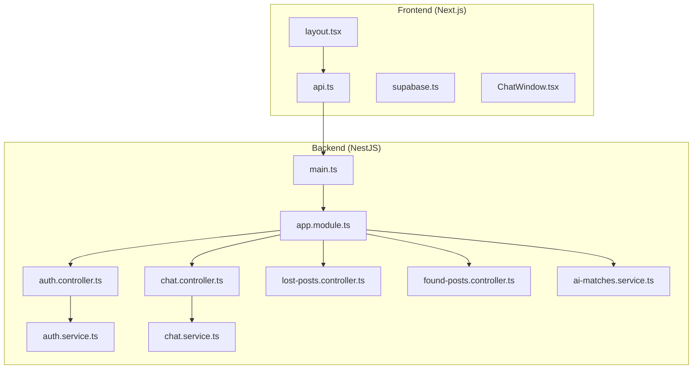
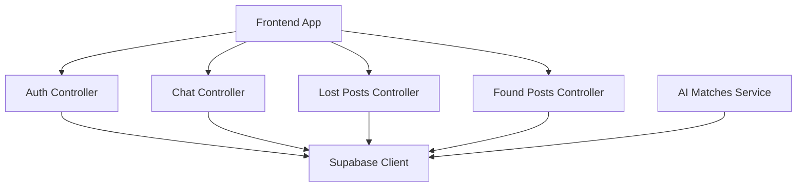
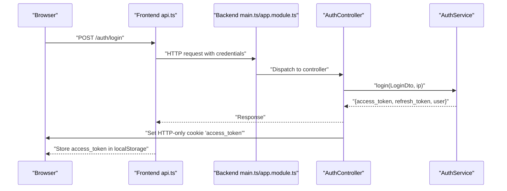
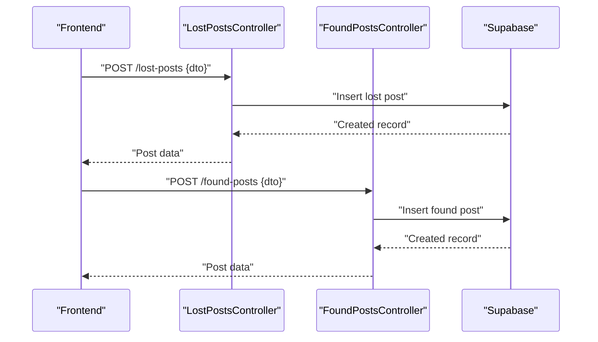
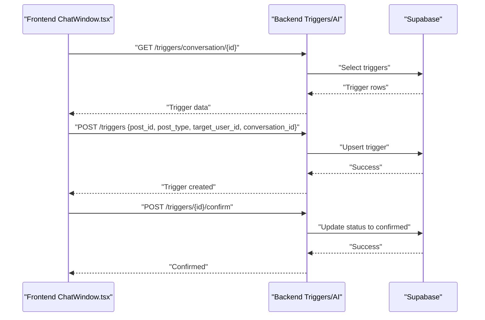
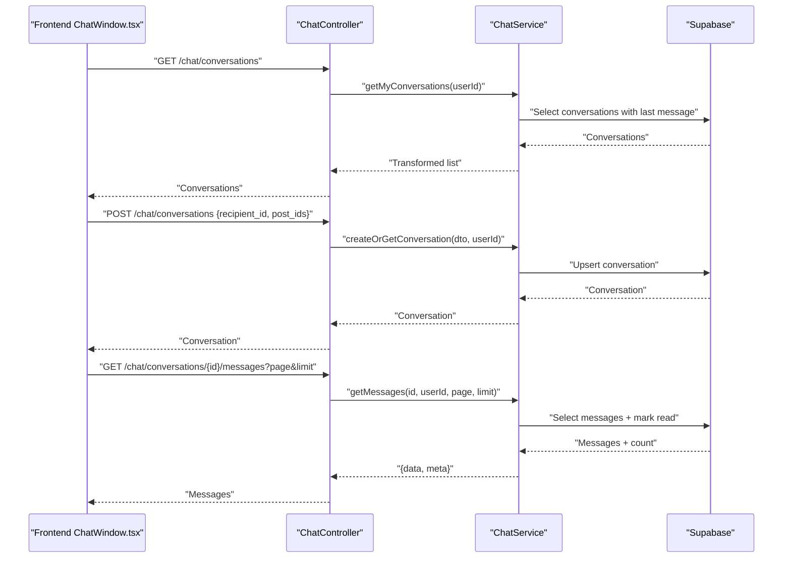
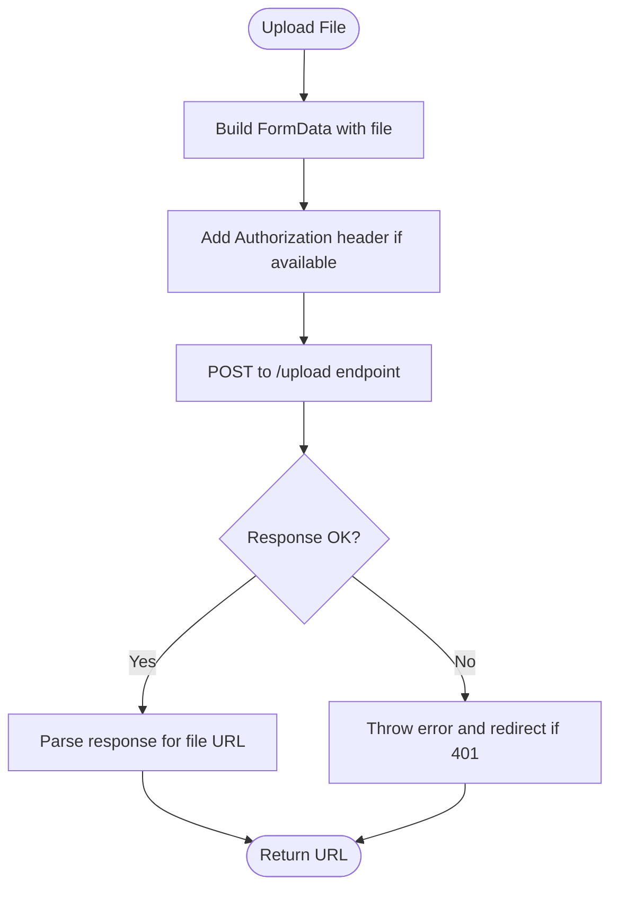
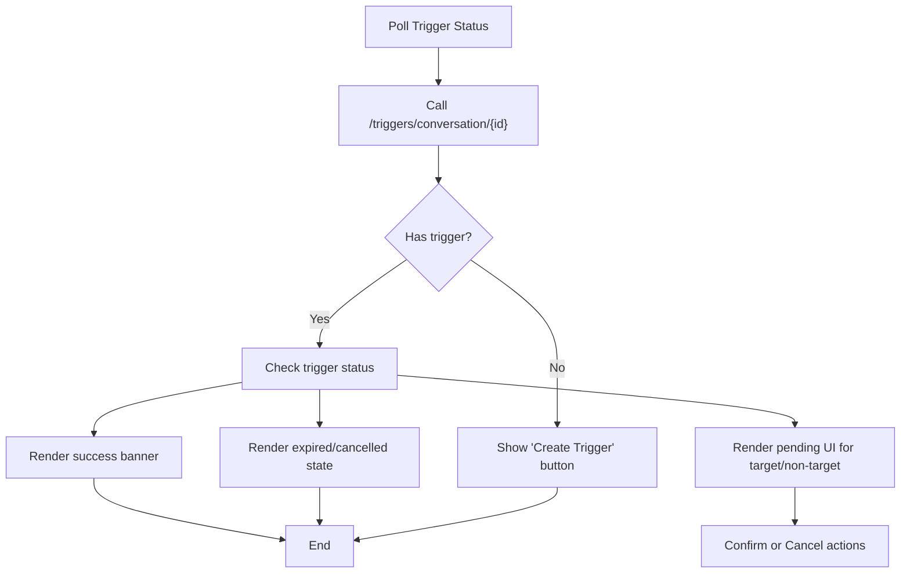
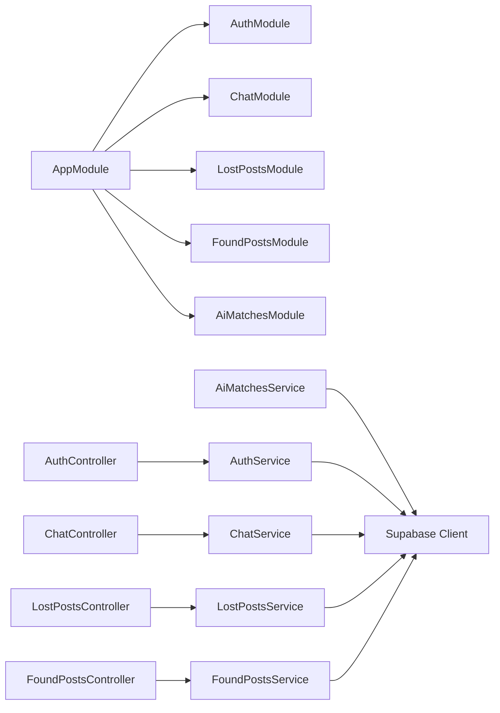

# Component Interactions

<cite>
**Referenced Files in This Document**
- [main.ts](file://backend/src/main.ts)
- [app.module.ts](file://backend/src/app.module.ts)
- [jwt-auth.guard.ts](file://backend/src/common/guards/jwt-auth.guard.ts)
- [auth.controller.ts](file://backend/src/modules/auth/auth.controller.ts)
- [auth.service.ts](file://backend/src/modules/auth/auth.service.ts)
- [chat.controller.ts](file://backend/src/modules/chat/chat.controller.ts)
- [chat.service.ts](file://backend/src/modules/chat/chat.service.ts)
- [lost-posts.controller.ts](file://backend/src/modules/lost-posts/lost-posts.controller.ts)
- [found-posts.controller.ts](file://backend/src/modules/found-posts/found-posts.controller.ts)
- [ai-matches.service.ts](file://backend/src/modules/ai-matches/ai-matches.service.ts)
- [supabase.ts](file://frontend/app/lib/supabase.ts)
- [api.ts](file://frontend/app/lib/api.ts)
- [ChatWindow.tsx](file://frontend/app/messages/ChatWindow.tsx)
- [types.ts](file://frontend/app/messages/types.ts)
- [layout.tsx](file://frontend/app/layout.tsx)
</cite>

## Table of Contents
1. [Introduction](#introduction)
2. [Project Structure](#project-structure)
3. [Core Components](#core-components)
4. [Architecture Overview](#architecture-overview)
5. [Detailed Component Analysis](#detailed-component-analysis)
6. [Dependency Analysis](#dependency-analysis)
7. [Performance Considerations](#performance-considerations)
8. [Troubleshooting Guide](#troubleshooting-guide)
9. [Conclusion](#conclusion)

## Introduction
This document explains how the MissLost platform orchestrates interactions between the frontend and backend, including HTTP request flows, authentication token handling, real-time-like features, and event-driven patterns. It documents NestJS module-to-module communication, dependency injection, service-layer interactions, and the data exchange protocols used for posts, chats, AI matching, and handover triggers. It also covers error propagation, retry and fallback strategies, caching considerations, and eventual consistency across distributed components.

## Project Structure
The system comprises:
- Backend: NestJS application bootstrapped with global pipes, CORS, and Swagger. Central AppModule aggregates feature modules (auth, users, posts, chat, AI matches, storage, triggers, uploads, notifications, handovers).
- Frontend: Next.js app with a themed shell, route protection, and API helpers for authenticated requests and file uploads.

**Diagram sources**
- [main.ts:1-45](file://backend/src/main.ts#L1-L45)
- [app.module.ts:1-67](file://backend/src/app.module.ts#L1-L67)
- [auth.controller.ts:1-130](file://backend/src/modules/auth/auth.controller.ts#L1-L130)
- [auth.service.ts:1-280](file://backend/src/modules/auth/auth.service.ts#L1-L280)
- [chat.controller.ts:1-50](file://backend/src/modules/chat/chat.controller.ts#L1-L50)
- [chat.service.ts:1-151](file://backend/src/modules/chat/chat.service.ts#L1-L151)
- [lost-posts.controller.ts:1-78](file://backend/src/modules/lost-posts/lost-posts.controller.ts#L1-L78)
- [found-posts.controller.ts:1-78](file://backend/src/modules/found-posts/found-posts.controller.ts#L1-L78)
- [ai-matches.service.ts:1-367](file://backend/src/modules/ai-matches/ai-matches.service.ts#L1-L367)
- [layout.tsx:1-44](file://frontend/app/layout.tsx#L1-L44)
- [api.ts:1-83](file://frontend/app/lib/api.ts#L1-L83)
- [supabase.ts:1-18](file://frontend/app/lib/supabase.ts#L1-L18)
- [ChatWindow.tsx:1-348](file://frontend/app/messages/ChatWindow.tsx#L1-L348)

**Section sources**
- [main.ts:1-45](file://backend/src/main.ts#L1-L45)
- [app.module.ts:1-67](file://backend/src/app.module.ts#L1-L67)
- [layout.tsx:1-44](file://frontend/app/layout.tsx#L1-L44)

## Core Components
- Authentication and session: Backend handles JWT signing and HTTP-only cookie issuance for secure sessions. Frontend stores a local access token and sends Authorization headers. Google OAuth redirects are handled server-side with cookie-based token delivery.
- Real-time chat: Protected chat endpoints manage conversations and messages. Frontend polls trigger status due to Supabase permissions; chat messages are fetched with pagination and read receipts.
- AI matching: Text-based matching engine computes similarity scores and persists match records; owners and finders confirm matches to finalize handover readiness.
- Posts: Lost and found posts expose CRUD APIs with public feeds and admin review workflows.
- Supabase integration: Backend services use a shared Supabase client configured with environment keys and optional token headers.

**Section sources**
- [auth.controller.ts:1-130](file://backend/src/modules/auth/auth.controller.ts#L1-L130)
- [auth.service.ts:1-280](file://backend/src/modules/auth/auth.service.ts#L1-L280)
- [chat.controller.ts:1-50](file://backend/src/modules/chat/chat.controller.ts#L1-L50)
- [chat.service.ts:1-151](file://backend/src/modules/chat/chat.service.ts#L1-L151)
- [lost-posts.controller.ts:1-78](file://backend/src/modules/lost-posts/lost-posts.controller.ts#L1-L78)
- [found-posts.controller.ts:1-78](file://backend/src/modules/found-posts/found-posts.controller.ts#L1-L78)
- [ai-matches.service.ts:1-367](file://backend/src/modules/ai-matches/ai-matches.service.ts#L1-L367)
- [api.ts:1-83](file://frontend/app/lib/api.ts#L1-L83)
- [supabase.ts:1-18](file://frontend/app/lib/supabase.ts#L1-L18)

## Architecture Overview
The backend exposes REST endpoints guarded by JWT and role guards. Controllers delegate to services that interact with Supabase. The frontend authenticates via cookies and/or local token, performs authenticated fetches, and renders UI components. Real-time features are implemented via periodic polling and server-managed triggers.

**Diagram sources**
- [auth.controller.ts:1-130](file://backend/src/modules/auth/auth.controller.ts#L1-L130)
- [chat.controller.ts:1-50](file://backend/src/modules/chat/chat.controller.ts#L1-L50)
- [lost-posts.controller.ts:1-78](file://backend/src/modules/lost-posts/lost-posts.controller.ts#L1-L78)
- [found-posts.controller.ts:1-78](file://backend/src/modules/found-posts/found-posts.controller.ts#L1-L78)
- [ai-matches.service.ts:1-367](file://backend/src/modules/ai-matches/ai-matches.service.ts#L1-L367)
- [supabase.ts:1-18](file://frontend/app/lib/supabase.ts#L1-L18)

## Detailed Component Analysis

### Authentication Flow: Cookie-Based Session and Token Handling
- Backend:
  - Registers cookie parser and global validation pipe.
  - Enables CORS for frontend origin with credentials.
  - Exposes auth endpoints for registration, login, logout, email verification, forgot/reset password, and Google OAuth.
  - Issues HTTP-only cookies for access tokens on successful login and Google callback.
  - Guards routes with JWT and role guards.
- Frontend:
  - Stores access token in localStorage and sends Authorization header.
  - Sends credentials: include to propagate cookies.
  - On 401, clears localStorage and redirects to login.

**Diagram sources**
- [main.ts:1-45](file://backend/src/main.ts#L1-L45)
- [app.module.ts:1-67](file://backend/src/app.module.ts#L1-L67)
- [auth.controller.ts:1-130](file://backend/src/modules/auth/auth.controller.ts#L1-L130)
- [auth.service.ts:1-280](file://backend/src/modules/auth/auth.service.ts#L1-L280)
- [api.ts:1-83](file://frontend/app/lib/api.ts#L1-L83)

**Section sources**
- [main.ts:1-45](file://backend/src/main.ts#L1-L45)
- [auth.controller.ts:1-130](file://backend/src/modules/auth/auth.controller.ts#L1-L130)
- [auth.service.ts:1-280](file://backend/src/modules/auth/auth.service.ts#L1-L280)
- [api.ts:1-83](file://frontend/app/lib/api.ts#L1-L83)

### Post Creation Workflow: Lost and Found Posts
- Lost posts:
  - Controller exposes POST /lost-posts for creation, GET /lost-posts for public feed, and admin endpoints for pending reviews.
  - Service validates ownership/roles and interacts with Supabase.
- Found posts:
  - Similar pattern for creation, public feed, personal feed, and admin review.

**Diagram sources**
- [lost-posts.controller.ts:1-78](file://backend/src/modules/lost-posts/lost-posts.controller.ts#L1-L78)
- [found-posts.controller.ts:1-78](file://backend/src/modules/found-posts/found-posts.controller.ts#L1-L78)

**Section sources**
- [lost-posts.controller.ts:1-78](file://backend/src/modules/lost-posts/lost-posts.controller.ts#L1-L78)
- [found-posts.controller.ts:1-78](file://backend/src/modules/found-posts/found-posts.controller.ts#L1-L78)

### AI Matching and Handover Triggers
- AI matching:
  - Service computes text similarity between lost and found posts and upserts match records.
  - Owners and finders can confirm matches; mutual confirmation sets status to confirmed.
- Handover triggers:
  - Frontend polls trigger status per conversation due to Supabase permissions.
  - Actions include creating a trigger, confirming by target user, and canceling by creator.

**Diagram sources**
- [ChatWindow.tsx:1-348](file://frontend/app/messages/ChatWindow.tsx#L1-L348)
- [ai-matches.service.ts:1-367](file://backend/src/modules/ai-matches/ai-matches.service.ts#L1-L367)

**Section sources**
- [ai-matches.service.ts:1-367](file://backend/src/modules/ai-matches/ai-matches.service.ts#L1-L367)
- [ChatWindow.tsx:1-348](file://frontend/app/messages/ChatWindow.tsx#L1-L348)
- [types.ts:1-51](file://frontend/app/messages/types.ts#L1-L51)

### Chat Communication: Conversations and Messages
- Controllers:
  - List conversations, create or get a conversation, list messages with pagination, send messages, and unread counts.
- Services:
  - Enforce participant checks, mark messages as read for others, and select relations for rendering.
- Frontend:
  - Renders messages anchored to bottom, auto-scrolls on updates, and polls trigger status.

**Diagram sources**
- [chat.controller.ts:1-50](file://backend/src/modules/chat/chat.controller.ts#L1-L50)
- [chat.service.ts:1-151](file://backend/src/modules/chat/chat.service.ts#L1-L151)
- [ChatWindow.tsx:1-348](file://frontend/app/messages/ChatWindow.tsx#L1-L348)

**Section sources**
- [chat.controller.ts:1-50](file://backend/src/modules/chat/chat.controller.ts#L1-L50)
- [chat.service.ts:1-151](file://backend/src/modules/chat/chat.service.ts#L1-L151)
- [ChatWindow.tsx:1-348](file://frontend/app/messages/ChatWindow.tsx#L1-L348)

### File Uploads and Downloads
- Frontend:
  - Uses multipart/form-data upload via a dedicated function that includes credentials and Authorization header if present.
  - Extracts URL from response payload.
- Backend:
  - Upload module/controller exists in the backend structure; the frontend does not directly call upload endpoints shown here. The upload flow follows the same authenticated fetch pattern as other endpoints.

**Diagram sources**
- [api.ts:48-82](file://frontend/app/lib/api.ts#L48-L82)

**Section sources**
- [api.ts:1-83](file://frontend/app/lib/api.ts#L1-L83)

### Real-Time Features and Event-Driven Patterns
- Real-time chat:
  - Backend: protected endpoints for messages and conversations.
  - Frontend: polls trigger status every 10 seconds due to Supabase permissions; messages are paginated and read receipts are applied server-side.
- Notifications and background processing:
  - Scheduled tasks are enabled globally; the Notifications module exists in the backend structure. While specific notification flows are not detailed here, scheduled jobs and module wiring support event-driven background processing.

**Diagram sources**
- [ChatWindow.tsx:32-57](file://frontend/app/messages/ChatWindow.tsx#L32-L57)

**Section sources**
- [chat.service.ts:1-151](file://backend/src/modules/chat/chat.service.ts#L1-L151)
- [ChatWindow.tsx:1-348](file://frontend/app/messages/ChatWindow.tsx#L1-L348)
- [app.module.ts:1-67](file://backend/src/app.module.ts#L1-L67)

## Dependency Analysis
- NestJS DI and guards:
  - AppModule registers global providers for filters, interceptors, and guards.
  - JwtAuthGuard integrates with reflection to allow public routes and throws UnauthorizedException otherwise.
- Module composition:
  - Feature modules are imported into AppModule; controllers depend on services; services depend on Supabase client.

**Diagram sources**
- [app.module.ts:1-67](file://backend/src/app.module.ts#L1-L67)
- [jwt-auth.guard.ts:1-29](file://backend/src/common/guards/jwt-auth.guard.ts#L1-L29)
- [auth.controller.ts:1-130](file://backend/src/modules/auth/auth.controller.ts#L1-L130)
- [auth.service.ts:1-280](file://backend/src/modules/auth/auth.service.ts#L1-L280)
- [chat.controller.ts:1-50](file://backend/src/modules/chat/chat.controller.ts#L1-L50)
- [chat.service.ts:1-151](file://backend/src/modules/chat/chat.service.ts#L1-L151)
- [lost-posts.controller.ts:1-78](file://backend/src/modules/lost-posts/lost-posts.controller.ts#L1-L78)
- [found-posts.controller.ts:1-78](file://backend/src/modules/found-posts/found-posts.controller.ts#L1-L78)
- [ai-matches.service.ts:1-367](file://backend/src/modules/ai-matches/ai-matches.service.ts#L1-L367)

**Section sources**
- [app.module.ts:1-67](file://backend/src/app.module.ts#L1-L67)
- [jwt-auth.guard.ts:1-29](file://backend/src/common/guards/jwt-auth.guard.ts#L1-L29)

## Performance Considerations
- Pagination and limits:
  - Chat endpoints accept page and limit parameters to bound payload sizes.
- Read receipts:
  - Server marks messages as read for other participants upon retrieval, reducing redundant reads.
- Supabase queries:
  - Selects use joins and ordering with foreign tables to minimize client-side work.
- Polling cadence:
  - Frontend polls trigger status every 10 seconds to balance responsiveness and load.

**Section sources**
- [chat.controller.ts:27-36](file://backend/src/modules/chat/chat.controller.ts#L27-L36)
- [chat.service.ts:68-100](file://backend/src/modules/chat/chat.service.ts#L68-L100)
- [ChatWindow.tsx:54-56](file://frontend/app/messages/ChatWindow.tsx#L54-L56)

## Troubleshooting Guide
- Authentication failures:
  - 401 responses clear localStorage and redirect to login. Verify cookies are sent with credentials and Authorization header is included when applicable.
- Token leakage prevention:
  - Backend uses HTTP-only cookies for access tokens and avoids placing tokens in URL fragments.
- Supabase permission limitations:
  - Frontend polls trigger status instead of relying on Supabase realtime due to anon key restrictions.
- Error propagation:
  - Backend throws typed exceptions; frontend surfaces errors and prevents silent failures.

**Section sources**
- [auth.controller.ts:51-61](file://backend/src/modules/auth/auth.controller.ts#L51-L61)
- [auth.controller.ts:98-128](file://backend/src/modules/auth/auth.controller.ts#L98-L128)
- [api.ts:30-43](file://frontend/app/lib/api.ts#L30-L43)
- [ChatWindow.tsx:32-43](file://frontend/app/messages/ChatWindow.tsx#L32-L43)

## Conclusion
MissLost’s architecture couples a secure NestJS backend with a responsive Next.js frontend. Authentication relies on HTTP-only cookies and local tokens, while Supabase underpins data persistence and constrained real-time features. Controllers orchestrate service-layer logic, enabling scalable post management, AI-driven matching, and chat workflows. Real-time needs are met through polling and server-managed triggers, ensuring robust UX with manageable operational overhead.