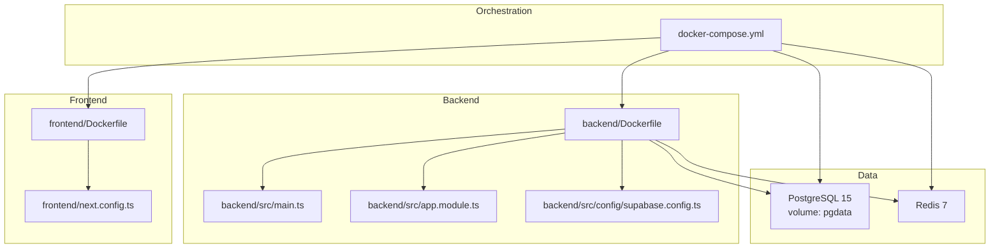
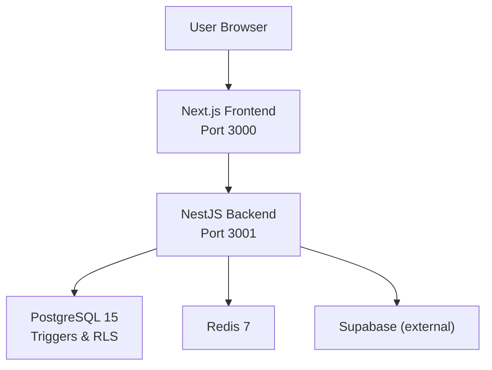
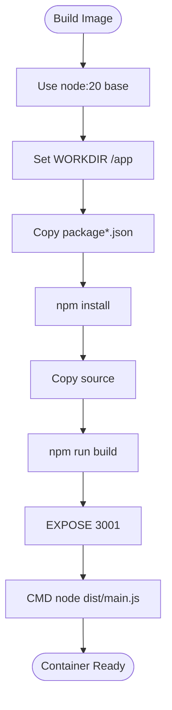
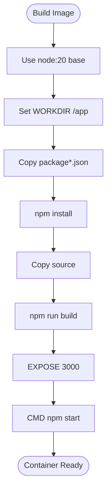
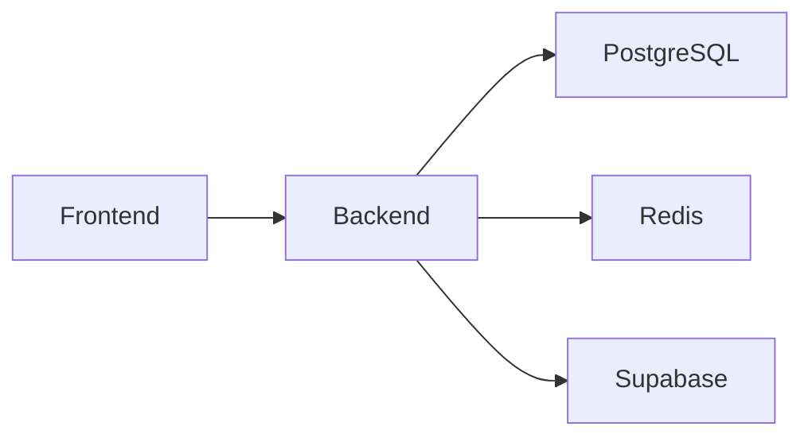

# Deployment Architecture

<cite>
**Referenced Files in This Document**
- [docker-compose.yml](file://docker-compose.yml)
- [backend/Dockerfile](file://backend/Dockerfile)
- [frontend/Dockerfile](file://frontend/Dockerfile)
- [backend/src/main.ts](file://backend/src/main.ts)
- [backend/src/app.module.ts](file://backend/src/app.module.ts)
- [backend/src/config/supabase.config.ts](file://backend/src/config/supabase.config.ts)
- [backend/package.json](file://backend/package.json)
- [frontend/package.json](file://frontend/package.json)
- [frontend/next.config.ts](file://frontend/next.config.ts)
- [backend/sql/triggers_migration.sql](file://backend/sql/triggers_migration.sql)
- [GOOGLE_OAUTH_SETUP.md](file://GOOGLE_OAUTH_SETUP.md)
- [OVERVIEW.md](file://OVERVIEW.md)
</cite>

## Table of Contents
1. [Introduction](#introduction)
2. [Project Structure](#project-structure)
3. [Core Components](#core-components)
4. [Architecture Overview](#architecture-overview)
5. [Detailed Component Analysis](#detailed-component-analysis)
6. [Dependency Analysis](#dependency-analysis)
7. [Performance Considerations](#performance-considerations)
8. [Troubleshooting Guide](#troubleshooting-guide)
9. [Conclusion](#conclusion)
10. [Appendices](#appendices)

## Introduction
This document describes the containerized deployment architecture for the MissLost platform. It covers orchestration via Docker Compose, multi-stage builds for backend and frontend, environment and secrets management, configuration patterns, scaling and load balancing, health checks, CI/CD considerations, rollback procedures, security, networking, backups, monitoring/logging, performance tuning, and capacity planning.

## Project Structure
The deployment spans four primary containers orchestrated by Docker Compose:
- Backend API service (NestJS)
- Frontend web application (Next.js)
- PostgreSQL database (with persistent volume)
- Redis cache

**Diagram sources**
- [docker-compose.yml:1-61](file://docker-compose.yml#L1-L61)
- [backend/Dockerfile:1-14](file://backend/Dockerfile#L1-L14)
- [frontend/Dockerfile:1-14](file://frontend/Dockerfile#L1-L14)
- [backend/src/main.ts:1-45](file://backend/src/main.ts#L1-L45)
- [backend/src/app.module.ts:1-67](file://backend/src/app.module.ts#L1-L67)
- [backend/src/config/supabase.config.ts:1-25](file://backend/src/config/supabase.config.ts#L1-L25)
- [frontend/next.config.ts:1-8](file://frontend/next.config.ts#L1-L8)

**Section sources**
- [docker-compose.yml:1-61](file://docker-compose.yml#L1-L61)
- [backend/Dockerfile:1-14](file://backend/Dockerfile#L1-L14)
- [frontend/Dockerfile:1-14](file://frontend/Dockerfile#L1-L14)

## Core Components
- Backend API
  - Built from a single-stage Node.js base image, compiles TypeScript, exposes port 3001, and runs the compiled main entrypoint.
  - Uses NestJS with global validation, CORS, and Swagger for API documentation.
  - Environment-driven configuration for port, frontend origin, and Supabase client initialization.
- Frontend Application
  - Built from a single-stage Node.js base image, compiles Next.js, exposes port 3000, and starts the production server.
  - Configuration is minimal in the provided file; runtime environment variables are expected via the Compose env_file.
- Database and Cache
  - PostgreSQL 15 with a named volume for persistence.
  - Redis 7 for caching.
- Authentication and Authorization
  - Supabase client initialized from environment variables.
  - Google OAuth setup documented for development and production.

**Section sources**
- [backend/src/main.ts:1-45](file://backend/src/main.ts#L1-L45)
- [backend/src/app.module.ts:1-67](file://backend/src/app.module.ts#L1-L67)
- [backend/src/config/supabase.config.ts:1-25](file://backend/src/config/supabase.config.ts#L1-L25)
- [backend/Dockerfile:1-14](file://backend/Dockerfile#L1-L14)
- [frontend/Dockerfile:1-14](file://frontend/Dockerfile#L1-L14)
- [frontend/next.config.ts:1-8](file://frontend/next.config.ts#L1-L8)
- [docker-compose.yml:27-44](file://docker-compose.yml#L27-L44)

## Architecture Overview
The system follows a classic three-tier pattern:
- Presentation tier: Next.js frontend
- Application tier: NestJS backend
- Data tier: PostgreSQL with triggers and RLS; Redis cache

**Diagram sources**
- [docker-compose.yml:3-25](file://docker-compose.yml#L3-L25)
- [backend/src/main.ts:24-27](file://backend/src/main.ts#L24-L27)
- [backend/src/config/supabase.config.ts:9-14](file://backend/src/config/supabase.config.ts#L9-L14)
- [backend/sql/triggers_migration.sql:1-338](file://backend/sql/triggers_migration.sql#L1-L338)

## Detailed Component Analysis

### Backend API Containerization and Build
- Multi-stage build is not currently implemented; the Dockerfile performs install, copy, build, expose, and run in a single stage.
- Ports exposed inside the container and mapped externally per Compose.
- Depends on PostgreSQL and Redis services.

**Diagram sources**
- [backend/Dockerfile:1-14](file://backend/Dockerfile#L1-L14)

**Section sources**
- [backend/Dockerfile:1-14](file://backend/Dockerfile#L1-L14)
- [docker-compose.yml:4-14](file://docker-compose.yml#L4-L14)

### Frontend Application Containerization and Build
- Single-stage build mirrors backend: install, copy, build, expose, start.
- Depends on backend service.

**Diagram sources**
- [frontend/Dockerfile:1-14](file://frontend/Dockerfile#L1-L14)

**Section sources**
- [frontend/Dockerfile:1-14](file://frontend/Dockerfile#L1-L14)
- [docker-compose.yml:16-25](file://docker-compose.yml#L16-L25)

### Environment Variables and Secrets Management
- Backend loads environment variables from a dedicated env file and uses them for:
  - Port binding
  - CORS origin
  - Supabase client initialization
- Frontend loads environment variables from a dedicated env file.
- Supabase client requires URL and either a service role key or anonymous key.
- Google OAuth setup documents client ID, secret, callback URL, and frontend URL.

Recommended practices:
- Store secrets outside the repository (e.g., external secret manager or Compose secrets).
- Separate development and production environment files.
- Use non-root users and read-only filesystems where possible.

**Section sources**
- [docker-compose.yml:12-13](file://docker-compose.yml#L12-L13)
- [docker-compose.yml:23-24](file://docker-compose.yml#L23-L24)
- [backend/src/main.ts:24-27](file://backend/src/main.ts#L24-L27)
- [backend/src/main.ts:39-40](file://backend/src/main.ts#L39-L40)
- [backend/src/config/supabase.config.ts:9-14](file://backend/src/config/supabase.config.ts#L9-L14)
- [GOOGLE_OAUTH_SETUP.md:55-63](file://GOOGLE_OAUTH_SETUP.md#L55-L63)

### Configuration Deployment Patterns
- Backend uses NestJS ConfigModule for global configuration.
- Frontend configuration is minimal; rely on env vars loaded via Compose.
- Database schema and triggers are provided as SQL scripts; initialize during first run or via migration tooling.

**Section sources**
- [backend/src/app.module.ts:30-31](file://backend/src/app.module.ts#L30-L31)
- [frontend/next.config.ts:1-8](file://frontend/next.config.ts#L1-L8)
- [backend/sql/triggers_migration.sql:1-338](file://backend/sql/triggers_migration.sql#L1-L338)

### Scaling Strategies and Load Balancing
- Current Compose setup runs single replicas of backend and frontend.
- Recommended horizontal scaling:
  - Run multiple backend replicas behind a reverse proxy/load balancer.
  - Use sticky sessions if JWT cookies are stateful; otherwise distribute across instances.
  - Scale Redis for caching and rate limiting; consider Redis Sentinel or clustering for HA.
- Vertical scaling:
  - Increase CPU/RAM limits for backend and database based on observed metrics.

[No sources needed since this section provides general guidance]

### Health Checks
- Implement readiness probes on backend (e.g., HTTP GET /health) returning 200 when DB and cache connections are ready.
- Implement liveness probes to restart unhealthy containers automatically.
- Frontend can use a simple HTTP probe against the Next.js server.

[No sources needed since this section provides general guidance]

### Monitoring and Logging
- Backend:
  - Enable structured logging (e.g., NestJS logger with JSON format).
  - Expose metrics via Prometheus-compatible endpoint (e.g., NestJS Prometheus module).
  - Centralize logs using a SIEM or ELK stack.
- Frontend:
  - Capture client-side errors via Sentry or similar.
  - Aggregate Next.js server logs.
- Database:
  - Enable PostgreSQL logging and replication monitoring.
  - Track slow queries and connection counts.

[No sources needed since this section provides general guidance]

### Security Considerations
- Network:
  - Restrict inbound ports; only expose 3000 (frontend) and 3001 (backend) if needed.
  - Place backend behind a reverse proxy with TLS termination.
- Secrets:
  - Use Compose secrets or external secret managers.
  - Rotate keys regularly and revoke compromised credentials.
- Authentication:
  - Enforce HTTPS and secure cookies.
  - Validate redirect URIs strictly for OAuth.
- Database:
  - Enable row-level security policies and limit superuser access.
  - Use strong passwords and disable unused extensions.

**Section sources**
- [GOOGLE_OAUTH_SETUP.md:84-94](file://GOOGLE_OAUTH_SETUP.md#L84-L94)
- [backend/sql/triggers_migration.sql:644-670](file://backend/sql/triggers_migration.sql#L644-L670)

### Data Backup and Recovery
- PostgreSQL:
  - Schedule regular logical backups (e.g., pg_dump) and store offsite.
  - Test restore procedures periodically.
- Redis:
  - Enable AOF persistence and snapshotting; replicate for disaster recovery.
- Frontend/Backend:
  - Back up application configuration and static assets if applicable.

[No sources needed since this section provides general guidance]

### CI/CD Considerations and Rollback Procedures
- Pipeline stages:
  - Build images for backend and frontend.
  - Run tests and linting.
  - Push images to registry.
  - Deploy via Compose or Kubernetes with blue/green or rolling updates.
- Rollback:
  - Keep previous image tags.
  - Re-deploy with rollback strategy and health checks.
  - Monitor metrics and logs post-deploy.

[No sources needed since this section provides general guidance]

## Dependency Analysis
The backend depends on:
- PostgreSQL for persisted data and triggers
- Redis for caching
- Supabase for authentication/SSO
- Frontend for API consumption

**Diagram sources**
- [docker-compose.yml:9-11](file://docker-compose.yml#L9-L11)
- [docker-compose.yml:21-22](file://docker-compose.yml#L21-L22)
- [backend/src/config/supabase.config.ts:9-14](file://backend/src/config/supabase.config.ts#L9-L14)

**Section sources**
- [docker-compose.yml:9-11](file://docker-compose.yml#L9-L11)
- [docker-compose.yml:21-22](file://docker-compose.yml#L21-L22)
- [backend/src/config/supabase.config.ts:9-14](file://backend/src/config/supabase.config.ts#L9-L14)

## Performance Considerations
- Backend:
  - Use production-grade Node.js flags and cluster workers if desired.
  - Optimize database queries and add appropriate indexes.
  - Enable connection pooling for PostgreSQL and Redis.
- Frontend:
  - Enable static generation and ISR where possible.
  - Use CDN for static assets.
- Database:
  - Apply schema and trigger optimizations from provided SQL.
  - Monitor and tune autovacuum and maintenance workloads.

**Section sources**
- [backend/sql/triggers_migration.sql:48-56](file://backend/sql/triggers_migration.sql#L48-L56)
- [backend/package.json:8-20](file://backend/package.json#L8-L20)
- [frontend/package.json:5-10](file://frontend/package.json#L5-L10)

## Troubleshooting Guide
Common issues and resolutions:
- CORS errors:
  - Ensure FRONTEND_URL matches the origin used by the browser.
- Supabase initialization failures:
  - Verify SUPABASE_URL and keys are present and correct.
- OAuth redirect mismatches:
  - Align Google OAuth redirect URIs with GOOGLE_CALLBACK_URL.
- Database connectivity:
  - Confirm PostgreSQL credentials and network reachability.
- Frontend not connecting to backend:
  - Verify backend port mapping and service dependencies.

**Section sources**
- [backend/src/main.ts:24-27](file://backend/src/main.ts#L24-L27)
- [backend/src/config/supabase.config.ts:12-14](file://backend/src/config/supabase.config.ts#L12-L14)
- [GOOGLE_OAUTH_SETUP.md:84-94](file://GOOGLE_OAUTH_SETUP.md#L84-L94)
- [docker-compose.yml:27-44](file://docker-compose.yml#L27-L44)

## Conclusion
The MissLost platform employs a straightforward, container-first deployment model using Docker Compose. By adopting multi-stage builds, robust environment/secrets management, health checks, and CI/CD best practices, the platform can evolve toward production-grade reliability, scalability, and maintainability. The provided SQL schema and triggers establish a solid foundation for data integrity and real-time features.

## Appendices

### Appendix A: Environment Variable Reference
- Backend
  - PORT: Backend listening port
  - FRONTEND_URL: Allowed origin for CORS
  - SUPABASE_URL: Supabase project URL
  - SUPABASE_SERVICE_ROLE_KEY or SUPABASE_ANON_KEY: Supabase credentials
- Frontend
  - Runtime environment variables loaded via env file (Compose)
- Database
  - POSTGRES_USER, POSTGRES_PASSWORD, POSTGRES_DB: Database credentials and name
- Redis
  - No special variables required beyond default image defaults

**Section sources**
- [backend/src/main.ts:24-27](file://backend/src/main.ts#L24-L27)
- [backend/src/main.ts:39-40](file://backend/src/main.ts#L39-L40)
- [backend/src/config/supabase.config.ts:9-14](file://backend/src/config/supabase.config.ts#L9-L14)
- [docker-compose.yml:30-33](file://docker-compose.yml#L30-L33)

### Appendix B: Database Schema Highlights
- Row-level security policies applied to posts tables.
- Triggers and functions for handover workflows and notifications.
- Views for admin dashboards and public feeds.

**Section sources**
- [OVERVIEW.md:644-670](file://OVERVIEW.md#L644-L670)
- [backend/sql/triggers_migration.sql:1-338](file://backend/sql/triggers_migration.sql#L1-L338)