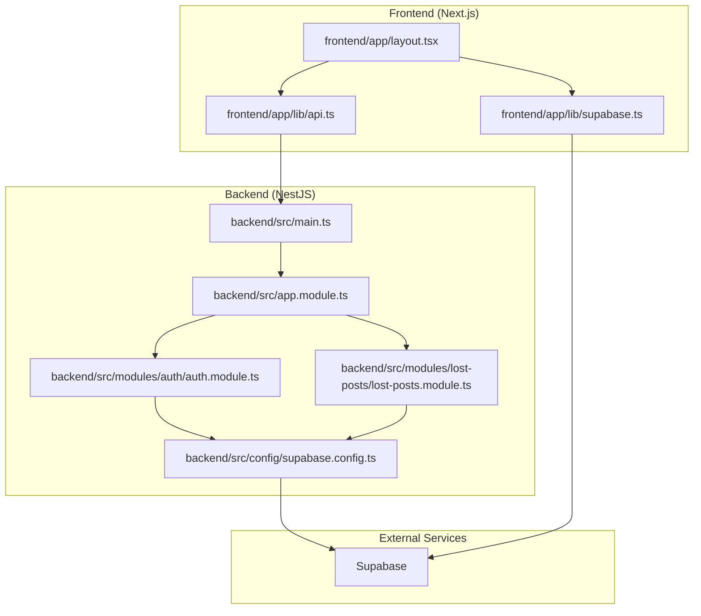
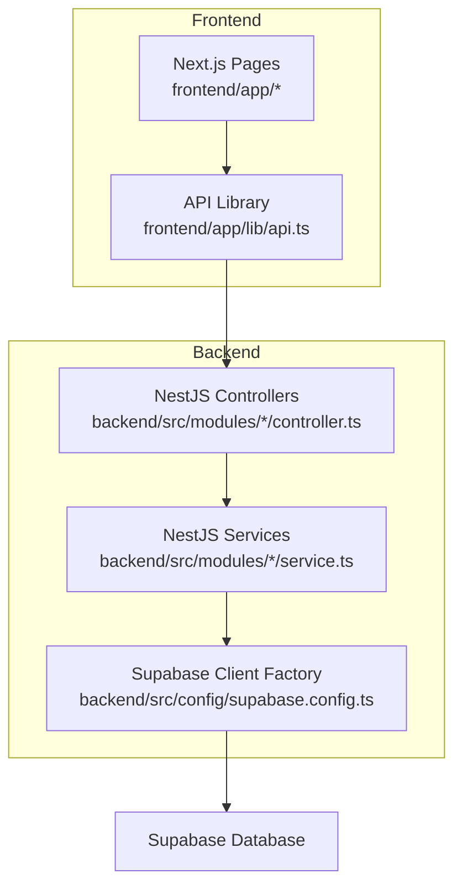
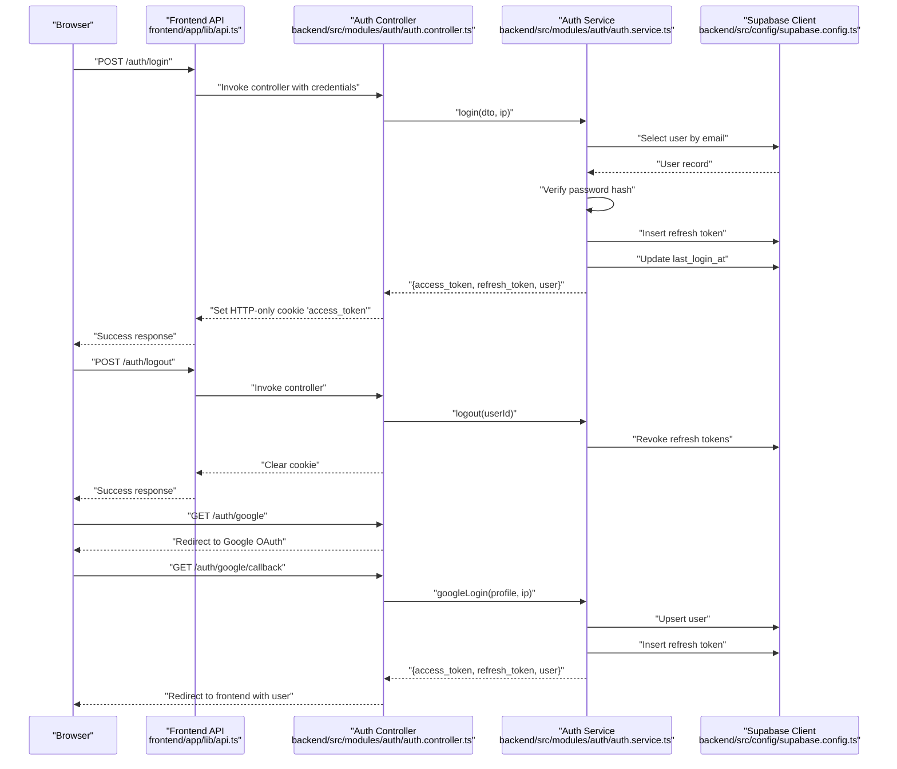
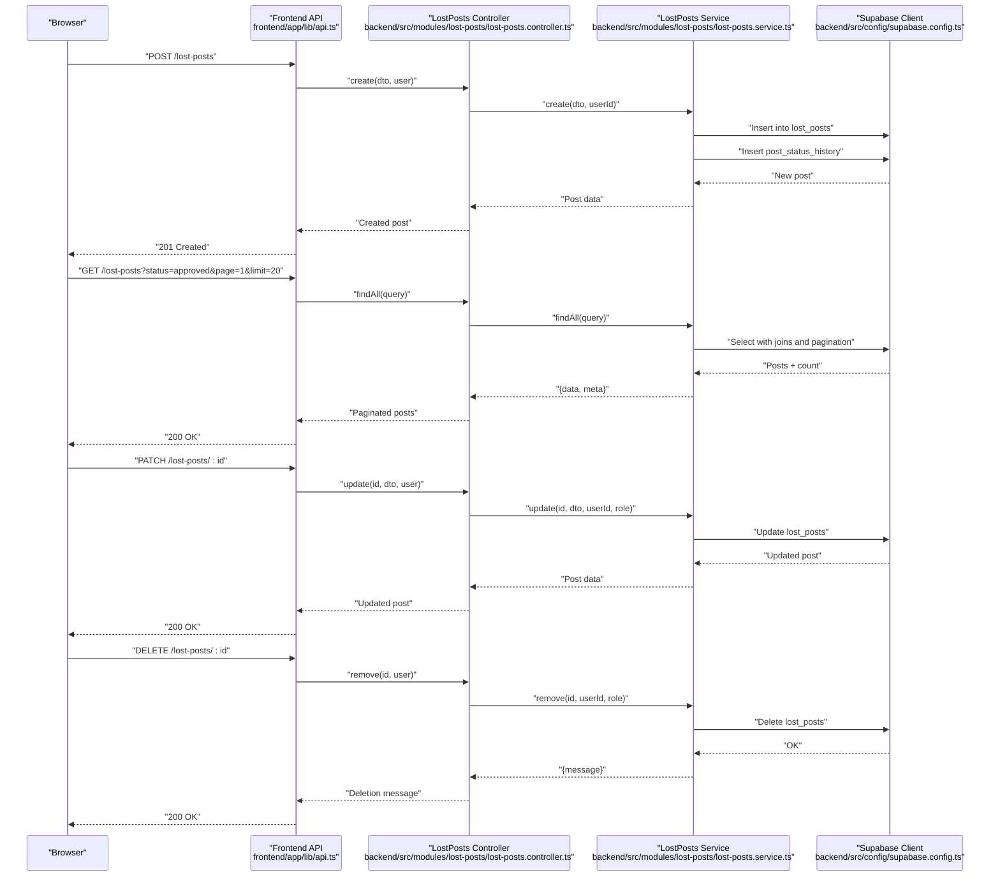
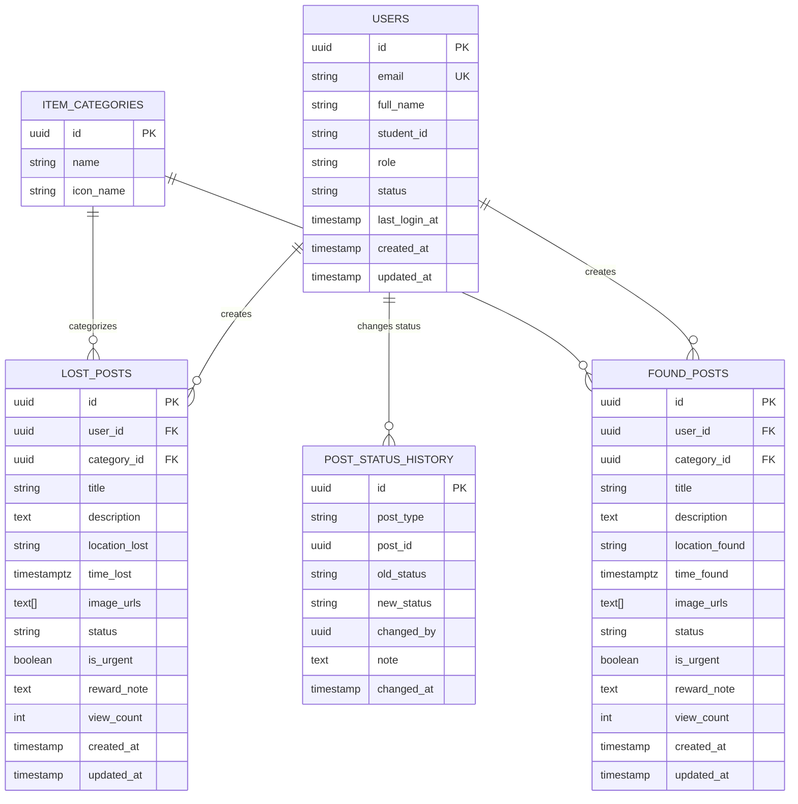
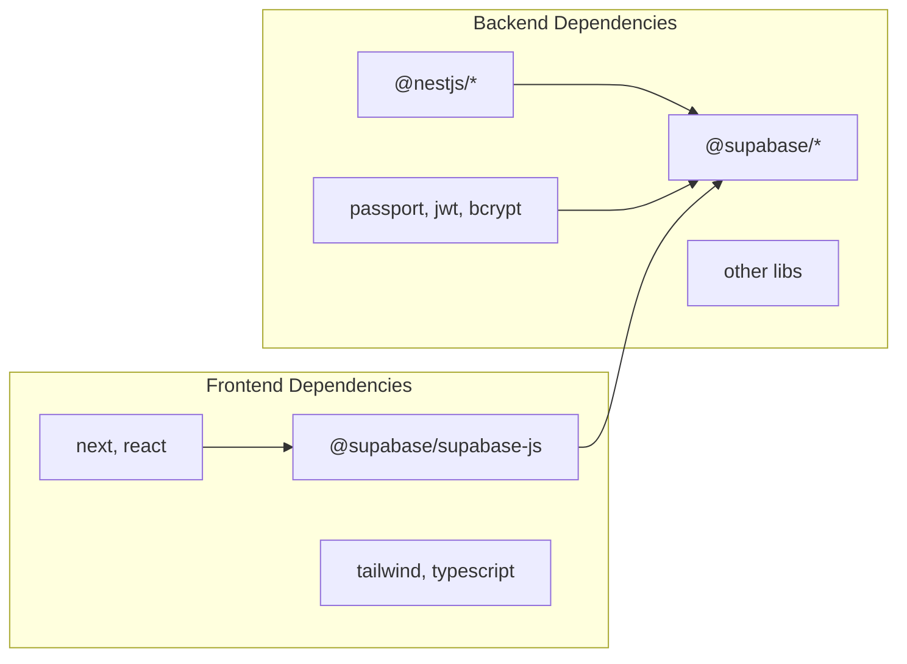

# System Design

<cite>
**Referenced Files in This Document**
- [main.ts](file://backend/src/main.ts)
- [app.module.ts](file://backend/src/app.module.ts)
- [auth.module.ts](file://backend/src/modules/auth/auth.module.ts)
- [auth.controller.ts](file://backend/src/modules/auth/auth.controller.ts)
- [auth.service.ts](file://backend/src/modules/auth/auth.service.ts)
- [lost-posts.module.ts](file://backend/src/modules/lost-posts/lost-posts.module.ts)
- [lost-posts.controller.ts](file://backend/src/modules/lost-posts/lost-posts.controller.ts)
- [lost-posts.service.ts](file://backend/src/modules/lost-posts/lost-posts.service.ts)
- [supabase.config.ts](file://backend/src/config/supabase.config.ts)
- [supabase.ts](file://frontend/app/lib/supabase.ts)
- [api.ts](file://frontend/app/lib/api.ts)
- [layout.tsx](file://frontend/app/layout.tsx)
- [package.json (backend)](file://backend/package.json)
- [package.json (frontend)](file://frontend/package.json)
</cite>

## Table of Contents
1. [Introduction](#introduction)
2. [Project Structure](#project-structure)
3. [Core Components](#core-components)
4. [Architecture Overview](#architecture-overview)
5. [Detailed Component Analysis](#detailed-component-analysis)
6. [Dependency Analysis](#dependency-analysis)
7. [Performance Considerations](#performance-considerations)
8. [Troubleshooting Guide](#troubleshooting-guide)
9. [Conclusion](#conclusion)
10. [Appendices](#appendices)

## Introduction
This document describes the system design of the MissLost platform, a full-stack web application for lost-and-found items within a university community. The backend follows a modular monolithic architecture built with NestJS, while the frontend uses Next.js App Router with page-based routing and component composition. The system integrates Supabase for authentication, authorization, and relational data operations. It documents data flow from UI interactions through API endpoints to database operations, defines system boundaries, and outlines scalability, performance, and fault tolerance considerations.

## Project Structure
The repository is split into two primary layers:
- Backend (NestJS): Modular monolith under backend/src/modules with feature-specific modules, shared common utilities, and centralized configuration.
- Frontend (Next.js): App Router-based pages under frontend/app with shared libraries for API and Supabase client initialization.

**Diagram sources**
- [main.ts:1-45](file://backend/src/main.ts#L1-L45)
- [app.module.ts:1-67](file://backend/src/app.module.ts#L1-L67)
- [auth.module.ts:1-35](file://backend/src/modules/auth/auth.module.ts#L1-L35)
- [lost-posts.module.ts:1-11](file://backend/src/modules/lost-posts/lost-posts.module.ts#L1-L11)
- [supabase.config.ts:1-25](file://backend/src/config/supabase.config.ts#L1-L25)
- [layout.tsx:1-44](file://frontend/app/layout.tsx#L1-L44)
- [api.ts:1-83](file://frontend/app/lib/api.ts#L1-L83)
- [supabase.ts:1-18](file://frontend/app/lib/supabase.ts#L1-L18)

**Section sources**
- [main.ts:1-45](file://backend/src/main.ts#L1-L45)
- [app.module.ts:1-67](file://backend/src/app.module.ts#L1-L67)
- [layout.tsx:1-44](file://frontend/app/layout.tsx#L1-L44)

## Core Components
- Backend bootstrap and middleware:
  - Initializes Nest application, registers cookie parser, global validation pipe, CORS, and Swagger documentation.
  - Exposes server on configurable port and logs startup and documentation URLs.
- Application module:
  - Aggregates all feature modules (auth, users, categories, lost-posts, found-posts, ai-matches, storage, chat, handovers, notifications, upload, triggers).
  - Registers global exception filter, response interceptor, and authentication guards.
- Supabase integration:
  - Centralized client factory ensures a single Supabase client instance with environment-driven configuration and logging.
- Frontend shell and routing:
  - Root layout composes theme provider, route guard, and client shell to wrap page content.
  - API library abstracts fetch with bearer token injection and credential handling.
  - Supabase client helper creates per-request clients with optional token header and disabled session persistence.

**Section sources**
- [main.ts:1-45](file://backend/src/main.ts#L1-L45)
- [app.module.ts:1-67](file://backend/src/app.module.ts#L1-L67)
- [supabase.config.ts:1-25](file://backend/src/config/supabase.config.ts#L1-L25)
- [layout.tsx:1-44](file://frontend/app/layout.tsx#L1-L44)
- [api.ts:1-83](file://frontend/app/lib/api.ts#L1-L83)
- [supabase.ts:1-18](file://frontend/app/lib/supabase.ts#L1-L18)

## Architecture Overview
The system follows a layered architecture:
- Presentation Layer (Next.js App Router):
  - Pages and components render UI, manage user interactions, and orchestrate API calls.
- Business Logic Layer (NestJS Modules):
  - Feature modules encapsulate controllers and services implementing domain logic.
- Data Access Layer (Supabase):
  - Controllers call services, which use the shared Supabase client to perform database operations.

**Diagram sources**
- [api.ts:1-83](file://frontend/app/lib/api.ts#L1-L83)
- [auth.controller.ts:1-130](file://backend/src/modules/auth/auth.controller.ts#L1-L130)
- [auth.service.ts:1-274](file://backend/src/modules/auth/auth.service.ts#L1-L274)
- [lost-posts.controller.ts:1-78](file://backend/src/modules/lost-posts/lost-posts.controller.ts#L1-L78)
- [lost-posts.service.ts:1-189](file://backend/src/modules/lost-posts/lost-posts.service.ts#L1-L189)
- [supabase.config.ts:1-25](file://backend/src/config/supabase.config.ts#L1-L25)

## Detailed Component Analysis

### Authentication Flow (Login, Logout, Google OAuth)
This sequence illustrates the end-to-end authentication flow, including local login, logout, and Google OAuth.

**Diagram sources**
- [auth.controller.ts:1-130](file://backend/src/modules/auth/auth.controller.ts#L1-L130)
- [auth.service.ts:1-274](file://backend/src/modules/auth/auth.service.ts#L1-L274)
- [supabase.config.ts:1-25](file://backend/src/config/supabase.config.ts#L1-L25)
- [api.ts:1-83](file://frontend/app/lib/api.ts#L1-L83)

**Section sources**
- [auth.controller.ts:1-130](file://backend/src/modules/auth/auth.controller.ts#L1-L130)
- [auth.service.ts:1-274](file://backend/src/modules/auth/auth.service.ts#L1-L274)
- [supabase.config.ts:1-25](file://backend/src/config/supabase.config.ts#L1-L25)
- [api.ts:1-83](file://frontend/app/lib/api.ts#L1-L83)

### Lost Posts Management Flow
This flow demonstrates creating, querying, updating, and deleting lost posts, including admin review.

**Diagram sources**
- [lost-posts.controller.ts:1-78](file://backend/src/modules/lost-posts/lost-posts.controller.ts#L1-L78)
- [lost-posts.service.ts:1-189](file://backend/src/modules/lost-posts/lost-posts.service.ts#L1-L189)
- [supabase.config.ts:1-25](file://backend/src/config/supabase.config.ts#L1-L25)
- [api.ts:1-83](file://frontend/app/lib/api.ts#L1-L83)

**Section sources**
- [lost-posts.controller.ts:1-78](file://backend/src/modules/lost-posts/lost-posts.controller.ts#L1-L78)
- [lost-posts.service.ts:1-189](file://backend/src/modules/lost-posts/lost-posts.service.ts#L1-L189)
- [supabase.config.ts:1-25](file://backend/src/config/supabase.config.ts#L1-L25)
- [api.ts:1-83](file://frontend/app/lib/api.ts#L1-L83)

### Data Model and Relationships
The backend interacts with Supabase tables related to users, posts, categories, and status history. The following ER diagram captures key entities and relationships.

**Diagram sources**
- [lost-posts.service.ts:45-73](file://backend/src/modules/lost-posts/lost-posts.service.ts#L45-L73)
- [lost-posts.service.ts:139-171](file://backend/src/modules/lost-posts/lost-posts.service.ts#L139-L171)

## Dependency Analysis
- Backend dependencies:
  - NestJS core modules and ecosystem packages for HTTP server, validation, guards, interceptors, scheduling, and Swagger.
  - Supabase client for SSR and JS SDKs.
  - Passport, JWT, and bcrypt for authentication and security.
- Frontend dependencies:
  - Next.js runtime, React, and Supabase client for SSR.
  - Tailwind and TypeScript for styling and type safety.

**Diagram sources**
- [package.json (backend):22-46](file://backend/package.json#L22-L46)
- [package.json (frontend):11-17](file://frontend/package.json#L11-L17)

**Section sources**
- [package.json (backend):1-94](file://backend/package.json#L1-L94)
- [package.json (frontend):1-29](file://frontend/package.json#L1-L29)

## Performance Considerations
- Pagination and indexing:
  - Use query parameters for pagination and range-based queries to limit result sets.
  - Ensure database indexes on frequently filtered columns (e.g., status, category_id, created_at).
- Caching:
  - Implement in-memory caching for read-heavy endpoints (e.g., post feeds) with TTL and cache invalidation on write operations.
- Asynchronous operations:
  - Defer non-critical updates (e.g., view counters) to fire-and-forget to reduce latency.
- CDN and asset optimization:
  - Serve images via Supabase Storage or CDN and leverage compression and lazy loading.
- Database connection pooling:
  - Centralize client creation and reuse connections; avoid creating new clients per request.
- Frontend:
  - Use Next.js static generation or server-side rendering for SEO and performance where appropriate.
  - Minimize re-renders with React.memo and memoized selectors.

## Troubleshooting Guide
- Authentication failures:
  - Verify JWT secret and cookie settings; ensure frontend sends credentials and cookies.
  - Check Supabase service role key and URL environment variables.
- CORS and cookie issues:
  - Confirm CORS origin matches frontend URL and credentials flag is enabled.
  - Validate cookie attributes (httpOnly, secure, sameSite, path, domain).
- Unauthorized responses:
  - Ensure access token exists in localStorage and is included in Authorization header.
  - On 401, frontend clears tokens and redirects to login.
- Database errors:
  - Inspect thrown validation and not-found exceptions; confirm table schemas and foreign keys.
- Google OAuth:
  - Confirm callback URL and error handling; ensure frontend receives user data without exposing tokens in URL.

**Section sources**
- [auth.controller.ts:52-61](file://backend/src/modules/auth/auth.controller.ts#L52-L61)
- [auth.controller.ts:98-128](file://backend/src/modules/auth/auth.controller.ts#L98-L128)
- [api.ts:30-43](file://frontend/app/lib/api.ts#L30-L43)
- [supabase.config.ts:8-23](file://backend/src/config/supabase.config.ts#L8-L23)

## Conclusion
MissLost employs a clean separation between frontend and backend layers, with the backend structured as a modular monolith and the frontend leveraging Next.js App Router. Supabase provides unified authentication, authorization, and relational data operations. The documented flows illustrate how user interactions propagate through the API to database operations, with clear system boundaries and guardrails for security and reliability. The architecture supports scalability through modularization, caching, and asynchronous tasks, while maintaining simplicity and developer productivity.

## Appendices
- Environment variables:
  - Backend: SUPABASE_URL, SUPABASE_SERVICE_ROLE_KEY, JWT_SECRET, FRONTEND_URL, COOKIE_* settings, PORT.
  - Frontend: NEXT_PUBLIC_SUPABASE_URL, NEXT_PUBLIC_SUPABASE_ANON_KEY, NEXT_PUBLIC_API_URL.
- Deployment:
  - Containerize backend and frontend; orchestrate with Docker Compose; expose ports and configure reverse proxy if needed.