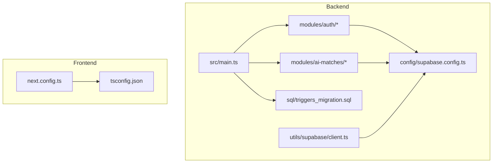
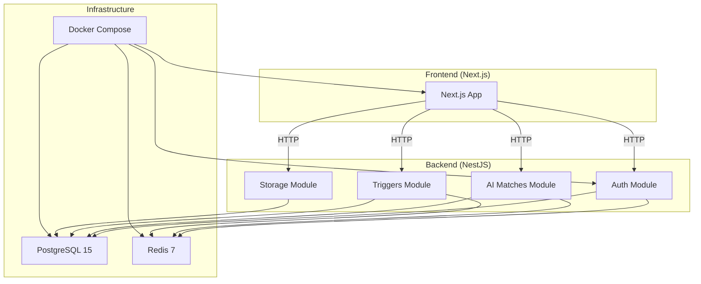
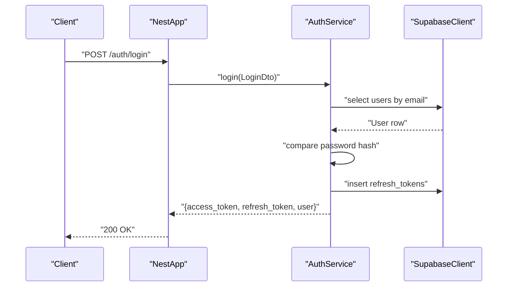
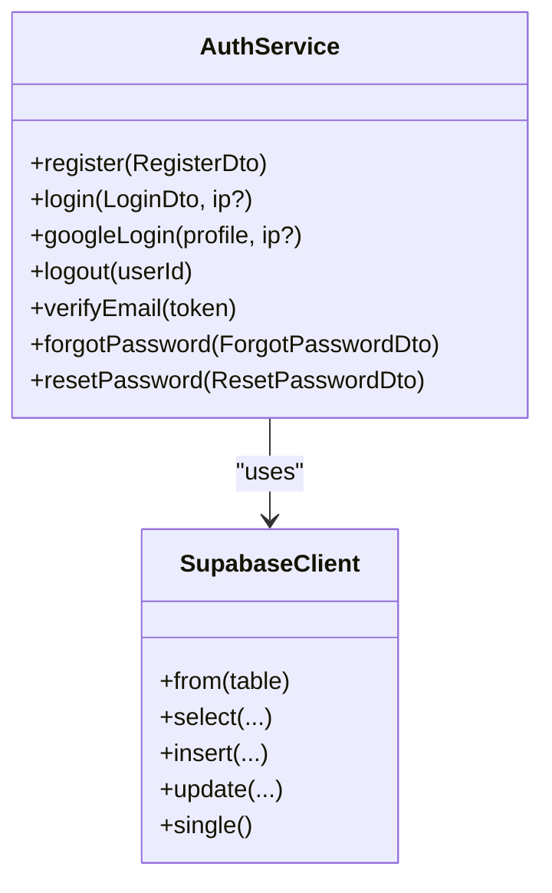
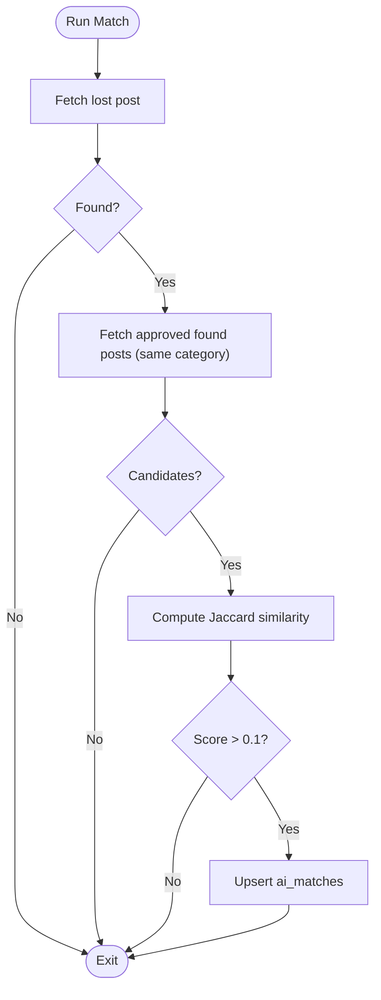
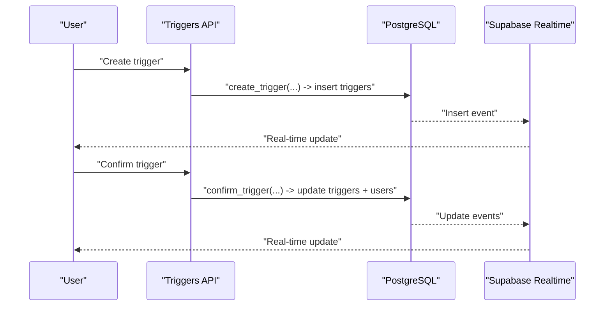
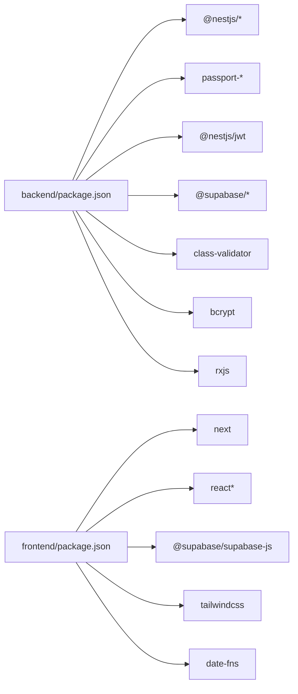

# Technology Stack

<cite>
**Referenced Files in This Document**
- [backend/package.json](file://backend/package.json)
- [frontend/package.json](file://frontend/package.json)
- [docker-compose.yml](file://docker-compose.yml)
- [backend/src/main.ts](file://backend/src/main.ts)
- [backend/nest-cli.json](file://backend/nest-cli.json)
- [backend/tsconfig.json](file://backend/tsconfig.json)
- [frontend/tsconfig.json](file://frontend/tsconfig.json)
- [backend/src/config/supabase.config.ts](file://backend/src/config/supabase.config.ts)
- [backend/src/utils/supabase/client.ts](file://backend/src/utils/supabase/client.ts)
- [backend/src/modules/auth/auth.service.ts](file://backend/src/modules/auth/auth.service.ts)
- [backend/src/modules/ai-matches/ai-matches.service.ts](file://backend/src/modules/ai-matches/ai-matches.service.ts)
- [backend/sql/triggers_migration.sql](file://backend/sql/triggers_migration.sql)
- [backend/Dockerfile](file://backend/Dockerfile)
- [frontend/Dockerfile](file://frontend/Dockerfile)
- [frontend/next.config.ts](file://frontend/next.config.ts)
</cite>

## Table of Contents
1. [Introduction](#introduction)
2. [Project Structure](#project-structure)
3. [Core Components](#core-components)
4. [Architecture Overview](#architecture-overview)
5. [Detailed Component Analysis](#detailed-component-analysis)
6. [Dependency Analysis](#dependency-analysis)
7. [Performance Considerations](#performance-considerations)
8. [Troubleshooting Guide](#troubleshooting-guide)
9. [Conclusion](#conclusion)
10. [Appendices](#appendices)

## Introduction
This document provides a comprehensive technology stack overview for the MissLost platform. It covers backend technologies (NestJS 11.0.1, TypeScript, PostgreSQL 15+, Supabase, Redis), frontend technologies (Next.js 16.2.3, React, Tailwind CSS, Material Design), and supporting technologies (Docker, pg_trgm-compatible text similarity, optional vector extensions, YOLO-based AI detection). It explains the rationale behind each choice, version compatibility, dependency management, upgrade paths, performance and scalability characteristics, maintenance considerations, development tools, build processes, deployment configurations, and licensing/sustainability notes.

## Project Structure
The project is organized into two primary applications:
- Backend: NestJS application with modular features (authentication, AI matching, chat, storage, triggers, uploads, users, categories, notifications, handovers, found/lost posts).
- Frontend: Next.js application implementing pages, components, hooks, and Supabase client utilities.

**Diagram sources**
- [backend/src/main.ts:1-45](file://backend/src/main.ts#L1-L45)
- [backend/src/modules/auth/auth.service.ts:1-274](file://backend/src/modules/auth/auth.service.ts#L1-L274)
- [backend/src/modules/ai-matches/ai-matches.service.ts:1-367](file://backend/src/modules/ai-matches/ai-matches.service.ts#L1-L367)
- [backend/sql/triggers_migration.sql:1-338](file://backend/sql/triggers_migration.sql#L1-L338)
- [backend/src/config/supabase.config.ts:1-25](file://backend/src/config/supabase.config.ts#L1-L25)
- [backend/src/utils/supabase/client.ts:1-19](file://backend/src/utils/supabase/client.ts#L1-L19)
- [frontend/next.config.ts:1-8](file://frontend/next.config.ts#L1-L8)
- [frontend/tsconfig.json:1-35](file://frontend/tsconfig.json#L1-L35)

**Section sources**
- [backend/src/main.ts:1-45](file://backend/src/main.ts#L1-L45)
- [frontend/next.config.ts:1-8](file://frontend/next.config.ts#L1-L8)

## Core Components
- Backend framework: NestJS 11.0.1 with TypeScript compiler options targeting ES2023 and NodeNext module resolution.
- Authentication and session: Passport-based strategies (Google OAuth, JWT), JWT service, bcrypt hashing, and Supabase-managed users and tokens.
- Real-time and triggers: PostgreSQL triggers and stored procedures for handover confirmation, notifications, and scoring; Supabase Realtime publication enabled for the triggers table.
- AI matching: Text-based similarity (Jaccard) between lost and found posts; optional future vector embeddings and YOLO-based image matching.
- Storage and uploads: Supabase Storage integration via Supabase client utilities.
- Frontend: Next.js 16.2.3 with React 19.2.4, Tailwind CSS 4, and TypeScript strict mode.
- Infrastructure: Docker images for backend/frontend, orchestrated by docker-compose with PostgreSQL 15 and Redis 7.

**Section sources**
- [backend/package.json:22-46](file://backend/package.json#L22-L46)
- [backend/tsconfig.json:1-26](file://backend/tsconfig.json#L1-L26)
- [frontend/package.json:11-17](file://frontend/package.json#L11-L17)
- [frontend/tsconfig.json:1-35](file://frontend/tsconfig.json#L1-L35)
- [backend/sql/triggers_migration.sql:1-338](file://backend/sql/triggers_migration.sql#L1-L338)
- [backend/src/config/supabase.config.ts:1-25](file://backend/src/config/supabase.config.ts#L1-L25)
- [backend/src/utils/supabase/client.ts:1-19](file://backend/src/utils/supabase/client.ts#L1-L19)

## Architecture Overview
The system integrates a NestJS backend with Supabase for authentication, database, and Realtime, while Next.js serves the frontend. Docker containers orchestrate backend, frontend, PostgreSQL, and Redis. AI matching runs server-side using text similarity; optional vector and image-based matching can be layered on top.

**Diagram sources**
- [docker-compose.yml:1-61](file://docker-compose.yml#L1-L61)
- [backend/src/modules/auth/auth.service.ts:1-274](file://backend/src/modules/auth/auth.service.ts#L1-L274)
- [backend/src/modules/ai-matches/ai-matches.service.ts:1-367](file://backend/src/modules/ai-matches/ai-matches.service.ts#L1-L367)
- [backend/sql/triggers_migration.sql:1-338](file://backend/sql/triggers_migration.sql#L1-L338)

## Detailed Component Analysis

### Backend: NestJS and TypeScript
- Framework: NestJS 11.0.1 with CLI collection configured to src and deleteOutDir enabled.
- TypeScript: ES2023 target, NodeNext module resolution, decorator metadata, strict null checks, incremental builds.
- Bootstrapping: Cookie parsing, global validation pipe, CORS enabling, Swagger UI setup, port selection.
- Build and run scripts: build, start, start:dev, start:debug, lint, test, test:watch, test:cov, test:e2e.

**Diagram sources**
- [backend/src/main.ts:1-45](file://backend/src/main.ts#L1-L45)
- [backend/src/modules/auth/auth.service.ts:72-110](file://backend/src/modules/auth/auth.service.ts#L72-L110)
- [backend/src/config/supabase.config.ts:1-25](file://backend/src/config/supabase.config.ts#L1-L25)

**Section sources**
- [backend/nest-cli.json:1-9](file://backend/nest-cli.json#L1-L9)
- [backend/tsconfig.json:1-26](file://backend/tsconfig.json#L1-L26)
- [backend/src/main.ts:1-45](file://backend/src/main.ts#L1-L45)
- [backend/package.json:8-21](file://backend/package.json#L8-L21)

### Authentication and Authorization
- Strategies: Google OAuth 2.0 and JWT Passport strategies.
- Password hashing: bcrypt with configurable rounds.
- Token lifecycle: JWT access tokens, hashed refresh tokens stored in database with expiry and revocation.
- Supabase integration: Users and tokens managed via Supabase client; email verification and password reset tokens persisted in auth_tokens.
- Roles and guards: Decorators and guards present for role-based access control.

**Diagram sources**
- [backend/src/modules/auth/auth.service.ts:1-274](file://backend/src/modules/auth/auth.service.ts#L1-L274)
- [backend/src/config/supabase.config.ts:1-25](file://backend/src/config/supabase.config.ts#L1-L25)

**Section sources**
- [backend/src/modules/auth/auth.service.ts:1-274](file://backend/src/modules/auth/auth.service.ts#L1-L274)
- [backend/src/config/supabase.config.ts:1-25](file://backend/src/config/supabase.config.ts#L1-L25)
- [backend/src/utils/supabase/client.ts:1-19](file://backend/src/utils/supabase/client.ts#L1-L19)

### AI Matching Engine
- Text similarity: Jaccard similarity computed over tokenized lowercased titles and descriptions; threshold applied before upserting matches.
- Match confirmation: Two-sided confirmation by owner and finder; combined confirmation marks match as confirmed.
- Dashboard statistics: Aggregated counts for posts, users, recent activity, top categories, and recent handovers.
- Pagination and filtering: Unified listing for lost and found posts with filters and pagination.

**Diagram sources**
- [backend/src/modules/ai-matches/ai-matches.service.ts:45-96](file://backend/src/modules/ai-matches/ai-matches.service.ts#L45-L96)

**Section sources**
- [backend/src/modules/ai-matches/ai-matches.service.ts:1-367](file://backend/src/modules/ai-matches/ai-matches.service.ts#L1-L367)

### Triggers and Real-Time Handover Workflow
- Triggers system: Stored procedures for creating, confirming, and cancelling triggers; automatic expiration job; notifications and training points updates.
- Supabase Realtime: Publication enabled for the triggers table to support real-time UI updates.
- Database extensions: uuid-ossp for UUID generation.

**Diagram sources**
- [backend/sql/triggers_migration.sql:63-146](file://backend/sql/triggers_migration.sql#L63-L146)
- [backend/sql/triggers_migration.sql:153-259](file://backend/sql/triggers_migration.sql#L153-L259)
- [backend/sql/triggers_migration.sql:325-336](file://backend/sql/triggers_migration.sql#L325-L336)

**Section sources**
- [backend/sql/triggers_migration.sql:1-338](file://backend/sql/triggers_migration.sql#L1-L338)

### Supabase Integration
- Backend clients:
  - Service client using service role key for server-side operations.
  - Anonymous client using anonymous key for browser-like backend usage.
- Environment variables: SUPABASE_URL, SUPABASE_SERVICE_ROLE_KEY, SUPABASE_ANON_KEY.
- Frontend client: Supabase JS SDK imported for frontend components.

**Section sources**
- [backend/src/config/supabase.config.ts:1-25](file://backend/src/config/supabase.config.ts#L1-L25)
- [backend/src/utils/supabase/client.ts:1-19](file://backend/src/utils/supabase/client.ts#L1-L19)
- [frontend/package.json:11-17](file://frontend/package.json#L11-L17)

### Frontend: Next.js, React, Tailwind CSS
- Framework: Next.js 16.2.3 with React 19.2.4.
- Styling: Tailwind CSS 4 with TypeScript strict mode.
- Configuration: Minimal Next config; tsconfig paths configured for @/* alias.

**Section sources**
- [frontend/package.json:11-17](file://frontend/package.json#L11-L17)
- [frontend/tsconfig.json:1-35](file://frontend/tsconfig.json#L1-L35)
- [frontend/next.config.ts:1-8](file://frontend/next.config.ts#L1-L8)

### Supporting Technologies
- Docker: Multi-stage builds for backend and frontend; exposes ports 3001 (backend) and 3000 (frontend); depends on PostgreSQL and Redis.
- PostgreSQL: Version 15 with uuid-ossp extension; triggers and stored procedures for business logic.
- Redis: Version 7 for caching and session-like storage (as used by backend).
- Optional AI enhancements: Vector extensions and YOLO-based detection can be integrated alongside current text similarity.

**Section sources**
- [docker-compose.yml:1-61](file://docker-compose.yml#L1-L61)
- [backend/Dockerfile:1-14](file://backend/Dockerfile#L1-L14)
- [frontend/Dockerfile:1-14](file://frontend/Dockerfile#L1-L14)
- [backend/sql/triggers_migration.sql:1-338](file://backend/sql/triggers_migration.sql#L1-L338)

## Dependency Analysis
- Backend dependencies include NestJS core modules, Swagger, Passport strategies, JWT, Supabase JS libraries, bcrypt, class-validator, and RxJS.
- Frontend dependencies include Next.js, React, Supabase JS, date-fns, Tailwind CSS, and TypeScript.
- NestJS CLI and TypeScript toolchain manage compilation and testing.

**Diagram sources**
- [backend/package.json:22-46](file://backend/package.json#L22-L46)
- [frontend/package.json:11-17](file://frontend/package.json#L11-L17)

**Section sources**
- [backend/package.json:22-46](file://backend/package.json#L22-L46)
- [frontend/package.json:11-17](file://frontend/package.json#L11-L17)

## Performance Considerations
- Backend:
  - ValidationPipe reduces overhead from malformed requests.
  - Cookie parsing and CORS configured for secure cross-origin requests.
  - Global transform enables implicit type conversion.
- Database:
  - UUID primary keys and targeted indexes on triggers improve lookup performance.
  - Stored procedures encapsulate transactional logic and reduce network round trips.
- Real-time:
  - Supabase Realtime publication for triggers table ensures low-latency UI updates.
- Caching:
  - Redis 7 can cache frequently accessed data and sessions to reduce load.
- Scalability:
  - Horizontal scaling of backend replicas behind a reverse proxy.
  - Database connection pooling and index tuning for high concurrency.
- AI Matching:
  - Current text similarity is O(n) per candidate set; vector indexing and YOLO-based image matching can improve recall and latency at scale.

[No sources needed since this section provides general guidance]

## Troubleshooting Guide
- Missing Supabase environment variables:
  - Ensure SUPABASE_URL, SUPABASE_SERVICE_ROLE_KEY, and SUPABASE_ANON_KEY are set in the environment.
- Authentication failures:
  - Verify JWT secret and token lifetimes; check refresh token storage and revocation.
- Real-time not updating:
  - Confirm Supabase Realtime publication includes the triggers table and client subscriptions are active.
- Database errors:
  - Review stored procedure logs and constraint violations; ensure uuid-ossp extension is enabled.
- Docker connectivity:
  - Confirm port mappings and service dependencies in docker-compose; verify volume mounts for PostgreSQL data.

**Section sources**
- [backend/src/config/supabase.config.ts:8-23](file://backend/src/config/supabase.config.ts#L8-L23)
- [backend/src/utils/supabase/client.ts:9-19](file://backend/src/utils/supabase/client.ts#L9-L19)
- [backend/sql/triggers_migration.sql:338-338](file://backend/sql/triggers_migration.sql#L338-L338)
- [docker-compose.yml:12-25](file://docker-compose.yml#L12-L25)

## Conclusion
MissLost leverages a modern, cohesive stack: NestJS for a robust backend, Supabase for identity, database, and real-time, PostgreSQL 15 for persistence, Redis for caching, and Next.js for a fast, responsive frontend. The current AI matching relies on text similarity; future enhancements can incorporate vector embeddings and YOLO-based detection. Dockerization simplifies deployment and scaling. The stack balances developer productivity, maintainability, and extensibility for real-world operations.

[No sources needed since this section summarizes without analyzing specific files]

## Appendices

### Version Compatibility and Upgrade Paths
- Backend:
  - NestJS 11.0.1; align TypeScript to ^5.x and Jest to ^30.x for compatibility.
  - Upgrade path: Patch releases within 11.x; major upgrades require careful migration of decorators, guards, and interceptors.
- Frontend:
  - Next.js 16.2.3; React 19.x; Tailwind CSS 4; align TypeScript to ~5.x.
  - Upgrade path: Follow Next.js release notes; test ESM/bundler module resolution changes.
- Database:
  - PostgreSQL 15; ensure uuid-ossp is enabled; adopt logical replication for migrations.
- Infrastructure:
  - Docker images based on Node 20; keep base OS updated; pin service versions in docker-compose.

**Section sources**
- [backend/package.json:22-46](file://backend/package.json#L22-L46)
- [frontend/package.json:11-17](file://frontend/package.json#L11-L17)
- [docker-compose.yml:27-43](file://docker-compose.yml#L27-L43)

### Licensing and Sustainability
- NestJS and related Nest packages: MIT licensed.
- Supabase: MIT licensed; community and commercial tiers available.
- PostgreSQL: Open source; community supported.
- Redis: BSD 3-Clause license.
- Next.js and React: MIT licensed.
- Tailwind CSS: MIT licensed.
- Bcrypt: BSD-3-Clause; widely used and maintained.
- Material Design: Apache 2.0 for design assets; component libraries vary.

**Section sources**
- [backend/package.json:7-7](file://backend/package.json#L7-L7)
- [frontend/package.json:4-4](file://frontend/package.json#L4-L4)

### Development Tools, Build, and Deployment
- Development:
  - Nest CLI scaffolding; TypeScript compilation; ESLint and Prettier for code quality; Jest for unit/e2e tests.
  - Next.js dev server; Tailwind CSS hot reload.
- Build:
  - Nest build produces ES2023 artifacts; Next.js build generates optimized static assets.
- Deployment:
  - Docker images built from Node 20; docker-compose orchestrates backend, frontend, PostgreSQL, and Redis.
  - Exposed ports: 3001 (backend), 3000 (frontend), 5432 (PostgreSQL), 6379 (Redis).

**Section sources**
- [backend/package.json:8-21](file://backend/package.json#L8-L21)
- [frontend/package.json:5-10](file://frontend/package.json#L5-L10)
- [backend/Dockerfile:1-14](file://backend/Dockerfile#L1-L14)
- [frontend/Dockerfile:1-14](file://frontend/Dockerfile#L1-L14)
- [docker-compose.yml:1-61](file://docker-compose.yml#L1-L61)