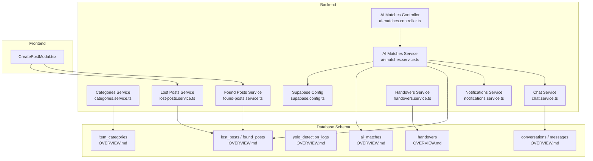
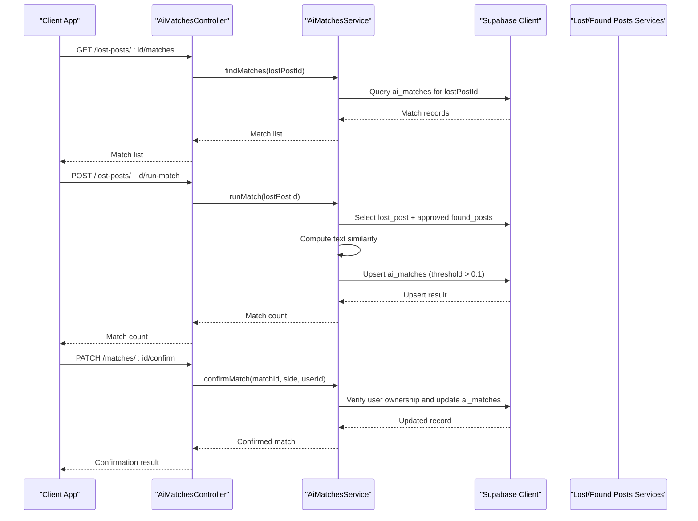
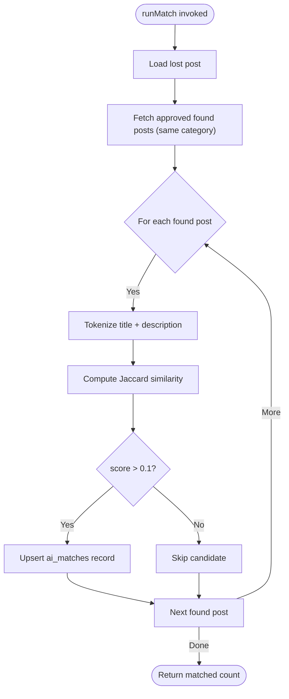
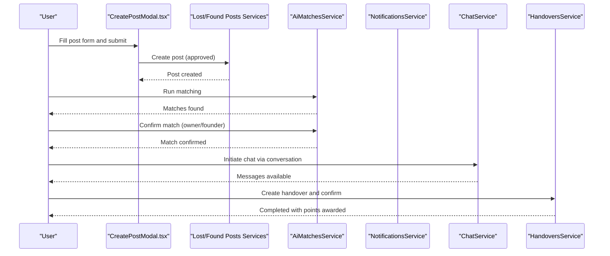
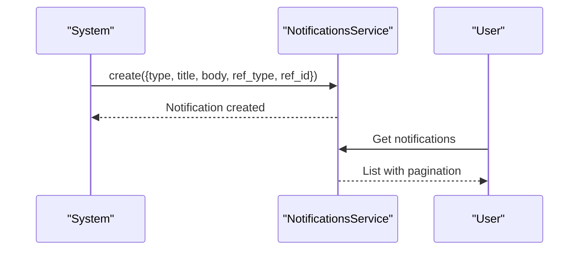
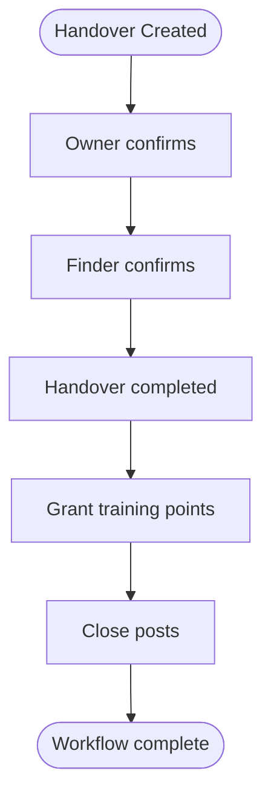
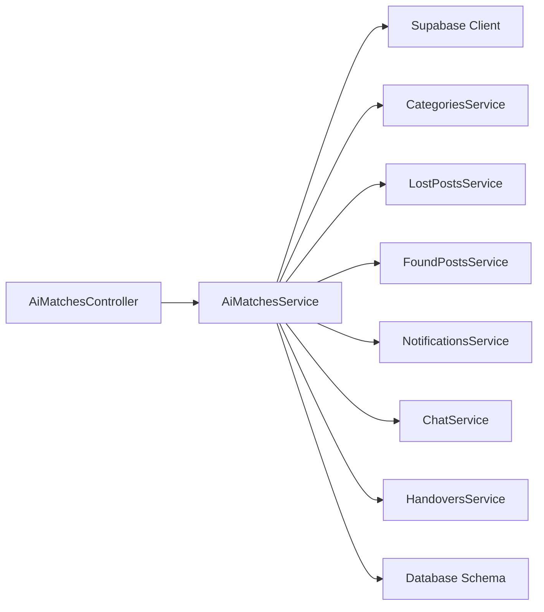

# AI-Powered Matching System

<cite>
**Referenced Files in This Document**
- [ai-matches.service.ts](file://backend/src/modules/ai-matches/ai-matches.service.ts)
- [ai-matches.controller.ts](file://backend/src/modules/ai-matches/ai-matches.controller.ts)
- [categories.service.ts](file://backend/src/modules/categories/categories.service.ts)
- [category.entity.ts](file://backend/src/modules/categories/entities/category.entity.ts)
- [lost-posts.service.ts](file://backend/src/modules/lost-posts/lost-posts.service.ts)
- [found-posts.service.ts](file://backend/src/modules/found-posts/found-posts.service.ts)
- [triggers_migration.sql](file://backend/sql/triggers_migration.sql)
- [supabase.config.ts](file://backend/src/config/supabase.config.ts)
- [notifications.service.ts](file://backend/src/modules/notifications/notifications.service.ts)
- [chat.service.ts](file://backend/src/modules/chat/chat.service.ts)
- [handovers.service.ts](file://backend/src/modules/handovers/handovers.service.ts)
- [OVERVIEW.md](file://OVERVIEW.md)
- [CreatePostModal.tsx](file://frontend/app/components/CreatePostModal.tsx)
</cite>

## Table of Contents
1. [Introduction](#introduction)
2. [Project Structure](#project-structure)
3. [Core Components](#core-components)
4. [Architecture Overview](#architecture-overview)
5. [Detailed Component Analysis](#detailed-component-analysis)
6. [Dependency Analysis](#dependency-analysis)
7. [Performance Considerations](#performance-considerations)
8. [Troubleshooting Guide](#troubleshooting-guide)
9. [Conclusion](#conclusion)
10. [Appendices](#appendices)

## Introduction
This document describes the AI-Powered Matching System that connects lost and found items through intelligent algorithms. The system implements a dual matching approach:
- Text similarity analysis: Computes semantic similarity between item descriptions and titles.
- YOLO-based object detection: Integrates with the categories system to classify items based on detected labels.

It also covers similarity scoring, thresholds, manual override capabilities, notification systems, user feedback loops, performance metrics, accuracy measurements, continuous improvement processes, and the balance between automation and human oversight.

## Project Structure
The matching system spans backend NestJS modules, database schema, and frontend components:
- AI Matches module: orchestration of matching, confirmation, and admin dashboards.
- Categories module: item classification and YOLO label mapping.
- Posts services: lost and found post lifecycle and status management.
- Notifications and Chat: communication channels during matching and handover.
- Database schema: ai_matches, item_categories, yolo_detection_logs, and related tables.



**Diagram sources**
- [ai-matches.service.ts:1-367](file://backend/src/modules/ai-matches/ai-matches.service.ts#L1-L367)
- [ai-matches.controller.ts:1-72](file://backend/src/modules/ai-matches/ai-matches.controller.ts#L1-L72)
- [categories.service.ts:1-32](file://backend/src/modules/categories/categories.service.ts#L1-L32)
- [lost-posts.service.ts:1-189](file://backend/src/modules/lost-posts/lost-posts.service.ts#L1-L189)
- [found-posts.service.ts:1-162](file://backend/src/modules/found-posts/found-posts.service.ts#L1-L162)
- [notifications.service.ts:1-81](file://backend/src/modules/notifications/notifications.service.ts#L1-L81)
- [chat.service.ts:1-151](file://backend/src/modules/chat/chat.service.ts#L1-L151)
- [handovers.service.ts:1-147](file://backend/src/modules/handovers/handovers.service.ts#L1-L147)
- [supabase.config.ts:1-25](file://backend/src/config/supabase.config.ts#L1-L25)
- [OVERVIEW.md:317-345](file://OVERVIEW.md#L317-L345)
- [CreatePostModal.tsx:1-584](file://frontend/app/components/CreatePostModal.tsx#L1-L584)

**Section sources**
- [ai-matches.service.ts:1-367](file://backend/src/modules/ai-matches/ai-matches.service.ts#L1-L367)
- [ai-matches.controller.ts:1-72](file://backend/src/modules/ai-matches/ai-matches.controller.ts#L1-L72)
- [categories.service.ts:1-32](file://backend/src/modules/categories/categories.service.ts#L1-L32)
- [lost-posts.service.ts:1-189](file://backend/src/modules/lost-posts/lost-posts.service.ts#L1-L189)
- [found-posts.service.ts:1-162](file://backend/src/modules/found-posts/found-posts.service.ts#L1-L162)
- [notifications.service.ts:1-81](file://backend/src/modules/notifications/notifications.service.ts#L1-L81)
- [chat.service.ts:1-151](file://backend/src/modules/chat/chat.service.ts#L1-L151)
- [handovers.service.ts:1-147](file://backend/src/modules/handovers/handovers.service.ts#L1-L147)
- [supabase.config.ts:1-25](file://backend/src/config/supabase.config.ts#L1-L25)
- [OVERVIEW.md:135-345](file://OVERVIEW.md#L135-L345)
- [CreatePostModal.tsx:1-584](file://frontend/app/components/CreatePostModal.tsx#L1-L584)

## Core Components
- AI Matches Service: Implements text similarity matching, manages match records, handles confirmation logic, and exposes admin statistics.
- Categories Service: Provides category metadata including YOLO labels for AI classification.
- Posts Services: Manage post creation, approval workflows, and status transitions.
- Notifications and Chat: Deliver real-time updates and facilitate communication between parties.
- Database Schema: Defines ai_matches, item_categories, yolo_detection_logs, and supporting tables.

Key responsibilities:
- Dual matching: Text similarity and YOLO label alignment.
- Threshold configuration: Minimum similarity threshold for automatic matches.
- Manual override: Owner/founder confirmation to finalize matches.
- Integration: Seamless connection to categories and post lifecycle.
- Feedback loop: Notifications and chat support user engagement.
- Admin oversight: Dashboards and post listing for monitoring and intervention.

**Section sources**
- [ai-matches.service.ts:15-96](file://backend/src/modules/ai-matches/ai-matches.service.ts#L15-L96)
- [categories.service.ts:10-19](file://backend/src/modules/categories/categories.service.ts#L10-L19)
- [lost-posts.service.ts:19-43](file://backend/src/modules/lost-posts/lost-posts.service.ts#L19-L43)
- [found-posts.service.ts:19-38](file://backend/src/modules/found-posts/found-posts.service.ts#L19-L38)
- [notifications.service.ts:15-31](file://backend/src/modules/notifications/notifications.service.ts#L15-L31)
- [chat.service.ts:12-36](file://backend/src/modules/chat/chat.service.ts#L12-L36)
- [OVERVIEW.md:314-345](file://OVERVIEW.md#L314-L345)

## Architecture Overview
The system follows a modular backend architecture with clear separation of concerns:
- Controllers expose REST endpoints for matching operations and admin dashboards.
- Services encapsulate business logic and data access via Supabase client.
- Database schema supports AI matching, YOLO classification, and user interactions.
- Frontend components integrate with backend APIs for post creation and user actions.



**Diagram sources**
- [ai-matches.controller.ts:24-40](file://backend/src/modules/ai-matches/ai-matches.controller.ts#L24-L40)
- [ai-matches.service.ts:15-141](file://backend/src/modules/ai-matches/ai-matches.service.ts#L15-L141)
- [lost-posts.service.ts:86-103](file://backend/src/modules/lost-posts/lost-posts.service.ts#L86-L103)
- [found-posts.service.ts:80-94](file://backend/src/modules/found-posts/found-posts.service.ts#L80-L94)

## Detailed Component Analysis

### AI Matches Service
Implements the core matching logic:
- Text similarity scoring using Jaccard similarity on tokenized terms.
- Automatic matching against approved found posts within the same category.
- Threshold filtering (default > 0.1) to reduce noise.
- Match confirmation workflow requiring both owner and finder consent.
- Admin dashboards for statistics and post listings.



**Diagram sources**
- [ai-matches.service.ts:45-96](file://backend/src/modules/ai-matches/ai-matches.service.ts#L45-L96)
- [ai-matches.service.ts:144-153](file://backend/src/modules/ai-matches/ai-matches.service.ts#L144-L153)

Key implementation highlights:
- Similarity computation: Tokenization with minimum word length filter, set intersection/union ratio.
- Threshold: Configurable via upsert condition; default 0.1 balances recall vs. precision.
- Persistence: Upserts ai_matches with conflict resolution on (lost_post_id, found_post_id).
- Confirmation: Two-sided consent required; both sides set flags, then status becomes confirmed.

**Section sources**
- [ai-matches.service.ts:45-96](file://backend/src/modules/ai-matches/ai-matches.service.ts#L45-L96)
- [ai-matches.service.ts:101-141](file://backend/src/modules/ai-matches/ai-matches.service.ts#L101-L141)
- [ai-matches.service.ts:144-153](file://backend/src/modules/ai-matches/ai-matches.service.ts#L144-L153)

### Categories Integration and YOLO Classification
The categories system provides:
- Category metadata with optional YOLO labels for AI classification.
- Integration points for item categorization during post creation and matching.

```mermaid
classDiagram
class Category {
+string id
+string name
+string yolo_label
+string yolo_label_vi
+string icon_name
+boolean is_active
+number sort_order
+string created_at
}
class CategoriesService {
+findAll() Category[]
+findById(id) Category|null
}
class AiMatchesService {
+findMatches(lostPostId) ai_matches[]
+runMatch(lostPostId) {matched : number}
}
CategoriesService --> Category : "returns"
AiMatchesService --> CategoriesService : "uses category_id"
```

**Diagram sources**
- [category.entity.ts:1-11](file://backend/src/modules/categories/entities/category.entity.ts#L1-L11)
- [categories.service.ts:10-30](file://backend/src/modules/categories/categories.service.ts#L10-L30)
- [ai-matches.service.ts:56-67](file://backend/src/modules/ai-matches/ai-matches.service.ts#L56-L67)

Integration notes:
- Matching restricts candidates to posts with the same category_id.
- YOLO detection logs capture raw detections and top labels for future model improvements.
- The ai_matches table includes fields for yolo_score and text_score to track contributions to similarity_score.

**Section sources**
- [categories.service.ts:10-30](file://backend/src/modules/categories/categories.service.ts#L10-L30)
- [category.entity.ts:1-11](file://backend/src/modules/categories/entities/category.entity.ts#L1-L11)
- [OVERVIEW.md:140-175](file://OVERVIEW.md#L140-L175)
- [OVERVIEW.md:317-345](file://OVERVIEW.md#L317-L345)

### Matching Workflow: From Post Creation to Successful Connection
End-to-end workflow:
1. Post creation: Users create lost or found posts via frontend forms; posts are inserted with approved status.
2. Matching execution: Admin or system runs matching against approved posts in the same category.
3. Candidate scoring: Text similarity computed; candidates above threshold recorded as ai_matches.
4. User confirmation: Owner and finder confirm separately; both confirmations required to finalize.
5. Handover and closure: Upon successful handover, posts are closed and training points awarded.



**Diagram sources**
- [CreatePostModal.tsx:196-238](file://frontend/app/components/CreatePostModal.tsx#L196-L238)
- [lost-posts.service.ts:19-43](file://backend/src/modules/lost-posts/lost-posts.service.ts#L19-L43)
- [found-posts.service.ts:19-38](file://backend/src/modules/found-posts/found-posts.service.ts#L19-L38)
- [ai-matches.service.ts:45-96](file://backend/src/modules/ai-matches/ai-matches.service.ts#L45-L96)
- [ai-matches.service.ts:101-141](file://backend/src/modules/ai-matches/ai-matches.service.ts#L101-L141)
- [notifications.service.ts:66-80](file://backend/src/modules/notifications/notifications.service.ts#L66-L80)
- [chat.service.ts:38-66](file://backend/src/modules/chat/chat.service.ts#L38-L66)
- [handovers.service.ts:12-32](file://backend/src/modules/handovers/handovers.service.ts#L12-L32)

**Section sources**
- [CreatePostModal.tsx:196-238](file://frontend/app/components/CreatePostModal.tsx#L196-L238)
- [lost-posts.service.ts:19-43](file://backend/src/modules/lost-posts/lost-posts.service.ts#L19-L43)
- [found-posts.service.ts:19-38](file://backend/src/modules/found-posts/found-posts.service.ts#L19-L38)
- [ai-matches.service.ts:45-96](file://backend/src/modules/ai-matches/ai-matches.service.ts#L45-L96)
- [ai-matches.service.ts:101-141](file://backend/src/modules/ai-matches/ai-matches.service.ts#L101-L141)
- [chat.service.ts:38-66](file://backend/src/modules/chat/chat.service.ts#L38-L66)
- [handovers.service.ts:12-32](file://backend/src/modules/handovers/handovers.service.ts#L12-L32)

### Notification Systems and User Feedback Loops
- Notification types include post_approved, post_rejected, match_found, new_message, handover_request, handover_completed, storage_available, points_awarded, and system.
- Notifications are created internally by services and retrieved by users.
- Real-time chat supports ongoing communication during handover.



**Diagram sources**
- [notifications.service.ts:66-80](file://backend/src/modules/notifications/notifications.service.ts#L66-L80)
- [notifications.service.ts:15-31](file://backend/src/modules/notifications/notifications.service.ts#L15-L31)

**Section sources**
- [notifications.service.ts:4-7](file://backend/src/modules/notifications/notifications.service.ts#L4-L7)
- [notifications.service.ts:66-80](file://backend/src/modules/notifications/notifications.service.ts#L66-L80)

### Handover and Closure Mechanisms
- Verification codes and expiration windows ensure secure handover.
- Training points are automatically granted upon completion.
- Posts statuses transition to closed after successful handover.



**Diagram sources**
- [handovers.service.ts:50-115](file://backend/src/modules/handovers/handovers.service.ts#L50-L115)
- [triggers_migration.sql:527-555](file://backend/sql/triggers_migration.sql#L527-L555)

**Section sources**
- [handovers.service.ts:50-115](file://backend/src/modules/handovers/handovers.service.ts#L50-L115)
- [triggers_migration.sql:527-555](file://backend/sql/triggers_migration.sql#L527-L555)

## Dependency Analysis
The AI matching system depends on:
- Supabase client for database operations.
- Categories service for category metadata and YOLO label mapping.
- Posts services for post lifecycle and status management.
- Notifications and chat services for user communication.
- Database schema for storing matches, categories, and detection logs.



**Diagram sources**
- [ai-matches.controller.ts:1-72](file://backend/src/modules/ai-matches/ai-matches.controller.ts#L1-L72)
- [ai-matches.service.ts:1-10](file://backend/src/modules/ai-matches/ai-matches.service.ts#L1-L10)
- [supabase.config.ts:1-25](file://backend/src/config/supabase.config.ts#L1-L25)
- [categories.service.ts:1-32](file://backend/src/modules/categories/categories.service.ts#L1-L32)
- [lost-posts.service.ts:1-189](file://backend/src/modules/lost-posts/lost-posts.service.ts#L1-L189)
- [found-posts.service.ts:1-162](file://backend/src/modules/found-posts/found-posts.service.ts#L1-L162)
- [notifications.service.ts:1-81](file://backend/src/modules/notifications/notifications.service.ts#L1-L81)
- [chat.service.ts:1-151](file://backend/src/modules/chat/chat.service.ts#L1-L151)
- [handovers.service.ts:1-147](file://backend/src/modules/handovers/handovers.service.ts#L1-L147)
- [OVERVIEW.md:317-345](file://OVERVIEW.md#L317-L345)

**Section sources**
- [ai-matches.controller.ts:1-72](file://backend/src/modules/ai-matches/ai-matches.controller.ts#L1-L72)
- [ai-matches.service.ts:1-10](file://backend/src/modules/ai-matches/ai-matches.service.ts#L1-L10)
- [supabase.config.ts:1-25](file://backend/src/config/supabase.config.ts#L1-L25)
- [OVERVIEW.md:317-345](file://OVERVIEW.md#L317-L345)

## Performance Considerations
- Text similarity computation: Jaccard similarity is efficient for moderate-sized texts; consider indexing and pre-tokenization for large-scale deployments.
- Database queries: Use selective filters (category_id, status) and appropriate indexes to minimize scan overhead.
- Threshold tuning: Adjust the minimum similarity threshold to balance false positives and missed matches.
- Concurrency: Upserts with conflict resolution prevent race conditions; ensure proper transaction boundaries.
- Caching: Cache frequently accessed category metadata to reduce database round trips.
- Monitoring: Track match rates, confirmation rates, and user feedback to guide threshold adjustments.

[No sources needed since this section provides general guidance]

## Troubleshooting Guide
Common issues and resolutions:
- No matches found: Verify category alignment and that found posts are approved; adjust similarity threshold if necessary.
- Unauthorized confirmation: Ensure the requesting user owns the respective post; controller enforces ownership checks.
- Duplicate matches: Upsert logic prevents duplicates; check conflict resolution keys.
- Notification delivery: Confirm notification creation and retrieval endpoints are functioning; verify user session and permissions.
- Handover failures: Validate verification codes and expiration; ensure both parties confirm.

**Section sources**
- [ai-matches.service.ts:101-141](file://backend/src/modules/ai-matches/ai-matches.service.ts#L101-L141)
- [notifications.service.ts:15-31](file://backend/src/modules/notifications/notifications.service.ts#L15-L31)
- [handovers.service.ts:50-115](file://backend/src/modules/handovers/handovers.service.ts#L50-L115)

## Conclusion
The AI-Powered Matching System combines text similarity and YOLO-based classification to intelligently connect lost and found items. It emphasizes transparency through two-sided confirmation, robust notification and chat systems, and administrative oversight. Continuous improvement is supported by logging detection outcomes and enabling manual overrides, ensuring both automation efficiency and human judgment remain integral to the platform’s success.

[No sources needed since this section summarizes without analyzing specific files]

## Appendices

### Similarity Scoring and Threshold Configuration
- Text similarity: Jaccard similarity on tokenized words with minimum length filter.
- Threshold: Default > 0.1 for automatic match inclusion; configurable via upsert logic.
- Combined scores: ai_matches stores separate yolo_score and text_score for future enhancements.

**Section sources**
- [ai-matches.service.ts:144-153](file://backend/src/modules/ai-matches/ai-matches.service.ts#L144-L153)
- [ai-matches.service.ts:77-87](file://backend/src/modules/ai-matches/ai-matches.service.ts#L77-L87)
- [OVERVIEW.md:317-345](file://OVERVIEW.md#L317-L345)

### Machine Learning Pipeline and Model Updating
- Detection logs: yolo_detection_logs captures raw detections and user confirmations for model improvement.
- Future enhancements: Embedding scores and vector similarity can be enabled with pgvector in later phases.

**Section sources**
- [OVERVIEW.md:165-175](file://OVERVIEW.md#L165-L175)
- [OVERVIEW.md:326-326](file://OVERVIEW.md#L326-L326)

### Examples and Edge Cases
- Successful match: Owner and finder both confirm; posts close; training points awarded.
- Common scenario: Category mismatch prevents matching; adjust category selection.
- Edge case: Very short descriptions yield low similarity; encourage richer descriptions.
- Appeal process: Admin dashboards enable post review and status changes; appeals can be handled through manual intervention.

**Section sources**
- [ai-matches.service.ts:124-130](file://backend/src/modules/ai-matches/ai-matches.service.ts#L124-L130)
- [lost-posts.service.ts:139-171](file://backend/src/modules/lost-posts/lost-posts.service.ts#L139-L171)
- [found-posts.service.ts:117-145](file://backend/src/modules/found-posts/found-posts.service.ts#L117-L145)
- [triggers_migration.sql:527-555](file://backend/sql/triggers_migration.sql#L527-L555)