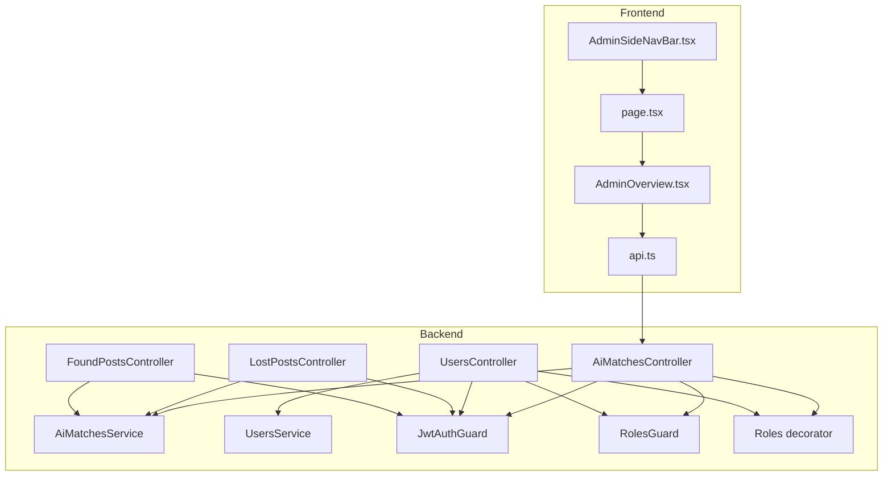
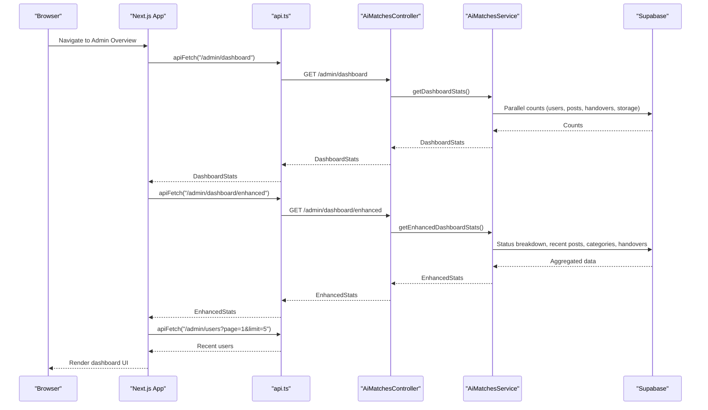
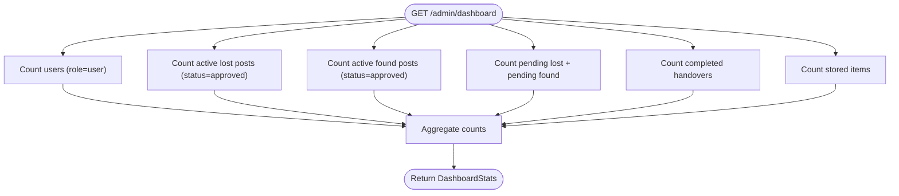
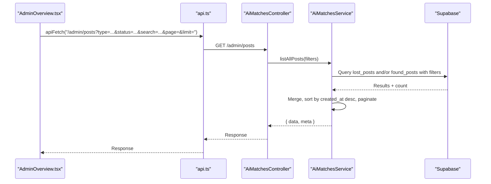
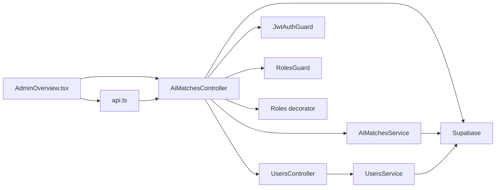

# Admin Overview Dashboard

<cite>
**Referenced Files in This Document**
- [AdminOverview.tsx](file://frontend/app/admin/admin-overview/AdminOverview.tsx)
- [page.tsx](file://frontend/app/admin/admin-overview/page.tsx)
- [api.ts](file://frontend/app/lib/api.ts)
- [AdminSideNavBar.tsx](file://frontend/app/components/AdminSideNavBar.tsx)
- [ai-matches.controller.ts](file://backend/src/modules/ai-matches/ai-matches.controller.ts)
- [ai-matches.service.ts](file://backend/src/modules/ai-matches/ai-matches.service.ts)
- [jwt-auth.guard.ts](file://backend/src/common/guards/jwt-auth.guard.ts)
- [roles.guard.ts](file://backend/src/common/guards/roles.guard.ts)
- [roles.decorator.ts](file://backend/src/common/decorators/roles.decorator.ts)
- [users.controller.ts](file://backend/src/modules/users/users.controller.ts)
- [users.service.ts](file://backend/src/modules/users/users.service.ts)
- [lost-posts.controller.ts](file://backend/src/modules/lost-posts/lost-posts.controller.ts)
- [found-posts.controller.ts](file://backend/src/modules/found-posts/found-posts.controller.ts)
</cite>

## Table of Contents
1. [Introduction](#introduction)
2. [Project Structure](#project-structure)
3. [Core Components](#core-components)
4. [Architecture Overview](#architecture-overview)
5. [Detailed Component Analysis](#detailed-component-analysis)
6. [Dependency Analysis](#dependency-analysis)
7. [Performance Considerations](#performance-considerations)
8. [Troubleshooting Guide](#troubleshooting-guide)
9. [Security Considerations](#security-considerations)
10. [Conclusion](#conclusion)
11. [Appendices](#appendices)

## Introduction
This document describes the Admin Overview Dashboard system, the central administrative interface and analytics monitoring panel for the platform. It covers the dashboard layout, key performance indicators, and system health metrics displayed to administrators. It also explains real-time statistics panels for post counts, user activity, match success rates, and platform usage trends, along with administrative controls for oversight, integration with backend analytics services, and data visualization components. Filtering and reporting capabilities, customization options, metric thresholds, automated alert configurations, and security considerations for dashboard access are included.

## Project Structure
The Admin Overview Dashboard spans the frontend Next.js application and the NestJS backend. The frontend renders the dashboard UI and fetches data from backend endpoints. The backend exposes admin-only endpoints secured by authentication and role-based authorization.

**Diagram sources**
- [AdminOverview.tsx:1-530](file://frontend/app/admin/admin-overview/AdminOverview.tsx#L1-L530)
- [page.tsx:1-6](file://frontend/app/admin/admin-overview/page.tsx#L1-L6)
- [api.ts:1-83](file://frontend/app/lib/api.ts#L1-L83)
- [AdminSideNavBar.tsx:1-119](file://frontend/app/components/AdminSideNavBar.tsx#L1-L119)
- [ai-matches.controller.ts:1-72](file://backend/src/modules/ai-matches/ai-matches.controller.ts#L1-L72)
- [ai-matches.service.ts:1-367](file://backend/src/modules/ai-matches/ai-matches.service.ts#L1-L367)
- [users.controller.ts:1-94](file://backend/src/modules/users/users.controller.ts#L1-L94)
- [users.service.ts:1-136](file://backend/src/modules/users/users.service.ts#L1-L136)
- [lost-posts.controller.ts:1-78](file://backend/src/modules/lost-posts/lost-posts.controller.ts#L1-L78)
- [found-posts.controller.ts:1-78](file://backend/src/modules/found-posts/found-posts.controller.ts#L1-L78)
- [jwt-auth.guard.ts:1-29](file://backend/src/common/guards/jwt-auth.guard.ts#L1-L29)
- [roles.guard.ts:1-28](file://backend/src/common/guards/roles.guard.ts#L1-L28)
- [roles.decorator.ts:1-5](file://backend/src/common/decorators/roles.decorator.ts#L1-L5)

**Section sources**
- [AdminOverview.tsx:1-530](file://frontend/app/admin/admin-overview/AdminOverview.tsx#L1-L530)
- [page.tsx:1-6](file://frontend/app/admin/admin-overview/page.tsx#L1-L6)
- [api.ts:1-83](file://frontend/app/lib/api.ts#L1-L83)
- [AdminSideNavBar.tsx:1-119](file://frontend/app/components/AdminSideNavBar.tsx#L1-L119)
- [ai-matches.controller.ts:1-72](file://backend/src/modules/ai-matches/ai-matches.controller.ts#L1-L72)
- [ai-matches.service.ts:1-367](file://backend/src/modules/ai-matches/ai-matches.service.ts#L1-L367)
- [users.controller.ts:1-94](file://backend/src/modules/users/users.controller.ts#L1-L94)
- [users.service.ts:1-136](file://backend/src/modules/users/users.service.ts#L1-L136)
- [lost-posts.controller.ts:1-78](file://backend/src/modules/lost-posts/lost-posts.controller.ts#L1-L78)
- [found-posts.controller.ts:1-78](file://backend/src/modules/found-posts/found-posts.controller.ts#L1-L78)
- [jwt-auth.guard.ts:1-29](file://backend/src/common/guards/jwt-auth.guard.ts#L1-L29)
- [roles.guard.ts:1-28](file://backend/src/common/guards/roles.guard.ts#L1-L28)
- [roles.decorator.ts:1-5](file://backend/src/common/decorators/roles.decorator.ts#L1-L5)

## Core Components
- Frontend dashboard renderer: AdminOverview.tsx fetches and displays real-time statistics, charts, and recent activity.
- Backend analytics endpoints: AiMatchesController exposes admin dashboard endpoints and enhanced analytics.
- Authentication and authorization: JwtAuthGuard and RolesGuard enforce admin-only access.
- Data service: AiMatchesService queries Supabase for counts, breakdowns, and recent activity.
- Supporting admin endpoints: UsersController and Lost/Found Posts controllers support user and post management.

Key responsibilities:
- AdminOverview.tsx: Renders statistics cards, progress bars, recent activity feed, and user table; formats timestamps; orchestrates parallel data loads.
- AiMatchesController: Exposes GET /admin/dashboard, GET /admin/dashboard/enhanced, and admin post listing with filters.
- AiMatchesService: Implements dashboard queries, status breakdowns, top categories, recent posts, and pagination-aware combined post listing.
- Security guards: JwtAuthGuard validates JWT; RolesGuard enforces admin role.

**Section sources**
- [AdminOverview.tsx:56-86](file://frontend/app/admin/admin-overview/AdminOverview.tsx#L56-L86)
- [ai-matches.controller.ts:42-71](file://backend/src/modules/ai-matches/ai-matches.controller.ts#L42-L71)
- [ai-matches.service.ts:155-274](file://backend/src/modules/ai-matches/ai-matches.service.ts#L155-L274)
- [jwt-auth.guard.ts:13-27](file://backend/src/common/guards/jwt-auth.guard.ts#L13-L27)
- [roles.guard.ts:10-25](file://backend/src/common/guards/roles.guard.ts#L10-L25)

## Architecture Overview
The dashboard follows a client-server pattern:
- The frontend requests admin dashboard data via authenticated endpoints.
- The backend validates credentials and roles, then executes analytics queries against Supabase.
- The frontend renders the UI with responsive layouts and interactive elements.

**Diagram sources**
- [AdminOverview.tsx:62-80](file://frontend/app/admin/admin-overview/AdminOverview.tsx#L62-L80)
- [api.ts:12-43](file://frontend/app/lib/api.ts#L12-L43)
- [ai-matches.controller.ts:42-56](file://backend/src/modules/ai-matches/ai-matches.controller.ts#L42-L56)
- [ai-matches.service.ts:155-274](file://backend/src/modules/ai-matches/ai-matches.service.ts#L155-L274)

## Detailed Component Analysis

### Dashboard Layout and Metrics
The Admin Overview dashboard organizes information into:
- Header with title and live data indicator.
- Bento-style statistics grid: active lost posts, active found posts, success rate card, and pending review count.
- Quick stats cards: total users (with active/suspended/pending breakdown), items in storage, and pending review action card.
- Two-column section: status breakdown for posts and top categories bar chart.
- Recent activity feed of mixed lost/found posts.
- Recent users table with role and status badges.

Real-time statistics panels:
- Success rate: computed from total handovers divided by total active posts.
- Status breakdown: percentage bars per status category for both lost and found posts.
- Top categories: proportional bars based on frequency across lost and found posts.
- Recent activity: latest 10 posts with user, category, and relative timestamp.
- Recent users: latest registered users with role and status.

Administrative controls:
- Pending review card links to post management for immediate moderation.
- Navigation sidebar provides quick access to admin sections.

**Section sources**
- [AdminOverview.tsx:110-528](file://frontend/app/admin/admin-overview/AdminOverview.tsx#L110-L528)

### Backend Analytics Endpoints
Admin endpoints:
- GET /admin/dashboard: Returns total users, active lost/found posts, pending review, total handovers, and items in storage.
- GET /admin/dashboard/enhanced: Returns posts breakdown (lost/found totals and per-status counts), users breakdown, recent posts, top categories, and recent handovers.
- GET /admin/posts: Lists all posts with filters (type, status, search) and pagination.

Implementation highlights:
- Dashboard stats use parallel Supabase queries for counts.
- Enhanced dashboard aggregates status counts, recent posts, top categories, and recent handovers.
- Combined post listing merges lost and found posts, applies filters, sorts by creation time, and paginates.

**Diagram sources**
- [ai-matches.controller.ts:42-48](file://backend/src/modules/ai-matches/ai-matches.controller.ts#L42-L48)
- [ai-matches.service.ts:155-182](file://backend/src/modules/ai-matches/ai-matches.service.ts#L155-L182)

**Section sources**
- [ai-matches.controller.ts:42-56](file://backend/src/modules/ai-matches/ai-matches.controller.ts#L42-L56)
- [ai-matches.service.ts:155-274](file://backend/src/modules/ai-matches/ai-matches.service.ts#L155-L274)

### Data Visualization Components
- Status breakdown bars: Percentage bars per status with color-coded labels.
- Top categories bars: Proportional bars scaled to the most frequent category.
- Recent activity feed: List items with status badges and relative timestamps.
- Recent users table: Role and status badges with training points and registration date.

These visuals are rendered directly in the frontend component using data returned from backend analytics endpoints.

**Section sources**
- [AdminOverview.tsx:268-528](file://frontend/app/admin/admin-overview/AdminOverview.tsx#L268-L528)

### Administrative Controls and Oversight
- Post management navigation: Pending review card links to post management for immediate moderation.
- User management navigation: Sidebar provides access to user administration.
- User status controls: Admin endpoints support suspend/activate user actions.
- Post moderation: Admin endpoints support retrieving pending posts and reviewing them.

Note: Emergency shutdown and system-wide alert management are not present in the current codebase. Administrators can manage users and posts through the provided endpoints.

**Section sources**
- [AdminOverview.tsx:248-266](file://frontend/app/admin/admin-overview/AdminOverview.tsx#L248-L266)
- [AdminSideNavBar.tsx:6-11](file://frontend/app/components/AdminSideNavBar.tsx#L6-L11)
- [users.controller.ts:78-92](file://backend/src/modules/users/users.controller.ts#L78-L92)
- [lost-posts.controller.ts:62-76](file://backend/src/modules/lost-posts/lost-posts.controller.ts#L62-L76)
- [found-posts.controller.ts:62-76](file://backend/src/modules/found-posts/found-posts.controller.ts#L62-L76)

### Filtering and Reporting Capabilities
- Admin post listing supports:
  - Type filter: all, lost, or found.
  - Status filter: arbitrary status value.
  - Search filter: title ILIKE pattern.
  - Pagination: page and limit parameters.
- Combined listing merges lost and found posts, sorts by created_at descending, and applies pagination when type=all.

**Diagram sources**
- [ai-matches.controller.ts:58-70](file://backend/src/modules/ai-matches/ai-matches.controller.ts#L58-L70)
- [ai-matches.service.ts:276-365](file://backend/src/modules/ai-matches/ai-matches.service.ts#L276-L365)

**Section sources**
- [ai-matches.controller.ts:58-70](file://backend/src/modules/ai-matches/ai-matches.controller.ts#L58-L70)
- [ai-matches.service.ts:276-365](file://backend/src/modules/ai-matches/ai-matches.service.ts#L276-L365)

### Dashboard Customization Options
- Metric thresholds: Success rate calculation can be adapted to require minimum post volume before displaying meaningful percentages.
- Automated alert configurations: Not implemented in code; administrators can monitor pending review counts and recent activity to identify anomalies.
- Visualization customization: Color schemes and labels are defined in the frontend component; can be adjusted for branding or accessibility.

**Section sources**
- [AdminOverview.tsx:82-86](file://frontend/app/admin/admin-overview/AdminOverview.tsx#L82-L86)

## Dependency Analysis
The dashboard depends on:
- Frontend dependencies: React hooks, api.ts for authenticated fetch, and Next.js routing.
- Backend dependencies: AiMatchesController and AiMatchesService for analytics, UsersService for recent users, and Supabase for data persistence.
- Security dependencies: JwtAuthGuard and RolesGuard for authentication and role enforcement.

**Diagram sources**
- [AdminOverview.tsx:1-530](file://frontend/app/admin/admin-overview/AdminOverview.tsx#L1-L530)
- [api.ts:1-83](file://frontend/app/lib/api.ts#L1-L83)
- [ai-matches.controller.ts:1-72](file://backend/src/modules/ai-matches/ai-matches.controller.ts#L1-L72)
- [ai-matches.service.ts:1-367](file://backend/src/modules/ai-matches/ai-matches.service.ts#L1-L367)
- [users.controller.ts:1-94](file://backend/src/modules/users/users.controller.ts#L1-L94)
- [users.service.ts:1-136](file://backend/src/modules/users/users.service.ts#L1-L136)
- [jwt-auth.guard.ts:1-29](file://backend/src/common/guards/jwt-auth.guard.ts#L1-L29)
- [roles.guard.ts:1-28](file://backend/src/common/guards/roles.guard.ts#L1-L28)
- [roles.decorator.ts:1-5](file://backend/src/common/decorators/roles.decorator.ts#L1-L5)

**Section sources**
- [AdminOverview.tsx:1-530](file://frontend/app/admin/admin-overview/AdminOverview.tsx#L1-L530)
- [api.ts:1-83](file://frontend/app/lib/api.ts#L1-L83)
- [ai-matches.controller.ts:1-72](file://backend/src/modules/ai-matches/ai-matches.controller.ts#L1-L72)
- [ai-matches.service.ts:1-367](file://backend/src/modules/ai-matches/ai-matches.service.ts#L1-L367)
- [users.controller.ts:1-94](file://backend/src/modules/users/users.controller.ts#L1-L94)
- [users.service.ts:1-136](file://backend/src/modules/users/users.service.ts#L1-L136)
- [jwt-auth.guard.ts:1-29](file://backend/src/common/guards/jwt-auth.guard.ts#L1-L29)
- [roles.guard.ts:1-28](file://backend/src/common/guards/roles.guard.ts#L1-L28)
- [roles.decorator.ts:1-5](file://backend/src/common/decorators/roles.decorator.ts#L1-L5)

## Performance Considerations
- Parallel queries: The dashboard uses Promise.all for counts and breakdowns to minimize latency.
- Efficient rendering: Progress bars and lists are rendered with minimal re-computation; percentages are computed once per render cycle.
- Pagination: Post listing endpoints support pagination to avoid large payloads.
- Caching: No explicit caching is implemented in the frontend; consider adding client-side caching for repeated queries.

[No sources needed since this section provides general guidance]

## Troubleshooting Guide
Common issues and remedies:
- Unauthorized access: If a 401 occurs, the frontend clears local storage and redirects to login. Verify JWT presence and expiration.
- Role access denied: Ensure the user has the admin role; otherwise, RolesGuard throws a forbidden error.
- Network errors: api.ts throws on non-OK responses; inspect network tab and server logs.
- Empty data: Some sections rely on recent activity and categories; absence indicates low platform activity.

**Section sources**
- [api.ts:30-43](file://frontend/app/lib/api.ts#L30-L43)
- [jwt-auth.guard.ts:22-27](file://backend/src/common/guards/jwt-auth.guard.ts#L22-L27)
- [roles.guard.ts:19-25](file://backend/src/common/guards/roles.guard.ts#L19-L25)

## Security Considerations
- Authentication: JwtAuthGuard ensures requests carry a valid JWT; otherwise, UnauthorizedException is thrown.
- Authorization: RolesGuard enforces admin-only access to dashboard endpoints.
- Cookies: Logout endpoint clears HTTP-only cookies with configurable attributes; ensure HTTPS and secure flags are enabled in production.
- Data exposure: Dashboard endpoints return aggregated counts and recent items; avoid exposing sensitive user details unless necessary.

**Section sources**
- [jwt-auth.guard.ts:13-27](file://backend/src/common/guards/jwt-auth.guard.ts#L13-L27)
- [roles.guard.ts:10-25](file://backend/src/common/guards/roles.guard.ts#L10-L25)
- [roles.decorator.ts:1-5](file://backend/src/common/decorators/roles.decorator.ts#L1-L5)
- [auth.controller.ts:46-61](file://backend/src/modules/auth/auth.controller.ts#L46-L61)

## Conclusion
The Admin Overview Dashboard provides administrators with a comprehensive, real-time view of platform activity, user engagement, and operational health. It leverages parallelized backend analytics, robust authentication and authorization, and a responsive frontend layout. While emergency shutdown and advanced alerting are not currently implemented, the dashboard’s modular design allows for future enhancements such as metric thresholds, automated alerts, and expanded administrative controls.

[No sources needed since this section summarizes without analyzing specific files]

## Appendices

### API Definitions
- GET /admin/dashboard
  - Description: Returns basic dashboard statistics.
  - Authentication: Required (JWT).
  - Authorization: admin role required.
  - Response: DashboardStats object containing counts for users, posts, reviews, handovers, and storage items.

- GET /admin/dashboard/enhanced
  - Description: Returns enhanced analytics including status breakdowns, recent activity, top categories, and recent handovers.
  - Authentication: Required (JWT).
  - Authorization: admin role required.
  - Response: EnhancedStats object with nested breakdowns and arrays.

- GET /admin/posts
  - Description: Lists all posts with optional filters and pagination.
  - Authentication: Required (JWT).
  - Authorization: admin role required.
  - Query parameters:
    - type: all | lost | found
    - status: string
    - search: string
    - page: number
    - limit: number
  - Response: Paginated list of posts with metadata.

- GET /admin/users
  - Description: Lists users with pagination.
  - Authentication: Required (JWT).
  - Authorization: admin role required.
  - Query parameters:
    - page: number
    - limit: number
  - Response: Paginated user list with metadata.

**Section sources**
- [ai-matches.controller.ts:42-70](file://backend/src/modules/ai-matches/ai-matches.controller.ts#L42-L70)
- [users.controller.ts:70-76](file://backend/src/modules/users/users.controller.ts#L70-L76)