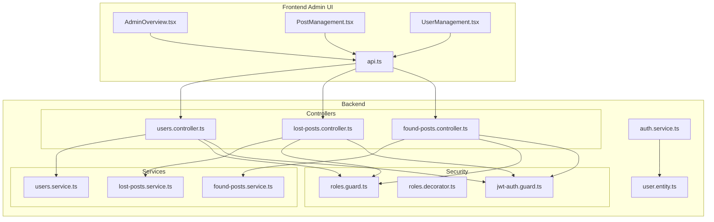
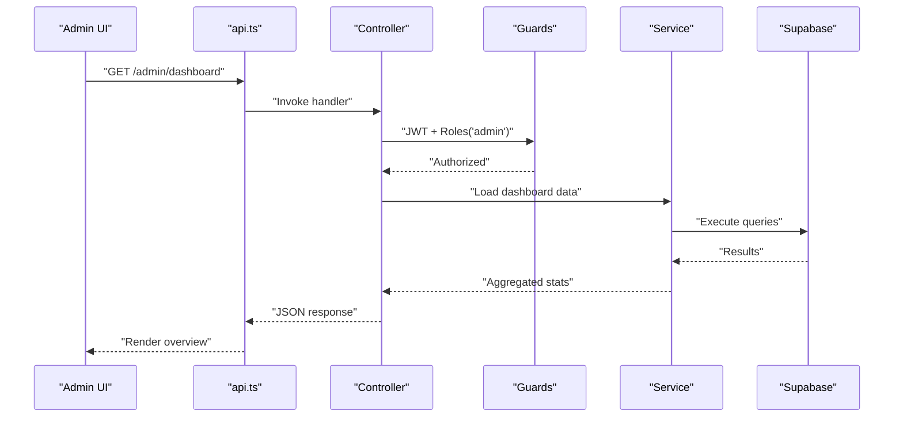
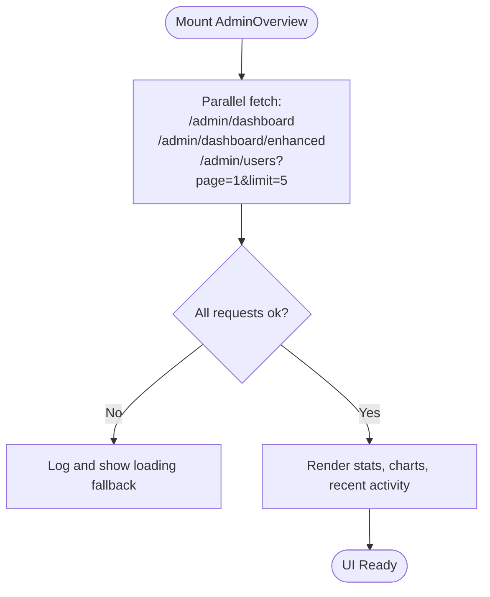
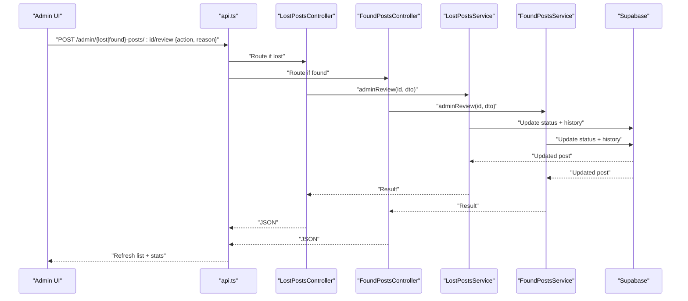
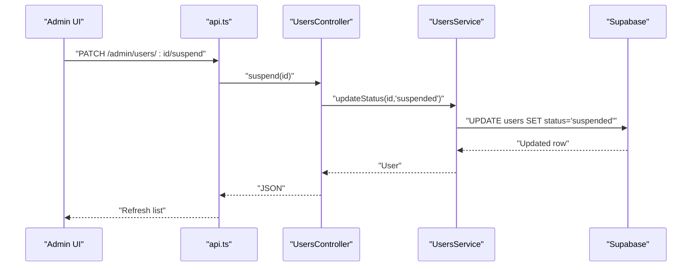
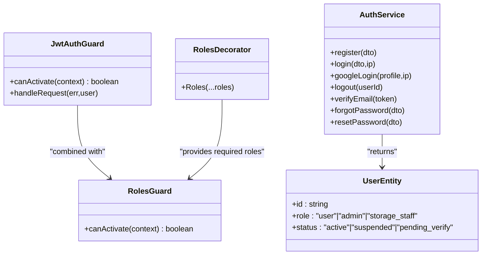
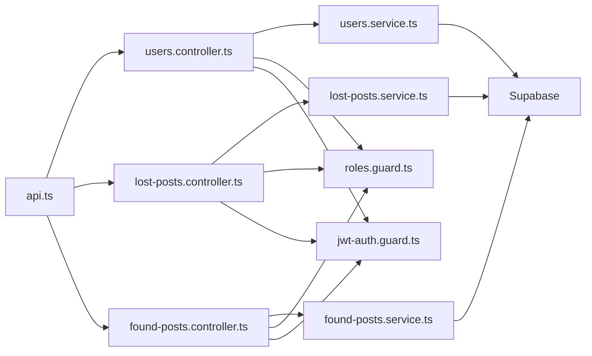

# Administrative Dashboard & Oversight

<cite>
**Referenced Files in This Document**
- [AdminOverview.tsx](file://frontend/app/admin/admin-overview/AdminOverview.tsx)
- [PostManagement.tsx](file://frontend/app/admin/post-management/PostManagement.tsx)
- [UserManagement.tsx](file://frontend/app/admin/user-management/UserManagement.tsx)
- [api.ts](file://frontend/app/lib/api.ts)
- [users.controller.ts](file://backend/src/modules/users/users.controller.ts)
- [users.service.ts](file://backend/src/modules/users/users.service.ts)
- [found-posts.controller.ts](file://backend/src/modules/found-posts/found-posts.controller.ts)
- [found-posts.service.ts](file://backend/src/modules/found-posts/found-posts.service.ts)
- [lost-posts.controller.ts](file://backend/src/modules/lost-posts/lost-posts.controller.ts)
- [lost-posts.service.ts](file://backend/src/modules/lost-posts/lost-posts.service.ts)
- [roles.guard.ts](file://backend/src/common/guards/roles.guard.ts)
- [roles.decorator.ts](file://backend/src/common/decorators/roles.decorator.ts)
- [jwt-auth.guard.ts](file://backend/src/common/guards/jwt-auth.guard.ts)
- [auth.service.ts](file://backend/src/modules/auth/auth.service.ts)
- [user.entity.ts](file://backend/src/modules/auth/entities/user.entity.ts)
</cite>

## Table of Contents
1. [Introduction](#introduction)
2. [Project Structure](#project-structure)
3. [Core Components](#core-components)
4. [Architecture Overview](#architecture-overview)
5. [Detailed Component Analysis](#detailed-component-analysis)
6. [Dependency Analysis](#dependency-analysis)
7. [Performance Considerations](#performance-considerations)
8. [Troubleshooting Guide](#troubleshooting-guide)
9. [Conclusion](#conclusion)

## Introduction
This document describes the Administrative Dashboard & Oversight system for content moderation, user management, and system monitoring. It covers the admin overview dashboard, post management interface, user management, administrative workflows, reporting and analytics, integrations, decision-making processes, and security controls. The system is built with a React-based admin UI and a NestJS backend integrated with Supabase for data persistence and authentication.

## Project Structure
The admin functionality spans three primary areas:
- Frontend admin pages: overview, post management, and user management
- Backend controllers and services for users, lost posts, and found posts
- Security guards and decorators enforcing role-based access control (RBAC)
- Shared API client for authenticated requests

**Diagram sources**
- [AdminOverview.tsx](file://frontend/app/admin/admin-overview/AdminOverview.tsx)
- [PostManagement.tsx](file://frontend/app/admin/post-management/PostManagement.tsx)
- [UserManagement.tsx](file://frontend/app/admin/user-management/UserManagement.tsx)
- [api.ts](file://frontend/app/lib/api.ts)
- [users.controller.ts](file://backend/src/modules/users/users.controller.ts)
- [lost-posts.controller.ts](file://backend/src/modules/lost-posts/lost-posts.controller.ts)
- [found-posts.controller.ts](file://backend/src/modules/found-posts/found-posts.controller.ts)
- [users.service.ts](file://backend/src/modules/users/users.service.ts)
- [lost-posts.service.ts](file://backend/src/modules/lost-posts/lost-posts.service.ts)
- [found-posts.service.ts](file://backend/src/modules/found-posts/found-posts.service.ts)
- [roles.guard.ts](file://backend/src/common/guards/roles.guard.ts)
- [roles.decorator.ts](file://backend/src/common/decorators/roles.decorator.ts)
- [jwt-auth.guard.ts](file://backend/src/common/guards/jwt-auth.guard.ts)
- [auth.service.ts](file://backend/src/modules/auth/auth.service.ts)
- [user.entity.ts](file://backend/src/modules/auth/entities/user.entity.ts)

**Section sources**
- [AdminOverview.tsx](file://frontend/app/admin/admin-overview/AdminOverview.tsx)
- [PostManagement.tsx](file://frontend/app/admin/post-management/PostManagement.tsx)
- [UserManagement.tsx](file://frontend/app/admin/user-management/UserManagement.tsx)
- [api.ts](file://frontend/app/lib/api.ts)
- [users.controller.ts](file://backend/src/modules/users/users.controller.ts)
- [lost-posts.controller.ts](file://backend/src/modules/lost-posts/lost-posts.controller.ts)
- [found-posts.controller.ts](file://backend/src/modules/found-posts/found-posts.controller.ts)
- [roles.guard.ts](file://backend/src/common/guards/roles.guard.ts)
- [jwt-auth.guard.ts](file://backend/src/common/guards/jwt-auth.guard.ts)

## Core Components
- Admin Overview Dashboard
  - Loads system stats, enhanced analytics, and recent activity
  - Displays quick stats cards, status breakdowns, top categories, and recent posts/users
- Post Management Interface
  - Lists posts with filtering, pagination, and status actions (approve, reject, delete)
  - Provides summary stats and category/status distribution
- User Management
  - Lists users with role/status badges and account control actions (suspend/activate)
  - Includes summary stats for active, suspended, and pending users
- Security and Access Control
  - JWT authentication guard and RBAC via roles decorator and roles guard
  - Admin-only endpoints enforced by @Roles('admin')

**Section sources**
- [AdminOverview.tsx](file://frontend/app/admin/admin-overview/AdminOverview.tsx)
- [PostManagement.tsx](file://frontend/app/admin/post-management/PostManagement.tsx)
- [UserManagement.tsx](file://frontend/app/admin/user-management/UserManagement.tsx)
- [roles.guard.ts](file://backend/src/common/guards/roles.guard.ts)
- [roles.decorator.ts](file://backend/src/common/decorators/roles.decorator.ts)
- [jwt-auth.guard.ts](file://backend/src/common/guards/jwt-auth.guard.ts)

## Architecture Overview
The admin UI communicates with backend endpoints via an authenticated API client. Controllers enforce RBAC for admin-only routes, and services encapsulate data access and business logic against Supabase.

**Diagram sources**
- [AdminOverview.tsx](file://frontend/app/admin/admin-overview/AdminOverview.tsx)
- [api.ts](file://frontend/app/lib/api.ts)
- [users.controller.ts](file://backend/src/modules/users/users.controller.ts)
- [users.service.ts](file://backend/src/modules/users/users.service.ts)
- [roles.guard.ts](file://backend/src/common/guards/roles.guard.ts)
- [jwt-auth.guard.ts](file://backend/src/common/guards/jwt-auth.guard.ts)

## Detailed Component Analysis

### Admin Overview Dashboard
- Responsibilities
  - Fetches dashboard stats, enhanced analytics, and recent users
  - Computes derived metrics (success rate, status distributions)
  - Renders summary cards, charts, and recent activity feed
- Data sources
  - Dashboard stats endpoint
  - Enhanced analytics endpoint
  - Recent users endpoint
- UI behavior
  - Parallel loading of stats
  - Local time-ago formatting
  - Navigation to post/user management

**Diagram sources**
- [AdminOverview.tsx](file://frontend/app/admin/admin-overview/AdminOverview.tsx)

**Section sources**
- [AdminOverview.tsx](file://frontend/app/admin/admin-overview/AdminOverview.tsx)

### Post Management Interface
- Responsibilities
  - List posts with filters (type, status, search)
  - Perform admin actions: approve, reject (with reason), delete
  - Show summary stats and distribution charts
- Data sources
  - Posts endpoint with pagination and filters
  - Enhanced analytics endpoint for stats
- Workflows
  - Approve: POST /admin/{lost|found}-posts/:id/review with action=approved
  - Reject: POST with action=rejected and reason
  - Delete: DELETE /{lost|found}-posts/:id

**Diagram sources**
- [PostManagement.tsx](file://frontend/app/admin/post-management/PostManagement.tsx)
- [lost-posts.controller.ts](file://backend/src/modules/lost-posts/lost-posts.controller.ts)
- [found-posts.controller.ts](file://backend/src/modules/found-posts/found-posts.controller.ts)
- [lost-posts.service.ts](file://backend/src/modules/lost-posts/lost-posts.service.ts)
- [found-posts.service.ts](file://backend/src/modules/found-posts/found-posts.service.ts)

**Section sources**
- [PostManagement.tsx](file://frontend/app/admin/post-management/PostManagement.tsx)
- [lost-posts.controller.ts](file://backend/src/modules/lost-posts/lost-posts.controller.ts)
- [found-posts.controller.ts](file://backend/src/modules/found-posts/found-posts.controller.ts)
- [lost-posts.service.ts](file://backend/src/modules/lost-posts/lost-posts.service.ts)
- [found-posts.service.ts](file://backend/src/modules/found-posts/found-posts.service.ts)

### User Management
- Responsibilities
  - List users with pagination
  - Suspend/activate user accounts
  - Show summary stats for user statuses
- Data sources
  - GET /admin/users?page,limit
  - PATCH /admin/users/:id/suspend, /admin/users/:id/activate

**Diagram sources**
- [UserManagement.tsx](file://frontend/app/admin/user-management/UserManagement.tsx)
- [users.controller.ts](file://backend/src/modules/users/users.controller.ts)
- [users.service.ts](file://backend/src/modules/users/users.service.ts)

**Section sources**
- [UserManagement.tsx](file://frontend/app/admin/user-management/UserManagement.tsx)
- [users.controller.ts](file://backend/src/modules/users/users.controller.ts)
- [users.service.ts](file://backend/src/modules/users/users.service.ts)

### Security and Access Control
- Guards and Decorators
  - JwtAuthGuard: Enforces JWT presence for protected routes
  - RolesGuard: Enforces required roles (e.g., admin)
  - Roles decorator: Declares required roles per route
- Authentication
  - AuthService handles registration, login, Google login, logout, email verification, and password reset
  - User entity defines roles and statuses

**Diagram sources**
- [jwt-auth.guard.ts](file://backend/src/common/guards/jwt-auth.guard.ts)
- [roles.guard.ts](file://backend/src/common/guards/roles.guard.ts)
- [roles.decorator.ts](file://backend/src/common/decorators/roles.decorator.ts)
- [auth.service.ts](file://backend/src/modules/auth/auth.service.ts)
- [user.entity.ts](file://backend/src/modules/auth/entities/user.entity.ts)

**Section sources**
- [roles.guard.ts](file://backend/src/common/guards/roles.guard.ts)
- [roles.decorator.ts](file://backend/src/common/decorators/roles.decorator.ts)
- [jwt-auth.guard.ts](file://backend/src/common/guards/jwt-auth.guard.ts)
- [auth.service.ts](file://backend/src/modules/auth/auth.service.ts)
- [user.entity.ts](file://backend/src/modules/auth/entities/user.entity.ts)

## Dependency Analysis
- Frontend depends on:
  - api.ts for authenticated HTTP requests
  - Next.js app directory routing for admin pages
- Backend controllers depend on:
  - Guards for authentication and authorization
  - Services for data access and business logic
  - Supabase client for database operations
- Services depend on:
  - Supabase client
  - Exception classes for error handling

**Diagram sources**
- [api.ts](file://frontend/app/lib/api.ts)
- [users.controller.ts](file://backend/src/modules/users/users.controller.ts)
- [lost-posts.controller.ts](file://backend/src/modules/lost-posts/lost-posts.controller.ts)
- [found-posts.controller.ts](file://backend/src/modules/found-posts/found-posts.controller.ts)
- [users.service.ts](file://backend/src/modules/users/users.service.ts)
- [lost-posts.service.ts](file://backend/src/modules/lost-posts/lost-posts.service.ts)
- [found-posts.service.ts](file://backend/src/modules/found-posts/found-posts.service.ts)
- [roles.guard.ts](file://backend/src/common/guards/roles.guard.ts)
- [jwt-auth.guard.ts](file://backend/src/common/guards/jwt-auth.guard.ts)

**Section sources**
- [api.ts](file://frontend/app/lib/api.ts)
- [users.controller.ts](file://backend/src/modules/users/users.controller.ts)
- [lost-posts.controller.ts](file://backend/src/modules/lost-posts/lost-posts.controller.ts)
- [found-posts.controller.ts](file://backend/src/modules/found-posts/found-posts.controller.ts)
- [users.service.ts](file://backend/src/modules/users/users.service.ts)
- [lost-posts.service.ts](file://backend/src/modules/lost-posts/lost-posts.service.ts)
- [found-posts.service.ts](file://backend/src/modules/found-posts/found-posts.service.ts)
- [roles.guard.ts](file://backend/src/common/guards/roles.guard.ts)
- [jwt-auth.guard.ts](file://backend/src/common/guards/jwt-auth.guard.ts)

## Performance Considerations
- Parallel loading
  - Admin overview loads multiple datasets concurrently to reduce perceived latency
- Pagination
  - Controllers support pagination to avoid large payloads
- Lazy increments
  - View counts are incremented asynchronously to minimize write latency
- Caching
  - Consider caching frequently accessed dashboard aggregates at the application level if appropriate

[No sources needed since this section provides general guidance]

## Troubleshooting Guide
- Unauthorized access
  - Symptom: Redirect to login or 401 errors
  - Causes: Missing/expired JWT, insufficient roles
  - Resolution: Re-authenticate; ensure user role includes admin
- Action failures
  - Symptom: Alerts for approve/reject/delete failures
  - Causes: Missing reason for rejection, backend validation errors
  - Resolution: Provide required reason for rejection; check network tab for error messages
- Data not updating
  - Symptom: Stale stats or lists after actions
  - Causes: UI not refreshing or API errors
  - Resolution: Trigger reload; confirm endpoints return success

**Section sources**
- [api.ts](file://frontend/app/lib/api.ts)
- [PostManagement.tsx](file://frontend/app/admin/post-management/PostManagement.tsx)
- [UserManagement.tsx](file://frontend/app/admin/user-management/UserManagement.tsx)
- [jwt-auth.guard.ts](file://backend/src/common/guards/jwt-auth.guard.ts)
- [roles.guard.ts](file://backend/src/common/guards/roles.guard.ts)

## Conclusion
The Administrative Dashboard & Oversight system provides a comprehensive admin interface for monitoring, content moderation, and user management. It leverages RBAC and JWT-based authentication to protect sensitive endpoints, integrates with Supabase for reliable data access, and offers responsive UI components for efficient oversight. The design balances automation with human discretion, enabling timely moderation decisions while maintaining transparency and auditability.