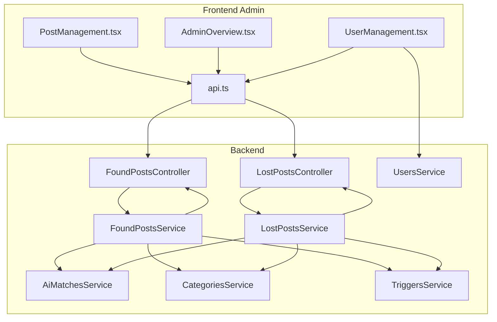
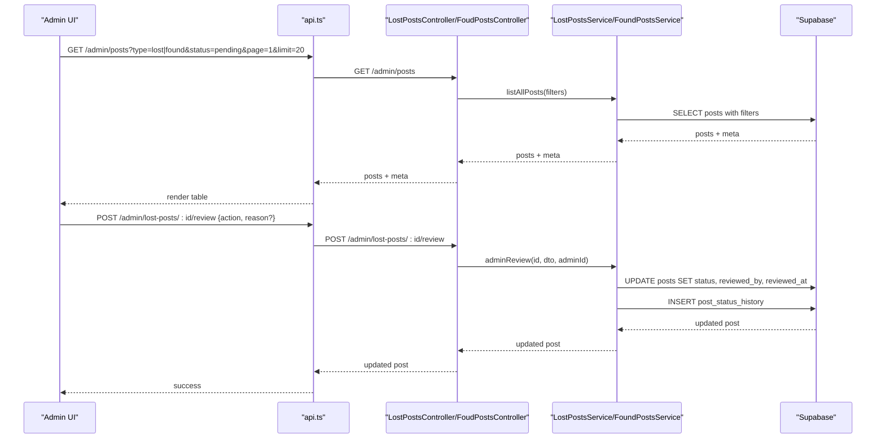
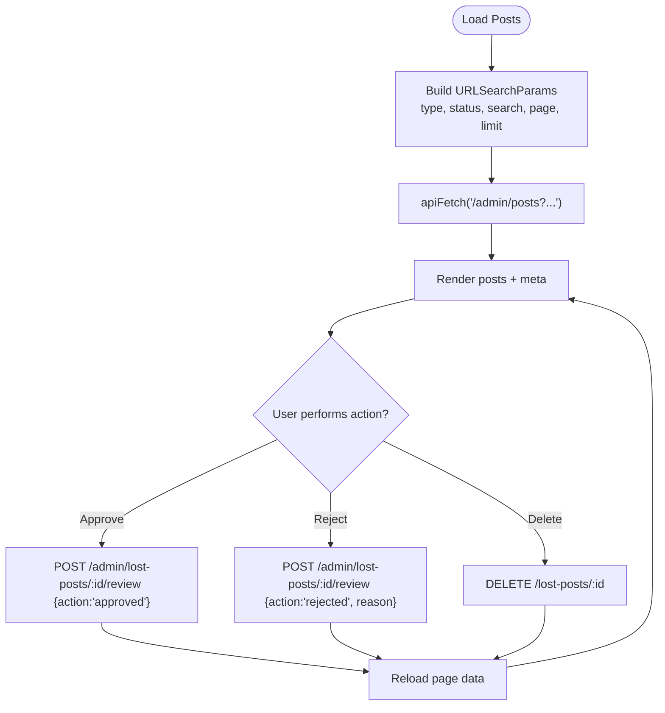
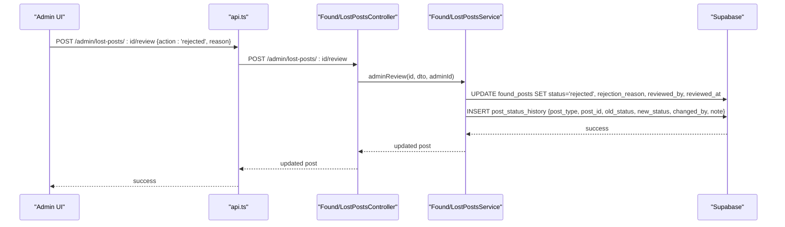
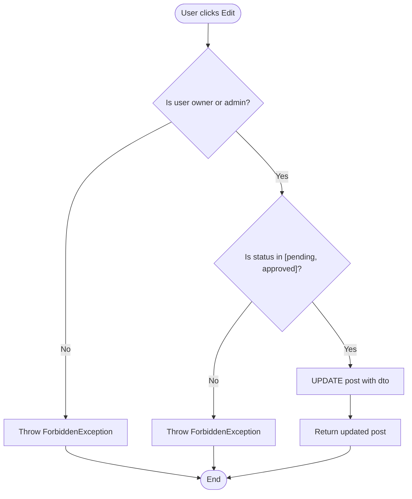
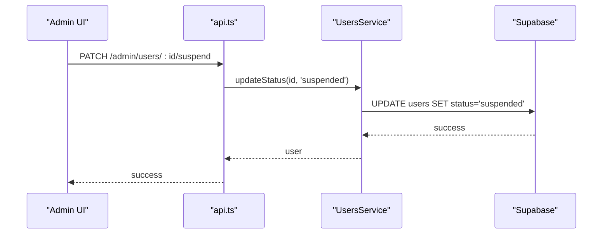
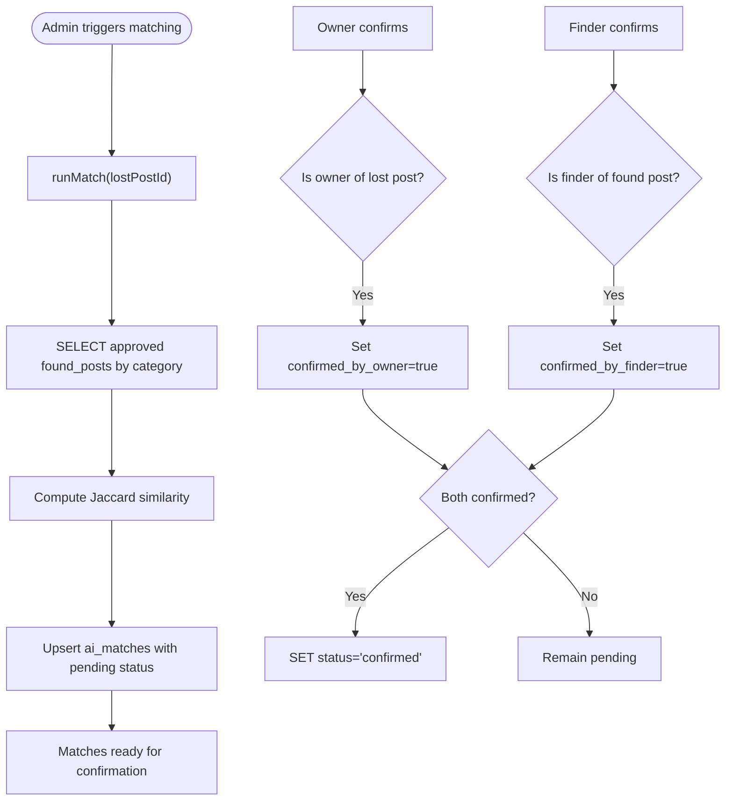
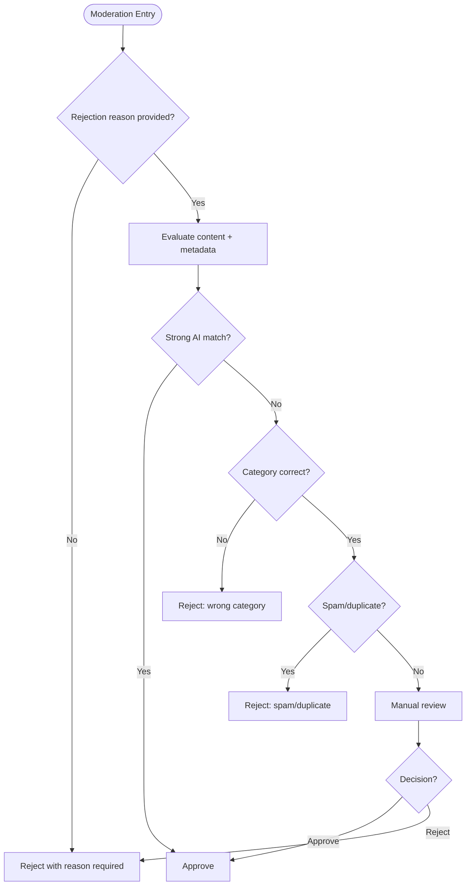
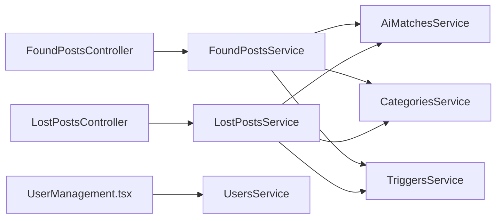

# Post Management System

<cite>
**Referenced Files in This Document**
- [PostManagement.tsx](file://frontend/app/admin/post-management/PostManagement.tsx)
- [page.tsx](file://frontend/app/admin/post-management/page.tsx)
- [AdminOverview.tsx](file://frontend/app/admin/admin-overview/AdminOverview.tsx)
- [UserManagement.tsx](file://frontend/app/admin/user-management/UserManagement.tsx)
- [api.ts](file://frontend/app/lib/api.ts)
- [supabase.ts](file://frontend/app/lib/supabase.ts)
- [found-posts.controller.ts](file://backend/src/modules/found-posts/found-posts.controller.ts)
- [lost-posts.controller.ts](file://backend/src/modules/lost-posts/lost-posts.controller.ts)
- [found-posts.service.ts](file://backend/src/modules/found-posts/found-posts.service.ts)
- [lost-posts.service.ts](file://backend/src/modules/lost-posts/lost-posts.service.ts)
- [query-found-posts.dto.ts](file://backend/src/modules/found-posts/dto/query-found-posts.dto.ts)
- [query-lost-posts.dto.ts](file://backend/src/modules/lost-posts/dto/query-lost-posts.dto.ts)
- [review-post.dto.ts](file://backend/src/modules/lost-posts/dto/review-post.dto.ts)
- [update-found-post.dto.ts](file://backend/src/modules/found-posts/dto/update-found-post.dto.ts)
- [ai-matches.service.ts](file://backend/src/modules/ai-matches/ai-matches.service.ts)
- [categories.service.ts](file://backend/src/modules/categories/categories.service.ts)
- [users.service.ts](file://backend/src/modules/users/users.service.ts)
- [triggers.service.ts](file://backend/src/modules/triggers/triggers.service.ts)
</cite>

## Table of Contents
1. [Introduction](#introduction)
2. [Project Structure](#project-structure)
3. [Core Components](#core-components)
4. [Architecture Overview](#architecture-overview)
5. [Detailed Component Analysis](#detailed-component-analysis)
6. [Dependency Analysis](#dependency-analysis)
7. [Performance Considerations](#performance-considerations)
8. [Troubleshooting Guide](#troubleshooting-guide)
9. [Conclusion](#conclusion)

## Introduction
This document describes the Post Management System with a focus on administrative controls for content moderation and post lifecycle management. It covers the post listing interface with filtering, moderation workflows (approval, rejection, automated matching), administrative editing and status updates, user action controls (suspend, delete), integration with AI matching systems, manual overrides, decision trees, escalation procedures, and audit trails.

## Project Structure
The system comprises:
- Frontend admin pages for post management, overview, and user management
- Backend controllers and services for lost and found posts
- AI matching service for automated post verification
- Supporting services for categories, users, and triggers
- Shared DTOs for queries and moderation actions

**Diagram sources**
- [PostManagement.tsx:1-698](file://frontend/app/admin/post-management/PostManagement.tsx#L1-L698)
- [AdminOverview.tsx:1-530](file://frontend/app/admin/admin-overview/AdminOverview.tsx#L1-L530)
- [UserManagement.tsx:1-327](file://frontend/app/admin/user-management/UserManagement.tsx#L1-L327)
- [api.ts](file://frontend/app/lib/api.ts)
- [found-posts.controller.ts:1-78](file://backend/src/modules/found-posts/found-posts.controller.ts#L1-L78)
- [lost-posts.controller.ts:1-78](file://backend/src/modules/lost-posts/lost-posts.controller.ts#L1-L78)
- [found-posts.service.ts:1-162](file://backend/src/modules/found-posts/found-posts.service.ts#L1-L162)
- [lost-posts.service.ts:1-189](file://backend/src/modules/lost-posts/lost-posts.service.ts#L1-L189)
- [ai-matches.service.ts:1-367](file://backend/src/modules/ai-matches/ai-matches.service.ts#L1-L367)
- [categories.service.ts:1-32](file://backend/src/modules/categories/categories.service.ts#L1-L32)
- [users.service.ts:1-136](file://backend/src/modules/users/users.service.ts#L1-L136)
- [triggers.service.ts:1-163](file://backend/src/modules/triggers/triggers.service.ts#L1-L163)

**Section sources**
- [PostManagement.tsx:1-698](file://frontend/app/admin/post-management/PostManagement.tsx#L1-L698)
- [AdminOverview.tsx:1-530](file://frontend/app/admin/admin-overview/AdminOverview.tsx#L1-L530)
- [UserManagement.tsx:1-327](file://frontend/app/admin/user-management/UserManagement.tsx#L1-L327)
- [found-posts.controller.ts:1-78](file://backend/src/modules/found-posts/found-posts.controller.ts#L1-L78)
- [lost-posts.controller.ts:1-78](file://backend/src/modules/lost-posts/lost-posts.controller.ts#L1-L78)
- [found-posts.service.ts:1-162](file://backend/src/modules/found-posts/found-posts.service.ts#L1-L162)
- [lost-posts.service.ts:1-189](file://backend/src/modules/lost-posts/lost-posts.service.ts#L1-L189)
- [ai-matches.service.ts:1-367](file://backend/src/modules/ai-matches/ai-matches.service.ts#L1-L367)
- [categories.service.ts:1-32](file://backend/src/modules/categories/categories.service.ts#L1-L32)
- [users.service.ts:1-136](file://backend/src/modules/users/users.service.ts#L1-L136)
- [triggers.service.ts:1-163](file://backend/src/modules/triggers/triggers.service.ts#L1-L163)

## Core Components
- Post listing and moderation UI: filters by type, status, search; approve/reject/delete actions; pagination and stats
- Lost and found post services: CRUD, status transitions, pending review retrieval, and moderation logging
- AI matching service: text-based matching between lost and found posts, confirmation workflow, and dashboard stats
- Categories service: category lookup for filtering and display
- Users service: user listing, status updates (suspend/activate), and training stats
- Triggers service: automated point-based handover triggers with cron expiration

**Section sources**
- [PostManagement.tsx:38-186](file://frontend/app/admin/post-management/PostManagement.tsx#L38-L186)
- [found-posts.service.ts:117-160](file://backend/src/modules/found-posts/found-posts.service.ts#L117-L160)
- [lost-posts.service.ts:139-187](file://backend/src/modules/lost-posts/lost-posts.service.ts#L139-L187)
- [ai-matches.service.ts:15-96](file://backend/src/modules/ai-matches/ai-matches.service.ts#L15-L96)
- [categories.service.ts:10-19](file://backend/src/modules/categories/categories.service.ts#L10-L19)
- [users.service.ts:105-134](file://backend/src/modules/users/users.service.ts#L105-L134)
- [triggers.service.ts:30-88](file://backend/src/modules/triggers/triggers.service.ts#L30-L88)

## Architecture Overview
The admin UI communicates with backend controllers via REST endpoints. Controllers delegate to services that interact with Supabase. Moderation actions update post statuses and log changes to a dedicated history table. AI matching runs independently to propose matches, which require manual confirmation.

**Diagram sources**
- [PostManagement.tsx:53-76](file://frontend/app/admin/post-management/PostManagement.tsx#L53-L76)
- [lost-posts.controller.ts:62-76](file://backend/src/modules/lost-posts/lost-posts.controller.ts#L62-L76)
- [found-posts.controller.ts:62-76](file://backend/src/modules/found-posts/found-posts.controller.ts#L62-L76)
- [lost-posts.service.ts:139-171](file://backend/src/modules/lost-posts/lost-posts.service.ts#L139-L171)
- [found-posts.service.ts:117-145](file://backend/src/modules/found-posts/found-posts.service.ts#L117-L145)

## Detailed Component Analysis

### Post Listing Interface and Filtering
- Filters supported: type (all/lost/found), status, search term, pagination
- Endpoint: GET /admin/posts with query parameters
- UI renders:
  - Summary cards for totals and pending counts
  - Filter chips for type and status
  - Search input
  - Live count badge for pending items
  - Paginated table with actions per row

**Diagram sources**
- [PostManagement.tsx:53-151](file://frontend/app/admin/post-management/PostManagement.tsx#L53-L151)

**Section sources**
- [PostManagement.tsx:38-186](file://frontend/app/admin/post-management/PostManagement.tsx#L38-L186)
- [PostManagement.tsx:187-698](file://frontend/app/admin/post-management/PostManagement.tsx#L187-L698)

### Content Moderation Workflows
- Approval process: POST /admin/lost-posts/:id/review or /admin/found-posts/:id/review with action: approved
- Rejection process: POST with action: rejected and reason required
- Pending review retrieval: GET /admin/lost-posts/pending and /admin/found-posts/pending
- Status history logging: Services insert records into post_status_history with old/new status, changed_by, and note

**Diagram sources**
- [lost-posts.controller.ts:70-76](file://backend/src/modules/lost-posts/lost-posts.controller.ts#L70-L76)
- [found-posts.controller.ts:70-76](file://backend/src/modules/found-posts/found-posts.controller.ts#L70-L76)
- [lost-posts.service.ts:139-171](file://backend/src/modules/lost-posts/lost-posts.service.ts#L139-L171)
- [found-posts.service.ts:117-145](file://backend/src/modules/found-posts/found-posts.service.ts#L117-L145)

**Section sources**
- [lost-posts.controller.ts:62-76](file://backend/src/modules/lost-posts/lost-posts.controller.ts#L62-L76)
- [found-posts.controller.ts:62-76](file://backend/src/modules/found-posts/found-posts.controller.ts#L62-L76)
- [lost-posts.service.ts:139-171](file://backend/src/modules/lost-posts/lost-posts.service.ts#L139-L171)
- [found-posts.service.ts:117-145](file://backend/src/modules/found-posts/found-posts.service.ts#L117-L145)

### Post Editing Capabilities
- Update endpoints: PATCH /lost-posts/:id and PATCH /found-posts/:id
- Ownership checks: users can edit their own posts; admins can edit any post
- Edit restrictions: posts with status not in pending/approved cannot be edited by non-admins
- Deletion: DELETE /lost-posts/:id or DELETE /found-posts/:id with ownership/admin checks

**Diagram sources**
- [lost-posts.service.ts:105-125](file://backend/src/modules/lost-posts/lost-posts.service.ts#L105-L125)
- [found-posts.service.ts:96-105](file://backend/src/modules/found-posts/found-posts.service.ts#L96-L105)

**Section sources**
- [lost-posts.service.ts:105-137](file://backend/src/modules/lost-posts/lost-posts.service.ts#L105-L137)
- [found-posts.service.ts:96-115](file://backend/src/modules/found-posts/found-posts.service.ts#L96-L115)
- [update-found-post.dto.ts:1-5](file://backend/src/modules/found-posts/dto/update-found-post.dto.ts#L1-L5)

### User Action Controls
- Suspension/activation: PATCH /admin/users/:id/suspend and PATCH /admin/users/:id/activate via UserManagement UI
- Enforcement: Non-admin users cannot act on admin accounts
- User listing: GET /admin/users?page&limit

**Diagram sources**
- [UserManagement.tsx:47-70](file://frontend/app/admin/user-management/UserManagement.tsx#L47-L70)
- [users.service.ts:123-134](file://backend/src/modules/users/users.service.ts#L123-L134)

**Section sources**
- [UserManagement.tsx:22-79](file://frontend/app/admin/user-management/UserManagement.tsx#L22-L79)
- [users.service.ts:105-134](file://backend/src/modules/users/users.service.ts#L105-L134)

### AI Matching Integration and Manual Override
- Automated matching: runMatch computes text similarity between lost and found posts in the same category; inserts matches with pending status
- Retrieval: findMatches returns existing matches with scores and confirmation flags
- Manual override: confirmMatch requires either owner or finder confirmation; both sides confirm -> status becomes confirmed
- Dashboard stats: getEnhancedDashboardStats aggregates status breakdown, recent posts, top categories

**Diagram sources**
- [ai-matches.service.ts:45-96](file://backend/src/modules/ai-matches/ai-matches.service.ts#L45-L96)
- [ai-matches.service.ts:101-141](file://backend/src/modules/ai-matches/ai-matches.service.ts#L101-L141)
- [ai-matches.service.ts:184-274](file://backend/src/modules/ai-matches/ai-matches.service.ts#L184-L274)

**Section sources**
- [ai-matches.service.ts:11-141](file://backend/src/modules/ai-matches/ai-matches.service.ts#L11-L141)
- [ai-matches.service.ts:155-274](file://backend/src/modules/ai-matches/ai-matches.service.ts#L155-L274)

### Decision Trees for Content Approval
Common moderation scenarios:
- Clear match with strong similarity and category alignment → approve
- Weak similarity or mismatched category → reject with reason
- Duplicate or spam-like content → reject with reason
- Post expired or irrelevant status → close (requires admin action)
- Escalation: higher-level admin review or policy override

[No sources needed since this diagram shows conceptual workflow, not actual code structure]

### Audit Trail Functionality
- Status history: post_status_history captures post_type, post_id, old_status, new_status, changed_by, note, and timestamp
- Logged on every moderation action (approve/reject)
- Used for transparency and compliance

**Section sources**
- [found-posts.service.ts:28-35](file://backend/src/modules/found-posts/found-posts.service.ts#L28-L35)
- [found-posts.service.ts:135-142](file://backend/src/modules/found-posts/found-posts.service.ts#L135-L142)
- [lost-posts.service.ts:32-40](file://backend/src/modules/lost-posts/lost-posts.service.ts#L32-L40)
- [lost-posts.service.ts:160-168](file://backend/src/modules/lost-posts/lost-posts.service.ts#L160-L168)

## Dependency Analysis
- Controllers depend on services for business logic
- Services depend on Supabase client for database operations
- AI matching service integrates with post services and categories
- User management depends on users service
- Triggers service supports point-based handovers and cron expiration

**Diagram sources**
- [found-posts.controller.ts:1-78](file://backend/src/modules/found-posts/found-posts.controller.ts#L1-L78)
- [lost-posts.controller.ts:1-78](file://backend/src/modules/lost-posts/lost-posts.controller.ts#L1-L78)
- [found-posts.service.ts:1-162](file://backend/src/modules/found-posts/found-posts.service.ts#L1-L162)
- [lost-posts.service.ts:1-189](file://backend/src/modules/lost-posts/lost-posts.service.ts#L1-L189)
- [ai-matches.service.ts:1-367](file://backend/src/modules/ai-matches/ai-matches.service.ts#L1-L367)
- [categories.service.ts:1-32](file://backend/src/modules/categories/categories.service.ts#L1-L32)
- [users.service.ts:1-136](file://backend/src/modules/users/users.service.ts#L1-L136)
- [triggers.service.ts:1-163](file://backend/src/modules/triggers/triggers.service.ts#L1-L163)

**Section sources**
- [found-posts.controller.ts:1-78](file://backend/src/modules/found-posts/found-posts.controller.ts#L1-L78)
- [lost-posts.controller.ts:1-78](file://backend/src/modules/lost-posts/lost-posts.controller.ts#L1-L78)
- [found-posts.service.ts:1-162](file://backend/src/modules/found-posts/found-posts.service.ts#L1-L162)
- [lost-posts.service.ts:1-189](file://backend/src/modules/lost-posts/lost-posts.service.ts#L1-L189)
- [ai-matches.service.ts:1-367](file://backend/src/modules/ai-matches/ai-matches.service.ts#L1-L367)
- [categories.service.ts:1-32](file://backend/src/modules/categories/categories.service.ts#L1-L32)
- [users.service.ts:1-136](file://backend/src/modules/users/users.service.ts#L1-L136)
- [triggers.service.ts:1-163](file://backend/src/modules/triggers/triggers.service.ts#L1-L163)

## Performance Considerations
- Pagination: enforced limits on listing endpoints prevent large payloads
- Selectivity: queries filter by status, category, and search to reduce result sets
- Parallelization: dashboard stats aggregate counts concurrently
- Fire-and-forget increments: view counts are updated after response to avoid blocking

[No sources needed since this section provides general guidance]

## Troubleshooting Guide
- Validation errors: thrown when required fields are missing (e.g., rejection reason)
- Ownership errors: forbidden when non-owners attempt edits or moderation actions
- Not found errors: returned when posts or users do not exist
- Cron expiration: pending triggers automatically expire after threshold

**Section sources**
- [lost-posts.service.ts:142-144](file://backend/src/modules/lost-posts/lost-posts.service.ts#L142-L144)
- [found-posts.service.ts:119-121](file://backend/src/modules/found-posts/found-posts.service.ts#L119-L121)
- [users.service.ts:123-134](file://backend/src/modules/users/users.service.ts#L123-L134)
- [triggers.service.ts:140-161](file://backend/src/modules/triggers/triggers.service.ts#L140-L161)

## Conclusion
The Post Management System provides a robust administrative interface for moderation, user actions, and post lifecycle control. It integrates AI-driven matching with manual override capabilities, maintains comprehensive audit trails, and offers efficient filtering and reporting. The modular backend services and clear separation of concerns support scalability and maintainability.