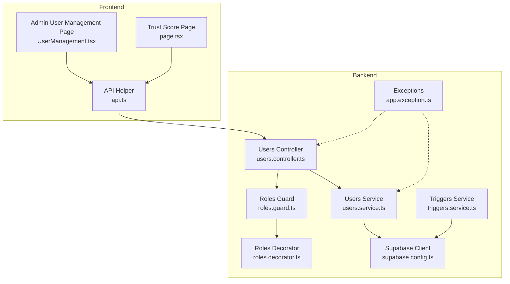
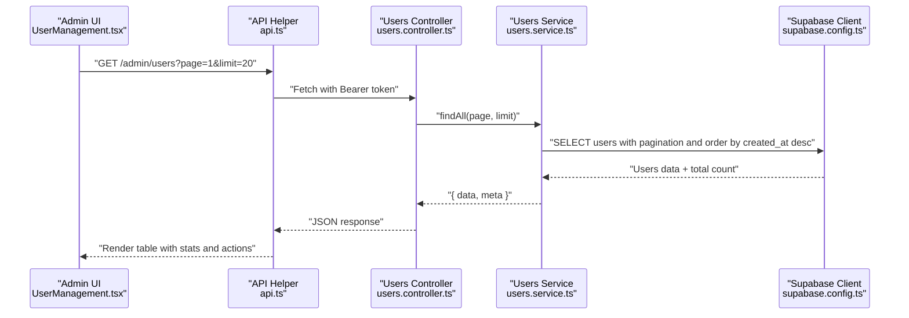
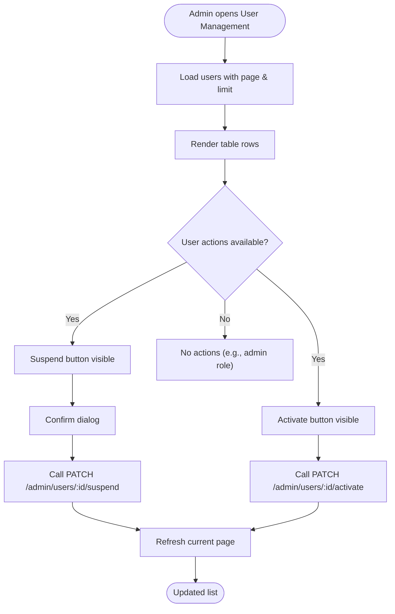
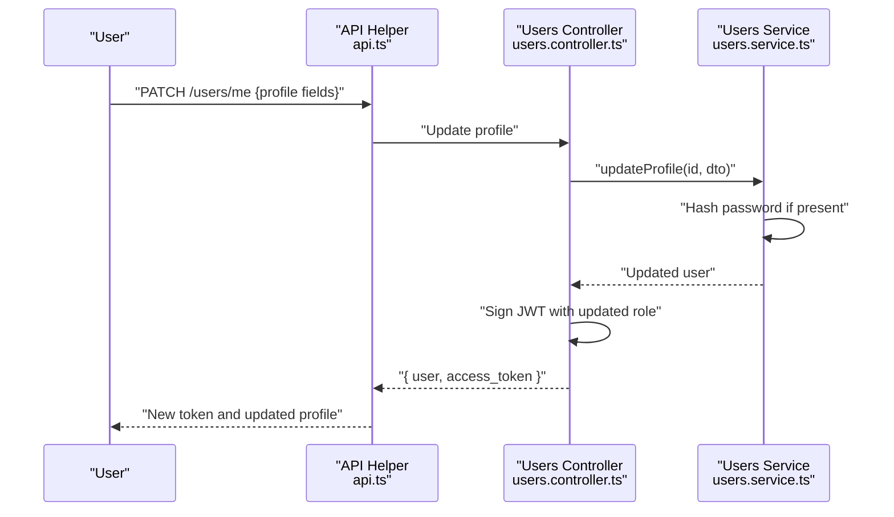
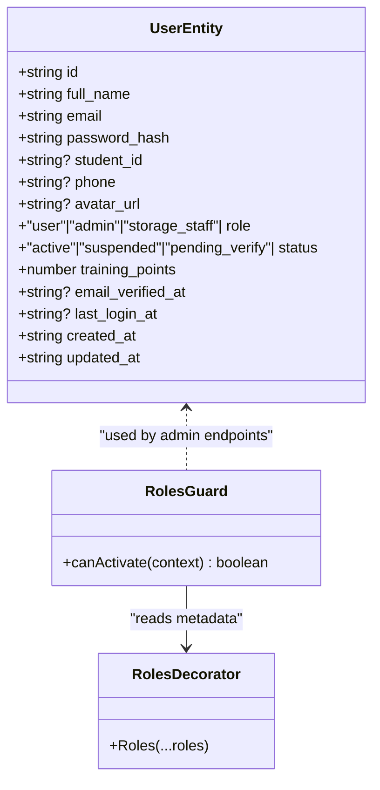
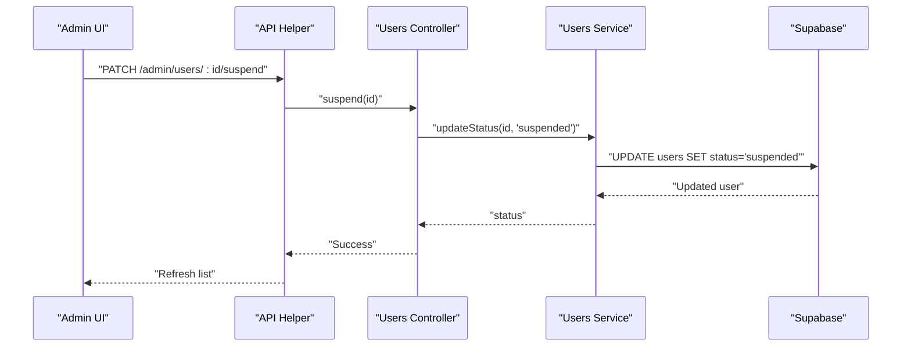
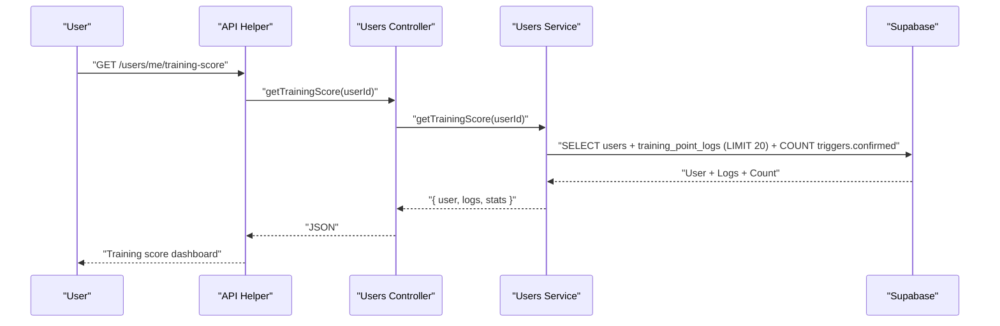
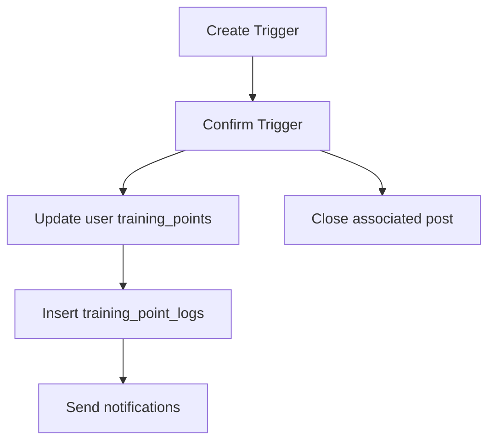
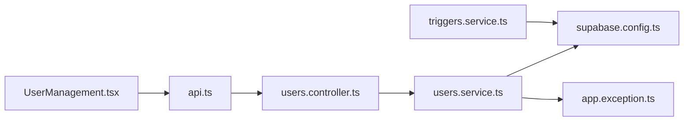

# User Management System

<cite>
**Referenced Files in This Document**
- [users.controller.ts](file://backend/src/modules/users/users.controller.ts)
- [users.service.ts](file://backend/src/modules/users/users.service.ts)
- [update-profile.dto.ts](file://backend/src/modules/users/dto/update-profile.dto.ts)
- [roles.guard.ts](file://backend/src/common/guards/roles.guard.ts)
- [roles.decorator.ts](file://backend/src/common/decorators/roles.decorator.ts)
- [user.entity.ts](file://backend/src/modules/auth/entities/user.entity.ts)
- [supabase.config.ts](file://backend/src/config/supabase.config.ts)
- [api.ts](file://frontend/app/lib/api.ts)
- [UserManagement.tsx](file://frontend/app/admin/user-management/UserManagement.tsx)
- [triggers_permissions.sql](file://backend/sql/triggers_permissions.sql)
- [update_trigger_points.sql](file://backend/sql/update_trigger_points.sql)
- [triggers.service.ts](file://backend/src/modules/triggers/triggers.service.ts)
- [trigger.dto.ts](file://backend/src/modules/triggers/dto/trigger.dto.ts)
- [app.exception.ts](file://backend/src/common/exceptions/app.exception.ts)
- [page.tsx](file://frontend/app/trust-score/page.tsx)
</cite>

## Table of Contents
1. [Introduction](#introduction)
2. [Project Structure](#project-structure)
3. [Core Components](#core-components)
4. [Architecture Overview](#architecture-overview)
5. [Detailed Component Analysis](#detailed-component-analysis)
6. [Dependency Analysis](#dependency-analysis)
7. [Performance Considerations](#performance-considerations)
8. [Troubleshooting Guide](#troubleshooting-guide)
9. [Conclusion](#conclusion)
10. [Appendices](#appendices)

## Introduction
This document describes the User Management System with a focus on administrative controls over user accounts and community management. It covers:
- User listing interface with sorting by registration date and filtering by status and role hierarchy
- User profile management (role assignments, training point adjustments, account status controls)
- Administrative actions (account suspension, activation)
- User activity monitoring (login history, post activity, community contribution tracking)
- Integration with the training points system for user recognition
- Appeals process for sanctions
- Privacy considerations, data retention, and balancing community safety with user rights

## Project Structure
The system spans a NestJS backend and a Next.js frontend:
- Backend modules: users, triggers, auth, and shared utilities for guards, decorators, and Supabase integration
- Frontend pages: admin user management, trust score dashboard, and API helpers

**Diagram sources**
- [users.controller.ts:1-94](file://backend/src/modules/users/users.controller.ts#L1-L94)
- [users.service.ts:1-136](file://backend/src/modules/users/users.service.ts#L1-L136)
- [roles.guard.ts:1-28](file://backend/src/common/guards/roles.guard.ts#L1-L28)
- [roles.decorator.ts:1-5](file://backend/src/common/decorators/roles.decorator.ts#L1-L5)
- [supabase.config.ts:1-25](file://backend/src/config/supabase.config.ts#L1-L25)
- [api.ts:1-83](file://frontend/app/lib/api.ts#L1-L83)
- [UserManagement.tsx:1-327](file://frontend/app/admin/user-management/UserManagement.tsx#L1-L327)
- [page.tsx:1-79](file://frontend/app/trust-score/page.tsx#L1-L79)
- [triggers.service.ts:1-163](file://backend/src/modules/triggers/triggers.service.ts#L1-L163)
- [app.exception.ts:1-46](file://backend/src/common/exceptions/app.exception.ts#L1-L46)

**Section sources**
- [users.controller.ts:1-94](file://backend/src/modules/users/users.controller.ts#L1-L94)
- [users.service.ts:1-136](file://backend/src/modules/users/users.service.ts#L1-L136)
- [roles.guard.ts:1-28](file://backend/src/common/guards/roles.guard.ts#L1-L28)
- [roles.decorator.ts:1-5](file://backend/src/common/decorators/roles.decorator.ts#L1-L5)
- [supabase.config.ts:1-25](file://backend/src/config/supabase.config.ts#L1-L25)
- [api.ts:1-83](file://frontend/app/lib/api.ts#L1-L83)
- [UserManagement.tsx:1-327](file://frontend/app/admin/user-management/UserManagement.tsx#L1-L327)
- [page.tsx:1-79](file://frontend/app/trust-score/page.tsx#L1-L79)
- [triggers.service.ts:1-163](file://backend/src/modules/triggers/triggers.service.ts#L1-L163)
- [app.exception.ts:1-46](file://backend/src/common/exceptions/app.exception.ts#L1-L46)

## Core Components
- Users Controller: Exposes endpoints for admin user listing, single user lookup, and account status updates (suspend/activate). Also exposes user self-service endpoints for profile and training data.
- Users Service: Implements data access against Supabase, including user queries, training history, and training score aggregation.
- Roles Guard and Decorator: Enforce role-based access control for admin-only endpoints.
- Supabase Client: Centralized client initialization and configuration.
- Frontend Admin Page: Renders user listing, status badges, pagination, and admin actions.
- Training Points Integration: Aggregates training score and logs; integrates with triggers confirmation logic.

Key responsibilities:
- Admin user listing with pagination and ordering by registration date
- Account status control (active/suspended)
- Training points tracking and logs
- Community contribution metrics via triggers

**Section sources**
- [users.controller.ts:23-94](file://backend/src/modules/users/users.controller.ts#L23-L94)
- [users.service.ts:105-136](file://backend/src/modules/users/users.service.ts#L105-L136)
- [roles.guard.ts:6-27](file://backend/src/common/guards/roles.guard.ts#L6-L27)
- [roles.decorator.ts:1-5](file://backend/src/common/decorators/roles.decorator.ts#L1-L5)
- [supabase.config.ts:7-23](file://backend/src/config/supabase.config.ts#L7-L23)
- [UserManagement.tsx:22-327](file://frontend/app/admin/user-management/UserManagement.tsx#L22-L327)
- [users.service.ts:61-103](file://backend/src/modules/users/users.service.ts#L61-L103)

## Architecture Overview
The system follows a layered architecture:
- Presentation layer: Next.js admin page and trust score page
- API layer: NestJS controller handling requests and delegating to services
- Domain layer: Services encapsulating business logic and data operations
- Persistence layer: Supabase client interacting with PostgreSQL

**Diagram sources**
- [UserManagement.tsx:28-41](file://frontend/app/admin/user-management/UserManagement.tsx#L28-L41)
- [api.ts:12-43](file://frontend/app/lib/api.ts#L12-L43)
- [users.controller.ts:70-76](file://backend/src/modules/users/users.controller.ts#L70-L76)
- [users.service.ts:105-121](file://backend/src/modules/users/users.service.ts#L105-L121)
- [supabase.config.ts:7-23](file://backend/src/config/supabase.config.ts#L7-L23)

## Detailed Component Analysis

### User Listing Interface
- Endpoint: GET /admin/users with pagination parameters
- Sorting: Users ordered by created_at descending (newest first)
- Filtering: The current implementation lists all users; filtering by role or activity status is not implemented in the backend controller
- Frontend rendering: Displays user full_name, email, role, status, training_points, created_at, and action buttons

**Diagram sources**
- [UserManagement.tsx:28-70](file://frontend/app/admin/user-management/UserManagement.tsx#L28-L70)
- [users.controller.ts:70-92](file://backend/src/modules/users/users.controller.ts#L70-L92)
- [users.service.ts:105-121](file://backend/src/modules/users/users.service.ts#L105-L121)

**Section sources**
- [users.controller.ts:70-76](file://backend/src/modules/users/users.controller.ts#L70-L76)
- [users.service.ts:105-121](file://backend/src/modules/users/users.service.ts#L105-L121)
- [UserManagement.tsx:22-327](file://frontend/app/admin/user-management/UserManagement.tsx#L22-L327)

### User Profile Management
- Self-service profile update endpoint: PATCH /users/me with DTO validation for name, phone, avatar_url, email, password, and bio
- Password hashing: Hashed before persistence
- Token refresh: On successful profile update, a new JWT is returned

**Diagram sources**
- [users.controller.ts:35-42](file://backend/src/modules/users/users.controller.ts#L35-L42)
- [users.service.ts:24-40](file://backend/src/modules/users/users.service.ts#L24-L40)
- [update-profile.dto.ts:1-38](file://backend/src/modules/users/dto/update-profile.dto.ts#L1-L38)

**Section sources**
- [users.controller.ts:35-42](file://backend/src/modules/users/users.controller.ts#L35-L42)
- [users.service.ts:24-40](file://backend/src/modules/users/users.service.ts#L24-L40)
- [update-profile.dto.ts:1-38](file://backend/src/modules/users/dto/update-profile.dto.ts#L1-L38)

### Role Assignments and Status Controls
- Role model: user, admin, storage_staff
- Status model: active, suspended, pending_verify
- Admin-only endpoints enforce role guard and decorator
- Current implementation does not expose explicit role assignment endpoints; role changes would require backend modifications

**Diagram sources**
- [user.entity.ts:1-19](file://backend/src/modules/auth/entities/user.entity.ts#L1-L19)
- [roles.guard.ts:6-27](file://backend/src/common/guards/roles.guard.ts#L6-L27)
- [roles.decorator.ts:1-5](file://backend/src/common/decorators/roles.decorator.ts#L1-L5)

**Section sources**
- [user.entity.ts:1-19](file://backend/src/modules/auth/entities/user.entity.ts#L1-L19)
- [roles.guard.ts:6-27](file://backend/src/common/guards/roles.guard.ts#L6-L27)
- [roles.decorator.ts:1-5](file://backend/src/common/decorators/roles.decorator.ts#L1-L5)

### Administrative Actions: Suspension and Activation
- Suspend endpoint: PATCH /admin/users/:id/suspend sets status to suspended
- Activate endpoint: PATCH /admin/users/:id/activate sets status to active
- Both endpoints are protected by RolesGuard requiring admin role

**Diagram sources**
- [users.controller.ts:78-84](file://backend/src/modules/users/users.controller.ts#L78-L84)
- [users.service.ts:123-134](file://backend/src/modules/users/users.service.ts#L123-L134)

**Section sources**
- [users.controller.ts:78-92](file://backend/src/modules/users/users.controller.ts#L78-L92)
- [users.service.ts:123-134](file://backend/src/modules/users/users.service.ts#L123-L134)

### User Activity Monitoring
- Training score and history: GET /users/me/training-score aggregates user profile, recent training logs, and confirmed triggers count
- Post activity: GET /users/me/posts returns lost and found posts authored by the user
- Login history: Not exposed via the current backend; last_login_at exists on the user entity but is not surfaced in the controller

**Diagram sources**
- [users.controller.ts:56-60](file://backend/src/modules/users/users.controller.ts#L56-L60)
- [users.service.ts:70-103](file://backend/src/modules/users/users.service.ts#L70-L103)
- [page.tsx:66-76](file://frontend/app/trust-score/page.tsx#L66-L76)

**Section sources**
- [users.controller.ts:44-60](file://backend/src/modules/users/users.controller.ts#L44-L60)
- [users.service.ts:42-59](file://backend/src/modules/users/users.service.ts#L42-L59)
- [users.service.ts:61-103](file://backend/src/modules/users/users.service.ts#L61-L103)
- [page.tsx:1-79](file://frontend/app/trust-score/page.tsx#L1-79)

### Training Points System Integration
- Training logs table records points_delta, reason, and balance_after
- Triggers service confirms handovers and updates training_points and logs atomically
- Points awarded per confirmed trigger is configured in the database migration script

**Diagram sources**
- [triggers.service.ts:30-68](file://backend/src/modules/triggers/triggers.service.ts#L30-L68)
- [update_trigger_points.sql:10-132](file://backend/sql/update_trigger_points.sql#L10-L132)

**Section sources**
- [users.service.ts:61-103](file://backend/src/modules/users/users.service.ts#L61-L103)
- [triggers.service.ts:30-68](file://backend/src/modules/triggers/triggers.service.ts#L30-L68)
- [update_trigger_points.sql:10-132](file://backend/sql/update_trigger_points.sql#L10-L132)

### Appeals Process for Sanctions
- The current backend does not expose an appeals endpoint or workflow
- Recommendations:
  - Add an appeals table with status (pending, reviewed, resolved)
  - Create endpoints for submitting appeals and admin review
  - Integrate with notifications and audit logs

[No sources needed since this section proposes future enhancements]

### Automated User Classification Systems
- Current implementation does not include automated classification logic
- Recommendations:
  - Use training_points thresholds to compute trust levels
  - Track activity metrics (posts, handovers) to flag low or high activity
  - Implement periodic scoring and status updates via scheduled tasks

[No sources needed since this section proposes future enhancements]

## Dependency Analysis
- Controllers depend on Services and Guards
- Services depend on Supabase client and database tables
- Frontend depends on API helper and controller endpoints
- Training score depends on training_point_logs and triggers tables

**Diagram sources**
- [UserManagement.tsx:1-327](file://frontend/app/admin/user-management/UserManagement.tsx#L1-L327)
- [api.ts:1-83](file://frontend/app/lib/api.ts#L1-L83)
- [users.controller.ts:1-94](file://backend/src/modules/users/users.controller.ts#L1-L94)
- [users.service.ts:1-136](file://backend/src/modules/users/users.service.ts#L1-L136)
- [supabase.config.ts:1-25](file://backend/src/config/supabase.config.ts#L1-L25)
- [app.exception.ts:1-46](file://backend/src/common/exceptions/app.exception.ts#L1-L46)
- [triggers.service.ts:1-163](file://backend/src/modules/triggers/triggers.service.ts#L1-L163)

**Section sources**
- [users.controller.ts:1-94](file://backend/src/modules/users/users.controller.ts#L1-L94)
- [users.service.ts:1-136](file://backend/src/modules/users/users.service.ts#L1-L136)
- [supabase.config.ts:1-25](file://backend/src/config/supabase.config.ts#L1-L25)
- [api.ts:1-83](file://frontend/app/lib/api.ts#L1-L83)
- [UserManagement.tsx:1-327](file://frontend/app/admin/user-management/UserManagement.tsx#L1-L327)
- [triggers.service.ts:1-163](file://backend/src/modules/triggers/triggers.service.ts#L1-L163)
- [app.exception.ts:1-46](file://backend/src/common/exceptions/app.exception.ts#L1-L46)

## Performance Considerations
- Pagination: Implemented in users listing to avoid large payloads
- Parallel queries: Training score aggregates user profile, logs, and trigger counts concurrently
- Database indexing: Ensure indexes on users.created_at, training_point_logs.user_id, and triggers relevant columns
- Token refresh: Updating profile returns a refreshed JWT to minimize re-authentication overhead

[No sources needed since this section provides general guidance]

## Troubleshooting Guide
Common issues and resolutions:
- Unauthorized access to admin endpoints: Verify bearer token and admin role
- User not found errors: Throws a not found exception when querying non-existent users
- Validation failures: DTO validation errors for profile updates
- Cron expiration: Pending triggers automatically expire after 48 hours

**Section sources**
- [roles.guard.ts:10-26](file://backend/src/common/guards/roles.guard.ts#L10-L26)
- [users.service.ts:20](file://backend/src/modules/users/users.service.ts#L20)
- [users.service.ts:91-93](file://backend/src/modules/users/users.service.ts#L91-L93)
- [triggers.service.ts:140-161](file://backend/src/modules/triggers/triggers.service.ts#L140-L161)

## Conclusion
The User Management System provides essential administrative controls and visibility into user activity and contributions. While the current implementation focuses on listing, status control, and training metrics, extending it with role assignment endpoints, appeals workflows, automated classification, and login history would further strengthen community governance and user rights protection.

## Appendices

### API Definitions
- GET /admin/users?page=&limit=
  - Description: List all users with pagination and sort by registration date (newest first)
  - Authentication: Admin required
  - Response: Array of users with meta pagination info
- PATCH /admin/users/:id/suspend
  - Description: Suspend a user account
  - Authentication: Admin required
  - Response: Updated user status
- PATCH /admin/users/:id/activate
  - Description: Activate a user account
  - Authentication: Admin required
  - Response: Updated user status
- GET /users/me/training-score
  - Description: Retrieve training score, recent logs, and confirmed handover count
  - Authentication: Requires JWT
  - Response: User profile, logs, and stats

**Section sources**
- [users.controller.ts:70-92](file://backend/src/modules/users/users.controller.ts#L70-L92)
- [users.controller.ts:56-60](file://backend/src/modules/users/users.controller.ts#L56-L60)

### Privacy Considerations and Data Retention
- Data minimization: Only collect necessary user attributes for administration and training
- Access logging: Record admin actions for audit trails
- Retention: Define policy for deleting inactive accounts and purging logs per jurisdictional requirements
- Transparency: Provide users with access to their data and the ability to request deletion

[No sources needed since this section provides general guidance]

### Escalation Procedures for Problematic Accounts
- Initial warning: Temporary restriction or requiring verification
- Review panel: Elevated cases escalated to moderators or admins
- Evidence log: Maintain logs of reports, actions, and communications
- Appeal workflow: Allow users to submit appeals with supporting evidence

[No sources needed since this section provides general guidance]