# Core Features

<cite>
**Referenced Files in This Document**
- [app.module.ts](file://backend/src/app.module.ts)
- [main.ts](file://backend/src/main.ts)
- [layout.tsx](file://frontend/app/layout.tsx)
- [auth.module.ts](file://backend/src/modules/auth/auth.module.ts)
- [auth.service.ts](file://backend/src/modules/auth/auth.service.ts)
- [lost-posts.module.ts](file://backend/src/modules/lost-posts/lost-posts.module.ts)
- [lost-posts.service.ts](file://backend/src/modules/lost-posts/lost-posts.service.ts)
- [found-posts.module.ts](file://backend/src/modules/found-posts/found-posts.module.ts)
- [found-posts.service.ts](file://backend/src/modules/found-posts/found-posts.service.ts)
- [ai-matches.module.ts](file://backend/src/modules/ai-matches/ai-matches.module.ts)
- [ai-matches.service.ts](file://backend/src/modules/ai-matches/ai-matches.service.ts)
- [chat.module.ts](file://backend/src/modules/chat/chat.module.ts)
- [chat.service.ts](file://backend/src/modules/chat/chat.service.ts)
- [storage.module.ts](file://backend/src/modules/storage/storage.module.ts)
- [storage.service.ts](file://backend/src/modules/storage/storage.service.ts)
- [handovers.module.ts](file://backend/src/modules/handovers/handovers.module.ts)
- [handovers.service.ts](file://backend/src/modules/handovers/handovers.service.ts)
- [notifications.module.ts](file://backend/src/modules/notifications/notifications.module.ts)
- [notifications.service.ts](file://backend/src/modules/notifications/notifications.service.ts)
- [categories.module.ts](file://backend/src/modules/categories/categories.module.ts)
- [categories.service.ts](file://backend/src/modules/categories/categories.service.ts)
- [triggers.module.ts](file://backend/src/modules/triggers/triggers.module.ts)
- [triggers.service.ts](file://backend/src/modules/triggers/triggers.service.ts)
</cite>

## Table of Contents
1. [Introduction](#introduction)
2. [Project Structure](#project-structure)
3. [Core Components](#core-components)
4. [Architecture Overview](#architecture-overview)
5. [Detailed Component Analysis](#detailed-component-analysis)
6. [Dependency Analysis](#dependency-analysis)
7. [Performance Considerations](#performance-considerations)
8. [Troubleshooting Guide](#troubleshooting-guide)
9. [Conclusion](#conclusion)

## Introduction
This document describes the core features that define the MissLost platform. It focuses on the main functionalities that drive user engagement and operational effectiveness: user authentication and authorization, lost item posting, found item submission, AI-powered matching, real-time chat, storage management integration, training points system, and administrative oversight. For each feature, we explain the user workflow, business logic, and technical implementation approach, including approval workflows, category classification, manual overrides, notifications, and the handover process. We also illustrate how features integrate to deliver a seamless experience.

## Project Structure
The backend is a NestJS application composed of modularized feature domains. The frontend is a Next.js application that renders pages and components protected by route guards and theme providers. The application initializes global guards, interceptors, and pipes, and exposes Swagger documentation.

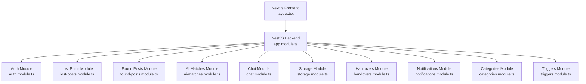

**Diagram sources**
- [layout.tsx:19-42](file://frontend/app/layout.tsx#L19-L42)
- [app.module.ts:28-66](file://backend/src/app.module.ts#L28-L66)

**Section sources**
- [app.module.ts:28-66](file://backend/src/app.module.ts#L28-L66)
- [main.ts:7-42](file://backend/src/main.ts#L7-L42)
- [layout.tsx:19-42](file://frontend/app/layout.tsx#L19-L42)

## Core Components
This section outlines the principal platform features and how they are implemented.

- Authentication and Authorization
  - JWT-based login and registration with bcrypt password hashing and refresh token persistence.
  - Google OAuth login via Supabase-managed upsert with email verification handling.
  - Role-based guards and global JWT guard applied at startup.
  - Email verification and password reset flows with token expiry and revocation semantics.

- Lost Item Posting System
  - Creation, retrieval, updates, deletion, and admin review of lost posts.
  - Automatic approval upon creation; admin review supports rejection with reasons and logs status history.

- Found Item Submission
  - Similar lifecycle to lost posts with automatic approval and admin review support.

- AI-Powered Matching
  - Text-based similarity matching between lost and found posts within the same category.
  - Per-side confirmation (owner or finder) leading to a mutual confirmation state.
  - Administrative dashboards for statistics and post listings.

- Real-Time Chat Communication
  - Conversation creation between participants, message retrieval with pagination, and read receipts.
  - Unread counters and participant verification.

- Storage Management Integration
  - Storage locations and items lookup, item creation linked to found posts, claiming by users, and search by item code.

- Training Points System
  - Points awarded via a database function during handover completion.
  - Post statuses updated to closed upon successful completion.

- Administrative Oversight
  - Pending post review, post listing with filters, dashboard statistics, and trigger management with cron expiration.

**Section sources**
- [auth.service.ts:21-110](file://backend/src/modules/auth/auth.service.ts#L21-L110)
- [auth.service.ts:112-167](file://backend/src/modules/auth/auth.service.ts#L112-L167)
- [auth.service.ts:180-208](file://backend/src/modules/auth/auth.service.ts#L180-L208)
- [auth.service.ts:210-234](file://backend/src/modules/auth/auth.service.ts#L210-L234)
- [auth.service.ts:236-272](file://backend/src/modules/auth/auth.service.ts#L236-L272)
- [lost-posts.service.ts:19-43](file://backend/src/modules/lost-posts/lost-posts.service.ts#L19-L43)
- [lost-posts.service.ts:139-171](file://backend/src/modules/lost-posts/lost-posts.service.ts#L139-L171)
- [found-posts.service.ts:19-38](file://backend/src/modules/found-posts/found-posts.service.ts#L19-L38)
- [found-posts.service.ts:117-145](file://backend/src/modules/found-posts/found-posts.service.ts#L117-L145)
- [ai-matches.service.ts:45-96](file://backend/src/modules/ai-matches/ai-matches.service.ts#L45-L96)
- [ai-matches.service.ts:101-141](file://backend/src/modules/ai-matches/ai-matches.service.ts#L101-L141)
- [ai-matches.service.ts:156-182](file://backend/src/modules/ai-matches/ai-matches.service.ts#L156-L182)
- [ai-matches.service.ts:277-365](file://backend/src/modules/ai-matches/ai-matches.service.ts#L277-L365)
- [chat.service.ts:12-36](file://backend/src/modules/chat/chat.service.ts#L12-L36)
- [chat.service.ts:38-66](file://backend/src/modules/chat/chat.service.ts#L38-L66)
- [chat.service.ts:68-100](file://backend/src/modules/chat/chat.service.ts#L68-L100)
- [chat.service.ts:102-126](file://backend/src/modules/chat/chat.service.ts#L102-L126)
- [chat.service.ts:128-136](file://backend/src/modules/chat/chat.service.ts#L128-L136)
- [storage.service.ts:53-78](file://backend/src/modules/storage/storage.service.ts#L53-L78)
- [storage.service.ts:80-100](file://backend/src/modules/storage/storage.service.ts#L80-L100)
- [storage.service.ts:102-115](file://backend/src/modules/storage/storage.service.ts#L102-L115)
- [handovers.service.ts:12-32](file://backend/src/modules/handovers/handovers.service.ts#L12-L32)
- [handovers.service.ts:50-84](file://backend/src/modules/handovers/handovers.service.ts#L50-L84)
- [handovers.service.ts:86-115](file://backend/src/modules/handovers/handovers.service.ts#L86-L115)
- [handovers.service.ts:117-131](file://backend/src/modules/handovers/handovers.service.ts#L117-L131)
- [notifications.service.ts:15-31](file://backend/src/modules/notifications/notifications.service.ts#L15-L31)
- [notifications.service.ts:33-41](file://backend/src/modules/notifications/notifications.service.ts#L33-L41)
- [notifications.service.ts:43-53](file://backend/src/modules/notifications/notifications.service.ts#L43-L53)
- [notifications.service.ts:55-63](file://backend/src/modules/notifications/notifications.service.ts#L55-L63)
- [notifications.service.ts:66-80](file://backend/src/modules/notifications/notifications.service.ts#L66-L80)
- [categories.service.ts:10-19](file://backend/src/modules/categories/categories.service.ts#L10-L19)
- [triggers.service.ts:30-48](file://backend/src/modules/triggers/triggers.service.ts#L30-L48)
- [triggers.service.ts:54-68](file://backend/src/modules/triggers/triggers.service.ts#L54-L68)
- [triggers.service.ts:74-88](file://backend/src/modules/triggers/triggers.service.ts#L74-L88)
- [triggers.service.ts:94-134](file://backend/src/modules/triggers/triggers.service.ts#L94-L134)
- [triggers.service.ts:140-161](file://backend/src/modules/triggers/triggers.service.ts#L140-L161)

## Architecture Overview
The backend composes multiple feature modules, each exporting a controller and service. Global guards enforce authentication and roles, while a global validation pipe ensures DTO safety. Supabase client is injected into services to perform database operations. The frontend uses route guards and theme providers to wrap pages.

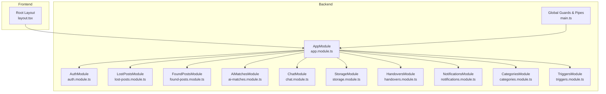

**Diagram sources**
- [app.module.ts:28-66](file://backend/src/app.module.ts#L28-L66)
- [main.ts:14-21](file://backend/src/main.ts#L14-L21)
- [layout.tsx:35-39](file://frontend/app/layout.tsx#L35-L39)

**Section sources**
- [app.module.ts:28-66](file://backend/src/app.module.ts#L28-L66)
- [main.ts:14-21](file://backend/src/main.ts#L14-L21)
- [layout.tsx:35-39](file://frontend/app/layout.tsx#L35-L39)

## Detailed Component Analysis

### Authentication and Authorization
- User Registration
  - Validates password confirmation, checks for duplicate emails, hashes passwords, inserts user with default role and status, and creates an email verification token.
- Login
  - Finds user by email, compares hashed password, enforces account status checks, generates JWT access token and a refresh token hash persisted in the database, and updates last login timestamp.
- Google Login
  - Upserts user record with Google-provided profile, verifies status, updates last login, and issues tokens.
- Logout
  - Revokes refresh tokens for the user.
- Email Verification
  - Validates token existence, expiry, marks user as active and email verified, and marks token as used.
- Password Reset
  - Generates reset token with expiry, validates token and expiry, updates password hash, and revokes refresh tokens.
- Security Controls
  - Global JWT guard and roles guard applied at startup; Supabase client used for all operations.

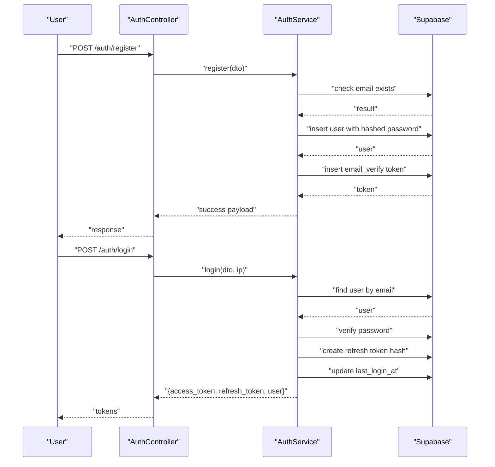

**Diagram sources**
- [auth.module.ts:11-32](file://backend/src/modules/auth/auth.module.ts#L11-L32)
- [auth.service.ts:21-110](file://backend/src/modules/auth/auth.service.ts#L21-L110)

**Section sources**
- [auth.module.ts:11-32](file://backend/src/modules/auth/auth.module.ts#L11-L32)
- [auth.service.ts:21-110](file://backend/src/modules/auth/auth.service.ts#L21-L110)
- [auth.service.ts:112-167](file://backend/src/modules/auth/auth.service.ts#L112-L167)
- [auth.service.ts:180-208](file://backend/src/modules/auth/auth.service.ts#L180-L208)
- [auth.service.ts:210-234](file://backend/src/modules/auth/auth.service.ts#L210-L234)
- [auth.service.ts:236-272](file://backend/src/modules/auth/auth.service.ts#L236-L272)
- [main.ts:48-63](file://backend/src/main.ts#L48-L63)

### Lost Item Posting System
- Creation
  - Inserts a new lost post with status approved and logs initial status history.
- Retrieval
  - Lists posts filtered by status, category, and search term with pagination and eager-loaded user and category data.
- Personal Posts
  - Retrieves posts owned by the current user.
- Detail View
  - Returns post with related user and category; increments view count asynchronously.
- Updates and Deletions
  - Enforces ownership and status constraints; admins can override restrictions.
- Admin Review
  - Supports rejection with reason and logs status history with admin metadata.

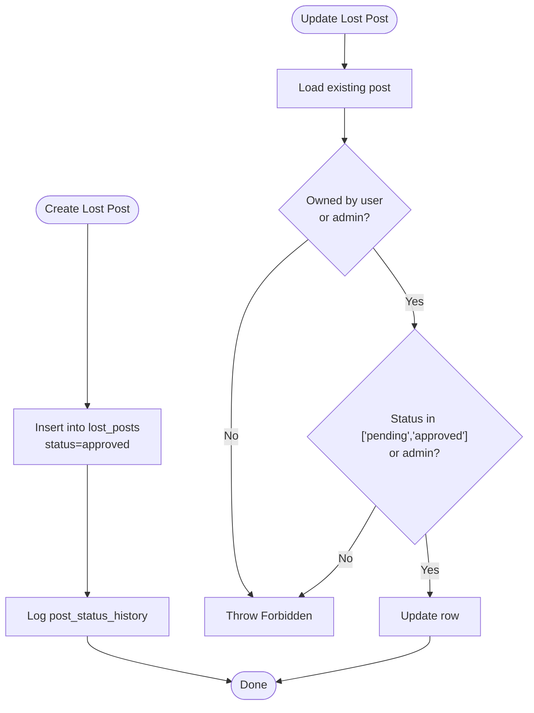

**Diagram sources**
- [lost-posts.service.ts:19-43](file://backend/src/modules/lost-posts/lost-posts.service.ts#L19-L43)
- [lost-posts.service.ts:105-125](file://backend/src/modules/lost-posts/lost-posts.service.ts#L105-L125)
- [lost-posts.service.ts:139-171](file://backend/src/modules/lost-posts/lost-posts.service.ts#L139-L171)

**Section sources**
- [lost-posts.module.ts:5-9](file://backend/src/modules/lost-posts/lost-posts.module.ts#L5-L9)
- [lost-posts.service.ts:19-43](file://backend/src/modules/lost-posts/lost-posts.service.ts#L19-L43)
- [lost-posts.service.ts:45-73](file://backend/src/modules/lost-posts/lost-posts.service.ts#L45-L73)
- [lost-posts.service.ts:75-84](file://backend/src/modules/lost-posts/lost-posts.service.ts#L75-L84)
- [lost-posts.service.ts:86-103](file://backend/src/modules/lost-posts/lost-posts.service.ts#L86-L103)
- [lost-posts.service.ts:105-125](file://backend/src/modules/lost-posts/lost-posts.service.ts#L105-L125)
- [lost-posts.service.ts:127-137](file://backend/src/modules/lost-posts/lost-posts.service.ts#L127-L137)
- [lost-posts.service.ts:139-171](file://backend/src/modules/lost-posts/lost-posts.service.ts#L139-L171)
- [lost-posts.service.ts:174-187](file://backend/src/modules/lost-posts/lost-posts.service.ts#L174-L187)

### Found Item Submission
- Creation
  - Inserts a new found post with status approved and logs initial status history.
- Retrieval
  - Lists posts filtered by status, category, and search term with pagination and eager-loaded user and category data.
- Personal Posts
  - Retrieves posts owned by the current user.
- Detail View
  - Returns post with related user and category; increments view count asynchronously.
- Updates and Deletions
  - Enforces ownership and allows admin overrides.
- Admin Review
  - Supports rejection with reason and logs status history with admin metadata.

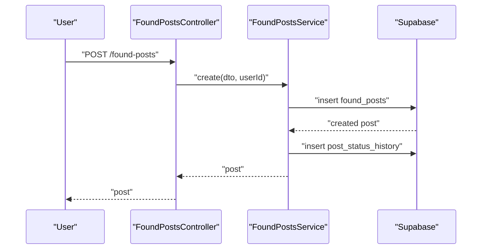

**Diagram sources**
- [found-posts.module.ts:5-9](file://backend/src/modules/found-posts/found-posts.module.ts#L5-L9)
- [found-posts.service.ts:19-38](file://backend/src/modules/found-posts/found-posts.service.ts#L19-L38)
- [found-posts.service.ts:117-145](file://backend/src/modules/found-posts/found-posts.service.ts#L117-L145)

**Section sources**
- [found-posts.module.ts:5-9](file://backend/src/modules/found-posts/found-posts.module.ts#L5-L9)
- [found-posts.service.ts:19-38](file://backend/src/modules/found-posts/found-posts.service.ts#L19-L38)
- [found-posts.service.ts:40-67](file://backend/src/modules/found-posts/found-posts.service.ts#L40-L67)
- [found-posts.service.ts:69-78](file://backend/src/modules/found-posts/found-posts.service.ts#L69-L78)
- [found-posts.service.ts:80-94](file://backend/src/modules/found-posts/found-posts.service.ts#L80-L94)
- [found-posts.service.ts:96-105](file://backend/src/modules/found-posts/found-posts.service.ts#L96-L105)
- [found-posts.service.ts:107-115](file://backend/src/modules/found-posts/found-posts.service.ts#L107-L115)
- [found-posts.service.ts:117-145](file://backend/src/modules/found-posts/found-posts.service.ts#L117-L145)
- [found-posts.service.ts:147-160](file://backend/src/modules/found-posts/found-posts.service.ts#L147-L160)

### AI-Powered Matching
- Match Discovery
  - Runs text similarity against approved found posts within the same category as the lost post; persists matches with scores and method.
- Existing Matches
  - Loads previously computed matches for a lost post with related found post and user data.
- Confirmation Workflow
  - Owner or finder confirms; mutual confirmation sets match status to confirmed.
- Admin Dashboard
  - Provides summary statistics, recent posts, top categories, recent handovers, and consolidated post listing with filters.

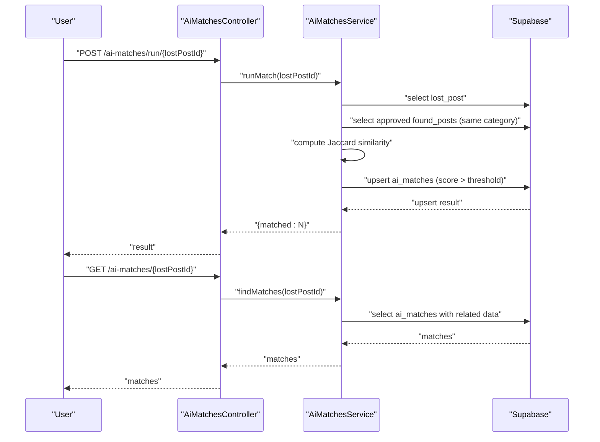

**Diagram sources**
- [ai-matches.module.ts:5-9](file://backend/src/modules/ai-matches/ai-matches.module.ts#L5-L9)
- [ai-matches.service.ts:45-96](file://backend/src/modules/ai-matches/ai-matches.service.ts#L45-L96)
- [ai-matches.service.ts:15-40](file://backend/src/modules/ai-matches/ai-matches.service.ts#L15-L40)

**Section sources**
- [ai-matches.module.ts:5-9](file://backend/src/modules/ai-matches/ai-matches.module.ts#L5-L9)
- [ai-matches.service.ts:15-40](file://backend/src/modules/ai-matches/ai-matches.service.ts#L15-L40)
- [ai-matches.service.ts:45-96](file://backend/src/modules/ai-matches/ai-matches.service.ts#L45-L96)
- [ai-matches.service.ts:101-141](file://backend/src/modules/ai-matches/ai-matches.service.ts#L101-L141)
- [ai-matches.service.ts:156-182](file://backend/src/modules/ai-matches/ai-matches.service.ts#L156-L182)
- [ai-matches.service.ts:185-274](file://backend/src/modules/ai-matches/ai-matches.service.ts#L185-L274)
- [ai-matches.service.ts:277-365](file://backend/src/modules/ai-matches/ai-matches.service.ts#L277-L365)

### Real-Time Chat Communication
- Conversations
  - Lists conversations for a user with last message metadata and sorts by last message time.
  - Creates or retrieves a conversation between two users for a specific lost/found post pair.
- Messages
  - Retrieves paginated messages for a conversation after asserting participantship.
  - Marks unread messages as read for other participants.
  - Sends a new message with content or image.
- Unread Count
  - Computes unread message count for a user.

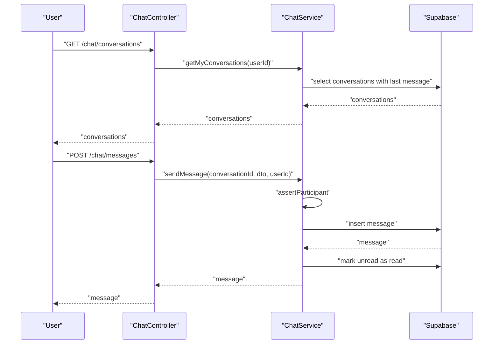

**Diagram sources**
- [chat.module.ts:5-9](file://backend/src/modules/chat/chat.module.ts#L5-L9)
- [chat.service.ts:12-36](file://backend/src/modules/chat/chat.service.ts#L12-L36)
- [chat.service.ts:38-66](file://backend/src/modules/chat/chat.service.ts#L38-L66)
- [chat.service.ts:68-100](file://backend/src/modules/chat/chat.service.ts#L68-L100)
- [chat.service.ts:102-126](file://backend/src/modules/chat/chat.service.ts#L102-L126)
- [chat.service.ts:128-136](file://backend/src/modules/chat/chat.service.ts#L128-L136)

**Section sources**
- [chat.module.ts:5-9](file://backend/src/modules/chat/chat.module.ts#L5-L9)
- [chat.service.ts:12-36](file://backend/src/modules/chat/chat.service.ts#L12-L36)
- [chat.service.ts:38-66](file://backend/src/modules/chat/chat.service.ts#L38-L66)
- [chat.service.ts:68-100](file://backend/src/modules/chat/chat.service.ts#L68-L100)
- [chat.service.ts:102-126](file://backend/src/modules/chat/chat.service.ts#L102-L126)
- [chat.service.ts:128-136](file://backend/src/modules/chat/chat.service.ts#L128-L136)

### Storage Management Integration
- Locations
  - Lists active storage locations ordered by campus.
- Items
  - Lists storage items optionally filtered by location with related found post and location data.
- Item Details
  - Retrieves a single item with related found post owner and location.
- Create Item
  - Ensures unique item code, inserts item, and updates associated found post to indicate it is in storage.
- Claim Item
  - Verifies item status and claims item by updating status and claim metadata.
- Search by Code
  - Searches items by partial code with related found post and location info.

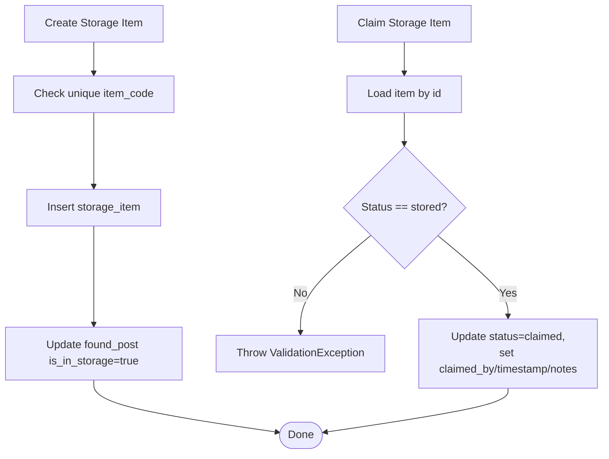

**Diagram sources**
- [storage.service.ts:53-78](file://backend/src/modules/storage/storage.service.ts#L53-L78)
- [storage.service.ts:80-100](file://backend/src/modules/storage/storage.service.ts#L80-L100)

**Section sources**
- [storage.service.ts:12-19](file://backend/src/modules/storage/storage.service.ts#L12-L19)
- [storage.service.ts:21-36](file://backend/src/modules/storage/storage.service.ts#L21-L36)
- [storage.service.ts:38-51](file://backend/src/modules/storage/storage.service.ts#L38-L51)
- [storage.service.ts:53-78](file://backend/src/modules/storage/storage.service.ts#L53-L78)
- [storage.service.ts:80-100](file://backend/src/modules/storage/storage.service.ts#L80-L100)
- [storage.service.ts:102-115](file://backend/src/modules/storage/storage.service.ts#L102-L115)

### Training Points System and Handover Process
- Create Handover
  - Validates ownership of the lost post and creates a handover with a generated verification code and pending status.
- Confirmations
  - Owner and finder confirm separately using the verification code; both confirmations complete the handover.
- Points and Post Closure
  - On completion, a database RPC grants training points and closes both lost and found posts.
- My Handovers
  - Lists handovers where the user was involved as owner or finder.

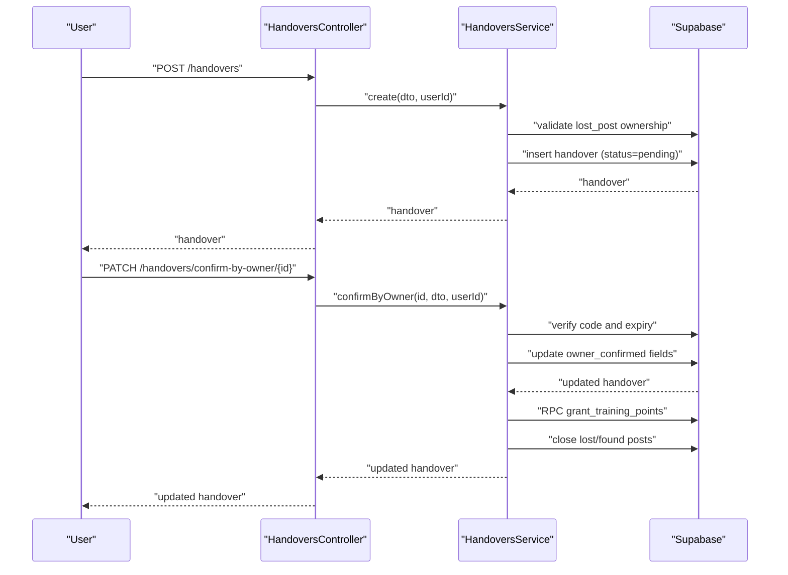

**Diagram sources**
- [handovers.module.ts:5-9](file://backend/src/modules/handovers/handovers.module.ts#L5-L9)
- [handovers.service.ts:12-32](file://backend/src/modules/handovers/handovers.service.ts#L12-L32)
- [handovers.service.ts:50-84](file://backend/src/modules/handovers/handovers.service.ts#L50-L84)
- [handovers.service.ts:86-115](file://backend/src/modules/handovers/handovers.service.ts#L86-L115)
- [handovers.service.ts:117-131](file://backend/src/modules/handovers/handovers.service.ts#L117-L131)

**Section sources**
- [handovers.module.ts:5-9](file://backend/src/modules/handovers/handovers.module.ts#L5-L9)
- [handovers.service.ts:12-32](file://backend/src/modules/handovers/handovers.service.ts#L12-L32)
- [handovers.service.ts:50-84](file://backend/src/modules/handovers/handovers.service.ts#L50-L84)
- [handovers.service.ts:86-115](file://backend/src/modules/handovers/handovers.service.ts#L86-L115)
- [handovers.service.ts:117-131](file://backend/src/modules/handovers/handovers.service.ts#L117-L131)
- [handovers.service.ts:133-145](file://backend/src/modules/handovers/handovers.service.ts#L133-L145)

### Administrative Oversight
- Pending Posts
  - Retrieves pending lost and found posts for moderation.
- Category Classification
  - Lists active categories for selection during post creation.
- Notifications
  - Fetches user notifications, unread counts, marks as read, and supports internal creation of notifications.
- Triggers
  - Creates, confirms, and cancels triggers via database functions; lists triggers per conversation; cron job expires pending triggers.

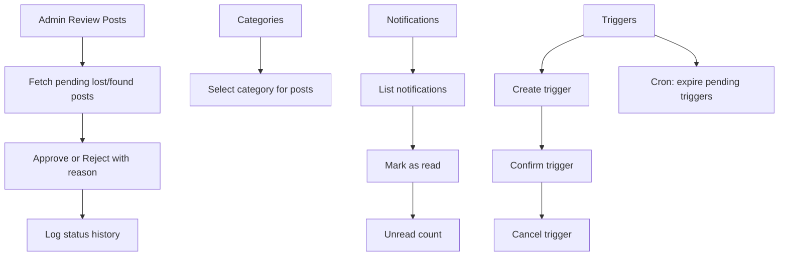

**Diagram sources**
- [lost-posts.service.ts:174-187](file://backend/src/modules/lost-posts/lost-posts.service.ts#L174-L187)
- [found-posts.service.ts:147-160](file://backend/src/modules/found-posts/found-posts.service.ts#L147-L160)
- [categories.service.ts:10-19](file://backend/src/modules/categories/categories.service.ts#L10-L19)
- [notifications.service.ts:15-31](file://backend/src/modules/notifications/notifications.service.ts#L15-L31)
- [notifications.service.ts:33-41](file://backend/src/modules/notifications/notifications.service.ts#L33-L41)
- [notifications.service.ts:43-53](file://backend/src/modules/notifications/notifications.service.ts#L43-L53)
- [notifications.service.ts:55-63](file://backend/src/modules/notifications/notifications.service.ts#L55-L63)
- [notifications.service.ts:66-80](file://backend/src/modules/notifications/notifications.service.ts#L66-L80)
- [triggers.service.ts:30-48](file://backend/src/modules/triggers/triggers.service.ts#L30-L48)
- [triggers.service.ts:54-68](file://backend/src/modules/triggers/triggers.service.ts#L54-L68)
- [triggers.service.ts:74-88](file://backend/src/modules/triggers/triggers.service.ts#L74-L88)
- [triggers.service.ts:140-161](file://backend/src/modules/triggers/triggers.service.ts#L140-L161)

**Section sources**
- [lost-posts.service.ts:174-187](file://backend/src/modules/lost-posts/lost-posts.service.ts#L174-L187)
- [found-posts.service.ts:147-160](file://backend/src/modules/found-posts/found-posts.service.ts#L147-L160)
- [categories.service.ts:10-19](file://backend/src/modules/categories/categories.service.ts#L10-L19)
- [notifications.service.ts:15-31](file://backend/src/modules/notifications/notifications.service.ts#L15-L31)
- [notifications.service.ts:33-41](file://backend/src/modules/notifications/notifications.service.ts#L33-L41)
- [notifications.service.ts:43-53](file://backend/src/modules/notifications/notifications.service.ts#L43-L53)
- [notifications.service.ts:55-63](file://backend/src/modules/notifications/notifications.service.ts#L55-L63)
- [notifications.service.ts:66-80](file://backend/src/modules/notifications/notifications.service.ts#L66-L80)
- [triggers.service.ts:30-48](file://backend/src/modules/triggers/triggers.service.ts#L30-L48)
- [triggers.service.ts:54-68](file://backend/src/modules/triggers/triggers.service.ts#L54-L68)
- [triggers.service.ts:74-88](file://backend/src/modules/triggers/triggers.service.ts#L74-L88)
- [triggers.service.ts:94-134](file://backend/src/modules/triggers/triggers.service.ts#L94-L134)
- [triggers.service.ts:140-161](file://backend/src/modules/triggers/triggers.service.ts#L140-L161)

## Dependency Analysis
The backend module composition defines clear boundaries between features. Controllers depend on services, and services depend on the shared Supabase client. Global guards and interceptors apply across all requests. The frontend wraps pages with route guards and theme providers.

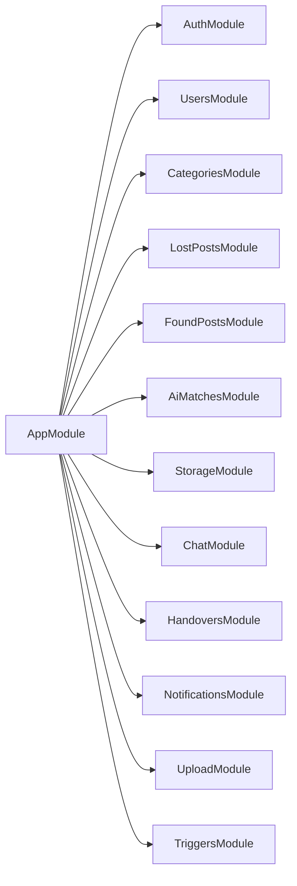

**Diagram sources**
- [app.module.ts:28-44](file://backend/src/app.module.ts#L28-L44)

**Section sources**
- [app.module.ts:28-44](file://backend/src/app.module.ts#L28-L44)

## Performance Considerations
- Pagination and Range Queries
  - Services consistently use range-based pagination to limit result sets for post listings and notifications.
- Asynchronous Operations
  - View count increments and status history logging are fire-and-forget to avoid blocking user actions.
- Batch Upserts
  - AI matching uses batch upserts to efficiently persist multiple candidate matches.
- Database Function Calls
  - Points granting and trigger operations leverage Postgres functions to maintain atomicity and reduce round-trips.
- Indexing and Filtering
  - Queries filter by indexed fields (status, category_id, user_id) and use ordering to optimize UI rendering.

[No sources needed since this section provides general guidance]

## Troubleshooting Guide
- Authentication
  - Registration fails on duplicate email or mismatched passwords.
  - Login fails for unverified accounts or suspended users; ensure email verification and status checks.
  - Password reset requires valid, unexpired tokens; verify token expiry and usage.
- Posts
  - Updates fail if post status is not in editable states or if the user is not the owner; admins can override.
  - Admin rejection requires a reason; otherwise validation errors occur.
- AI Matches
  - Matches require sufficient text overlap; adjust search terms or categories to improve recall.
  - Mutual confirmation is required; ensure both parties confirm to finalize a match.
- Chat
  - Participant verification prevents unauthorized access; ensure conversation IDs belong to the user.
  - Messages must include either content or an image; empty messages are rejected.
- Storage
  - Item code uniqueness is enforced; duplicates cause validation errors.
  - Claiming requires the item to be in the correct status; verify storage state.
- Handovers
  - Verification codes must match and not be expired; ensure timely confirmations.
  - Completion triggers points award and post closure; verify database function execution.
- Notifications
  - Unread counts reflect non-read messages; mark as read to update counters.
- Triggers
  - Pending triggers expire automatically after a fixed period; monitor cron logs for failures.

**Section sources**
- [auth.service.ts:23-25](file://backend/src/modules/auth/auth.service.ts#L23-L25)
- [auth.service.ts:81-91](file://backend/src/modules/auth/auth.service.ts#L81-L91)
- [auth.service.ts:238-240](file://backend/src/modules/auth/auth.service.ts#L238-L240)
- [auth.service.ts:192-195](file://backend/src/modules/auth/auth.service.ts#L192-L195)
- [lost-posts.service.ts:108-114](file://backend/src/modules/lost-posts/lost-posts.service.ts#L108-L114)
- [lost-posts.service.ts:142-144](file://backend/src/modules/lost-posts/lost-posts.service.ts#L142-L144)
- [found-posts.service.ts:96-100](file://backend/src/modules/found-posts/found-posts.service.ts#L96-L100)
- [ai-matches.service.ts:77-86](file://backend/src/modules/ai-matches/ai-matches.service.ts#L77-L86)
- [chat.service.ts:143-148](file://backend/src/modules/chat/chat.service.ts#L143-L148)
- [chat.service.ts:103-105](file://backend/src/modules/chat/chat.service.ts#L103-L105)
- [storage.service.ts:54-61](file://backend/src/modules/storage/storage.service.ts#L54-L61)
- [storage.service.ts:82-84](file://backend/src/modules/storage/storage.service.ts#L82-L84)
- [handovers.service.ts:57-62](file://backend/src/modules/handovers/handovers.service.ts#L57-L62)
- [handovers.service.ts:89-94](file://backend/src/modules/handovers/handovers.service.ts#L89-L94)
- [notifications.service.ts:43-53](file://backend/src/modules/notifications/notifications.service.ts#L43-L53)
- [triggers.service.ts:121-131](file://backend/src/modules/triggers/triggers.service.ts#L121-L131)
- [triggers.service.ts:150-153](file://backend/src/modules/triggers/triggers.service.ts#L150-L153)

## Conclusion
MissLost’s core features form a cohesive ecosystem: secure authentication underpins all actions, posts for lost and found items are managed with robust approval and review workflows, AI-driven matching accelerates connections, real-time chat enables smooth communication, storage integration tracks physical custody, and the training points system incentivizes successful handovers. Administrators benefit from comprehensive dashboards, moderation tools, and trigger management. Together, these components deliver a scalable, transparent, and user-friendly platform for community-based item recovery.