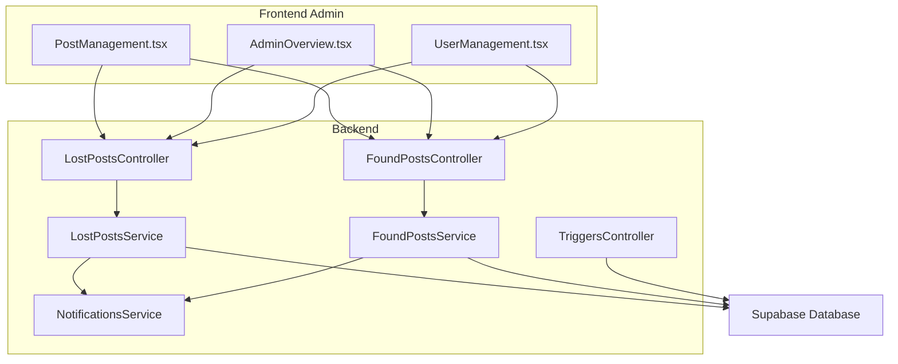
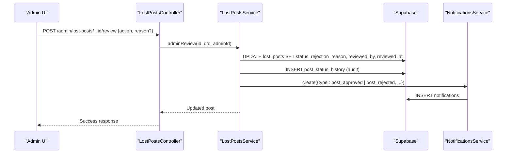
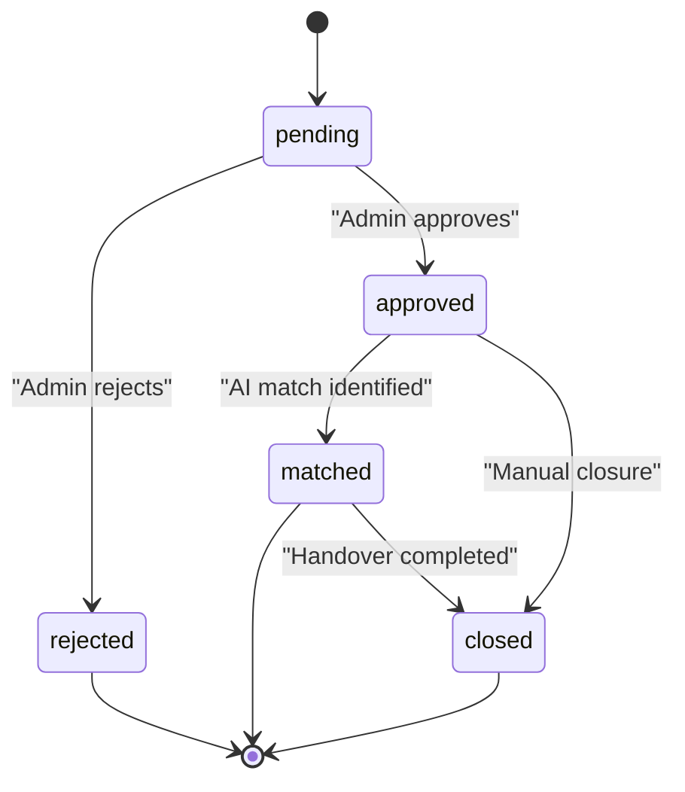
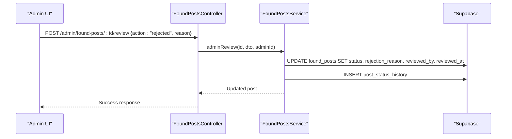
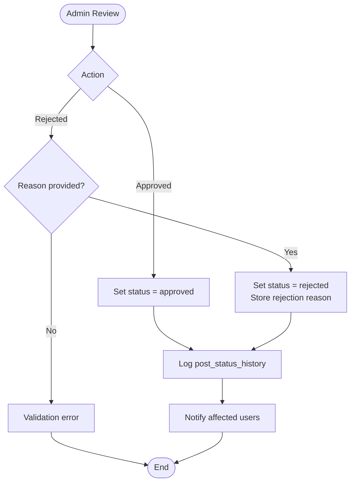
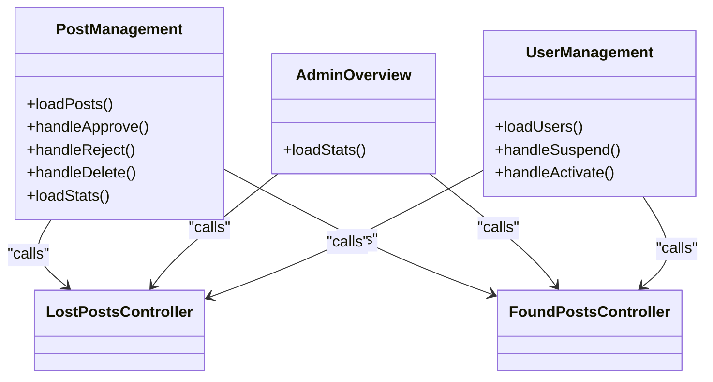
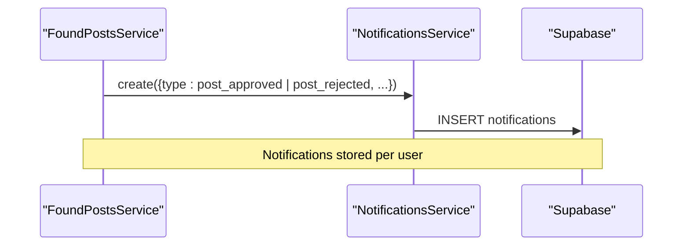
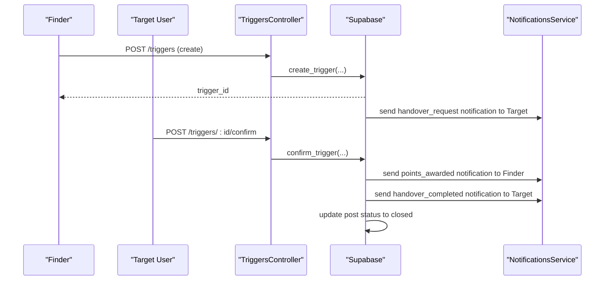
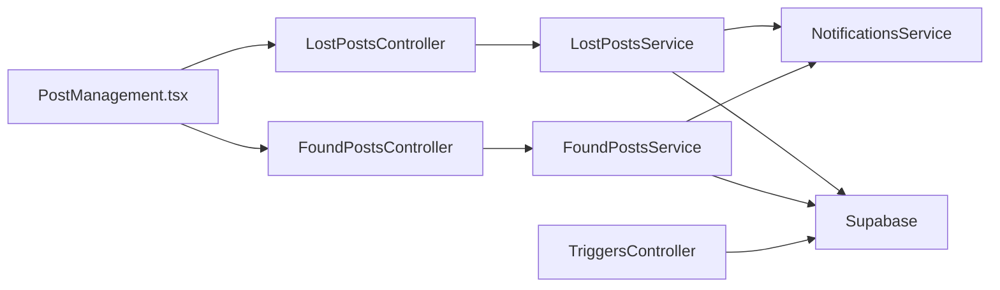

# Approval Workflow and Moderation

<cite>
**Referenced Files in This Document**
- [lost-posts.controller.ts](file://backend/src/modules/lost-posts/lost-posts.controller.ts)
- [found-posts.controller.ts](file://backend/src/modules/found-posts/found-posts.controller.ts)
- [lost-posts.service.ts](file://backend/src/modules/lost-posts/lost-posts.service.ts)
- [found-posts.service.ts](file://backend/src/modules/found-posts/found-posts.service.ts)
- [review-post.dto.ts](file://backend/src/modules/lost-posts/dto/review-post.dto.ts)
- [query-lost-posts.dto.ts](file://backend/src/modules/lost-posts/dto/query-lost-posts.dto.ts)
- [query-found-posts.dto.ts](file://backend/src/modules/found-posts/dto/query-found-posts.dto.ts)
- [PostManagement.tsx](file://frontend/app/admin/post-management/PostManagement.tsx)
- [AdminOverview.tsx](file://frontend/app/admin/admin-overview/AdminOverview.tsx)
- [UserManagement.tsx](file://frontend/app/admin/user-management/UserManagement.tsx)
- [notifications.service.ts](file://backend/src/modules/notifications/notifications.service.ts)
- [triggers.controller.ts](file://backend/src/modules/triggers/triggers.controller.ts)
- [triggers_migration.sql](file://backend/sql/triggers_migration.sql)
- [OVERVIEW.md](file://OVERVIEW.md)
</cite>

## Table of Contents
1. [Introduction](#introduction)
2. [Project Structure](#project-structure)
3. [Core Components](#core-components)
4. [Architecture Overview](#architecture-overview)
5. [Detailed Component Analysis](#detailed-component-analysis)
6. [Dependency Analysis](#dependency-analysis)
7. [Performance Considerations](#performance-considerations)
8. [Troubleshooting Guide](#troubleshooting-guide)
9. [Conclusion](#conclusion)
10. [Appendices](#appendices)

## Introduction
This document explains the Approval Workflow and Moderation system for content review and approval processes in the platform. It covers the admin review interface, approval criteria, decision-making workflows for lost and found posts, status management (pending, approved, rejected, matched, closed), user notifications, moderation tools, audit trails, integration with notifications, quality assurance measures, and administrative oversight procedures. It also outlines appeal and escalation pathways and administrative reporting capabilities.

## Project Structure
The moderation and approval system spans backend NestJS modules and frontend admin dashboards:
- Controllers expose endpoints for post creation, retrieval, updates, deletion, and admin review.
- Services encapsulate business logic for post lifecycle, status transitions, and audit logging.
- Frontend admin pages provide dashboards for reviewing posts, monitoring statistics, and managing users.
- Notifications service integrates with the database to record and manage user notifications.
- Triggers module supports handover workflows and integrates with training points and notifications.

**Diagram sources**
- [PostManagement.tsx:1-698](file://frontend/app/admin/post-management/PostManagement.tsx#L1-L698)
- [AdminOverview.tsx:1-530](file://frontend/app/admin/admin-overview/AdminOverview.tsx#L1-L530)
- [UserManagement.tsx:1-327](file://frontend/app/admin/user-management/UserManagement.tsx#L1-L327)
- [lost-posts.controller.ts:1-78](file://backend/src/modules/lost-posts/lost-posts.controller.ts#L1-L78)
- [found-posts.controller.ts:1-78](file://backend/src/modules/found-posts/found-posts.controller.ts#L1-L78)
- [lost-posts.service.ts:1-189](file://backend/src/modules/lost-posts/lost-posts.service.ts#L1-L189)
- [found-posts.service.ts:1-162](file://backend/src/modules/found-posts/found-posts.service.ts#L1-L162)
- [notifications.service.ts:1-82](file://backend/src/modules/notifications/notifications.service.ts#L1-L82)
- [triggers.controller.ts:1-42](file://backend/src/modules/triggers/triggers.controller.ts#L1-L42)

**Section sources**
- [lost-posts.controller.ts:1-78](file://backend/src/modules/lost-posts/lost-posts.controller.ts#L1-L78)
- [found-posts.controller.ts:1-78](file://backend/src/modules/found-posts/found-posts.controller.ts#L1-L78)
- [PostManagement.tsx:1-698](file://frontend/app/admin/post-management/PostManagement.tsx#L1-L698)
- [AdminOverview.tsx:1-530](file://frontend/app/admin/admin-overview/AdminOverview.tsx#L1-L530)
- [UserManagement.tsx:1-327](file://frontend/app/admin/user-management/UserManagement.tsx#L1-L327)
- [notifications.service.ts:1-82](file://backend/src/modules/notifications/notifications.service.ts#L1-L82)
- [triggers.controller.ts:1-42](file://backend/src/modules/triggers/triggers.controller.ts#L1-L42)

## Core Components
- Lost and Found Post Controllers: Expose CRUD and admin review endpoints for both post types.
- Lost and Found Post Services: Implement post lifecycle logic, status transitions, and audit logging.
- Review DTO: Validates admin review actions and reasons.
- Query DTOs: Standardize filtering and pagination for post listings.
- Admin UI: Provides dashboards for post management, statistics, and user management.
- Notifications Service: Centralized mechanism for creating and retrieving notifications.
- Triggers Module: Supports handover workflows and integrates with training points and notifications.

Key responsibilities:
- Enforce status transitions and validation rules.
- Maintain audit trail via post_status_history.
- Notify users on status changes and system events.
- Support admin oversight with dashboards and filters.

**Section sources**
- [lost-posts.controller.ts:1-78](file://backend/src/modules/lost-posts/lost-posts.controller.ts#L1-L78)
- [found-posts.controller.ts:1-78](file://backend/src/modules/found-posts/found-posts.controller.ts#L1-L78)
- [lost-posts.service.ts:1-189](file://backend/src/modules/lost-posts/lost-posts.service.ts#L1-L189)
- [found-posts.service.ts:1-162](file://backend/src/modules/found-posts/found-posts.service.ts#L1-L162)
- [review-post.dto.ts:1-14](file://backend/src/modules/lost-posts/dto/review-post.dto.ts#L1-L14)
- [query-lost-posts.dto.ts:1-36](file://backend/src/modules/lost-posts/dto/query-lost-posts.dto.ts#L1-L36)
- [query-found-posts.dto.ts:1-36](file://backend/src/modules/found-posts/dto/query-found-posts.dto.ts#L1-L36)
- [PostManagement.tsx:1-698](file://frontend/app/admin/post-management/PostManagement.tsx#L1-L698)
- [AdminOverview.tsx:1-530](file://frontend/app/admin/admin-overview/AdminOverview.tsx#L1-L530)
- [UserManagement.tsx:1-327](file://frontend/app/admin/user-management/UserManagement.tsx#L1-L327)
- [notifications.service.ts:1-82](file://backend/src/modules/notifications/notifications.service.ts#L1-L82)

## Architecture Overview
The moderation workflow centers on admin review endpoints and status transitions. Admins use the Post Management dashboard to approve or reject posts. On approval or rejection, the system updates the post status, records audit history, and optionally notifies users. The system also supports user management and integrates with handover workflows.

**Diagram sources**
- [lost-posts.controller.ts:70-76](file://backend/src/modules/lost-posts/lost-posts.controller.ts#L70-L76)
- [lost-posts.service.ts:139-171](file://backend/src/modules/lost-posts/lost-posts.service.ts#L139-L171)
- [notifications.service.ts:66-81](file://backend/src/modules/notifications/notifications.service.ts#L66-L81)

**Section sources**
- [lost-posts.controller.ts:70-76](file://backend/src/modules/lost-posts/lost-posts.controller.ts#L70-L76)
- [lost-posts.service.ts:139-171](file://backend/src/modules/lost-posts/lost-posts.service.ts#L139-L171)
- [notifications.service.ts:66-81](file://backend/src/modules/notifications/notifications.service.ts#L66-L81)

## Detailed Component Analysis

### Status Management System
The system defines five statuses for posts:
- pending: Awaiting admin review.
- approved: Visible publicly.
- rejected: Rejected by admin with optional reason.
- matched: Identified as a potential match (requires further confirmation).
- closed: Post is closed (e.g., after successful handover).

Status transitions:
- Creation sets initial status to approved for both post types.
- Admin review can change status to approved or rejected.
- Matched and closed statuses are managed by AI matching and handover workflows.

Audit trail:
- post_status_history captures post_type, post_id, old_status, new_status, changed_by, note, and timestamp.

**Diagram sources**
- [triggers_migration.sql:294-304](file://backend/sql/triggers_migration.sql#L294-L304)
- [OVERVIEW.md:183-189](file://OVERVIEW.md#L183-L189)

**Section sources**
- [lost-posts.service.ts:25-40](file://backend/src/modules/lost-posts/lost-posts.service.ts#L25-L40)
- [found-posts.service.ts:22-37](file://backend/src/modules/found-posts/found-posts.service.ts#L22-L37)
- [lost-posts.service.ts:139-171](file://backend/src/modules/lost-posts/lost-posts.service.ts#L139-L171)
- [found-posts.service.ts:117-145](file://backend/src/modules/found-posts/found-posts.service.ts#L117-L145)
- [triggers_migration.sql:294-304](file://backend/sql/triggers_migration.sql#L294-L304)
- [OVERVIEW.md:183-189](file://OVERVIEW.md#L183-L189)

### Admin Review Interface and Workflows
- Endpoints:
  - GET /admin/lost-posts/pending and GET /admin/found-posts/pending: Retrieve pending posts for review.
  - POST /admin/lost-posts/:id/review and POST /admin/found-posts/:id/review: Approve or reject a post with optional reason.

- Validation:
  - ReviewPostDto enforces action to be approved or rejected.
  - Reject requires a reason; otherwise, validation fails.

- Audit logging:
  - post_status_history is updated with old/new status, admin ID, and reason.

- Frontend:
  - PostManagement.tsx displays pending posts, allows approve/reject actions, and shows stats.
  - AdminOverview.tsx aggregates system-wide metrics and recent activity.

**Diagram sources**
- [found-posts.controller.ts:70-76](file://backend/src/modules/found-posts/found-posts.controller.ts#L70-L76)
- [found-posts.service.ts:117-145](file://backend/src/modules/found-posts/found-posts.service.ts#L117-L145)
- [review-post.dto.ts:1-14](file://backend/src/modules/lost-posts/dto/review-post.dto.ts#L1-L14)

**Section sources**
- [lost-posts.controller.ts:62-76](file://backend/src/modules/lost-posts/lost-posts.controller.ts#L62-L76)
- [found-posts.controller.ts:62-76](file://backend/src/modules/found-posts/found-posts.controller.ts#L62-L76)
- [lost-posts.service.ts:139-171](file://backend/src/modules/lost-posts/lost-posts.service.ts#L139-L171)
- [found-posts.service.ts:117-145](file://backend/src/modules/found-posts/found-posts.service.ts#L117-L145)
- [review-post.dto.ts:1-14](file://backend/src/modules/lost-posts/dto/review-post.dto.ts#L1-L14)
- [PostManagement.tsx:96-136](file://frontend/app/admin/post-management/PostManagement.tsx#L96-L136)
- [AdminOverview.tsx:62-80](file://frontend/app/admin/admin-overview/AdminOverview.tsx#L62-L80)

### Quality Assurance Measures
- Duplicate detection and inappropriate content screening:
  - Full-text search indexes on titles and descriptions enable efficient discovery of similar posts.
  - AI matching module computes text similarity to suggest matches between lost and found posts.
- Community guideline enforcement:
  - Admin review process enforces policy compliance.
  - Optional rejection reasons support transparency and policy alignment.

**Diagram sources**
- [review-post.dto.ts:1-14](file://backend/src/modules/lost-posts/dto/review-post.dto.ts#L1-L14)
- [lost-posts.service.ts:139-171](file://backend/src/modules/lost-posts/lost-posts.service.ts#L139-L171)
- [found-posts.service.ts:117-145](file://backend/src/modules/found-posts/found-posts.service.ts#L117-L145)

**Section sources**
- [query-lost-posts.dto.ts:1-36](file://backend/src/modules/lost-posts/dto/query-lost-posts.dto.ts#L1-L36)
- [query-found-posts.dto.ts:1-36](file://backend/src/modules/found-posts/dto/query-found-posts.dto.ts#L1-L36)
- [OVERVIEW.md:178-276](file://OVERVIEW.md#L178-L276)
- [ai-matches.service.ts:1-155](file://backend/src/modules/ai-matches/ai-matches.service.ts#L1-L155)

### Moderation Tools and Administrative Oversight
- Post Management dashboard:
  - Filter by type (lost/found/all), status, and search.
  - Approve or reject pending posts with immediate audit logging.
  - View stats including totals, pending counts, and recent activity.
- User Management dashboard:
  - View user list, suspend/activate accounts, and monitor training points.
- Admin Overview:
  - System-wide metrics, success rates, and recent activity feed.

**Diagram sources**
- [PostManagement.tsx:53-151](file://frontend/app/admin/post-management/PostManagement.tsx#L53-L151)
- [AdminOverview.tsx:62-80](file://frontend/app/admin/admin-overview/AdminOverview.tsx#L62-L80)
- [UserManagement.tsx:28-70](file://frontend/app/admin/user-management/UserManagement.tsx#L28-L70)

**Section sources**
- [PostManagement.tsx:1-698](file://frontend/app/admin/post-management/PostManagement.tsx#L1-L698)
- [AdminOverview.tsx:1-530](file://frontend/app/admin/admin-overview/AdminOverview.tsx#L1-L530)
- [UserManagement.tsx:1-327](file://frontend/app/admin/user-management/UserManagement.tsx#L1-L327)

### Audit Trail Functionality
- post_status_history captures:
  - post_type, post_id
  - old_status, new_status
  - changed_by (admin/user)
  - note (e.g., rejection reason)
  - created_at timestamp

This enables full traceability of moderation actions.

**Section sources**
- [lost-posts.service.ts:160-168](file://backend/src/modules/lost-posts/lost-posts.service.ts#L160-L168)
- [found-posts.service.ts:135-142](file://backend/src/modules/found-posts/found-posts.service.ts#L135-L142)
- [triggers_migration.sql:294-304](file://backend/sql/triggers_migration.sql#L294-L304)

### Notification Integration
- Notification types include post_approved, post_rejected, match_found, new_message, handover_request, handover_completed, storage_available, points_awarded, system.
- NotificationsService supports fetching notifications, marking as read, and creating notifications.
- Triggers module emits notifications during handover workflows (e.g., handover_request, points_awarded, handover_completed).

**Diagram sources**
- [notifications.service.ts:66-81](file://backend/src/modules/notifications/notifications.service.ts#L66-L81)
- [triggers_migration.sql:123-140](file://backend/sql/triggers_migration.sql#L123-L140)

**Section sources**
- [notifications.service.ts:1-82](file://backend/src/modules/notifications/notifications.service.ts#L1-L82)
- [triggers_migration.sql:123-140](file://backend/sql/triggers_migration.sql#L123-L140)

### Handover and Escalation Workflows
- Triggers module manages handover requests:
  - Create trigger for a post (finder confirms ownership).
  - Confirm trigger to award training points and update post status to closed.
  - Cancel trigger to abort the process.
- Auto-expiration prevents stale triggers.
- Notifications integrate with handover events.

**Diagram sources**
- [triggers.controller.ts:15-31](file://backend/src/modules/triggers/triggers.controller.ts#L15-L31)
- [triggers_migration.sql:63-146](file://backend/sql/triggers_migration.sql#L63-L146)
- [triggers_migration.sql:153-259](file://backend/sql/triggers_migration.sql#L153-L259)

**Section sources**
- [triggers.controller.ts:1-42](file://backend/src/modules/triggers/triggers.controller.ts#L1-L42)
- [triggers_migration.sql:1-338](file://backend/sql/triggers_migration.sql#L1-L338)

## Dependency Analysis
Moderation components depend on:
- Controllers -> Services -> Supabase client -> Database.
- Services -> NotificationsService for user notifications.
- Frontend dashboards -> Backend endpoints for data and actions.

**Diagram sources**
- [PostManagement.tsx:1-698](file://frontend/app/admin/post-management/PostManagement.tsx#L1-L698)
- [lost-posts.controller.ts:1-78](file://backend/src/modules/lost-posts/lost-posts.controller.ts#L1-L78)
- [found-posts.controller.ts:1-78](file://backend/src/modules/found-posts/found-posts.controller.ts#L1-L78)
- [lost-posts.service.ts:1-189](file://backend/src/modules/lost-posts/lost-posts.service.ts#L1-L189)
- [found-posts.service.ts:1-162](file://backend/src/modules/found-posts/found-posts.service.ts#L1-L162)
- [notifications.service.ts:1-82](file://backend/src/modules/notifications/notifications.service.ts#L1-L82)
- [triggers.controller.ts:1-42](file://backend/src/modules/triggers/triggers.controller.ts#L1-L42)

**Section sources**
- [lost-posts.controller.ts:1-78](file://backend/src/modules/lost-posts/lost-posts.controller.ts#L1-L78)
- [found-posts.controller.ts:1-78](file://backend/src/modules/found-posts/found-posts.controller.ts#L1-L78)
- [lost-posts.service.ts:1-189](file://backend/src/modules/lost-posts/lost-posts.service.ts#L1-L189)
- [found-posts.service.ts:1-162](file://backend/src/modules/found-posts/found-posts.service.ts#L1-L162)
- [notifications.service.ts:1-82](file://backend/src/modules/notifications/notifications.service.ts#L1-L82)
- [triggers.controller.ts:1-42](file://backend/src/modules/triggers/triggers.controller.ts#L1-L42)

## Performance Considerations
- Use paginated queries for post listings to avoid large payloads.
- Leverage database indexes on status, category, and timestamps for efficient filtering.
- Minimize concurrent write operations on post_status_history to reduce contention.
- Offload heavy computations (e.g., AI matching) to background jobs when scaling.

## Troubleshooting Guide
Common issues and resolutions:
- Validation errors on review:
  - Ensure rejection actions include a reason; otherwise, validation fails.
- Permission errors:
  - Admin-only endpoints require admin role; verify authentication and roles.
- Missing notifications:
  - Confirm notifications service is invoked after status changes and that the notifications table exists.
- Stale triggers:
  - Verify auto-expire function runs and pending triggers are expired appropriately.

**Section sources**
- [review-post.dto.ts:1-14](file://backend/src/modules/lost-posts/dto/review-post.dto.ts#L1-L14)
- [lost-posts.service.ts:139-171](file://backend/src/modules/lost-posts/lost-posts.service.ts#L139-L171)
- [found-posts.service.ts:117-145](file://backend/src/modules/found-posts/found-posts.service.ts#L117-L145)
- [notifications.service.ts:66-81](file://backend/src/modules/notifications/notifications.service.ts#L66-L81)
- [triggers_migration.sql:325-336](file://backend/sql/triggers_migration.sql#L325-L336)

## Conclusion
The Approval Workflow and Moderation system provides a robust framework for managing lost and found posts. Admins can efficiently review, approve, or reject posts while maintaining a complete audit trail. The system integrates notifications, supports user management, and leverages AI matching and handover workflows to enhance community outcomes. Administrative dashboards offer oversight and reporting capabilities essential for effective moderation.

## Appendices

### Decision Trees and Examples
- Example scenario: Approve a lost post
  - Admin selects approve from Post Management.
  - System updates status to approved and logs audit entry.
  - Optional: Notify user via notifications service.
- Example scenario: Reject a found post
  - Admin selects reject with a reason.
  - System updates status to rejected, stores reason, logs audit entry.
  - Optional: Notify user via notifications service.

**Section sources**
- [PostManagement.tsx:96-136](file://frontend/app/admin/post-management/PostManagement.tsx#L96-L136)
- [lost-posts.service.ts:139-171](file://backend/src/modules/lost-posts/lost-posts.service.ts#L139-L171)
- [found-posts.service.ts:117-145](file://backend/src/modules/found-posts/found-posts.service.ts#L117-L145)
- [notifications.service.ts:66-81](file://backend/src/modules/notifications/notifications.service.ts#L66-L81)