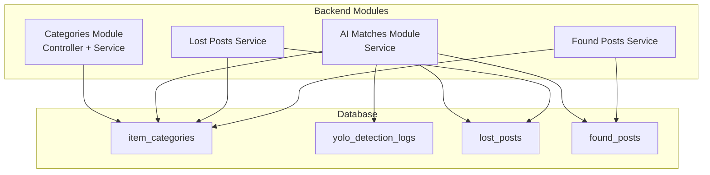
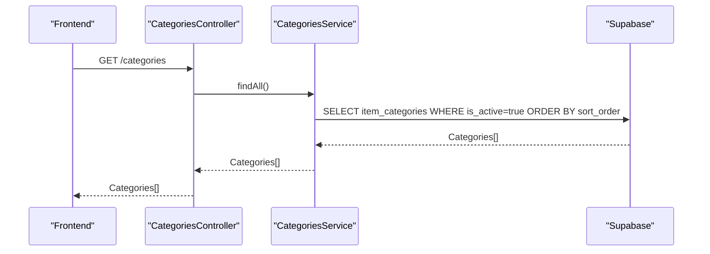
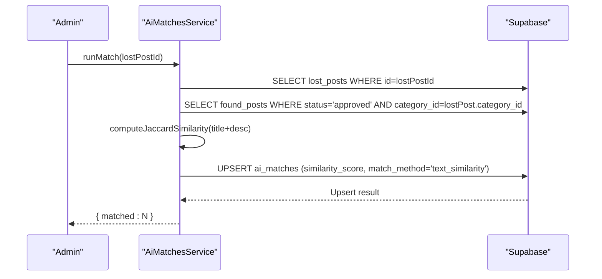
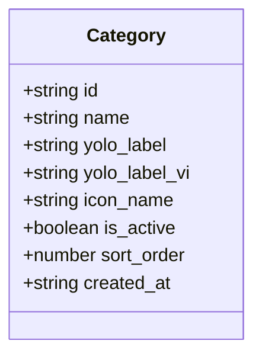
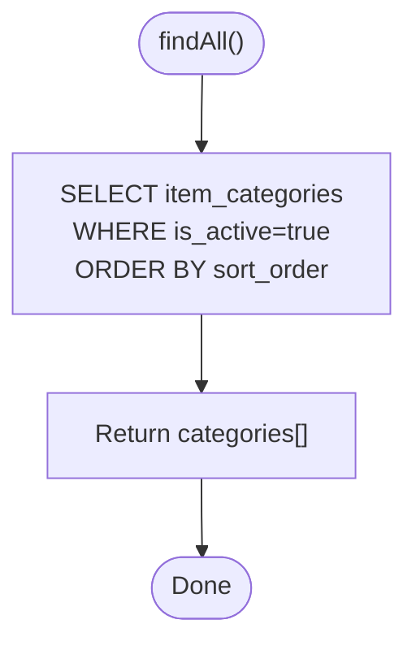
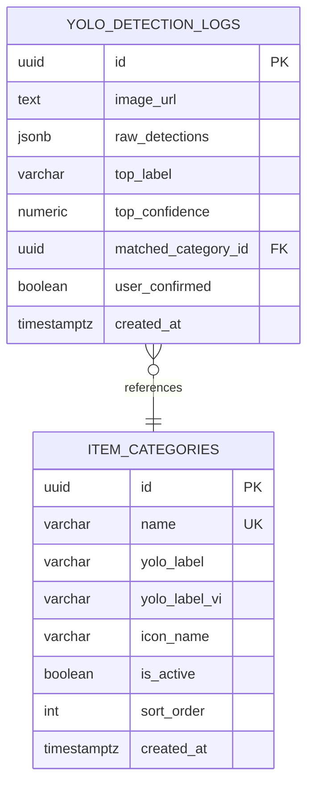
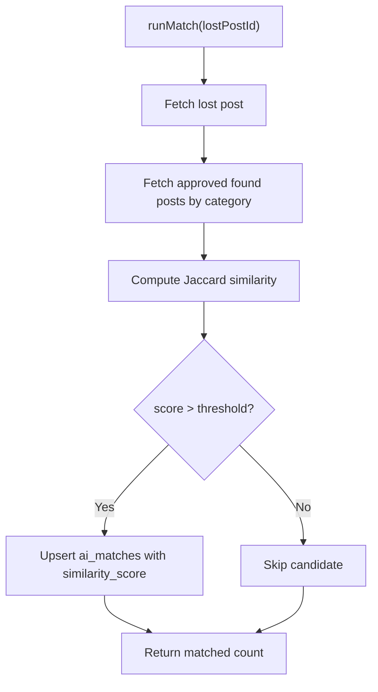
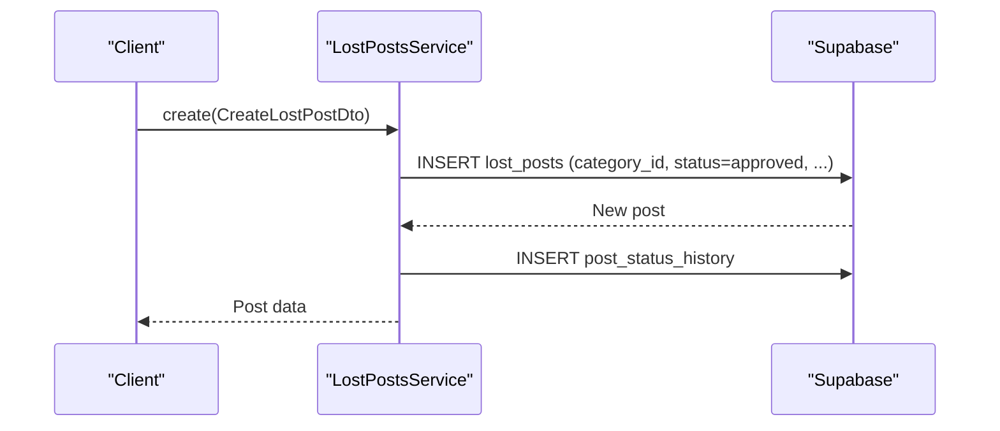
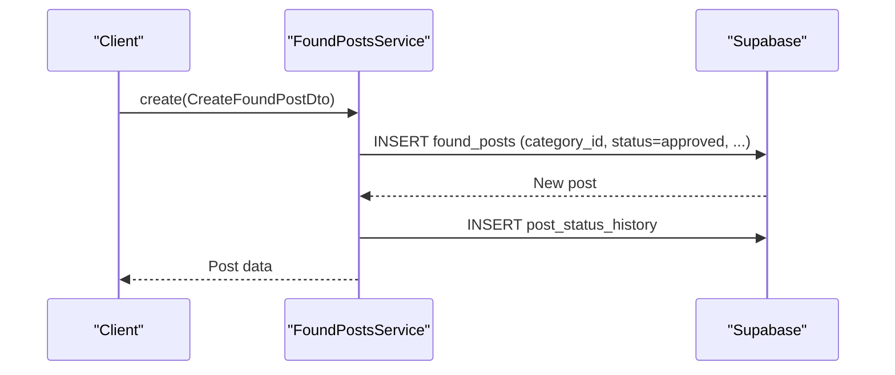
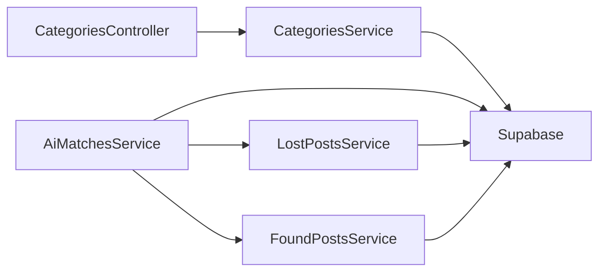

# Category Classification System

<cite>
**Referenced Files in This Document**
- [category.entity.ts](file://backend/src/modules/categories/entities/category.entity.ts)
- [categories.service.ts](file://backend/src/modules/categories/categories.service.ts)
- [categories.controller.ts](file://backend/src/modules/categories/categories.controller.ts)
- [categories.module.ts](file://backend/src/modules/categories/categories.module.ts)
- [ai-matches.service.ts](file://backend/src/modules/ai-matches/ai-matches.service.ts)
- [lost-posts.service.ts](file://backend/src/modules/lost-posts/lost-posts.service.ts)
- [found-posts.service.ts](file://backend/src/modules/found-posts/found-posts.service.ts)
- [create-lost-post.dto.ts](file://backend/src/modules/lost-posts/dto/create-lost-post.dto.ts)
- [create-found-post.dto.ts](file://backend/src/modules/found-posts/dto/create-found-found-post.dto.ts)
- [triggers_migration.sql](file://backend/sql/triggers_migration.sql)
- [OVERVIEW.md](file://OVERVIEW.md)
</cite>

## Table of Contents
1. [Introduction](#introduction)
2. [Project Structure](#project-structure)
3. [Core Components](#core-components)
4. [Architecture Overview](#architecture-overview)
5. [Detailed Component Analysis](#detailed-component-analysis)
6. [Dependency Analysis](#dependency-analysis)
7. [Performance Considerations](#performance-considerations)
8. [Troubleshooting Guide](#troubleshooting-guide)
9. [Conclusion](#conclusion)
10. [Appendices](#appendices)

## Introduction
This document describes the Category Classification System responsible for item categorization and classification within the platform. It covers the category hierarchy, classification algorithms, and the integration with YOLO-based object detection for automatic item classification. It also documents the category entity structure, relationships, and metadata management; the frontend components for category selection during post creation; the administrator management system for categories; and the relationship between categories and posts, including category assignment and filtering.

## Project Structure
The Category Classification System spans backend NestJS modules and shared database schema definitions:
- Categories module: exposes category data and retrieval for frontend consumption.
- AI Matches module: orchestrates text-based matching between lost and found posts by category and supports administrative dashboards.
- Posts services: manage post creation, filtering, and category assignment for lost and found posts.
- Database schema: defines item categories and YOLO detection logs.

**Diagram sources**
- [categories.controller.ts:1-18](file://backend/src/modules/categories/categories.controller.ts#L1-L18)
- [categories.service.ts:1-32](file://backend/src/modules/categories/categories.service.ts#L1-L32)
- [ai-matches.service.ts:15-96](file://backend/src/modules/ai-matches/ai-matches.service.ts#L15-L96)
- [lost-posts.service.ts:19-43](file://backend/src/modules/lost-posts/lost-posts.service.ts#L19-L43)
- [found-posts.service.ts:19-38](file://backend/src/modules/found-posts/found-posts.service.ts#L19-L38)
- [triggers_migration.sql:140-175](file://backend/sql/triggers_migration.sql#L140-L175)

**Section sources**
- [categories.module.ts:1-11](file://backend/src/modules/categories/categories.module.ts#L1-L11)
- [categories.controller.ts:1-18](file://backend/src/modules/categories/categories.controller.ts#L1-L18)
- [categories.service.ts:1-32](file://backend/src/modules/categories/categories.service.ts#L1-L32)
- [ai-matches.service.ts:15-96](file://backend/src/modules/ai-matches/ai-matches.service.ts#L15-L96)
- [lost-posts.service.ts:19-43](file://backend/src/modules/lost-posts/lost-posts.service.ts#L19-L43)
- [found-posts.service.ts:19-38](file://backend/src/modules/found-posts/found-posts.service.ts#L19-L38)
- [triggers_migration.sql:140-175](file://backend/sql/triggers_migration.sql#L140-L175)

## Core Components
- Category entity: Defines category fields including identifiers, labels for YOLO integration, icons, activation flag, ordering, and timestamps.
- Categories service: Provides category retrieval for active categories ordered by sort order and lookup by ID.
- Categories controller: Exposes a public endpoint to fetch categories.
- AI Matches service: Implements text-based matching between lost and found posts by category, computes similarity scores, and manages match confirmations.
- Lost and Found Posts services: Handle post creation, filtering, and category assignment; support category-based queries.
- Database schema: Declares item categories and YOLO detection logs with foreign key relationships.

Key implementation references:
- Category entity definition: [category.entity.ts:1-11](file://backend/src/modules/categories/entities/category.entity.ts#L1-L11)
- Categories service methods: [categories.service.ts:10-30](file://backend/src/modules/categories/categories.service.ts#L10-L30)
- Categories controller endpoint: [categories.controller.ts:11-16](file://backend/src/modules/categories/categories.controller.ts#L11-L16)
- Text-based matching logic: [ai-matches.service.ts:45-96](file://backend/src/modules/ai-matches/ai-matches.service.ts#L45-L96)
- Post creation with category_id: [create-lost-post.dto.ts:34-37](file://backend/src/modules/lost-posts/dto/create-lost-post.dto.ts#L34-L37), [create-found-post.dto.ts:27-30](file://backend/src/modules/found-posts/dto/create-found-post.dto.ts#L27-L30)
- Database schema: [triggers_migration.sql:140-175](file://backend/sql/triggers_migration.sql#L140-L175)

**Section sources**
- [category.entity.ts:1-11](file://backend/src/modules/categories/entities/category.entity.ts#L1-L11)
- [categories.service.ts:10-30](file://backend/src/modules/categories/categories.service.ts#L10-L30)
- [categories.controller.ts:11-16](file://backend/src/modules/categories/categories.controller.ts#L11-L16)
- [ai-matches.service.ts:45-96](file://backend/src/modules/ai-matches/ai-matches.service.ts#L45-L96)
- [create-lost-post.dto.ts:34-37](file://backend/src/modules/lost-posts/dto/create-lost-post.dto.ts#L34-L37)
- [create-found-post.dto.ts:27-30](file://backend/src/modules/found-posts/dto/create-found-post.dto.ts#L27-L30)
- [triggers_migration.sql:140-175](file://backend/sql/triggers_migration.sql#L140-L175)

## Architecture Overview
The system integrates category data with post creation and matching workflows. Categories are fetched via a dedicated endpoint and used by posts services for filtering and assignment. AI-driven matching operates on text similarity within the same category, while YOLO detection logs capture machine predictions and user confirmations for continuous improvement.

**Diagram sources**
- [categories.controller.ts:11-16](file://backend/src/modules/categories/categories.controller.ts#L11-L16)
- [categories.service.ts:10-19](file://backend/src/modules/categories/categories.service.ts#L10-L19)

**Diagram sources**
- [ai-matches.service.ts:45-96](file://backend/src/modules/ai-matches/ai-matches.service.ts#L45-L96)

## Detailed Component Analysis

### Category Entity and Metadata Management
The category entity encapsulates:
- Unique identifier and human-readable name
- Optional YOLO label fields for English and Vietnamese labels
- Icon name for UI rendering
- Activation flag and sort order for presentation
- Creation timestamp

**Diagram sources**
- [category.entity.ts:1-11](file://backend/src/modules/categories/entities/category.entity.ts#L1-L11)

Metadata management:
- Categories are stored in the item_categories table with unique names and optional YOLO labels.
- The database includes seed data mapping common YOLO COCO labels to categories and an auxiliary table for YOLO detection logs.

References:
- Entity fields: [category.entity.ts:1-11](file://backend/src/modules/categories/entities/category.entity.ts#L1-L11)
- Schema definition and seed data: [triggers_migration.sql:140-163](file://backend/sql/triggers_migration.sql#L140-L163)
- Detection logs schema: [triggers_migration.sql:165-175](file://backend/sql/triggers_migration.sql#L165-L175)

**Section sources**
- [category.entity.ts:1-11](file://backend/src/modules/categories/entities/category.entity.ts#L1-L11)
- [triggers_migration.sql:140-175](file://backend/sql/triggers_migration.sql#L140-L175)

### Categories Module: Retrieval and Exposure
- findAll retrieves active categories ordered by sort_order and returns essential fields for UI rendering.
- findById retrieves a single category by ID for detailed views or administrative updates.

**Diagram sources**
- [categories.service.ts:10-19](file://backend/src/modules/categories/categories.service.ts#L10-L19)

References:
- Controller endpoint: [categories.controller.ts:11-16](file://backend/src/modules/categories/categories.controller.ts#L11-L16)
- Service methods: [categories.service.ts:10-30](file://backend/src/modules/categories/categories.service.ts#L10-L30)

**Section sources**
- [categories.controller.ts:11-16](file://backend/src/modules/categories/categories.controller.ts#L11-L16)
- [categories.service.ts:10-30](file://backend/src/modules/categories/categories.service.ts#L10-L30)

### AI-Based Matching and Automatic Categorization
Automatic categorization leverages YOLO detection logs with category associations:
- YOLO detection logs record raw detections, top label, confidence, and matched category ID.
- User confirmations indicate acceptance of suggested categories for model refinement.

**Diagram sources**
- [triggers_migration.sql:140-175](file://backend/sql/triggers_migration.sql#L140-L175)

Text-based matching workflow:
- Retrieves a lost post and candidate found posts within the same category.
- Computes Jaccard similarity on normalized tokens from titles and descriptions.
- Upserts AI match records with similarity scores and match method.

**Diagram sources**
- [ai-matches.service.ts:45-96](file://backend/src/modules/ai-matches/ai-matches.service.ts#L45-L96)

References:
- Detection logs schema: [triggers_migration.sql:165-175](file://backend/sql/triggers_migration.sql#L165-L175)
- Seed category mapping: [triggers_migration.sql:151-163](file://backend/sql/triggers_migration.sql#L151-L163)

**Section sources**
- [ai-matches.service.ts:45-96](file://backend/src/modules/ai-matches/ai-matches.service.ts#L45-L96)
- [triggers_migration.sql:140-175](file://backend/sql/triggers_migration.sql#L140-L175)

### Post Creation and Category Assignment
Lost and found posts support category assignment via category_id in their DTOs. Services insert posts with initial statuses and maintain status histories.

**Diagram sources**
- [lost-posts.service.ts:19-43](file://backend/src/modules/lost-posts/lost-posts.service.ts#L19-L43)
- [create-lost-post.dto.ts:34-37](file://backend/src/modules/lost-posts/dto/create-lost-post.dto.ts#L34-L37)

**Diagram sources**
- [found-posts.service.ts:19-38](file://backend/src/modules/found-posts/found-posts.service.ts#L19-L38)
- [create-found-post.dto.ts:27-30](file://backend/src/modules/found-posts/dto/create-found-post.dto.ts#L27-L30)

References:
- Lost post creation: [lost-posts.service.ts:19-43](file://backend/src/modules/lost-posts/lost-posts.service.ts#L19-L43)
- Found post creation: [found-posts.service.ts:19-38](file://backend/src/modules/found-posts/found-posts.service.ts#L19-L38)
- DTO category fields: [create-lost-post.dto.ts:34-37](file://backend/src/modules/lost-posts/dto/create-lost-post.dto.ts#L34-L37), [create-found-post.dto.ts:27-30](file://backend/src/modules/found-posts/dto/create-found-post.dto.ts#L27-L30)

**Section sources**
- [lost-posts.service.ts:19-43](file://backend/src/modules/lost-posts/lost-posts.service.ts#L19-L43)
- [found-posts.service.ts:19-38](file://backend/src/modules/found-posts/found-posts.service.ts#L19-L38)
- [create-lost-post.dto.ts:34-37](file://backend/src/modules/lost-posts/dto/create-lost-post.dto.ts#L34-L37)
- [create-found-post.dto.ts:27-30](file://backend/src/modules/found-posts/dto/create-found-post.dto.ts#L27-L30)

### Category-Based Filtering and Relationship to Posts
Posts services filter by category_id and include category metadata in responses. This enables category-aware feeds and administrative dashboards.

References:
- Lost posts filtering: [lost-posts.service.ts:45-73](file://backend/src/modules/lost-posts/lost-posts.service.ts#L45-L73)
- Found posts filtering: [found-posts.service.ts:40-67](file://backend/src/modules/found-posts/found-posts.service.ts#L40-L67)
- Category inclusion in selects: [lost-posts.service.ts:52-56](file://backend/src/modules/lost-posts/lost-posts.service.ts#L52-L56), [found-posts.service.ts:47-51](file://backend/src/modules/found-posts/found-posts.service.ts#L47-L51)

**Section sources**
- [lost-posts.service.ts:45-73](file://backend/src/modules/lost-posts/lost-posts.service.ts#L45-L73)
- [found-posts.service.ts:40-67](file://backend/src/modules/found-posts/found-posts.service.ts#L40-L67)
- [lost-posts.service.ts:52-56](file://backend/src/modules/lost-posts/lost-posts.service.ts#L52-L56)
- [found-posts.service.ts:47-51](file://backend/src/modules/found-posts/found-posts.service.ts#L47-L51)

### Frontend Integration for Category Selection
The frontend consumes the categories endpoint to populate category selection UIs during post creation. While the specific frontend components are outside the provided backend context, the backend provides:
- A public endpoint to fetch active categories ordered by sort order.
- Category metadata suitable for rendering icons and labels.

References:
- Categories endpoint: [categories.controller.ts:11-16](file://backend/src/modules/categories/categories.controller.ts#L11-L16)
- Active categories retrieval: [categories.service.ts:10-19](file://backend/src/modules/categories/categories.service.ts#L10-L19)

**Section sources**
- [categories.controller.ts:11-16](file://backend/src/modules/categories/categories.controller.ts#L11-L16)
- [categories.service.ts:10-19](file://backend/src/modules/categories/categories.service.ts#L10-L19)

### Administrative Oversight Procedures
Administrators can:
- Review posts and approve or reject them, logging status changes.
- Use administrative dashboards to monitor statistics and recent activity, including top categories.

References:
- Lost post admin review: [lost-posts.service.ts:139-171](file://backend/src/modules/lost-posts/lost-posts.service.ts#L139-L171)
- Found post admin review: [found-posts.service.ts:117-145](file://backend/src/modules/found-posts/found-posts.service.ts#L117-L145)
- Enhanced dashboard stats (including top categories): [ai-matches.service.ts:185-274](file://backend/src/modules/ai-matches/ai-matches.service.ts#L185-L274)

**Section sources**
- [lost-posts.service.ts:139-171](file://backend/src/modules/lost-posts/lost-posts.service.ts#L139-L171)
- [found-posts.service.ts:117-145](file://backend/src/modules/found-posts/found-posts.service.ts#L117-L145)
- [ai-matches.service.ts:185-274](file://backend/src/modules/ai-matches/ai-matches.service.ts#L185-L274)

## Dependency Analysis
The system exhibits clear separation of concerns:
- Categories module depends on Supabase client for data access.
- AI Matches module coordinates across posts and categories, leveraging text similarity.
- Posts services depend on categories for filtering and assignment.

**Diagram sources**
- [categories.controller.ts:1-18](file://backend/src/modules/categories/categories.controller.ts#L1-L18)
- [categories.service.ts:1-32](file://backend/src/modules/categories/categories.service.ts#L1-L32)
- [ai-matches.service.ts:15-96](file://backend/src/modules/ai-matches/ai-matches.service.ts#L15-L96)
- [lost-posts.service.ts:19-43](file://backend/src/modules/lost-posts/lost-posts.service.ts#L19-L43)
- [found-posts.service.ts:19-38](file://backend/src/modules/found-posts/found-posts.service.ts#L19-L38)

**Section sources**
- [categories.controller.ts:1-18](file://backend/src/modules/categories/categories.controller.ts#L1-L18)
- [categories.service.ts:1-32](file://backend/src/modules/categories/categories.service.ts#L1-L32)
- [ai-matches.service.ts:15-96](file://backend/src/modules/ai-matches/ai-matches.service.ts#L15-L96)
- [lost-posts.service.ts:19-43](file://backend/src/modules/lost-posts/lost-posts.service.ts#L19-L43)
- [found-posts.service.ts:19-38](file://backend/src/modules/found-posts/found-posts.service.ts#L19-L38)

## Performance Considerations
- Category retrieval orders by sort_order; ensure appropriate indexing on is_active and sort_order for efficient filtering and sorting.
- Text-based matching iterates candidates and performs tokenization; consider limiting candidate sets or adding pre-filtering by category to reduce computation.
- Upsert operations for matches should leverage conflict resolution efficiently; ensure database constraints and indexes support bulk upsert performance.

## Troubleshooting Guide
Common issues and remedies:
- Category retrieval errors: Verify is_active filtering and sort_order ordering; check database connectivity and table existence.
  - Reference: [categories.service.ts:10-19](file://backend/src/modules/categories/categories.service.ts#L10-L19)
- Match computation anomalies: Validate input normalization and Jaccard similarity thresholds; ensure category_id alignment between posts.
  - Reference: [ai-matches.service.ts:45-96](file://backend/src/modules/ai-matches/ai-matches.service.ts#L45-L96)
- Post creation failures: Confirm DTO validation and status history insertion; inspect error propagation.
  - Reference: [lost-posts.service.ts:19-43](file://backend/src/modules/lost-posts/lost-posts.service.ts#L19-L43), [found-posts.service.ts:19-38](file://backend/src/modules/found-posts/found-posts.service.ts#L19-L38)

**Section sources**
- [categories.service.ts:10-19](file://backend/src/modules/categories/categories.service.ts#L10-L19)
- [ai-matches.service.ts:45-96](file://backend/src/modules/ai-matches/ai-matches.service.ts#L45-L96)
- [lost-posts.service.ts:19-43](file://backend/src/modules/lost-posts/lost-posts.service.ts#L19-L43)
- [found-posts.service.ts:19-38](file://backend/src/modules/found-posts/found-posts.service.ts#L19-L38)

## Conclusion
The Category Classification System integrates category metadata, post lifecycle management, and AI-driven matching to streamline item categorization. Categories are actively maintained and exposed via a simple endpoint, while posts leverage category assignments for filtering and discovery. The AI Matches service provides robust text-based matching within categories, and YOLO detection logs support continuous learning and accuracy improvements. Administrators benefit from comprehensive dashboards and review workflows to ensure data quality and system integrity.

## Appendices

### Example Scenarios
- Automatic categorization via YOLO: An image is processed by YOLO; the top label is logged with a matched category ID; user confirmation improves future suggestions.
  - References: [triggers_migration.sql:165-175](file://backend/sql/triggers_migration.sql#L165-L175)
- Category-based filtering: A user filters lost posts by category_id to see only “Backpacks”.
  - References: [lost-posts.service.ts:45-73](file://backend/src/modules/lost-posts/lost-posts.service.ts#L45-L73)
- Administrator oversight: An admin reviews pending posts, approves or rejects them, and observes top categories in the dashboard.
  - References: [lost-posts.service.ts:139-171](file://backend/src/modules/lost-posts/lost-posts.service.ts#L139-L171), [ai-matches.service.ts:185-274](file://backend/src/modules/ai-matches/ai-matches.service.ts#L185-L274)