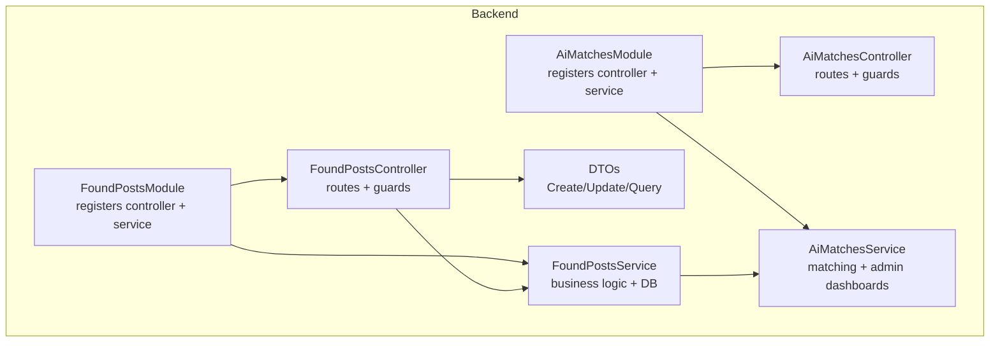
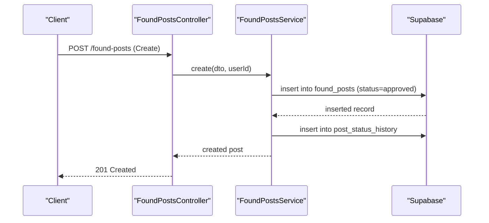
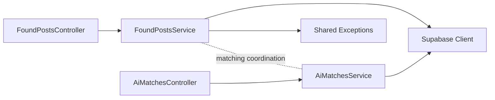

# Found Posts Management

<cite>
**Referenced Files in This Document**
- [found-posts.module.ts](file://backend/src/modules/found-posts/found-posts.module.ts)
- [found-posts.controller.ts](file://backend/src/modules/found-posts/found-posts.controller.ts)
- [found-posts.service.ts](file://backend/src/modules/found-posts/found-posts.service.ts)
- [create-found-post.dto.ts](file://backend/src/modules/found-posts/dto/create-found-post.dto.ts)
- [update-found-post.dto.ts](file://backend/src/modules/found-posts/dto/update-found-post.dto.ts)
- [query-found-posts.dto.ts](file://backend/src/modules/found-posts/dto/query-found-posts.dto.ts)
- [ai-matches.module.ts](file://backend/src/modules/ai-matches/ai-matches.module.ts)
- [ai-matches.controller.ts](file://backend/src/modules/ai-matches/ai-matches.controller.ts)
- [ai-matches.service.ts](file://backend/src/modules/ai-matches/ai-matches.service.ts)
</cite>

## Table of Contents
1. [Introduction](#introduction)
2. [Project Structure](#project-structure)
3. [Core Components](#core-components)
4. [Architecture Overview](#architecture-overview)
5. [Detailed Component Analysis](#detailed-component-analysis)
6. [Dependency Analysis](#dependency-analysis)
7. [Performance Considerations](#performance-considerations)
8. [Troubleshooting Guide](#troubleshooting-guide)
9. [Conclusion](#conclusion)

## Introduction
This document describes the Found Posts Management system, focusing on the complete workflow for reporting found items. It covers post creation (form fields, validation, metadata), approval workflow (admin review, status management), post lifecycle (transitions, audit trail), frontend components (creation/editing/managing), AI matching integration for connecting found posts with potential lost posts, moderation and spam prevention, and administrative oversight.

## Project Structure
The Found Posts module is implemented as a NestJS module with a controller, service, and DTOs. It integrates with Supabase for persistence and interacts with the AI Matching module to surface potential matches for lost posts.

**Diagram sources**
- [found-posts.module.ts:1-11](file://backend/src/modules/found-posts/found-posts.module.ts#L1-L11)
- [found-posts.controller.ts:1-78](file://backend/src/modules/found-posts/found-posts.controller.ts#L1-L78)
- [found-posts.service.ts:1-162](file://backend/src/modules/found-posts/found-posts.service.ts#L1-L162)
- [ai-matches.module.ts:1-11](file://backend/src/modules/ai-matches/ai-matches.module.ts#L1-L11)
- [ai-matches.controller.ts:1-72](file://backend/src/modules/ai-matches/ai-matches.controller.ts#L1-L72)
- [ai-matches.service.ts:1-367](file://backend/src/modules/ai-matches/ai-matches.service.ts#L1-L367)

**Section sources**
- [found-posts.module.ts:1-11](file://backend/src/modules/found-posts/found-posts.module.ts#L1-L11)
- [ai-matches.module.ts:1-11](file://backend/src/modules/ai-matches/ai-matches.module.ts#L1-L11)

## Core Components
- FoundPostsController: Exposes REST endpoints for creating, listing, viewing, updating, deleting found posts, and admin review actions.
- FoundPostsService: Implements business logic for CRUD operations, status updates, permission checks, and audit trail logging.
- DTOs: Define validation rules for create, update, and query operations.
- AiMatchesService: Provides text-based matching between lost and found posts and supports admin dashboards.

Key capabilities:
- Create a found post with title, description, location, time, optional category, images, contact info, and storage flag.
- List public found posts with filtering, pagination, and search.
- View a single found post with user and category details.
- Update or delete posts with ownership/admin checks.
- Admin review to approve/reject posts with reasons and audit history.
- Integration with AI matching to discover potential matches for lost posts.

**Section sources**
- [found-posts.controller.ts:1-78](file://backend/src/modules/found-posts/found-posts.controller.ts#L1-L78)
- [found-posts.service.ts:19-160](file://backend/src/modules/found-posts/found-posts.service.ts#L19-L160)
- [create-found-post.dto.ts:1-48](file://backend/src/modules/found-posts/dto/create-found-post.dto.ts#L1-L48)
- [update-found-post.dto.ts:1-5](file://backend/src/modules/found-posts/dto/update-found-post.dto.ts#L1-L5)
- [query-found-posts.dto.ts:1-36](file://backend/src/modules/found-posts/dto/query-found-posts.dto.ts#L1-L36)
- [ai-matches.service.ts:15-96](file://backend/src/modules/ai-matches/ai-matches.service.ts#L15-L96)

## Architecture Overview
The system follows a layered architecture:
- Controllers handle HTTP requests and apply guards and decorators.
- Services encapsulate domain logic and interact with Supabase.
- DTOs enforce validation at the boundaries.
- AI Matching service provides cross-module integrations for discovery and admin insights.

**Diagram sources**
- [found-posts.controller.ts:24-28](file://backend/src/modules/found-posts/found-posts.controller.ts#L24-L28)
- [found-posts.service.ts:19-38](file://backend/src/modules/found-posts/found-posts.service.ts#L19-L38)

## Detailed Component Analysis

### Found Posts Creation Workflow
- Endpoint: POST /found-posts
- Authentication: JWT required
- Input validation: CreateFoundPostDto enforces field constraints (min/max lengths, date format, UUID, URLs, boolean).
- Behavior: Inserts a new found post with status set to approved and records an initial status history entry.

Validation highlights:
- Title: required, length bounds
- Description: required, length bounds
- Location found: required
- Time found: required date-time
- Category ID: optional UUID
- Image URLs: optional array of valid URLs
- Contact info: optional string
- Storage flag: optional boolean

Metadata captured:
- User ID (from JWT)
- Status: initially approved
- Optional category association
- Optional storage flag

**Section sources**
- [found-posts.controller.ts:24-28](file://backend/src/modules/found-posts/found-posts.controller.ts#L24-L28)
- [create-found-post.dto.ts:7-47](file://backend/src/modules/found-posts/dto/create-found-post.dto.ts#L7-L47)
- [found-posts.service.ts:19-38](file://backend/src/modules/found-posts/found-posts.service.ts#L19-L38)

### Approval Workflow and Admin Review
- Endpoint: POST /admin/found-posts/:id/review
- Guards: JWT + Roles (admin)
- Input: Review action (approve/reject) and optional reason (required for rejection)
- Behavior:
  - Updates post status and reviewer metadata
  - Records status change in post_status_history
  - Reject reason stored when applicable

Status management:
- Initial status: approved
- Admin can set status to approved or rejected
- Rejection requires a reason

Audit trail:
- post_status_history captures post_type, post_id, old/new status, changed_by, and note

**Section sources**
- [found-posts.controller.ts:70-76](file://backend/src/modules/found-posts/found-posts.controller.ts#L70-L76)
- [found-posts.service.ts:117-145](file://backend/src/modules/found-posts/found-posts.service.ts#L117-L145)

### Post Lifecycle and Status Transitions
Lifecycle stages:
- Draft/initial: created with approved status
- Active: visible in public feed
- Pending review: admin-managed state
- Approved: publicly visible
- Rejected: hidden/not visible
- Matched/Closed: managed via AI matching and handover flows

Status transitions:
- Creator: update/delete (ownership checks)
- Admin: review (approve/reject)

Audit trail:
- post_status_history logs all transitions with timestamps and notes

**Section sources**
- [found-posts.service.ts:40-67](file://backend/src/modules/found-posts/found-posts.service.ts#L40-L67)
- [found-posts.service.ts:135-142](file://backend/src/modules/found-posts/found-posts.service.ts#L135-L142)

### Public Feed and Search
- Endpoint: GET /found-posts
- Filters: status, category_id, search term, pagination
- Sorting: newest first
- Projection: includes user and category details for display

**Section sources**
- [found-posts.controller.ts:30-35](file://backend/src/modules/found-posts/found-posts.controller.ts#L30-L35)
- [found-posts.service.ts:40-67](file://backend/src/modules/found-posts/found-posts.service.ts#L40-L67)
- [query-found-posts.dto.ts:5-35](file://backend/src/modules/found-posts/dto/query-found-posts.dto.ts#L5-L35)

### Single Post Retrieval and Views
- Endpoint: GET /found-posts/:id
- Returns post with user and category details
- Increments view_count after retrieval

**Section sources**
- [found-posts.controller.ts:43-48](file://backend/src/modules/found-posts/found-posts.controller.ts#L43-L48)
- [found-posts.service.ts:80-94](file://backend/src/modules/found-posts/found-posts.service.ts#L80-L94)

### My Posts and Ownership Controls
- Endpoint: GET /found-posts/my
- Returns posts owned by the authenticated user
- Update/Delete endpoints enforce ownership or admin role

**Section sources**
- [found-posts.controller.ts:37-41](file://backend/src/modules/found-posts/found-posts.controller.ts#L37-L41)
- [found-posts.service.ts:96-115](file://backend/src/modules/found-posts/found-posts.service.ts#L96-L115)

### AI Matching Integration
The AI Matching module surfaces potential matches between lost and found posts:
- Text-based similarity between lost and found post titles/descriptions
- Stored in ai_matches with confidence scores and match method
- Admin dashboards show statistics and recent activity
- Users can confirm matches from either side (owner or finder)

Integration touchpoints:
- Lost post endpoints can trigger matching
- Found post approvals may influence candidate pool
- Matches support further handover workflows

**Section sources**
- [ai-matches.controller.ts:24-40](file://backend/src/modules/ai-matches/ai-matches.controller.ts#L24-L40)
- [ai-matches.service.ts:15-96](file://backend/src/modules/ai-matches/ai-matches.service.ts#L15-L96)
- [ai-matches.service.ts:156-274](file://backend/src/modules/ai-matches/ai-matches.service.ts#L156-L274)

### Frontend Components and User Experience
While the repository snapshot does not include frontend TypeScript/Next.js files, the backend clearly defines:
- Public feed endpoint for browsing found posts
- My posts endpoint for personal management
- Single post view endpoint
- Admin endpoints for pending reviews and dashboards

Frontend expectations based on backend contracts:
- Found post creation modal/form with validation feedback
- Edit/delete controls for owned posts
- Public feed with search and category filters
- Admin panel for reviewing pending posts and managing status

[No sources needed since this section doesn't analyze specific frontend files]

### Moderation, Spam Prevention, and Content Quality
- Ownership checks prevent unauthorized edits/deletions
- Admin review gate ensures content quality and compliance
- Validation DTOs reduce malformed submissions
- Audit trail enables tracking of changes and decisions
- Admin dashboards provide visibility into system health and trends

**Section sources**
- [found-posts.service.ts:96-115](file://backend/src/modules/found-posts/found-posts.service.ts#L96-L115)
- [found-posts.service.ts:117-145](file://backend/src/modules/found-posts/found-posts.service.ts#L117-L145)
- [create-found-post.dto.ts:7-47](file://backend/src/modules/found-posts/dto/create-found-post.dto.ts#L7-L47)

## Dependency Analysis
FoundPostsModule depends on FoundPostsService, which in turn depends on Supabase client and shared exception types. AiMatchesModule depends on AiMatchesService, which also uses Supabase. FoundPostsService can coordinate with AiMatchesService for matching-related workflows.

**Diagram sources**
- [found-posts.controller.ts:1-78](file://backend/src/modules/found-posts/found-posts.controller.ts#L1-L78)
- [found-posts.service.ts:1-17](file://backend/src/modules/found-posts/found-posts.service.ts#L1-L17)
- [ai-matches.controller.ts:1-72](file://backend/src/modules/ai-matches/ai-matches.controller.ts#L1-L72)
- [ai-matches.service.ts:1-9](file://backend/src/modules/ai-matches/ai-matches.service.ts#L1-L9)

**Section sources**
- [found-posts.module.ts:1-11](file://backend/src/modules/found-posts/found-posts.module.ts#L1-L11)
- [ai-matches.module.ts:1-11](file://backend/src/modules/ai-matches/ai-matches.module.ts#L1-L11)

## Performance Considerations
- Pagination: QueryFoundPostsDto supports page and limit with max limit enforcement.
- Indexing: Ensure database indexes on status, category_id, created_at for efficient queries.
- Selectivity: Use category_id and search filters to narrow result sets.
- Asynchronous operations: Consider background jobs for heavy tasks (e.g., batch matching) to avoid blocking request threads.

[No sources needed since this section provides general guidance]

## Troubleshooting Guide
Common issues and resolutions:
- Validation errors on creation: Ensure title/description meet length requirements, time_found is a valid date-time, image_urls are valid URLs, and category_id is a valid UUID if provided.
- Unauthorized access: Ownership checks require the logged-in user to own the post or be an admin.
- Missing post: findOne throws a not-found error if the post does not exist or status conditions are not met.
- Admin review failures: Rejection requires a reason; otherwise, validation will fail.

**Section sources**
- [create-found-post.dto.ts:7-47](file://backend/src/modules/found-posts/dto/create-found-post.dto.ts#L7-L47)
- [found-posts.service.ts:96-115](file://backend/src/modules/found-posts/found-posts.service.ts#L96-L115)
- [found-posts.service.ts:117-121](file://backend/src/modules/found-posts/found-posts.service.ts#L117-L121)

## Conclusion
The Found Posts Management system provides a robust foundation for users to report found items and for administrators to moderate content. It emphasizes strong validation, clear ownership semantics, and an audit trail. Integration with the AI Matching module enables intelligent discovery of potential matches, supporting a complete lifecycle from creation to resolution. Administrators benefit from dashboards and centralized management tools to oversee system health and content quality.