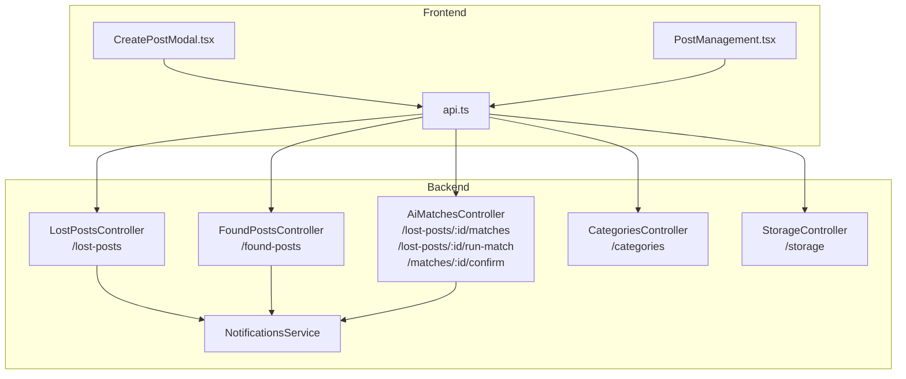
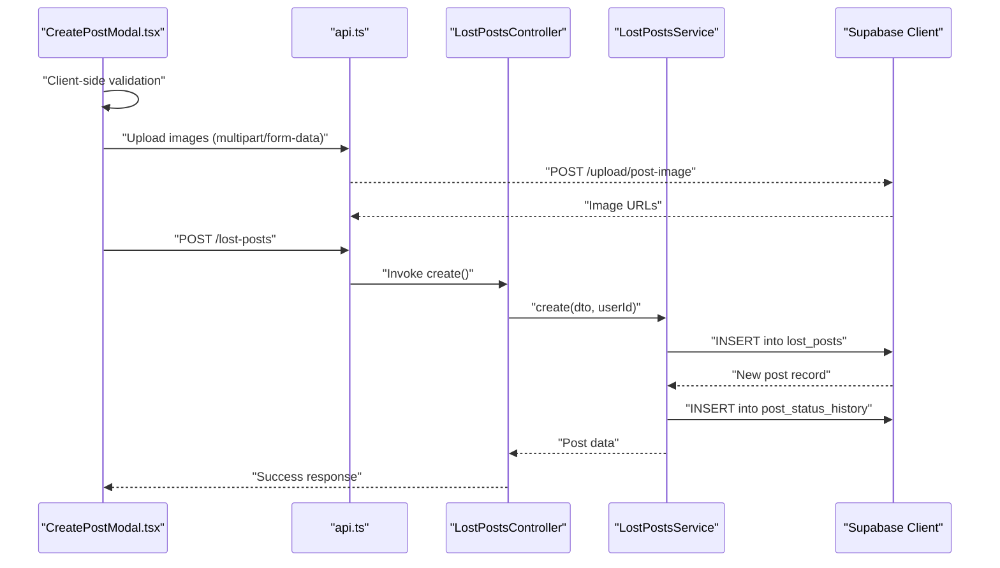
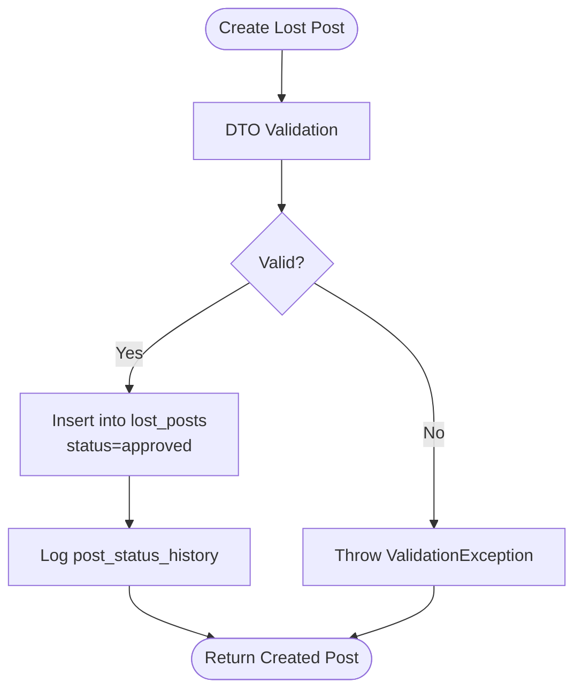
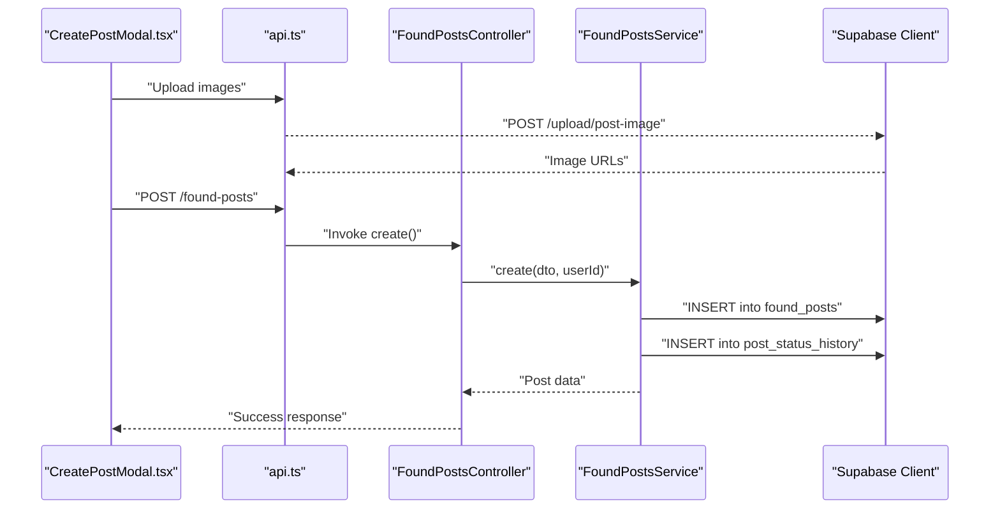
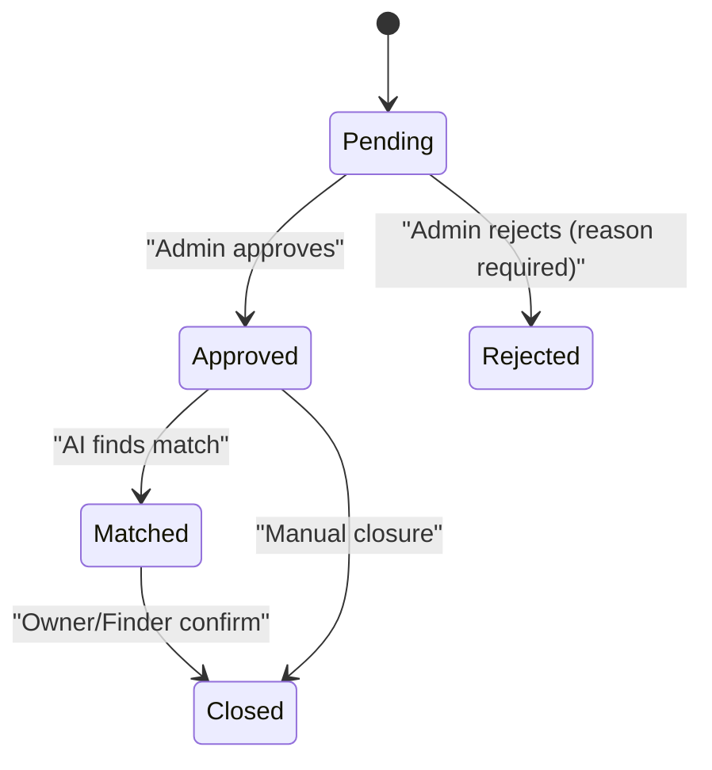
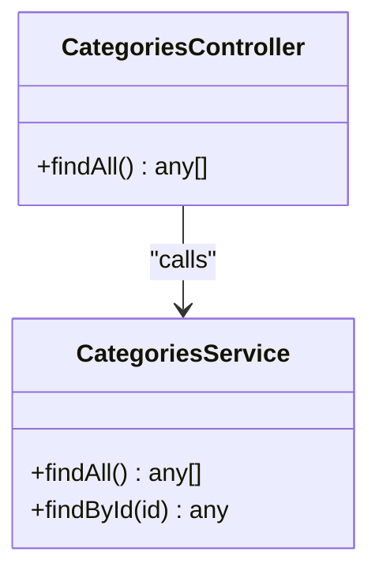
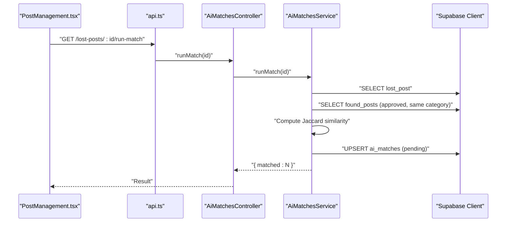
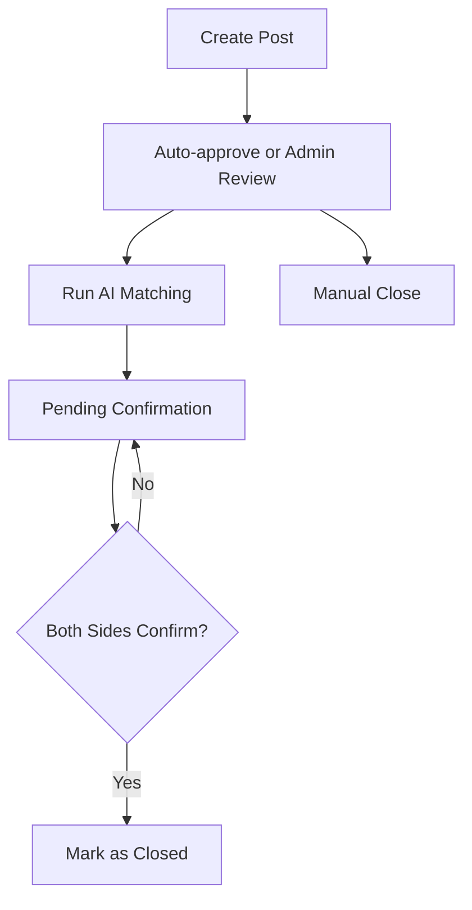
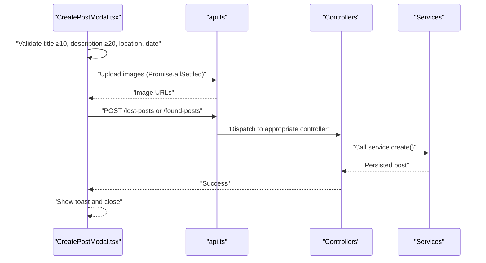
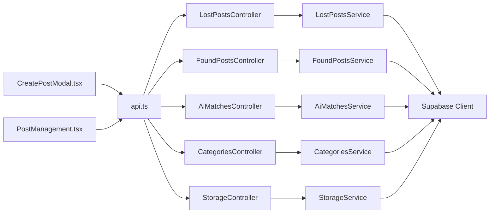

# Lost & Found Posting System

<cite>
**Referenced Files in This Document**
- [lost-posts.controller.ts](file://backend/src/modules/lost-posts/lost-posts.controller.ts)
- [found-posts.controller.ts](file://backend/src/modules/found-posts/found-posts.controller.ts)
- [ai-matches.controller.ts](file://backend/src/modules/ai-matches/ai-matches.controller.ts)
- [categories.controller.ts](file://backend/src/modules/categories/categories.controller.ts)
- [lost-posts.service.ts](file://backend/src/modules/lost-posts/lost-posts.service.ts)
- [found-posts.service.ts](file://backend/src/modules/found-posts/found-posts.service.ts)
- [ai-matches.service.ts](file://backend/src/modules/ai-matches/ai-matches.service.ts)
- [categories.service.ts](file://backend/src/modules/categories/categories.service.ts)
- [notifications.service.ts](file://backend/src/modules/notifications/notifications.service.ts)
- [create-lost-post.dto.ts](file://backend/src/modules/lost-posts/dto/create-lost-post.dto.ts)
- [update-lost-post.dto.ts](file://backend/src/modules/lost-posts/dto/update-lost-post.dto.ts)
- [review-post.dto.ts](file://backend/src/modules/lost-posts/dto/review-post.dto.ts)
- [create-found-post.dto.ts](file://backend/src/modules/found-posts/dto/create-found-post.dto.ts)
- [update-found-post.dto.ts](file://backend/src/modules/found-posts/dto/update-found-post.dto.ts)
- [storage.controller.ts](file://backend/src/modules/storage/storage.controller.ts)
- [CreatePostModal.tsx](file://frontend/app/components/CreatePostModal.tsx)
- [PostManagement.tsx](file://frontend/app/admin/post-management/PostManagement.tsx)
- [api.ts](file://frontend/app/lib/api.ts)
</cite>

## Table of Contents
1. [Introduction](#introduction)
2. [Project Structure](#project-structure)
3. [Core Components](#core-components)
4. [Architecture Overview](#architecture-overview)
5. [Detailed Component Analysis](#detailed-component-analysis)
6. [Dependency Analysis](#dependency-analysis)
7. [Performance Considerations](#performance-considerations)
8. [Troubleshooting Guide](#troubleshooting-guide)
9. [Conclusion](#conclusion)
10. [Appendices](#appendices)

## Introduction
This document describes the Lost & Found Posting System with a focus on content creation and management. It covers the end-to-end workflow for creating lost and found posts, form validation, image uploads, metadata collection, approval workflows, status management, category classification, AI-driven matching, and administrative oversight. It also documents the user interface components for post creation, editing, and management, and outlines moderation and content quality assurance practices.

## Project Structure
The system is organized into backend NestJS modules and a frontend Next.js application:
- Backend modules:
  - Lost posts and found posts controllers/services for CRUD and review
  - AI matches controller/service for text-based matching and confirmation
  - Categories module for item classification
  - Notifications module for user alerts
  - Storage module for centralized item storage
- Frontend components:
  - CreatePostModal for post creation
  - PostManagement for admin oversight and filtering
  - API helpers for authenticated requests and uploads

**Diagram sources**
- [lost-posts.controller.ts:24-76](file://backend/src/modules/lost-posts/lost-posts.controller.ts#L24-L76)
- [found-posts.controller.ts:24-76](file://backend/src/modules/found-posts/found-posts.controller.ts#L24-L76)
- [ai-matches.controller.ts:24-70](file://backend/src/modules/ai-matches/ai-matches.controller.ts#L24-L70)
- [categories.controller.ts:11-16](file://backend/src/modules/categories/categories.controller.ts#L11-L16)
- [storage.controller.ts:18-58](file://backend/src/modules/storage/storage.controller.ts#L18-L58)
- [CreatePostModal.tsx:135-238](file://frontend/app/components/CreatePostModal.tsx#L135-L238)
- [PostManagement.tsx:53-151](file://frontend/app/admin/post-management/PostManagement.tsx#L53-L151)
- [api.ts:12-43](file://frontend/app/lib/api.ts#L12-L43)

**Section sources**
- [lost-posts.controller.ts:1-78](file://backend/src/modules/lost-posts/lost-posts.controller.ts#L1-L78)
- [found-posts.controller.ts:1-78](file://backend/src/modules/found-posts/found-posts.controller.ts#L1-L78)
- [ai-matches.controller.ts:1-72](file://backend/src/modules/ai-matches/ai-matches.controller.ts#L1-L72)
- [categories.controller.ts:1-18](file://backend/src/modules/categories/categories.controller.ts#L1-L18)
- [storage.controller.ts:1-60](file://backend/src/modules/storage/storage.controller.ts#L1-L60)
- [CreatePostModal.tsx:1-584](file://frontend/app/components/CreatePostModal.tsx#L1-L584)
- [PostManagement.tsx:1-698](file://frontend/app/admin/post-management/PostManagement.tsx#L1-L698)
- [api.ts:1-83](file://frontend/app/lib/api.ts#L1-L83)

## Core Components
- Lost Posts Module
  - Controllers expose endpoints for creating, listing, viewing, updating, deleting, and admin reviewing lost posts.
  - Services implement validation, status history logging, and permission checks.
- Found Posts Module
  - Mirrors lost posts with similar CRUD and admin review capabilities.
- AI Matches Module
  - Provides endpoints to list matches, run text similarity matching, and confirm matches from owner or finder perspectives.
  - Implements Jaccard similarity scoring and status transitions.
- Categories Module
  - Exposes active categories for classification during post creation.
- Notifications Module
  - Manages user notifications for approvals, rejections, matches, and other events.
- Storage Module
  - Supports storage locations and items, enabling centralized handling for found items.
- Frontend Modules
  - CreatePostModal handles form validation, image uploads, and submission.
  - PostManagement provides admin dashboards, filtering, and bulk actions.

**Section sources**
- [lost-posts.controller.ts:24-76](file://backend/src/modules/lost-posts/lost-posts.controller.ts#L24-L76)
- [found-posts.controller.ts:24-76](file://backend/src/modules/found-posts/found-posts.controller.ts#L24-L76)
- [ai-matches.controller.ts:24-70](file://backend/src/modules/ai-matches/ai-matches.controller.ts#L24-L70)
- [categories.controller.ts:11-16](file://backend/src/modules/categories/categories.controller.ts#L11-L16)
- [notifications.service.ts:15-80](file://backend/src/modules/notifications/notifications.service.ts#L15-L80)
- [storage.controller.ts:18-58](file://backend/src/modules/storage/storage.controller.ts#L18-L58)
- [CreatePostModal.tsx:135-238](file://frontend/app/components/CreatePostModal.tsx#L135-L238)
- [PostManagement.tsx:53-151](file://frontend/app/admin/post-management/PostManagement.tsx#L53-L151)

## Architecture Overview
The system follows a layered architecture:
- Presentation Layer (Next.js)
  - Components render forms, lists, and admin dashboards.
  - API helper manages authentication and HTTP requests.
- Application Layer (NestJS)
  - Controllers define endpoints and orchestrate use cases.
  - Services encapsulate business logic, validation, and persistence.
- Data Access (Supabase)
  - Services query and mutate data via Supabase client.

**Diagram sources**
- [CreatePostModal.tsx:135-238](file://frontend/app/components/CreatePostModal.tsx#L135-L238)
- [api.ts:48-82](file://frontend/app/lib/api.ts#L48-L82)
- [lost-posts.controller.ts:24-28](file://backend/src/modules/lost-posts/lost-posts.controller.ts#L24-L28)
- [lost-posts.service.ts:19-43](file://backend/src/modules/lost-posts/lost-posts.service.ts#L19-L43)

## Detailed Component Analysis

### Lost Posts Workflow
- Creation
  - DTO enforces title length, description length, location, time, optional category, images, contact info, urgency flag, and reward note.
  - Service inserts post with initial status and logs status history.
- Listing and Filtering
  - Supports pagination, category filter, and search by title.
- Viewing
  - Increments view count and returns post with author and category details.
- Editing and Deletion
  - Enforces ownership and status constraints; admins can override restrictions.
- Admin Review
  - Approve or reject with reason required for rejections; updates status and logs history.

**Diagram sources**
- [create-lost-post.dto.ts:14-60](file://backend/src/modules/lost-posts/dto/create-lost-post.dto.ts#L14-L60)
- [lost-posts.service.ts:19-43](file://backend/src/modules/lost-posts/lost-posts.service.ts#L19-L43)

**Section sources**
- [create-lost-post.dto.ts:14-60](file://backend/src/modules/lost-posts/dto/create-lost-post.dto.ts#L14-L60)
- [update-lost-post.dto.ts:1-5](file://backend/src/modules/lost-posts/dto/update-lost-post.dto.ts#L1-L5)
- [review-post.dto.ts:4-13](file://backend/src/modules/lost-posts/dto/review-post.dto.ts#L4-L13)
- [lost-posts.controller.ts:24-76](file://backend/src/modules/lost-posts/lost-posts.controller.ts#L24-L76)
- [lost-posts.service.ts:19-187](file://backend/src/modules/lost-posts/lost-posts.service.ts#L19-L187)

### Found Posts Workflow
- Creation mirrors lost posts with category, images, contact info, and storage flag.
- Listing, viewing, editing, deletion, and admin review follow the same pattern as lost posts.

**Diagram sources**
- [CreatePostModal.tsx:196-222](file://frontend/app/components/CreatePostModal.tsx#L196-L222)
- [found-posts.controller.ts:24-28](file://backend/src/modules/found-posts/found-posts.controller.ts#L24-L28)
- [found-posts.service.ts:19-38](file://backend/src/modules/found-posts/found-posts.service.ts#L19-L38)

**Section sources**
- [create-found-post.dto.ts:7-48](file://backend/src/modules/found-posts/dto/create-found-post.dto.ts#L7-L48)
- [update-found-post.dto.ts:1-5](file://backend/src/modules/found-posts/dto/update-found-post.dto.ts#L1-L5)
- [found-posts.controller.ts:24-76](file://backend/src/modules/found-posts/found-posts.controller.ts#L24-L76)
- [found-posts.service.ts:19-160](file://backend/src/modules/found-posts/found-posts.service.ts#L19-L160)

### Approval Workflow and Status Management
- Initial status is approved for newly created posts.
- Admin endpoints allow reviewing pending posts with approve/reject actions.
- Rejection requires a reason; both actions update status and log history.
- Statuses include pending, approved, rejected, matched, closed.

**Diagram sources**
- [lost-posts.service.ts:139-171](file://backend/src/modules/lost-posts/lost-posts.service.ts#L139-L171)
- [found-posts.service.ts:117-145](file://backend/src/modules/found-posts/found-posts.service.ts#L117-L145)
- [ai-matches.service.ts:101-141](file://backend/src/modules/ai-matches/ai-matches.service.ts#L101-L141)

**Section sources**
- [lost-posts.service.ts:139-187](file://backend/src/modules/lost-posts/lost-posts.service.ts#L139-L187)
- [found-posts.service.ts:117-160](file://backend/src/modules/found-posts/found-posts.service.ts#L117-L160)

### Category Classification and Automatic Categorization
- Categories are fetched from the categories endpoint and presented in the post creation modal.
- Posts optionally include a category_id; otherwise, they remain uncategorized.
- Automatic categorization is not implemented in the provided code; category selection is manual.

**Diagram sources**
- [categories.controller.ts:11-16](file://backend/src/modules/categories/categories.controller.ts#L11-L16)
- [categories.service.ts:10-31](file://backend/src/modules/categories/categories.service.ts#L10-L31)

**Section sources**
- [categories.controller.ts:11-16](file://backend/src/modules/categories/categories.controller.ts#L11-L16)
- [categories.service.ts:10-31](file://backend/src/modules/categories/categories.service.ts#L10-L31)
- [create-lost-post.dto.ts:34-37](file://backend/src/modules/lost-posts/dto/create-lost-post.dto.ts#L34-L37)
- [create-found-post.dto.ts:27-30](file://backend/src/modules/found-posts/dto/create-found-post.dto.ts#L27-L30)

### AI Matching System
- Text-based matching compares title and description after normalization.
- Computes Jaccard similarity; stores matches with pending status.
- Owner or finder can confirm matches; both sides required for final confirmation.
- Admin dashboard aggregates statistics and recent activity.

**Diagram sources**
- [PostManagement.tsx:53-75](file://frontend/app/admin/post-management/PostManagement.tsx#L53-L75)
- [ai-matches.controller.ts:30-34](file://backend/src/modules/ai-matches/ai-matches.controller.ts#L30-L34)
- [ai-matches.service.ts:45-96](file://backend/src/modules/ai-matches/ai-matches.service.ts#L45-L96)

**Section sources**
- [ai-matches.controller.ts:24-40](file://backend/src/modules/ai-matches/ai-matches.controller.ts#L24-L40)
- [ai-matches.service.ts:15-153](file://backend/src/modules/ai-matches/ai-matches.service.ts#L15-L153)

### Post Lifecycle and Audit Trails
- Lifecycle: created -> approved -> matched (optional) -> closed.
- Status history is logged for all status changes, including admin reviews and match confirmations.
- View counts are incremented upon post retrieval.

**Diagram sources**
- [lost-posts.service.ts:32-40](file://backend/src/modules/lost-posts/lost-posts.service.ts#L32-L40)
- [found-posts.service.ts:28-35](file://backend/src/modules/found-posts/found-posts.service.ts#L28-L35)
- [ai-matches.service.ts:120-141](file://backend/src/modules/ai-matches/ai-matches.service.ts#L120-L141)

**Section sources**
- [lost-posts.service.ts:32-40](file://backend/src/modules/lost-posts/lost-posts.service.ts#L32-L40)
- [found-posts.service.ts:28-35](file://backend/src/modules/found-posts/found-posts.service.ts#L28-L35)
- [ai-matches.service.ts:120-141](file://backend/src/modules/ai-matches/ai-matches.service.ts#L120-L141)

### User Interface Components
- CreatePostModal
  - Handles toggling between lost and found posts, collects metadata, validates inputs, supports drag-and-drop image uploads, and submits to backend.
  - Integrates with geolocation hook to populate location.
- PostManagement
  - Admin dashboard with filtering by type, status, and search; live pending count; pagination; and action buttons for approve, reject, and delete.

**Diagram sources**
- [CreatePostModal.tsx:135-238](file://frontend/app/components/CreatePostModal.tsx#L135-L238)
- [api.ts:12-43](file://frontend/app/lib/api.ts#L12-L43)
- [lost-posts.controller.ts:24-28](file://backend/src/modules/lost-posts/lost-posts.controller.ts#L24-L28)
- [found-posts.controller.ts:24-28](file://backend/src/modules/found-posts/found-posts.controller.ts#L24-L28)

**Section sources**
- [CreatePostModal.tsx:135-238](file://frontend/app/components/CreatePostModal.tsx#L135-L238)
- [PostManagement.tsx:53-151](file://frontend/app/admin/post-management/PostManagement.tsx#L53-L151)
- [api.ts:12-82](file://frontend/app/lib/api.ts#L12-L82)

### Moderation, Spam Prevention, and Quality Assurance
- Admin review ensures content quality and compliance before public visibility.
- Rejection requires a reason, improving transparency and moderation consistency.
- Status history provides audit trails for all changes.
- Frontend enforces basic client-side validation to reduce invalid submissions.
- Optional storage flag for found posts integrates with the storage module for centralized handling.

**Section sources**
- [lost-posts.service.ts:139-171](file://backend/src/modules/lost-posts/lost-posts.service.ts#L139-L171)
- [found-posts.service.ts:117-145](file://backend/src/modules/found-posts/found-posts.service.ts#L117-L145)
- [CreatePostModal.tsx:138-154](file://frontend/app/components/CreatePostModal.tsx#L138-L154)

## Dependency Analysis
- Controllers depend on services for business logic.
- Services depend on Supabase client for database operations.
- Frontend components depend on API helper for authenticated requests.
- AI matches service depends on text similarity computation and database upserts.

**Diagram sources**
- [lost-posts.controller.ts:1-78](file://backend/src/modules/lost-posts/lost-posts.controller.ts#L1-L78)
- [found-posts.controller.ts:1-78](file://backend/src/modules/found-posts/found-posts.controller.ts#L1-L78)
- [ai-matches.controller.ts:1-72](file://backend/src/modules/ai-matches/ai-matches.controller.ts#L1-L72)
- [categories.controller.ts:1-18](file://backend/src/modules/categories/categories.controller.ts#L1-L18)
- [storage.controller.ts:1-60](file://backend/src/modules/storage/storage.controller.ts#L1-L60)
- [CreatePostModal.tsx:1-584](file://frontend/app/components/CreatePostModal.tsx#L1-L584)
- [PostManagement.tsx:1-698](file://frontend/app/admin/post-management/PostManagement.tsx#L1-L698)
- [api.ts:1-83](file://frontend/app/lib/api.ts#L1-L83)

**Section sources**
- [lost-posts.service.ts:1-18](file://backend/src/modules/lost-posts/lost-posts.service.ts#L1-L18)
- [found-posts.service.ts:1-18](file://backend/src/modules/found-posts/found-posts.service.ts#L1-L18)
- [ai-matches.service.ts:1-10](file://backend/src/modules/ai-matches/ai-matches.service.ts#L1-L10)
- [categories.service.ts:1-8](file://backend/src/modules/categories/categories.service.ts#L1-L8)
- [storage.controller.ts:1-60](file://backend/src/modules/storage/storage.controller.ts#L1-L60)

## Performance Considerations
- Image uploads use concurrent promises with progress tracking; consider chunked uploads for large files.
- Pagination is implemented server-side; ensure indexes exist on frequently filtered columns (status, category_id, created_at).
- AI matching computes Jaccard similarity across candidate sets; consider batching or caching for large datasets.
- View count increments are fire-and-forget; ensure eventual consistency if real-time accuracy is required.

## Troubleshooting Guide
- Authentication failures
  - API helper redirects to login on 401; verify token presence and expiration.
- Upload failures
  - Check network errors and unauthorized responses; frontend handles token refresh prompts.
- Validation errors
  - DTO constraints enforce minimum lengths and formats; ensure client-side validation aligns with server-side rules.
- Admin review errors
  - Rejection requires a reason; ensure reason field is present when rejecting posts.
- Status history discrepancies
  - Verify post_status_history insertions occur on all status changes.

**Section sources**
- [api.ts:30-43](file://frontend/app/lib/api.ts#L30-L43)
- [CreatePostModal.tsx:182-194](file://frontend/app/components/CreatePostModal.tsx#L182-L194)
- [lost-posts.service.ts:142-144](file://backend/src/modules/lost-posts/lost-posts.service.ts#L142-L144)
- [found-posts.service.ts:119-121](file://backend/src/modules/found-posts/found-posts.service.ts#L119-L121)

## Conclusion
The Lost & Found Posting System provides a robust foundation for managing lost and found posts with strong validation, admin oversight, and an AI-powered matching mechanism. The frontend components offer intuitive creation and management experiences, while the backend services ensure data integrity and auditability. Extending automatic categorization and enhancing moderation workflows would further improve system maturity.

## Appendices

### Example Post Types and Common Use Cases
- Lost Post
  - Example: “Lost black backpack at library”
  - Metadata: title, description, location_lost, time_lost, category_id, image_urls, contact_info, is_urgent, reward_note
- Found Post
  - Example: “Found wallet at back field”
  - Metadata: title, description, location_found, time_found, category_id, image_urls, contact_info, is_in_storage

**Section sources**
- [create-lost-post.dto.ts:14-60](file://backend/src/modules/lost-posts/dto/create-lost-post.dto.ts#L14-L60)
- [create-found-post.dto.ts:7-48](file://backend/src/modules/found-posts/dto/create-found-post.dto.ts#L7-L48)

### Administrative Oversight Procedures
- Review pending posts via admin endpoints.
- Approve or reject with required reasons for rejections.
- Monitor dashboard statistics and recent activity.
- Manage storage items and locations for found items.

**Section sources**
- [lost-posts.controller.ts:62-76](file://backend/src/modules/lost-posts/lost-posts.controller.ts#L62-L76)
- [found-posts.controller.ts:62-76](file://backend/src/modules/found-posts/found-posts.controller.ts#L62-L76)
- [PostManagement.tsx:78-93](file://frontend/app/admin/post-management/PostManagement.tsx#L78-L93)
- [storage.controller.ts:18-58](file://backend/src/modules/storage/storage.controller.ts#L18-L58)