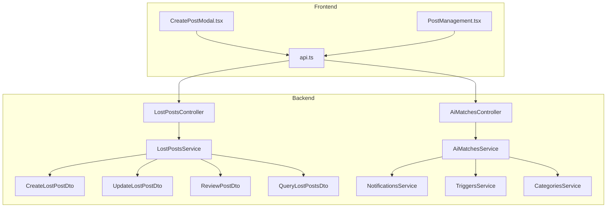
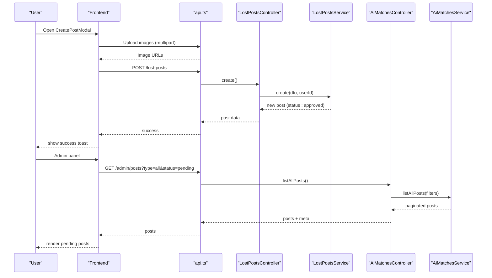
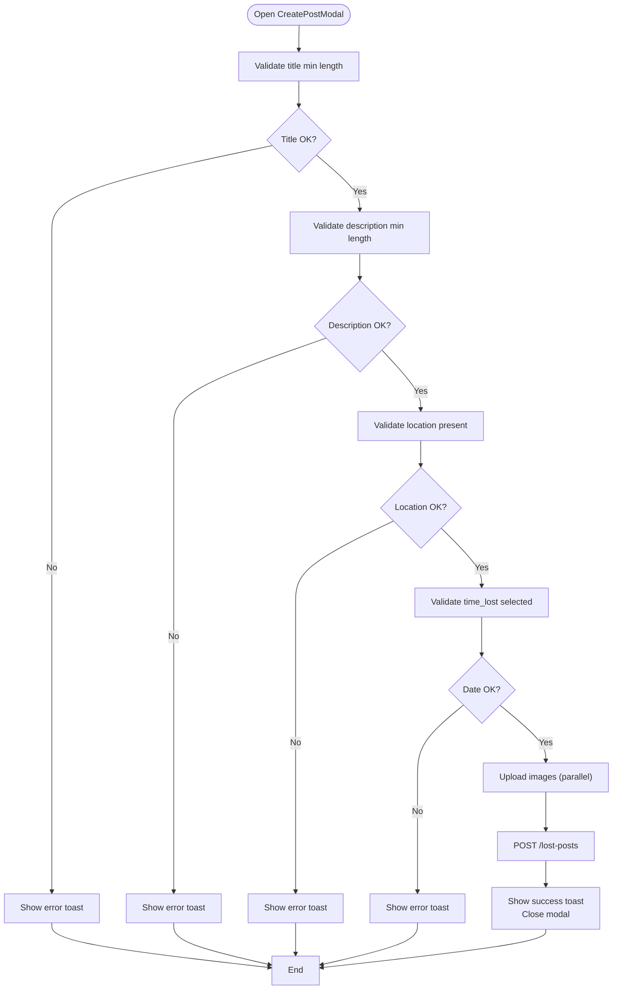
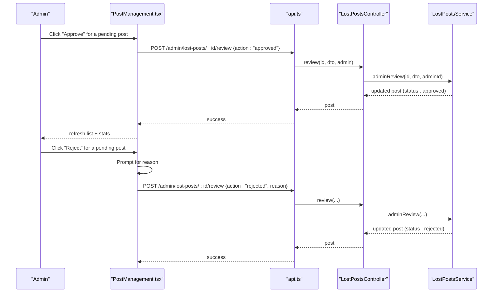
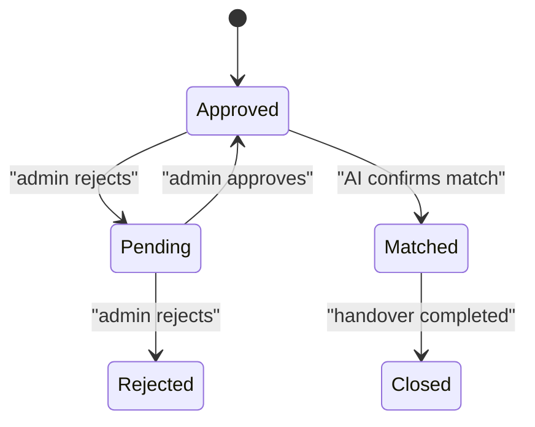
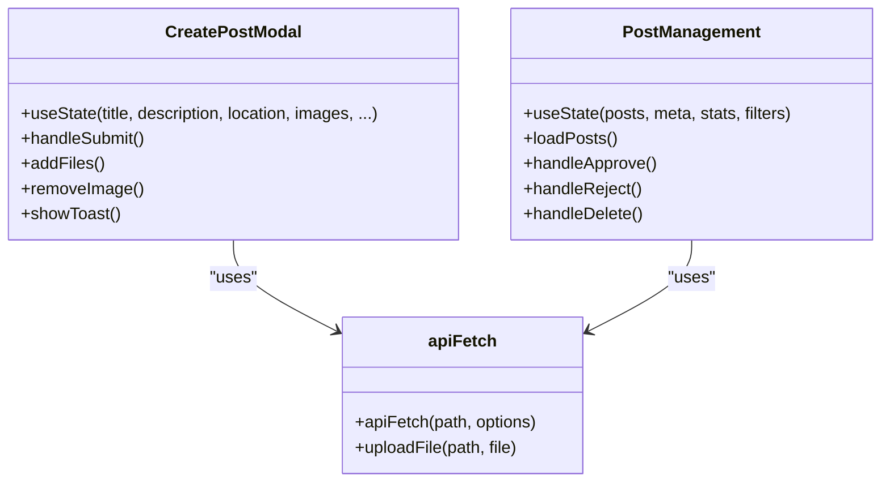
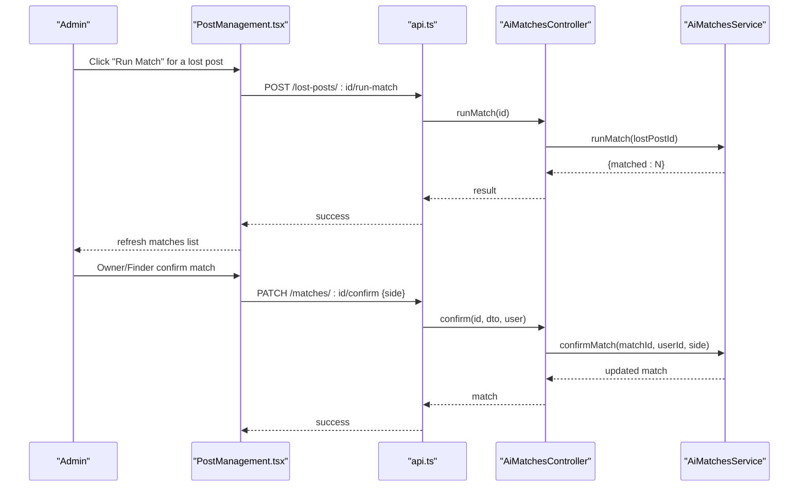
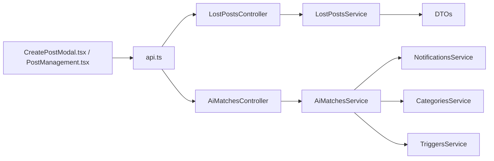

# Lost Posts Management

<cite>
**Referenced Files in This Document**
- [lost-posts.controller.ts](file://backend/src/modules/lost-posts/lost-posts.controller.ts)
- [lost-posts.service.ts](file://backend/src/modules/lost-posts/lost-posts.service.ts)
- [create-lost-post.dto.ts](file://backend/src/modules/lost-posts/dto/create-lost-post.dto.ts)
- [update-lost-post.dto.ts](file://backend/src/modules/lost-posts/dto/update-lost-post.dto.ts)
- [review-post.dto.ts](file://backend/src/modules/lost-posts/dto/review-post.dto.ts)
- [query-lost-posts.dto.ts](file://backend/src/modules/lost-posts/dto/query-lost-posts.dto.ts)
- [ai-matches.controller.ts](file://backend/src/modules/ai-matches/ai-matches.controller.ts)
- [ai-matches.service.ts](file://backend/src/modules/ai-matches/ai-matches.service.ts)
- [notifications.service.ts](file://backend/src/modules/notifications/notifications.service.ts)
- [triggers.service.ts](file://backend/src/modules/triggers/triggers.service.ts)
- [categories.service.ts](file://backend/src/modules/categories/categories.service.ts)
- [CreatePostModal.tsx](file://frontend/app/components/CreatePostModal.tsx)
- [PostManagement.tsx](file://frontend/app/admin/post-management/PostManagement.tsx)
- [api.ts](file://frontend/app/lib/api.ts)
</cite>

## Table of Contents
1. [Introduction](#introduction)
2. [Project Structure](#project-structure)
3. [Core Components](#core-components)
4. [Architecture Overview](#architecture-overview)
5. [Detailed Component Analysis](#detailed-component-analysis)
6. [Dependency Analysis](#dependency-analysis)
7. [Performance Considerations](#performance-considerations)
8. [Troubleshooting Guide](#troubleshooting-guide)
9. [Conclusion](#conclusion)
10. [Appendices](#appendices)

## Introduction
This document describes the Lost Posts Management system with a focus on the complete workflow for reporting lost items. It covers post creation (fields, validation, metadata), approval workflow (admin review, statuses), post lifecycle (transitions, audit trails), frontend components (creation/editing/management), AI matching integration, moderation and spam prevention, and administrative oversight.

## Project Structure
The system is split into:
- Backend NestJS modules for lost posts, AI matching, notifications, triggers, categories, uploads, and more.
- Frontend Next.js app with components for creating posts, viewing feeds, managing posts, and admin dashboards.

**Diagram sources**
- [lost-posts.controller.ts:1-78](file://backend/src/modules/lost-posts/lost-posts.controller.ts#L1-L78)
- [lost-posts.service.ts:1-189](file://backend/src/modules/lost-posts/lost-posts.service.ts#L1-L189)
- [create-lost-post.dto.ts:1-61](file://backend/src/modules/lost-posts/dto/create-lost-post.dto.ts#L1-L61)
- [update-lost-post.dto.ts:1-5](file://backend/src/modules/lost-posts/dto/update-lost-post.dto.ts#L1-L5)
- [review-post.dto.ts:1-14](file://backend/src/modules/lost-posts/dto/review-post.dto.ts#L1-L14)
- [query-lost-posts.dto.ts:1-36](file://backend/src/modules/lost-posts/dto/query-lost-posts.dto.ts#L1-L36)
- [ai-matches.controller.ts:1-72](file://backend/src/modules/ai-matches/ai-matches.controller.ts#L1-L72)
- [ai-matches.service.ts:1-367](file://backend/src/modules/ai-matches/ai-matches.service.ts#L1-L367)
- [notifications.service.ts:1-82](file://backend/src/modules/notifications/notifications.service.ts#L1-L82)
- [triggers.service.ts:1-163](file://backend/src/modules/triggers/triggers.service.ts#L1-L163)
- [categories.service.ts:1-32](file://backend/src/modules/categories/categories.service.ts#L1-L32)
- [CreatePostModal.tsx:1-584](file://frontend/app/components/CreatePostModal.tsx#L1-L584)
- [PostManagement.tsx:1-698](file://frontend/app/admin/post-management/PostManagement.tsx#L1-L698)
- [api.ts:1-83](file://frontend/app/lib/api.ts#L1-L83)

**Section sources**
- [lost-posts.controller.ts:1-78](file://backend/src/modules/lost-posts/lost-posts.controller.ts#L1-L78)
- [ai-matches.controller.ts:1-72](file://backend/src/modules/ai-matches/ai-matches.controller.ts#L1-L72)
- [CreatePostModal.tsx:1-584](file://frontend/app/components/CreatePostModal.tsx#L1-L584)
- [PostManagement.tsx:1-698](file://frontend/app/admin/post-management/PostManagement.tsx#L1-L698)
- [api.ts:1-83](file://frontend/app/lib/api.ts#L1-L83)

## Core Components
- Lost Posts Controller and Service: expose endpoints for creating, querying, updating, deleting, and admin reviewing lost posts; manage statuses and audit trails.
- DTOs: define strict validation rules for post creation, updates, queries, and admin reviews.
- AI Matches Controller and Service: expose endpoints to list and run text-based matches for lost posts against found posts; support owner/founder confirmations.
- Notifications Service: manage user notifications for approvals, rejections, matches, and other events.
- Triggers Service: manage point-based triggers for handovers and confirmations.
- Categories Service: provide item categories for classification.
- Frontend Components: CreatePostModal for user post creation; PostManagement for admin oversight.

**Section sources**
- [lost-posts.service.ts:1-189](file://backend/src/modules/lost-posts/lost-posts.service.ts#L1-L189)
- [create-lost-post.dto.ts:1-61](file://backend/src/modules/lost-posts/dto/create-lost-post.dto.ts#L1-L61)
- [update-lost-post.dto.ts:1-5](file://backend/src/modules/lost-posts/dto/update-lost-post.dto.ts#L1-L5)
- [review-post.dto.ts:1-14](file://backend/src/modules/lost-posts/dto/review-post.dto.ts#L1-L14)
- [query-lost-posts.dto.ts:1-36](file://backend/src/modules/lost-posts/dto/query-lost-posts.dto.ts#L1-L36)
- [ai-matches.service.ts:1-367](file://backend/src/modules/ai-matches/ai-matches.service.ts#L1-L367)
- [notifications.service.ts:1-82](file://backend/src/modules/notifications/notifications.service.ts#L1-L82)
- [triggers.service.ts:1-163](file://backend/src/modules/triggers/triggers.service.ts#L1-L163)
- [categories.service.ts:1-32](file://backend/src/modules/categories/categories.service.ts#L1-L32)
- [CreatePostModal.tsx:1-584](file://frontend/app/components/CreatePostModal.tsx#L1-L584)
- [PostManagement.tsx:1-698](file://frontend/app/admin/post-management/PostManagement.tsx#L1-L698)

## Architecture Overview
The system follows a layered backend/frontend design:
- Frontend communicates with backend via authenticated API calls.
- Backend services interact with Supabase for persistence and real-time-like behavior.
- AI matching runs text similarity between lost and found posts.
- Admin workflows are role-gated and surfaced in the admin panel.

**Diagram sources**
- [CreatePostModal.tsx:135-238](file://frontend/app/components/CreatePostModal.tsx#L135-L238)
- [api.ts:12-43](file://frontend/app/lib/api.ts#L12-L43)
- [lost-posts.controller.ts:24-28](file://backend/src/modules/lost-posts/lost-posts.controller.ts#L24-L28)
- [lost-posts.service.ts:19-43](file://backend/src/modules/lost-posts/lost-posts.service.ts#L19-L43)
- [ai-matches.controller.ts:58-70](file://backend/src/modules/ai-matches/ai-matches.controller.ts#L58-L70)
- [ai-matches.service.ts:276-366](file://backend/src/modules/ai-matches/ai-matches.service.ts#L276-L366)

## Detailed Component Analysis

### Lost Post Creation Workflow
- Form fields and metadata:
  - Title, description, location_lost, time_lost, category_id, image_urls, contact_info, is_urgent, reward_note.
  - Validation enforces minimum lengths, date format, optional UUID/category, URL arrays, booleans, and max length for reward note.
- Backend creation:
  - Inserts into lost_posts with status set to approved by default.
  - Logs status history with note “new post”.
- Frontend creation:
  - Client-side validation mirrors server rules.
  - Uploads images in parallel, tracks progress, and submits post payload.
  - Uses apiFetch with bearer token and handles unauthorized redirects.

**Diagram sources**
- [CreatePostModal.tsx:135-238](file://frontend/app/components/CreatePostModal.tsx#L135-L238)
- [create-lost-post.dto.ts:14-60](file://backend/src/modules/lost-posts/dto/create-lost-post.dto.ts#L14-L60)

**Section sources**
- [create-lost-post.dto.ts:1-61](file://backend/src/modules/lost-posts/dto/create-lost-post.dto.ts#L1-L61)
- [lost-posts.service.ts:19-43](file://backend/src/modules/lost-posts/lost-posts.service.ts#L19-L43)
- [CreatePostModal.tsx:135-238](file://frontend/app/components/CreatePostModal.tsx#L135-L238)
- [api.ts:12-43](file://frontend/app/lib/api.ts#L12-L43)

### Approval Workflow and Admin Review
- Endpoints:
  - Public feed retrieval by status, category, and search.
  - My posts listing.
  - Single post retrieval with view count increment.
  - Update/delete with ownership and status checks.
  - Admin endpoints: list pending lost posts and approve/reject with reason.
- Status management:
  - Initial status is approved upon creation.
  - Admin can change status to approved or rejected; rejection requires a reason.
  - Status history is logged with old/new status and admin note.
- Frontend admin:
  - Admin dashboard lists posts with filters and actions (approve, reject, delete).
  - Enhanced dashboard shows stats, top categories, and recent activity.

**Diagram sources**
- [PostManagement.tsx:96-136](file://frontend/app/admin/post-management/PostManagement.tsx#L96-L136)
- [lost-posts.controller.ts:70-76](file://backend/src/modules/lost-posts/lost-posts.controller.ts#L70-L76)
- [lost-posts.service.ts:139-171](file://backend/src/modules/lost-posts/lost-posts.service.ts#L139-L171)

**Section sources**
- [lost-posts.controller.ts:62-76](file://backend/src/modules/lost-posts/lost-posts.controller.ts#L62-L76)
- [lost-posts.service.ts:139-171](file://backend/src/modules/lost-posts/lost-posts.service.ts#L139-L171)
- [PostManagement.tsx:96-136](file://frontend/app/admin/post-management/PostManagement.tsx#L96-L136)

### Post Lifecycle, Status Transitions, and Audit Trails
- Lifecycle stages:
  - Created: status approved by default; view count incremented on read.
  - Pending: visible to admin queue; can be approved or rejected.
  - Approved: publicly visible in feeds.
  - Rejected: visible to author; reason stored.
  - Matched/Closed: managed by AI matching and handover flows.
- Audit trail:
  - post_status_history captures post_type, post_id, old_status, new_status, changed_by, and note.

**Diagram sources**
- [lost-posts.service.ts:32-40](file://backend/src/modules/lost-posts/lost-posts.service.ts#L32-L40)
- [lost-posts.service.ts:160-168](file://backend/src/modules/lost-posts/lost-posts.service.ts#L160-L168)

**Section sources**
- [lost-posts.service.ts:45-103](file://backend/src/modules/lost-posts/lost-posts.service.ts#L45-L103)
- [lost-posts.service.ts:160-168](file://backend/src/modules/lost-posts/lost-posts.service.ts#L160-L168)

### Frontend Components: Creation, Editing, and Management
- CreatePostModal:
  - Handles toggling between lost/found, collects fields, validates locally, uploads images, and submits to backend.
  - Provides user feedback via toast notifications.
- PostManagement (Admin):
  - Loads posts with filters (type, status, search), pagination, and actions (approve, reject, delete).
  - Displays summary stats and recent activity.

**Diagram sources**
- [CreatePostModal.tsx:23-238](file://frontend/app/components/CreatePostModal.tsx#L23-L238)
- [PostManagement.tsx:38-151](file://frontend/app/admin/post-management/PostManagement.tsx#L38-L151)
- [api.ts:12-82](file://frontend/app/lib/api.ts#L12-L82)

**Section sources**
- [CreatePostModal.tsx:1-584](file://frontend/app/components/CreatePostModal.tsx#L1-L584)
- [PostManagement.tsx:1-698](file://frontend/app/admin/post-management/PostManagement.tsx#L1-L698)
- [api.ts:1-83](file://frontend/app/lib/api.ts#L1-L83)

### AI Matching Integration
- Endpoints:
  - GET /lost-posts/:id/matches: list existing AI matches with scores and status.
  - POST /lost-posts/:id/run-match: compute text similarity against approved found posts in the same category.
  - PATCH /matches/:id/confirm: owner or finder confirms match; both sides confirm -> status becomes confirmed.
- Matching logic:
  - Text similarity computed using Jaccard similarity on tokenized lowercased text.
  - Upsert matches with conflict resolution on (lost_post_id, found_post_id).
- Admin dashboard:
  - Enhanced stats including status breakdown, top categories, recent posts.

**Diagram sources**
- [ai-matches.controller.ts:24-40](file://backend/src/modules/ai-matches/ai-matches.controller.ts#L24-L40)
- [ai-matches.service.ts:45-96](file://backend/src/modules/ai-matches/ai-matches.service.ts#L45-L96)
- [ai-matches.service.ts:101-141](file://backend/src/modules/ai-matches/ai-matches.service.ts#L101-L141)
- [PostManagement.tsx:96-136](file://frontend/app/admin/post-management/PostManagement.tsx#L96-L136)

**Section sources**
- [ai-matches.controller.ts:1-72](file://backend/src/modules/ai-matches/ai-matches.controller.ts#L1-L72)
- [ai-matches.service.ts:1-367](file://backend/src/modules/ai-matches/ai-matches.service.ts#L1-L367)

### Moderation, Spam Prevention, and Content Quality Assurance
- Role-gated endpoints:
  - Admin-only routes for reviewing and listing pending posts.
- Ownership checks:
  - Users can only edit/delete their own posts unless admin.
  - Edit allowed only when status is pending or approved.
- Validation:
  - Strict DTO validation prevents malformed or overly short posts.
- Notifications:
  - Approve/reject notifications can be sent to users via NotificationsService.
- Triggers:
  - Point-based triggers for handover confirmations; auto-expiry after time window.

**Section sources**
- [lost-posts.controller.ts:62-76](file://backend/src/modules/lost-posts/lost-posts.controller.ts#L62-L76)
- [lost-posts.service.ts:105-125](file://backend/src/modules/lost-posts/lost-posts.service.ts#L105-L125)
- [notifications.service.ts:1-82](file://backend/src/modules/notifications/notifications.service.ts#L1-L82)
- [triggers.service.ts:1-163](file://backend/src/modules/triggers/triggers.service.ts#L1-L163)

## Dependency Analysis
- Controllers depend on Services for business logic.
- Services depend on Supabase client for database operations.
- DTOs enforce validation at boundaries.
- Frontend depends on api.ts for authenticated requests.
- AI service integrates with notifications and categories.

**Diagram sources**
- [lost-posts.controller.ts:1-78](file://backend/src/modules/lost-posts/lost-posts.controller.ts#L1-L78)
- [ai-matches.controller.ts:1-72](file://backend/src/modules/ai-matches/ai-matches.controller.ts#L1-L72)
- [lost-posts.service.ts:1-189](file://backend/src/modules/lost-posts/lost-posts.service.ts#L1-L189)
- [ai-matches.service.ts:1-367](file://backend/src/modules/ai-matches/ai-matches.service.ts#L1-L367)
- [notifications.service.ts:1-82](file://backend/src/modules/notifications/notifications.service.ts#L1-L82)
- [categories.service.ts:1-32](file://backend/src/modules/categories/categories.service.ts#L1-L32)
- [triggers.service.ts:1-163](file://backend/src/modules/triggers/triggers.service.ts#L1-L163)
- [CreatePostModal.tsx:1-584](file://frontend/app/components/CreatePostModal.tsx#L1-L584)
- [PostManagement.tsx:1-698](file://frontend/app/admin/post-management/PostManagement.tsx#L1-L698)
- [api.ts:1-83](file://frontend/app/lib/api.ts#L1-L83)

**Section sources**
- [lost-posts.controller.ts:1-78](file://backend/src/modules/lost-posts/lost-posts.controller.ts#L1-L78)
- [ai-matches.controller.ts:1-72](file://backend/src/modules/ai-matches/ai-matches.controller.ts#L1-L72)
- [lost-posts.service.ts:1-189](file://backend/src/modules/lost-posts/lost-posts.service.ts#L1-L189)
- [ai-matches.service.ts:1-367](file://backend/src/modules/ai-matches/ai-matches.service.ts#L1-L367)
- [api.ts:1-83](file://frontend/app/lib/api.ts#L1-L83)

## Performance Considerations
- Image uploads are parallelized with progress tracking; consider chunking for very large batches.
- Backend queries use pagination and range-based fetching; keep limit reasonable.
- View count increments are fire-and-forget to avoid blocking reads.
- AI matching computes Jaccard similarity per candidate; consider indexing or caching strategies for very large datasets.

## Troubleshooting Guide
- Authentication failures:
  - apiFetch automatically clears tokens and redirects to login on 401.
- Upload failures:
  - Check network errors and token validity; frontend handles unauthorized redirects.
- Validation errors:
  - DTOs enforce field constraints; ensure client-side and server-side validations align.
- Admin review errors:
  - Rejection requires a reason; ensure reason is provided when rejecting.
- Notifications:
  - Use NotificationsService to fetch unread counts and mark as read.

**Section sources**
- [api.ts:30-43](file://frontend/app/lib/api.ts#L30-L43)
- [lost-posts.service.ts:142-144](file://backend/src/modules/lost-posts/lost-posts.service.ts#L142-L144)
- [notifications.service.ts:15-63](file://backend/src/modules/notifications/notifications.service.ts#L15-L63)

## Conclusion
The Lost Posts Management system provides a robust pipeline for users to report lost items, with strong validation, admin oversight, and AI-driven matching. The frontend offers intuitive creation and management experiences, while backend services ensure data integrity, auditability, and extensibility for moderation and quality assurance.

## Appendices

### Example Scenarios and Common Item Types
- Scenario 1: Student loses backpack in library
  - Fields: title, description, location_lost, time_lost, category (bag/accessories), images, contact_info, is_urgent, reward_note.
- Scenario 2: Staff member finds wallet near campus
  - Fields: title, description, location_found, time_found, category (wallet/cards), images, is_in_storage.
- Common item types:
  - Electronics, accessories, stationery, ID cards, wallets, books, umbrellas.

### Administrative Oversight Procedures
- Approve: Change status to approved; post appears in public feeds.
- Reject: Provide reason; post remains visible to author; reason stored.
- Delete: Remove post if inappropriate or spam.
- Monitor: Use admin dashboard to track pending posts, status distribution, and recent activity.