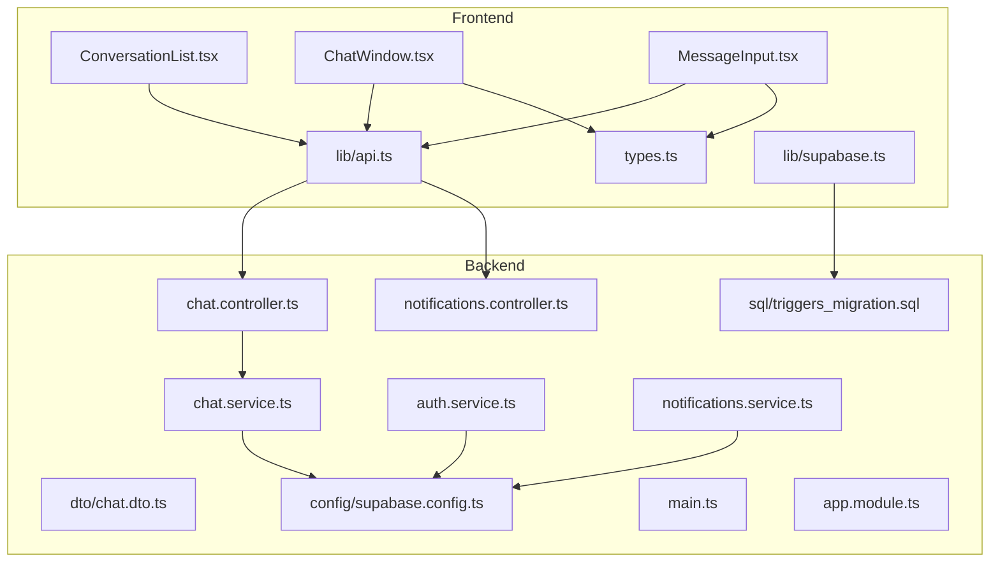
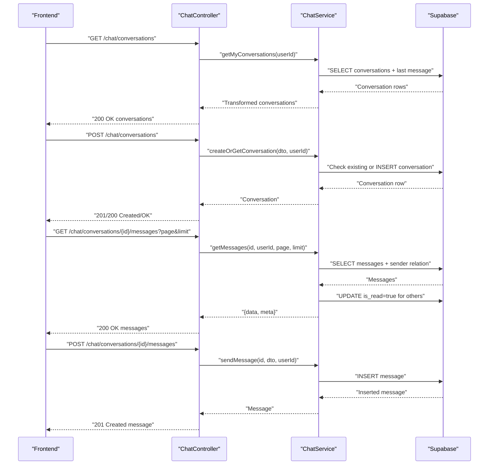
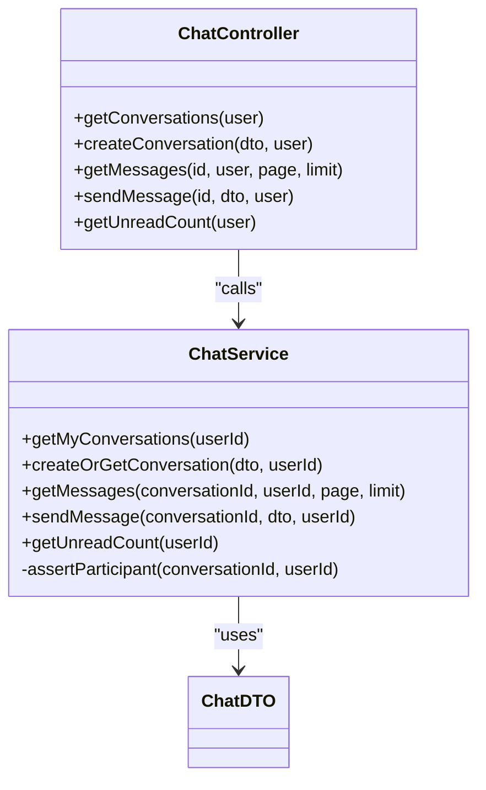
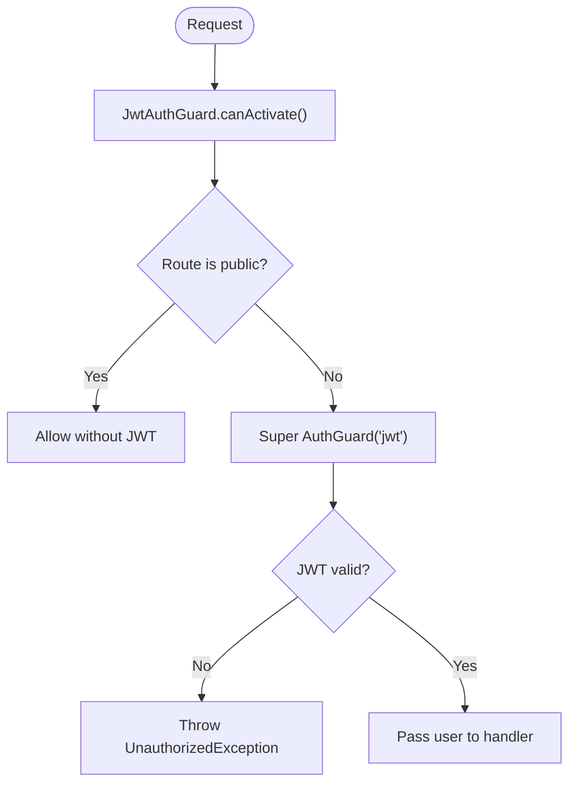
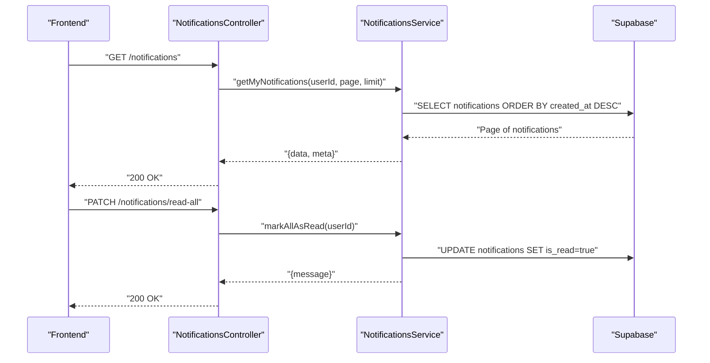
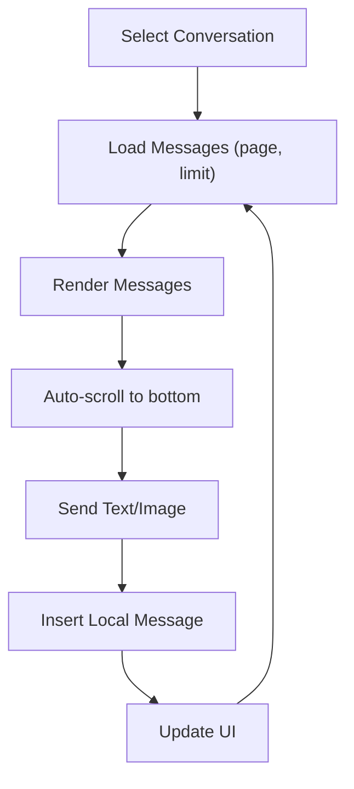
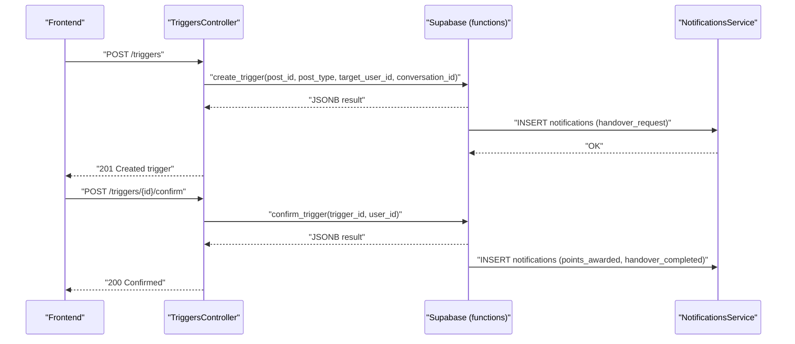
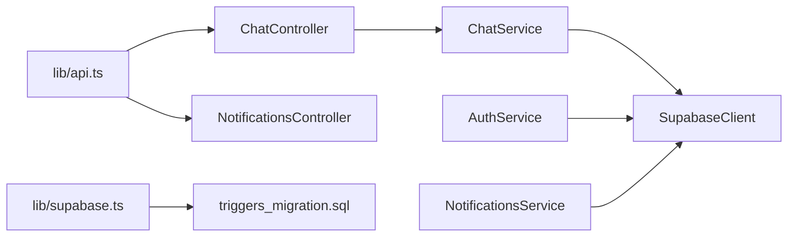

# Real-Time Chat & Communication

<cite>
**Referenced Files in This Document**
- [backend/src/modules/chat/chat.controller.ts](file://backend/src/modules/chat/chat.controller.ts)
- [backend/src/modules/chat/chat.service.ts](file://backend/src/modules/chat/chat.service.ts)
- [backend/src/modules/chat/dto/chat.dto.ts](file://backend/src/modules/chat/dto/chat.dto.ts)
- [backend/src/modules/auth/auth.service.ts](file://backend/src/modules/auth/auth.service.ts)
- [backend/src/common/guards/jwt-auth.guard.ts](file://backend/src/common/guards/jwt-auth.guard.ts)
- [backend/src/modules/notifications/notifications.service.ts](file://backend/src/modules/notifications/notifications.service.ts)
- [backend/src/modules/notifications/notifications.controller.ts](file://backend/src/modules/notifications/notifications.controller.ts)
- [backend/src/config/supabase.config.ts](file://backend/src/config/supabase.config.ts)
- [backend/src/main.ts](file://backend/src/main.ts)
- [backend/src/app.module.ts](file://backend/src/app.module.ts)
- [frontend/app/messages/types.ts](file://frontend/app/messages/types.ts)
- [frontend/app/messages/ChatWindow.tsx](file://frontend/app/messages/ChatWindow.tsx)
- [frontend/app/messages/ConversationList.tsx](file://frontend/app/messages/ConversationList.tsx)
- [frontend/app/messages/MessageInput.tsx](file://frontend/app/messages/MessageInput.tsx)
- [frontend/app/lib/api.ts](file://frontend/app/lib/api.ts)
- [frontend/app/lib/supabase.ts](file://frontend/app/lib/supabase.ts)
- [backend/sql/triggers_migration.sql](file://backend/sql/triggers_migration.sql)
</cite>

## Table of Contents
1. [Introduction](#introduction)
2. [Project Structure](#project-structure)
3. [Core Components](#core-components)
4. [Architecture Overview](#architecture-overview)
5. [Detailed Component Analysis](#detailed-component-analysis)
6. [Dependency Analysis](#dependency-analysis)
7. [Performance Considerations](#performance-considerations)
8. [Troubleshooting Guide](#troubleshooting-guide)
9. [Conclusion](#conclusion)
10. [Appendices](#appendices)

## Introduction
This document describes the Real-Time Chat & Communication system that enables instant messaging between users. It covers the WebSocket-free architecture using REST APIs and server-sent polling for auxiliary features, the conversation lifecycle, participant management, message threading, and the chat UI components. It also documents authentication integration, notifications, message status tracking, backend persistence and retrieval, and operational considerations such as privacy, retention, moderation, performance, scalability, and offline handling.

## Project Structure
The chat system spans backend NestJS modules and frontend Next.js pages/components:
- Backend modules: chat, auth, notifications, triggers, upload, and others.
- Frontend pages: messages with ConversationList, ChatWindow, MessageInput, and shared types.
- Shared utilities: API helpers and Supabase client wrappers.

**Diagram sources**
- [frontend/app/messages/ConversationList.tsx:1-103](file://frontend/app/messages/ConversationList.tsx#L1-L103)
- [frontend/app/messages/ChatWindow.tsx:1-348](file://frontend/app/messages/ChatWindow.tsx#L1-L348)
- [frontend/app/messages/MessageInput.tsx:1-117](file://frontend/app/messages/MessageInput.tsx#L1-L117)
- [frontend/app/messages/types.ts:1-51](file://frontend/app/messages/types.ts#L1-L51)
- [frontend/app/lib/api.ts:1-83](file://frontend/app/lib/api.ts#L1-L83)
- [frontend/app/lib/supabase.ts:1-18](file://frontend/app/lib/supabase.ts#L1-L18)
- [backend/src/modules/chat/chat.controller.ts:1-50](file://backend/src/modules/chat/chat.controller.ts#L1-L50)
- [backend/src/modules/chat/chat.service.ts:1-151](file://backend/src/modules/chat/chat.service.ts#L1-L151)
- [backend/src/modules/chat/dto/chat.dto.ts:1-36](file://backend/src/modules/chat/dto/chat.dto.ts#L1-L36)
- [backend/src/modules/auth/auth.service.ts:1-280](file://backend/src/modules/auth/auth.service.ts#L1-L280)
- [backend/src/modules/notifications/notifications.service.ts:1-82](file://backend/src/modules/notifications/notifications.service.ts#L1-L82)
- [backend/src/modules/notifications/notifications.controller.ts:1-42](file://backend/src/modules/notifications/notifications.controller.ts#L1-L42)
- [backend/src/config/supabase.config.ts:1-25](file://backend/src/config/supabase.config.ts#L1-L25)
- [backend/src/main.ts:1-45](file://backend/src/main.ts#L1-L45)
- [backend/src/app.module.ts:1-67](file://backend/src/app.module.ts#L1-L67)
- [backend/sql/triggers_migration.sql:1-338](file://backend/sql/triggers_migration.sql#L1-L338)

**Section sources**
- [backend/src/modules/chat/chat.controller.ts:1-50](file://backend/src/modules/chat/chat.controller.ts#L1-L50)
- [backend/src/modules/chat/chat.service.ts:1-151](file://backend/src/modules/chat/chat.service.ts#L1-L151)
- [frontend/app/messages/ChatWindow.tsx:1-348](file://frontend/app/messages/ChatWindow.tsx#L1-L348)
- [frontend/app/messages/ConversationList.tsx:1-103](file://frontend/app/messages/ConversationList.tsx#L1-L103)
- [frontend/app/messages/MessageInput.tsx:1-117](file://frontend/app/messages/MessageInput.tsx#L1-L117)
- [frontend/app/messages/types.ts:1-51](file://frontend/app/messages/types.ts#L1-L51)
- [frontend/app/lib/api.ts:1-83](file://frontend/app/lib/api.ts#L1-L83)
- [frontend/app/lib/supabase.ts:1-18](file://frontend/app/lib/supabase.ts#L1-L18)
- [backend/src/config/supabase.config.ts:1-25](file://backend/src/config/supabase.config.ts#L1-L25)
- [backend/src/main.ts:1-45](file://backend/src/main.ts#L1-L45)
- [backend/src/app.module.ts:1-67](file://backend/src/app.module.ts#L1-L67)
- [backend/sql/triggers_migration.sql:1-338](file://backend/sql/triggers_migration.sql#L1-L338)

## Core Components
- Chat controller and service: expose REST endpoints for conversations and messages, enforce participant checks, and manage message reads.
- DTOs: define request shapes for creating conversations and sending messages.
- Authentication: JWT guard and auth service for login/registration and token issuance.
- Notifications: endpoints/services for retrieving and marking notifications as read.
- Frontend chat UI: conversation list, chat canvas, and message input with image upload support.
- Supabase integration: backend client initialization and triggers SQL for auxiliary handover features.

**Section sources**
- [backend/src/modules/chat/chat.controller.ts:1-50](file://backend/src/modules/chat/chat.controller.ts#L1-L50)
- [backend/src/modules/chat/chat.service.ts:1-151](file://backend/src/modules/chat/chat.service.ts#L1-L151)
- [backend/src/modules/chat/dto/chat.dto.ts:1-36](file://backend/src/modules/chat/dto/chat.dto.ts#L1-L36)
- [backend/src/common/guards/jwt-auth.guard.ts:1-29](file://backend/src/common/guards/jwt-auth.guard.ts#L1-L29)
- [backend/src/modules/auth/auth.service.ts:1-280](file://backend/src/modules/auth/auth.service.ts#L1-L280)
- [backend/src/modules/notifications/notifications.service.ts:1-82](file://backend/src/modules/notifications/notifications.service.ts#L1-L82)
- [backend/src/modules/notifications/notifications.controller.ts:1-42](file://backend/src/modules/notifications/notifications.controller.ts#L1-L42)
- [frontend/app/messages/ChatWindow.tsx:1-348](file://frontend/app/messages/ChatWindow.tsx#L1-L348)
- [frontend/app/messages/ConversationList.tsx:1-103](file://frontend/app/messages/ConversationList.tsx#L1-L103)
- [frontend/app/messages/MessageInput.tsx:1-117](file://frontend/app/messages/MessageInput.tsx#L1-L117)
- [frontend/app/lib/api.ts:1-83](file://frontend/app/lib/api.ts#L1-L83)
- [backend/src/config/supabase.config.ts:1-25](file://backend/src/config/supabase.config.ts#L1-L25)
- [backend/sql/triggers_migration.sql:1-338](file://backend/sql/triggers_migration.sql#L1-L338)

## Architecture Overview
The chat system uses a REST-first approach:
- Clients authenticate via JWT and call protected endpoints.
- Conversations and messages are persisted in Supabase tables.
- Participants receive notifications for new messages and handover events.
- Auxiliary handover requests leverage PostgreSQL functions and triggers, emitting notifications and updating user points.

**Diagram sources**
- [backend/src/modules/chat/chat.controller.ts:15-42](file://backend/src/modules/chat/chat.controller.ts#L15-L42)
- [backend/src/modules/chat/chat.service.ts:12-126](file://backend/src/modules/chat/chat.service.ts#L12-L126)
- [backend/src/config/supabase.config.ts:7-23](file://backend/src/config/supabase.config.ts#L7-L23)

**Section sources**
- [backend/src/modules/chat/chat.controller.ts:1-50](file://backend/src/modules/chat/chat.controller.ts#L1-L50)
- [backend/src/modules/chat/chat.service.ts:1-151](file://backend/src/modules/chat/chat.service.ts#L1-L151)
- [backend/src/config/supabase.config.ts:1-25](file://backend/src/config/supabase.config.ts#L1-L25)

## Detailed Component Analysis

### Backend: Chat Module
- Controllers:
  - List conversations, create or get a conversation, list messages with pagination, send messages, and get unread counts.
- Service:
  - Validates participants, constructs queries with relations, marks messages as read upon retrieval, and enforces content presence for sent messages.
- DTOs:
  - Define optional post associations and message content/image/message_type.

**Diagram sources**
- [backend/src/modules/chat/chat.controller.ts:1-50](file://backend/src/modules/chat/chat.controller.ts#L1-L50)
- [backend/src/modules/chat/chat.service.ts:1-151](file://backend/src/modules/chat/chat.service.ts#L1-L151)
- [backend/src/modules/chat/dto/chat.dto.ts:1-36](file://backend/src/modules/chat/dto/chat.dto.ts#L1-L36)

**Section sources**
- [backend/src/modules/chat/chat.controller.ts:1-50](file://backend/src/modules/chat/chat.controller.ts#L1-L50)
- [backend/src/modules/chat/chat.service.ts:1-151](file://backend/src/modules/chat/chat.service.ts#L1-L151)
- [backend/src/modules/chat/dto/chat.dto.ts:1-36](file://backend/src/modules/chat/dto/chat.dto.ts#L1-L36)

### Backend: Authentication and Guards
- JWT guard integrates with NestJS guards and reflects public routes.
- Auth service handles registration, login, Google login, logout, and token management.

**Diagram sources**
- [backend/src/common/guards/jwt-auth.guard.ts:1-29](file://backend/src/common/guards/jwt-auth.guard.ts#L1-L29)
- [backend/src/modules/auth/auth.service.ts:72-110](file://backend/src/modules/auth/auth.service.ts#L72-L110)

**Section sources**
- [backend/src/common/guards/jwt-auth.guard.ts:1-29](file://backend/src/common/guards/jwt-auth.guard.ts#L1-L29)
- [backend/src/modules/auth/auth.service.ts:1-280](file://backend/src/modules/auth/auth.service.ts#L1-L280)

### Backend: Notifications
- Provides endpoints to list notifications, get unread counts, and mark as read.
- Notifications are stored in the notifications table and used for chat and handover events.

**Diagram sources**
- [backend/src/modules/notifications/notifications.controller.ts:1-42](file://backend/src/modules/notifications/notifications.controller.ts#L1-L42)
- [backend/src/modules/notifications/notifications.service.ts:15-63](file://backend/src/modules/notifications/notifications.service.ts#L15-L63)

**Section sources**
- [backend/src/modules/notifications/notifications.controller.ts:1-42](file://backend/src/modules/notifications/notifications.controller.ts#L1-L42)
- [backend/src/modules/notifications/notifications.service.ts:1-82](file://backend/src/modules/notifications/notifications.service.ts#L1-L82)

### Frontend: Chat UI Components
- ConversationList displays conversations with last message previews and unread indicators.
- ChatWindow renders messages, auto-scrolls to bottom, and shows a banner for handover triggers.
- MessageInput supports text and image uploads, with disabled states and loading feedback.

**Diagram sources**
- [frontend/app/messages/ConversationList.tsx:12-98](file://frontend/app/messages/ConversationList.tsx#L12-L98)
- [frontend/app/messages/ChatWindow.tsx:12-344](file://frontend/app/messages/ChatWindow.tsx#L12-L344)
- [frontend/app/messages/MessageInput.tsx:9-113](file://frontend/app/messages/MessageInput.tsx#L9-L113)

**Section sources**
- [frontend/app/messages/ConversationList.tsx:1-103](file://frontend/app/messages/ConversationList.tsx#L1-L103)
- [frontend/app/messages/ChatWindow.tsx:1-348](file://frontend/app/messages/ChatWindow.tsx#L1-L348)
- [frontend/app/messages/MessageInput.tsx:1-117](file://frontend/app/messages/MessageInput.tsx#L1-L117)
- [frontend/app/messages/types.ts:1-51](file://frontend/app/messages/types.ts#L1-L51)

### Handover Triggers and Notifications
- Triggers are managed via PostgreSQL functions and stored procedures, emitting notifications and updating user points upon confirmation.
- Frontend polls trigger status for conversations where Supabase realtime is restricted.

**Diagram sources**
- [backend/sql/triggers_migration.sql:63-146](file://backend/sql/triggers_migration.sql#L63-L146)
- [backend/sql/triggers_migration.sql:153-259](file://backend/sql/triggers_migration.sql#L153-L259)
- [backend/sql/triggers_migration.sql:266-318](file://backend/sql/triggers_migration.sql#L266-L318)
- [backend/modules/notifications/notifications.service.ts:66-80](file://backend/src/modules/notifications/notifications.service.ts#L66-L80)
- [frontend/app/messages/ChatWindow.tsx:32-57](file://frontend/app/messages/ChatWindow.tsx#L32-L57)

**Section sources**
- [backend/sql/triggers_migration.sql:1-338](file://backend/sql/triggers_migration.sql#L1-L338)
- [backend/src/modules/notifications/notifications.service.ts:1-82](file://backend/src/modules/notifications/notifications.service.ts#L1-L82)
- [frontend/app/messages/ChatWindow.tsx:1-348](file://frontend/app/messages/ChatWindow.tsx#L1-L348)

## Dependency Analysis
- Controllers depend on services; services depend on Supabase client initialization.
- Guards apply globally; auth module provides tokens; notifications module manages read/unread state.
- Frontend depends on API helpers for authentication and uploads; uses Supabase client for non-realtime features.

**Diagram sources**
- [backend/src/modules/chat/chat.controller.ts:1-50](file://backend/src/modules/chat/chat.controller.ts#L1-L50)
- [backend/src/modules/chat/chat.service.ts:1-151](file://backend/src/modules/chat/chat.service.ts#L1-L151)
- [backend/src/config/supabase.config.ts:1-25](file://backend/src/config/supabase.config.ts#L1-L25)
- [backend/src/modules/auth/auth.service.ts:1-280](file://backend/src/modules/auth/auth.service.ts#L1-L280)
- [backend/src/modules/notifications/notifications.service.ts:1-82](file://backend/src/modules/notifications/notifications.service.ts#L1-L82)
- [frontend/app/lib/api.ts:1-83](file://frontend/app/lib/api.ts#L1-L83)
- [frontend/app/lib/supabase.ts:1-18](file://frontend/app/lib/supabase.ts#L1-L18)
- [backend/sql/triggers_migration.sql:1-338](file://backend/sql/triggers_migration.sql#L1-L338)

**Section sources**
- [backend/src/app.module.ts:1-67](file://backend/src/app.module.ts#L1-L67)
- [backend/src/main.ts:1-45](file://backend/src/main.ts#L1-L45)
- [frontend/app/lib/api.ts:1-83](file://frontend/app/lib/api.ts#L1-L83)

## Performance Considerations
- Pagination: Messages are fetched with range-based pagination to limit payload sizes.
- Read marking: Upon retrieval, unread messages for other participants are marked read in a single batch update.
- Frontend rendering: Auto-scroll uses requestAnimationFrame to avoid layout thrashing.
- Polling vs. WebSockets: Handover trigger status uses polling due to Supabase realtime permissions; this reduces complexity but increases latency compared to true real-time updates.
- Image uploads: Separate upload endpoint returns a URL; clients embed URLs in messages to minimize payload sizes.

[No sources needed since this section provides general guidance]

## Troubleshooting Guide
- Authentication failures:
  - 401 responses remove local tokens and redirect to login.
  - Ensure cookies are included and Bearer token is present in Authorization header.
- Participant validation:
  - Non-participants receive forbidden errors when accessing conversations.
- Message validation:
  - Sending requires either content or image URL; otherwise validation errors are thrown.
- Unread counts:
  - Verify is_read flags and sender filtering when computing unread totals.
- Notifications:
  - Use endpoints to mark as read or read all; check unread counts.

**Section sources**
- [frontend/app/lib/api.ts:30-42](file://frontend/app/lib/api.ts#L30-L42)
- [backend/src/modules/chat/chat.service.ts:138-149](file://backend/src/modules/chat/chat.service.ts#L138-L149)
- [backend/src/modules/chat/chat.service.ts:102-105](file://backend/src/modules/chat/chat.service.ts#L102-L105)
- [backend/src/modules/notifications/notifications.service.ts:33-41](file://backend/src/modules/notifications/notifications.service.ts#L33-L41)

## Conclusion
The chat system provides a robust, REST-driven foundation for instant messaging with strong participant enforcement, pagination, and read status tracking. Authentication is enforced via JWT guards, and notifications support user engagement. The handover feature complements chat with structured workflows and point-based rewards. While real-time updates are achieved via polling for auxiliary features, the core messaging relies on efficient REST endpoints and careful frontend rendering for responsiveness.

[No sources needed since this section summarizes without analyzing specific files]

## Appendices

### Typical Chat Scenarios and Flows
- Create or join a conversation:
  - Choose a post and a recipient; backend checks existing conversations and creates one if none exists.
- Compose and send a message:
  - Text or image; backend validates content presence and inserts the message.
- View conversation history:
  - Paginated retrieval with read marking for others.
- Receive notifications:
  - New message and handover-related notifications are stored and can be marked as read.

**Section sources**
- [backend/src/modules/chat/chat.controller.ts:21-42](file://backend/src/modules/chat/chat.controller.ts#L21-L42)
- [backend/src/modules/chat/chat.service.ts:38-66](file://backend/src/modules/chat/chat.service.ts#L38-L66)
- [backend/src/modules/chat/chat.service.ts:102-126](file://backend/src/modules/chat/chat.service.ts#L102-L126)
- [backend/src/modules/chat/chat.service.ts:68-100](file://backend/src/modules/chat/chat.service.ts#L68-L100)
- [backend/src/modules/notifications/notifications.service.ts:15-41](file://backend/src/modules/notifications/notifications.service.ts#L15-L41)

### Privacy, Retention, and Moderation Notes
- Access control: Participant checks ensure only authorized users can access conversations and messages.
- Data minimization: DTOs restrict accepted fields; backend validates presence of content or image.
- Retention: No explicit retention policy is defined in the referenced files; implement database policies or scheduled jobs as needed.
- Moderation: No dedicated moderation endpoints are present in the referenced files; consider adding flagging and admin controls if required.

[No sources needed since this section provides general guidance]

### Offline Message Handling
- The current implementation does not include persistent offline queues or push notifications; messages are delivered synchronously via REST.
- To support offline scenarios, consider integrating push notifications and storing out-of-band messages with retry/backoff logic.

[No sources needed since this section provides general guidance]