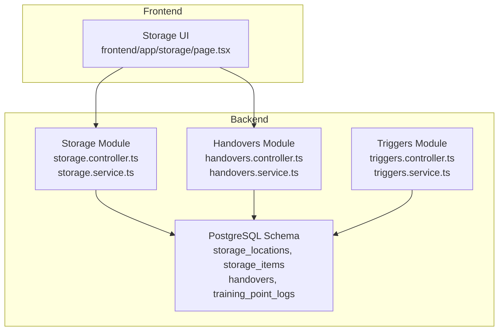
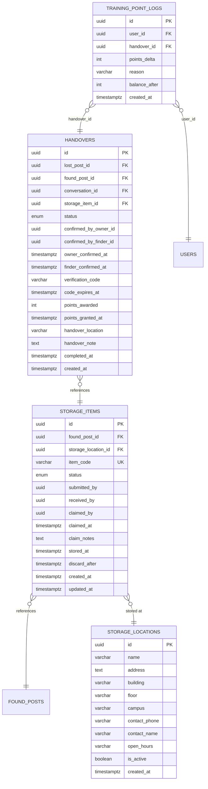
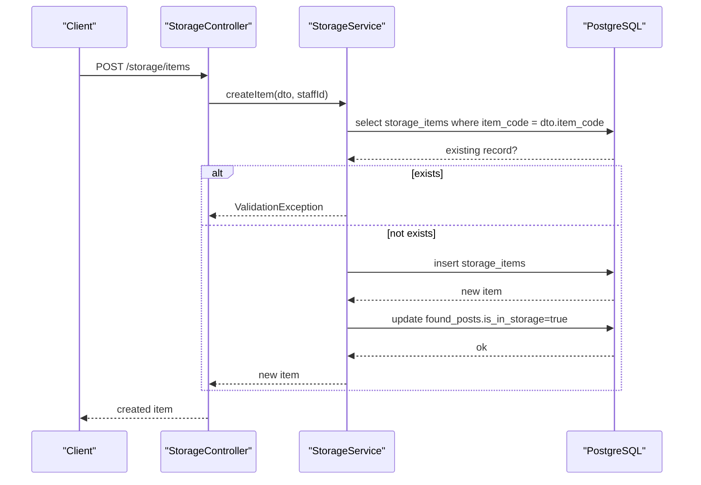
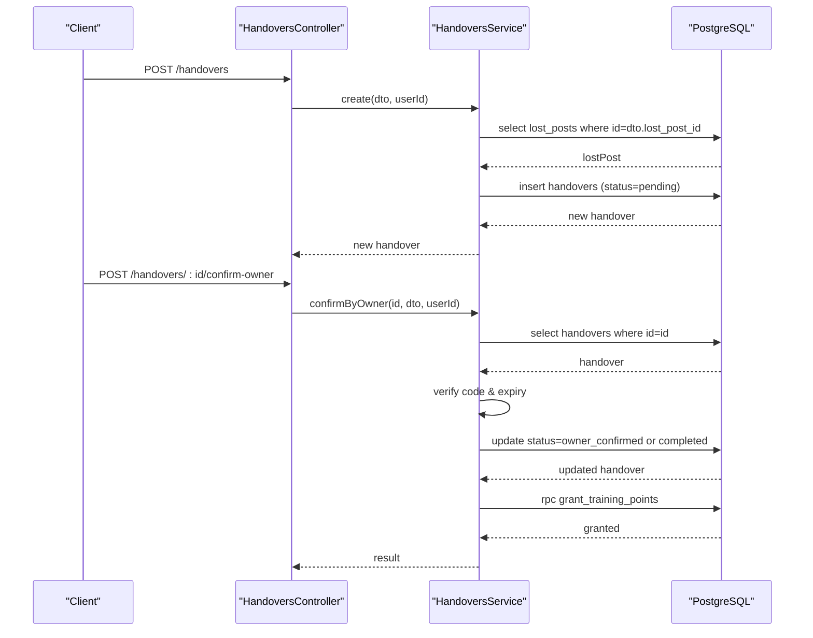
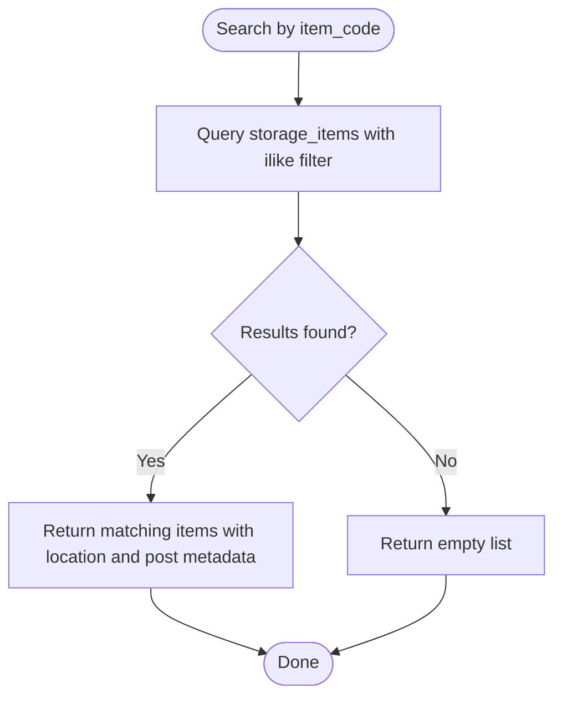
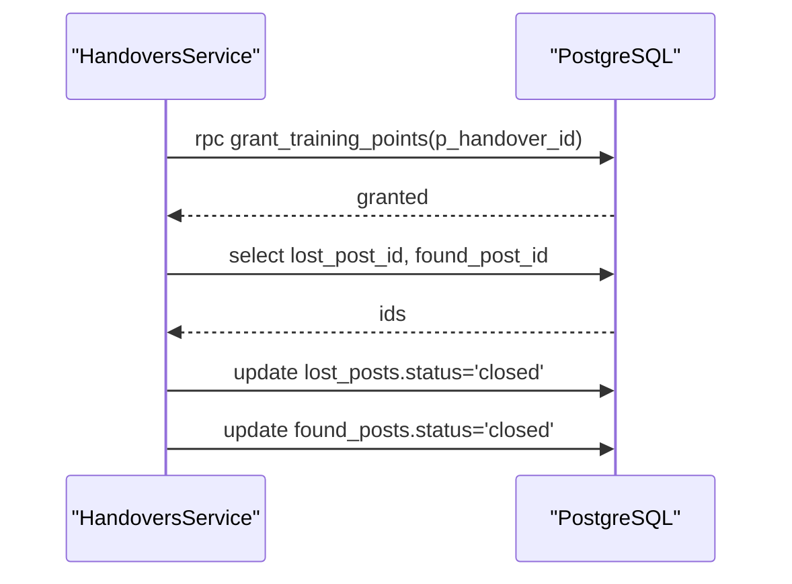
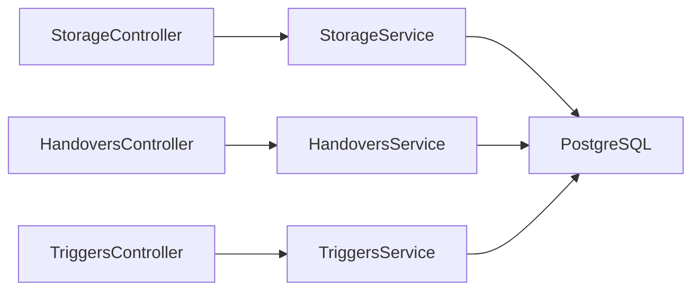

# Storage Management & Handover Process

<cite>
**Referenced Files in This Document**
- [storage.controller.ts](file://backend/src/modules/storage/storage.controller.ts)
- [storage.service.ts](file://backend/src/modules/storage/storage.service.ts)
- [storage.module.ts](file://backend/src/modules/storage/storage.module.ts)
- [storage.dto.ts](file://backend/src/modules/storage/dto/storage.dto.ts)
- [handovers.controller.ts](file://backend/src/modules/handovers/handovers.controller.ts)
- [handovers.service.ts](file://backend/src/modules/handovers/handovers.service.ts)
- [handovers.module.ts](file://backend/src/modules/handovers/handovers.module.ts)
- [handover.dto.ts](file://backend/src/modules/handovers/dto/handover.dto.ts)
- [page.tsx](file://frontend/app/storage/page.tsx)
- [triggers.service.ts](file://backend/src/modules/triggers/triggers.service.ts)
- [triggers.controller.ts](file://backend/src/modules/triggers/triggers.controller.ts)
- [trigger.dto.ts](file://backend/src/modules/triggers/dto/trigger.dto.ts)
- [triggers_migration.sql](file://backend/sql/triggers_migration.sql)
- [update_trigger_points.sql](file://backend/sql/update_trigger_points.sql)
- [OVERVIEW.md](file://OVERVIEW.md)
</cite>

## Table of Contents
1. [Introduction](#introduction)
2. [Project Structure](#project-structure)
3. [Core Components](#core-components)
4. [Architecture Overview](#architecture-overview)
5. [Detailed Component Analysis](#detailed-component-analysis)
6. [Dependency Analysis](#dependency-analysis)
7. [Performance Considerations](#performance-considerations)
8. [Troubleshooting Guide](#troubleshooting-guide)
9. [Conclusion](#conclusion)
10. [Appendices](#appendices)

## Introduction
This document explains the Storage Management & Handover Process, focusing on physical item tracking and management integrated with campus storage facilities. It covers facility mapping, item location tracking, inventory management, and the handover workflow from post approval through item pickup/delivery. It also documents capacity management, availability checking, administrative controls, user interface considerations, operational challenges, and integration with the training points system and reward mechanisms.

## Project Structure
The system comprises two primary modules:
- Storage module: manages storage locations, inventory entries, and item claims.
- Handovers module: coordinates owner/founder verification and completion tracking, integrating with storage items and training points.

**Diagram sources**
- [storage.controller.ts:1-60](file://backend/src/modules/storage/storage.controller.ts#L1-L60)
- [storage.service.ts:1-117](file://backend/src/modules/storage/storage.service.ts#L1-L117)
- [handovers.controller.ts:1-45](file://backend/src/modules/handovers/handovers.controller.ts#L1-L45)
- [handovers.service.ts:1-147](file://backend/src/modules/handovers/handovers.service.ts#L1-L147)
- [page.tsx:1-146](file://frontend/app/storage/page.tsx#L1-L146)
- [OVERVIEW.md:348-524](file://OVERVIEW.md#L348-L524)

**Section sources**
- [storage.controller.ts:1-60](file://backend/src/modules/storage/storage.controller.ts#L1-L60)
- [storage.service.ts:1-117](file://backend/src/modules/storage/storage.service.ts#L1-L117)
- [handovers.controller.ts:1-45](file://backend/src/modules/handovers/handovers.controller.ts#L1-L45)
- [handovers.service.ts:1-147](file://backend/src/modules/handovers/handovers.service.ts#L1-L147)
- [page.tsx:1-146](file://frontend/app/storage/page.tsx#L1-L146)
- [OVERVIEW.md:348-524](file://OVERVIEW.md#L348-L524)

## Core Components
- Storage module
  - Endpoints: list locations, list items, search by item code, get item details, create item, claim item.
  - Responsibilities: manage storage locations, track inventory, enforce item uniqueness, and update post status upon storage entry.
- Handovers module
  - Endpoints: create handover request, list user's handovers, get detail, confirm by owner, confirm by finder.
  - Responsibilities: coordinate owner/founder verification, enforce 6-digit verification code with expiry, award training points, and close related posts.
- Triggers module (context)
  - Provides legacy trigger-based handover flow with training points and cron-based expiration.
  - Useful for understanding historical workflows and training point mechanics.

**Section sources**
- [storage.controller.ts:1-60](file://backend/src/modules/storage/storage.controller.ts#L1-L60)
- [storage.service.ts:1-117](file://backend/src/modules/storage/storage.service.ts#L1-L117)
- [handovers.controller.ts:1-45](file://backend/src/modules/handovers/handovers.controller.ts#L1-L45)
- [handovers.service.ts:1-147](file://backend/src/modules/handovers/handovers.service.ts#L1-L147)
- [triggers.service.ts:1-163](file://backend/src/modules/triggers/triggers.service.ts#L1-L163)

## Architecture Overview
The storage and handover system integrates with PostgreSQL tables and Supabase client. Storage items are linked to found posts and storage locations. Handovers reference storage items and trigger training point grants upon completion.

**Diagram sources**
- [OVERVIEW.md:348-524](file://OVERVIEW.md#L348-L524)

**Section sources**
- [OVERVIEW.md:348-524](file://OVERVIEW.md#L348-L524)

## Detailed Component Analysis

### Storage Module
The storage module handles:
- Facility mapping: list active storage locations with campus and contact info.
- Inventory management: list items per location, search by item code, detailed item view.
- Item lifecycle: create item (with uniqueness check), claim item, and update post status.

Key implementation patterns:
- Supabase client usage for queries and inserts.
- Validation and error handling for duplicates and missing records.
- Cascading updates to found posts when items enter storage.

**Diagram sources**
- [storage.controller.ts:46-58](file://backend/src/modules/storage/storage.controller.ts#L46-L58)
- [storage.service.ts:53-78](file://backend/src/modules/storage/storage.service.ts#L53-L78)

**Section sources**
- [storage.controller.ts:1-60](file://backend/src/modules/storage/storage.controller.ts#L1-L60)
- [storage.service.ts:1-117](file://backend/src/modules/storage/storage.service.ts#L1-L117)
- [storage.dto.ts:1-28](file://backend/src/modules/storage/dto/storage.dto.ts#L1-L28)

### Handovers Module
The handover module coordinates:
- Request creation: validates ownership of the lost post and creates a pending handover with a 6-digit verification code and expiry.
- Verification: owner and finder confirm separately; upon dual confirmation, the handover completes.
- Training points: RPC call to grant points and close related posts.

**Diagram sources**
- [handovers.controller.ts:15-37](file://backend/src/modules/handovers/handovers.controller.ts#L15-L37)
- [handovers.service.ts:12-84](file://backend/src/modules/handovers/handovers.service.ts#L12-L84)

**Section sources**
- [handovers.controller.ts:1-45](file://backend/src/modules/handovers/handovers.controller.ts#L1-L45)
- [handovers.service.ts:1-147](file://backend/src/modules/handovers/handovers.service.ts#L1-L147)
- [handover.dto.ts:1-34](file://backend/src/modules/handovers/dto/handover.dto.ts#L1-L34)

### Storage Booking, Capacity, and Availability
- Storage locations are mapped with campus, building, floor, and contact details. Filtering by campus supports facility mapping.
- Inventory queries support filtering by location ID and ordering by stored time.
- Availability is implicit: items with status "stored" are available for claim; claims transition status to "claimed".

**Diagram sources**
- [storage.service.ts:102-115](file://backend/src/modules/storage/storage.service.ts#L102-L115)

**Section sources**
- [storage.service.ts:12-115](file://backend/src/modules/storage/storage.service.ts#L12-L115)

### Administrative Controls and Oversight
- Location visibility: only active locations are returned, enabling administrative deactivation without deletion.
- Staff actions: item creation and claiming require authenticated staff/admin roles.
- Post updates: automatic flagging of found posts as "in storage" when items are created.

**Section sources**
- [storage.controller.ts:18-58](file://backend/src/modules/storage/storage.controller.ts#L18-L58)
- [storage.service.ts:12-78](file://backend/src/modules/storage/storage.service.ts#L12-L78)

### User Interface for Storage and Handover
- Storage page presents a grid of storage locations with activity status, address, staff count, and item counts. Users can navigate to view items per location.
- Handover UI integrates with chat and verification flows; the handover detail endpoint exposes storage item linkage for pickup/delivery coordination.

**Section sources**
- [page.tsx:1-146](file://frontend/app/storage/page.tsx#L1-L146)
- [handovers.controller.ts:27-31](file://backend/src/modules/handovers/handovers.controller.ts#L27-L31)

### Integration with Training Points and Rewards
- On handover completion, training points are granted via an RPC call and training point logs are recorded.
- Related posts are closed automatically.

**Diagram sources**
- [handovers.service.ts:117-131](file://backend/src/modules/handovers/handovers.service.ts#L117-L131)

**Section sources**
- [handovers.service.ts:78-131](file://backend/src/modules/handovers/handovers.service.ts#L78-L131)
- [OVERVIEW.md:473-524](file://OVERVIEW.md#L473-L524)

## Dependency Analysis
- Storage module depends on Supabase client and interacts with storage_locations and storage_items tables.
- Handovers module depends on Supabase client and interacts with handovers, found_posts, lost_posts, and training_point_logs.
- Triggers module provides complementary handover logic with training points and cron-based expiration.

**Diagram sources**
- [storage.controller.ts:1-60](file://backend/src/modules/storage/storage.controller.ts#L1-L60)
- [handovers.controller.ts:1-45](file://backend/src/modules/handovers/handovers.controller.ts#L1-L45)
- [triggers.controller.ts:1-42](file://backend/src/modules/triggers/triggers.controller.ts#L1-L42)

**Section sources**
- [storage.controller.ts:1-60](file://backend/src/modules/storage/storage.controller.ts#L1-L60)
- [handovers.controller.ts:1-45](file://backend/src/modules/handovers/handovers.controller.ts#L1-L45)
- [triggers.controller.ts:1-42](file://backend/src/modules/triggers/triggers.controller.ts#L1-L42)

## Performance Considerations
- Indexes on storage_items (location, status, item_code) and handovers (status) improve query performance.
- Ordering by stored_at and created_at timestamps ensures recent items/posts appear first.
- Use pagination or limits for large result sets (e.g., search endpoints).
- Batch updates for post closures after handover completion reduce round trips.

[No sources needed since this section provides general guidance]

## Troubleshooting Guide
Common issues and resolutions:
- Item code duplication: creation fails if item_code already exists; verify uniqueness before insertion.
- Item not in "stored" status: claiming requires status "stored"; check inventory status before attempting claim.
- Ownership verification failures: handover creation requires the requesting user to own the lost post.
- Verification code errors: incorrect or expired codes prevent confirmation; ensure offline sharing of codes and timely confirmation.
- Training points not awarded: verify RPC grant succeeded and related posts were closed.

**Section sources**
- [storage.service.ts:53-78](file://backend/src/modules/storage/storage.service.ts#L53-L78)
- [storage.service.ts:80-100](file://backend/src/modules/storage/storage.service.ts#L80-L100)
- [handovers.service.ts:12-32](file://backend/src/modules/handovers/handovers.service.ts#L12-L32)
- [handovers.service.ts:50-84](file://backend/src/modules/handovers/handovers.service.ts#L50-L84)
- [handovers.service.ts:86-115](file://backend/src/modules/handovers/handovers.service.ts#L86-L115)

## Conclusion
The Storage Management & Handover Process integrates campus storage facilities with item tracking and a robust handover workflow. It enforces verification, manages training points, and provides administrative oversight. The modular backend and clear UI afford practical solutions for logistics coordination, capacity planning, and user engagement.

[No sources needed since this section summarizes without analyzing specific files]

## Appendices

### Typical Handover Scenarios and Timing
- Owner requests handover for a lost post they own; system generates a 6-digit verification code with expiry.
- Finder confirms receipt; upon dual confirmation, training points are awarded and posts are closed.
- Pickup scheduling: use handover_location and handover_note for coordination; storage item linkage enables precise location retrieval.

**Section sources**
- [handover.dto.ts:4-27](file://backend/src/modules/handovers/dto/handover.dto.ts#L4-L27)
- [handovers.service.ts:50-115](file://backend/src/modules/handovers/handovers.service.ts#L50-L115)

### Operational Challenges and Capacity Planning
- Peak usage: monitor item counts per location and campus to anticipate demand.
- Expiry management: ensure timely verification to avoid orphaned handovers.
- Staff coordination: maintain accurate contact info and open hours for storage locations.

**Section sources**
- [storage.service.ts:12-19](file://backend/src/modules/storage/storage.service.ts#L12-L19)
- [OVERVIEW.md:348-403](file://OVERVIEW.md#L348-L403)

### Legacy Triggers Integration (Context)
- Historical trigger-based handover flow with cron-based expiration and training points remains useful for understanding training point mechanics and legacy workflows.

**Section sources**
- [triggers_migration.sql:1-338](file://backend/sql/triggers_migration.sql#L1-L338)
- [update_trigger_points.sql:1-132](file://backend/sql/update_trigger_points.sql#L1-L132)
- [triggers.service.ts:140-161](file://backend/src/modules/triggers/triggers.service.ts#L140-L161)