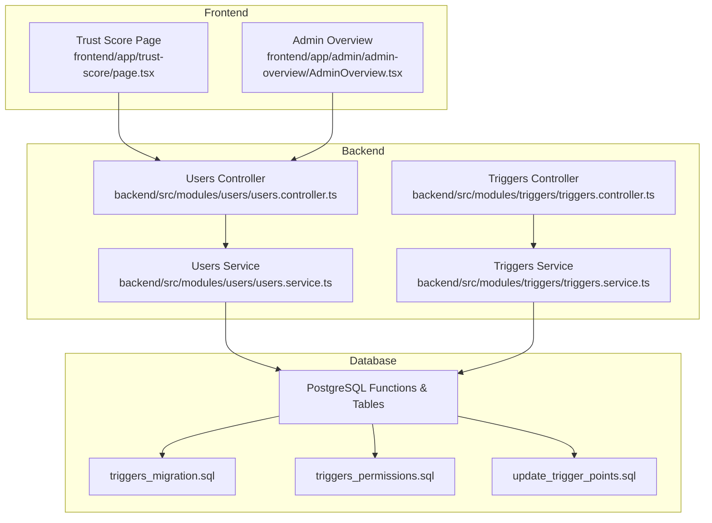
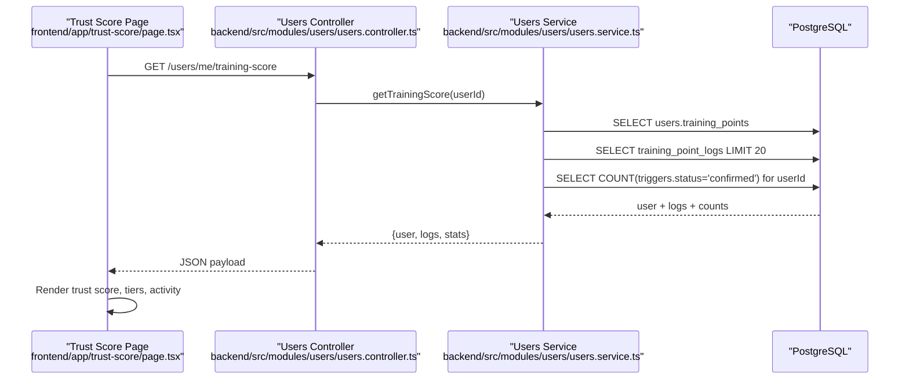
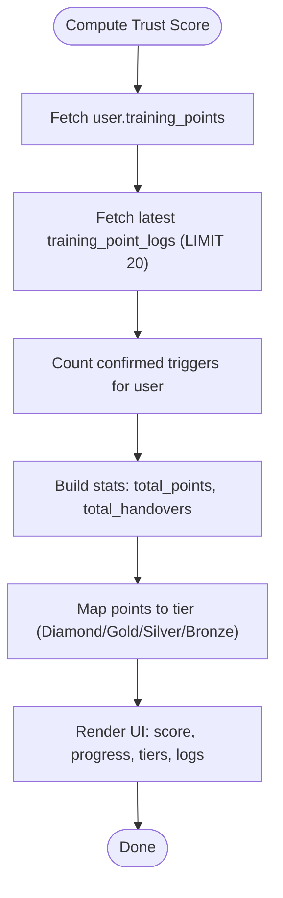
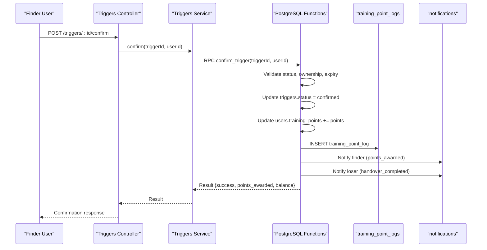
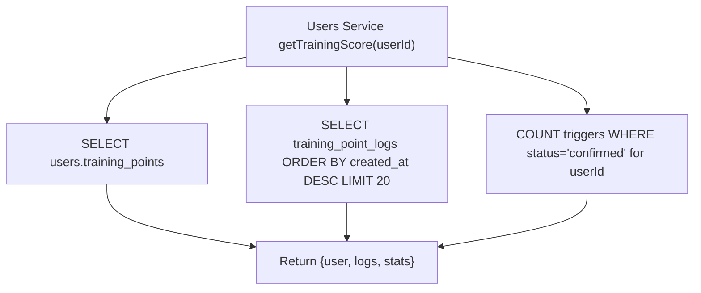
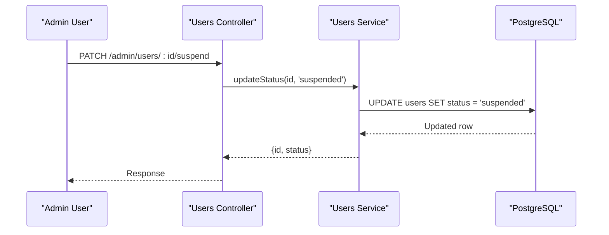
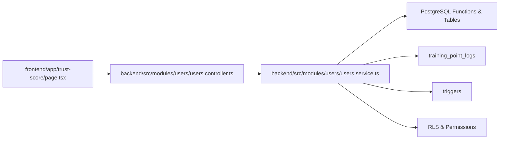

# Training Points & Recognition System

<cite>
**Referenced Files in This Document**
- [users.service.ts](file://backend/src/modules/users/users.service.ts)
- [users.controller.ts](file://backend/src/modules/users/users.controller.ts)
- [user.entity.ts](file://backend/src/modules/auth/entities/user.entity.ts)
- [triggers.service.ts](file://backend/src/modules/triggers/triggers.service.ts)
- [triggers.controller.ts](file://backend/src/modules/triggers/triggers.controller.ts)
- [trigger.dto.ts](file://backend/src/modules/triggers/dto/trigger.dto.ts)
- [triggers_migration.sql](file://backend/sql/triggers_migration.sql)
- [triggers_permissions.sql](file://backend/sql/triggers_permissions.sql)
- [update_trigger_points.sql](file://backend/sql/update_trigger_points.sql)
- [page.tsx](file://frontend/app/trust-score/page.tsx)
- [AdminOverview.tsx](file://frontend/app/admin/admin-overview/AdminOverview.tsx)
- [OVERVIEW.md](file://OVERVIEW.md)
</cite>

## Table of Contents
1. [Introduction](#introduction)
2. [Project Structure](#project-structure)
3. [Core Components](#core-components)
4. [Architecture Overview](#architecture-overview)
5. [Detailed Component Analysis](#detailed-component-analysis)
6. [Dependency Analysis](#dependency-analysis)
7. [Performance Considerations](#performance-considerations)
8. [Troubleshooting Guide](#troubleshooting-guide)
9. [Conclusion](#conclusion)
10. [Appendices](#appendices)

## Introduction
This document describes the Training Points & Recognition System that incentivizes positive community behavior by rewarding successful matches and responsible use of the platform. It covers point allocation for successful handovers, trust score computation, recognition tiers, user profile integration, administrative controls, and the user interface for tracking points and viewing history. It also outlines fairness safeguards, point manipulation prevention, and the relationship between trust scores and platform privileges.

## Project Structure
The system spans backend NestJS services and controllers, PostgreSQL functions and permissions, and a Next.js frontend page for trust score display.

**Diagram sources**
- [page.tsx](file://frontend/app/trust-score/page.tsx)
- [AdminOverview.tsx](file://frontend/app/admin/admin-overview/AdminOverview.tsx)
- [users.controller.ts](file://backend/src/modules/users/users.controller.ts)
- [users.service.ts](file://backend/src/modules/users/users.service.ts)
- [triggers.controller.ts](file://backend/src/modules/triggers/triggers.controller.ts)
- [triggers.service.ts](file://backend/src/modules/triggers/triggers.service.ts)
- [triggers_migration.sql](file://backend/sql/triggers_migration.sql)
- [triggers_permissions.sql](file://backend/sql/triggers_permissions.sql)
- [update_trigger_points.sql](file://backend/sql/update_trigger_points.sql)

**Section sources**
- [users.controller.ts:1-94](file://backend/src/modules/users/users.controller.ts#L1-L94)
- [users.service.ts:1-136](file://backend/src/modules/users/users.service.ts#L1-L136)
- [triggers.controller.ts:1-42](file://backend/src/modules/triggers/triggers.controller.ts#L1-L42)
- [triggers.service.ts:1-163](file://backend/src/modules/triggers/triggers.service.ts#L1-L163)
- [page.tsx:1-377](file://frontend/app/trust-score/page.tsx#L1-L377)
- [AdminOverview.tsx:49-86](file://frontend/app/admin/admin-overview/AdminOverview.tsx#L49-L86)

## Core Components
- Trust score and training points: stored in the users table and summarized via dedicated endpoints.
- Point logs: recorded in training_point_logs for auditability.
- Handover triggers: PostgreSQL functions manage creation, confirmation, cancellation, expiration, and point crediting.
- Frontend trust score page: renders user trust score, recent activity, and recognition tiers.
- Admin dashboard: surfaces training_points for monitoring.

Key implementation references:
- Trust score retrieval and training history: [users.service.ts:70-103], [users.controller.ts:56-60], [users.controller.ts:50-54].
- Trigger lifecycle and point crediting: [triggers.service.ts:30-68], [triggers_migration.sql:63-259], [update_trigger_points.sql:9-131].
- Frontend rendering and tiers: [page.tsx:44-64], [page.tsx:273-295], [page.tsx:339-370].
- Admin overview integration: [AdminOverview.tsx:56-80].

**Section sources**
- [users.service.ts:70-103](file://backend/src/modules/users/users.service.ts#L70-L103)
- [users.controller.ts:50-60](file://backend/src/modules/users/users.controller.ts#L50-L60)
- [triggers.service.ts:30-68](file://backend/src/modules/triggers/triggers.service.ts#L30-L68)
- [triggers_migration.sql:63-259](file://backend/sql/triggers_migration.sql#L63-L259)
- [update_trigger_points.sql:9-131](file://backend/sql/update_trigger_points.sql#L9-L131)
- [page.tsx:44-64](file://frontend/app/trust-score/page.tsx#L44-L64)
- [page.tsx:273-295](file://frontend/app/trust-score/page.tsx#L273-L295)
- [page.tsx:339-370](file://frontend/app/trust-score/page.tsx#L339-L370)
- [AdminOverview.tsx:56-80](file://frontend/app/admin/admin-overview/AdminOverview.tsx#L56-L80)

## Architecture Overview
The system uses a hybrid backend/frontend architecture:
- Backend APIs expose user profile, training score, training history, and trigger operations.
- PostgreSQL functions encapsulate atomic business logic for trigger lifecycle and point updates.
- Frontend pages consume these APIs to render trust score dashboards and tier progression.

**Diagram sources**
- [page.tsx:71-76](file://frontend/app/trust-score/page.tsx#L71-L76)
- [users.controller.ts:56-60](file://backend/src/modules/users/users.controller.ts#L56-L60)
- [users.service.ts:70-103](file://backend/src/modules/users/users.service.ts#L70-L103)

## Detailed Component Analysis

### Trust Score and Recognition Tiers
- Trust score is derived from:
  - Total training_points from users table.
  - Recent training_point_logs entries (limited view).
  - Total confirmed handovers count for the user.
- Recognition tiers are computed client-side based on total_points:
  - Diamond ≥100
  - Gold 50–99
  - Silver 20–49
  - Bronze 0–19
- The frontend displays:
  - Circular progress toward next tier.
  - Tier cards with active/past/locked states.
  - Activity timeline with reasons and balances.

**Diagram sources**
- [users.service.ts:70-103](file://backend/src/modules/users/users.service.ts#L70-L103)
- [page.tsx:44-64](file://frontend/app/trust-score/page.tsx#L44-L64)
- [page.tsx:273-295](file://frontend/app/trust-score/page.tsx#L273-L295)
- [page.tsx:339-370](file://frontend/app/trust-score/page.tsx#L339-L370)

**Section sources**
- [users.service.ts:70-103](file://backend/src/modules/users/users.service.ts#L70-L103)
- [page.tsx:44-64](file://frontend/app/trust-score/page.tsx#L44-L64)
- [page.tsx:273-295](file://frontend/app/trust-score/page.tsx#L273-L295)
- [page.tsx:339-370](file://frontend/app/trust-score/page.tsx#L339-L370)

### Point Allocation for Successful Matches
- Point allocation occurs when a trigger is confirmed:
  - Only the finder receives points (not the original owner).
  - Default points awarded per successful handover is 5 (updated from previous default).
  - A training_point_log entry is inserted with reason, delta, and balance_after.
  - Notifications are sent to both parties upon confirmation.
  - Related posts are closed automatically.

**Diagram sources**
- [triggers.controller.ts:21-25](file://backend/src/modules/triggers/triggers.controller.ts#L21-L25)
- [triggers.service.ts:54-68](file://backend/src/modules/triggers/triggers.service.ts#L54-L68)
- [triggers_migration.sql:153-259](file://backend/sql/triggers_migration.sql#L153-L259)
- [update_trigger_points.sql:9-131](file://backend/sql/update_trigger_points.sql#L9-L131)

**Section sources**
- [triggers.controller.ts:21-25](file://backend/src/modules/triggers/triggers.controller.ts#L21-L25)
- [triggers.service.ts:54-68](file://backend/src/modules/triggers/triggers.service.ts#L54-L68)
- [triggers_migration.sql:153-259](file://backend/sql/triggers_migration.sql#L153-L259)
- [update_trigger_points.sql:9-131](file://backend/sql/update_trigger_points.sql#L9-L131)

### Trust Score Calculation Methodology
- The backend aggregates:
  - user.training_points
  - Latest training_point_logs ordered by created_at (recent 20)
  - Count of confirmed triggers associated with the user
- The frontend computes:
  - Tier based on total_points
  - Progress bar to next tier
  - Human-friendly timestamps for logs

**Diagram sources**
- [users.service.ts:70-103](file://backend/src/modules/users/users.service.ts#L70-L103)

**Section sources**
- [users.service.ts:70-103](file://backend/src/modules/users/users.service.ts#L70-L103)
- [page.tsx:30-41](file://frontend/app/trust-score/page.tsx#L30-L41)

### Point Decay Mechanisms
- No explicit point decay mechanism is present in the current implementation.
- The system relies on the permanence of training_point_logs and cumulative training_points to maintain historical records.

**Section sources**
- [users.service.ts:61-68](file://backend/src/modules/users/users.service.ts#L61-L68)
- [triggers_migration.sql:514-522](file://backend/sql/triggers_migration.sql#L514-L522)

### Recognition Tiers and Visual Display
- Tiers:
  - Diamond: ≥100 points
  - Gold: 50–99 points
  - Silver: 20–49 points
  - Bronze: 0–19 points
- Visual indicators:
  - Circular progress ring
  - Tier cards with active state and lock indicators
  - Activity timeline with verified chips and timestamps

**Section sources**
- [page.tsx:44-64](file://frontend/app/trust-score/page.tsx#L44-L64)
- [page.tsx:273-295](file://frontend/app/trust-score/page.tsx#L273-L295)
- [page.tsx:339-370](file://frontend/app/trust-score/page.tsx#L339-L370)

### Integration with User Profiles and Badges
- User entity includes training_points for profile-level display.
- Admin overview displays training_points alongside other metrics.
- The system does not define badge assets or metadata in the provided code; recognition is visualized via tier icons and labels.

**Section sources**
- [user.entity.ts:11](file://backend/src/modules/auth/entities/user.entity.ts#L11)
- [AdminOverview.tsx:56-80](file://frontend/app/admin/admin-overview/AdminOverview.tsx#L56-L80)

### Administrative Controls for Point Adjustments and Policy Changes
- Administrators can:
  - View all users and their training_points via admin endpoints.
  - Suspend or activate user accounts (indirectly affects eligibility for point crediting).
- Point policy changes are managed via database migrations/functions:
  - Default points_awarded updated in triggers table/function.
  - Permissions and RLS policies maintained for triggers.

**Diagram sources**
- [users.controller.ts:78-92](file://backend/src/modules/users/users.controller.ts#L78-L92)
- [users.service.ts:124-134](file://backend/src/modules/users/users.service.ts#L124-L134)

**Section sources**
- [users.controller.ts:70-92](file://backend/src/modules/users/users.controller.ts#L70-L92)
- [users.service.ts:106-134](file://backend/src/modules/users/users.service.ts#L106-L134)
- [triggers_permissions.sql:19-56](file://backend/sql/triggers_permissions.sql#L19-L56)
- [update_trigger_points.sql:6-7](file://backend/sql/update_trigger_points.sql#L6-L7)

### User Interface for Point Tracking, History, and Achievements
- Trust Score page:
  - Hero section with user name, total points, and badge-like tags.
  - Quick stats: total handovers, total points, activity count.
  - Levels card: progress bar to next tier and tier list.
  - Activity history: chronological logs with reasons and balances.
- The page fetches data via a single endpoint and renders all visuals client-side.

**Section sources**
- [page.tsx:213-377](file://frontend/app/trust-score/page.tsx#L213-L377)

### Behavioral Incentives and Responsible Use
- Positive reinforcement:
  - Immediate point credit for successful handovers.
  - Clear visibility of recent activity and tier progression.
- Safeguards:
  - Only the finder receives points, reducing incentive misalignment.
  - Expiration of pending triggers prevents stale states.
  - RLS and function-level validations restrict unauthorized actions.

**Section sources**
- [update_trigger_points.sql:74-89](file://backend/sql/update_trigger_points.sql#L74-L89)
- [triggers_migration.sql:175-186](file://backend/sql/triggers_migration.sql#L175-L186)
- [triggers_permissions.sql:25-49](file://backend/sql/triggers_permissions.sql#L25-L49)

### Examples of Point-Earning Scenarios and Milestones
- Scenario: Finder confirms a successful handover.
  - Action: Target user confirms receipt.
  - Outcome: Finder’s training_points increase by 5; training_point_log entry created; notifications sent.
- Milestone: Reach next tier.
  - Action: Accumulate points until threshold met.
  - Outcome: UI highlights active tier and progress to next tier.

**Section sources**
- [update_trigger_points.sql:74-111](file://backend/sql/update_trigger_points.sql#L74-L111)
- [page.tsx:273-295](file://frontend/app/trust-score/page.tsx#L273-L295)

### Community Recognition Programs
- The system supports recognition via:
  - Tier badges and progress bars.
  - Public display of training_points in admin overview.
- Formal badges or metadata are not defined in the current codebase.

**Section sources**
- [AdminOverview.tsx:56-80](file://frontend/app/admin/admin-overview/AdminOverview.tsx#L56-L80)
- [page.tsx:44-64](file://frontend/app/trust-score/page.tsx#L44-L64)

### Fairness Considerations and Prevention of Point Manipulation
- Access control:
  - RLS policies restrict trigger visibility and updates to authorized users.
  - Function-level EXECUTE grants ensure only validated operations occur.
- Operational integrity:
  - Atomic trigger functions update status, users, logs, and notifications in a single transaction.
  - Pending triggers auto-expire after 48 hours to prevent stale states.
- Status checks:
  - Finder account status is validated before crediting points.

**Section sources**
- [triggers_permissions.sql:25-56](file://backend/sql/triggers_permissions.sql#L25-L56)
- [triggers_migration.sql:153-259](file://backend/sql/triggers_migration.sql#L153-L259)
- [triggers_migration.sql:136-146](file://backend/sql/triggers_migration.sql#L136-L146)
- [triggers.service.ts:140-161](file://backend/src/modules/triggers/triggers.service.ts#L140-L161)

### Appeals Processes for Disputed Point Allocations
- No explicit appeals process is implemented in the provided code.
- Recommendations:
  - Add a dispute workflow in triggers (e.g., disputer_confirmed status).
  - Introduce admin-mediated resolution with audit trail in training_point_logs.

**Section sources**
- [triggers_migration.sql:478-507](file://backend/sql/triggers_migration.sql#L478-L507)
- [triggers_migration.sql:514-522](file://backend/sql/triggers_migration.sql#L514-L522)

### Relationship Between Trust Scores and Platform Privileges
- Trust score is surfaced in admin overview, enabling oversight.
- Privileges are not explicitly tied to trust scores in the current codebase; administrators can still manage roles and statuses independently.

**Section sources**
- [AdminOverview.tsx:56-80](file://frontend/app/admin/admin-overview/AdminOverview.tsx#L56-L80)
- [users.controller.ts:78-92](file://backend/src/modules/users/users.controller.ts#L78-L92)

## Dependency Analysis
- Backend depends on:
  - Supabase client for database operations.
  - PostgreSQL functions for atomic trigger operations.
  - RLS and permissions for secure access.
- Frontend depends on:
  - API endpoints for trust score and training history.
  - Client-side logic for rendering tiers and timelines.

**Diagram sources**
- [page.tsx](file://frontend/app/trust-score/page.tsx)
- [users.controller.ts](file://backend/src/modules/users/users.controller.ts)
- [users.service.ts](file://backend/src/modules/users/users.service.ts)
- [triggers_migration.sql](file://backend/sql/triggers_migration.sql)
- [triggers_permissions.sql](file://backend/sql/triggers_permissions.sql)

**Section sources**
- [users.service.ts:70-103](file://backend/src/modules/users/users.service.ts#L70-L103)
- [triggers_migration.sql:63-259](file://backend/sql/triggers_migration.sql#L63-L259)
- [triggers_permissions.sql:19-56](file://backend/sql/triggers_permissions.sql#L19-L56)

## Performance Considerations
- Database queries:
  - Parallel fetching of user, logs, and trigger counts reduces latency.
  - Indexes on triggers and training_point_logs improve lookup performance.
- Frontend:
  - Client-side rendering minimizes server load.
  - Pagination is not implemented for logs; consider limiting returned rows for large histories.

**Section sources**
- [users.service.ts:70-103](file://backend/src/modules/users/users.service.ts#L70-L103)
- [triggers_migration.sql:48-57](file://backend/sql/triggers_migration.sql#L48-L57)

## Troubleshooting Guide
- Common issues and remedies:
  - Trigger confirmation fails due to expired or invalid state:
    - Verify trigger status and expiry; pending triggers auto-expire.
  - Finder account suspended:
    - Confirmation is blocked; activate account first.
  - Missing training logs:
    - Ensure confirm_trigger executed and logs inserted.
  - UI not loading trust score:
    - Confirm endpoint availability and network connectivity.

**Section sources**
- [triggers_migration.sql:175-186](file://backend/sql/triggers_migration.sql#L175-L186)
- [triggers_migration.sql:194-199](file://backend/sql/triggers_migration.sql#L194-L199)
- [users.controller.ts:56-60](file://backend/src/modules/users/users.controller.ts#L56-L60)
- [page.tsx:78-97](file://frontend/app/trust-score/page.tsx#L78-L97)

## Conclusion
The Training Points & Recognition System provides a robust foundation for encouraging positive community participation. It credits successful handovers to the finder, maintains transparent logs, and presents a clear, motivating tier system. Administrators can oversee user activity and enforce fairness through database-level policies and function-level validations. Future enhancements could include formal badge metadata, appeals workflows, and privilege tiers linked to trust scores.

## Appendices
- Additional schema and overview references:
  - Training point logs table definition and indexes.
  - Admin overview integration points.

**Section sources**
- [OVERVIEW.md:473-524](file://OVERVIEW.md#L473-L524)
- [AdminOverview.tsx:56-80](file://frontend/app/admin/admin-overview/AdminOverview.tsx#L56-L80)