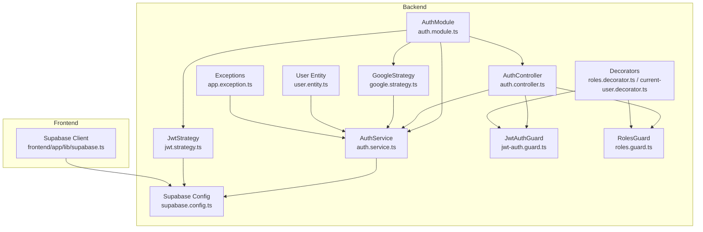
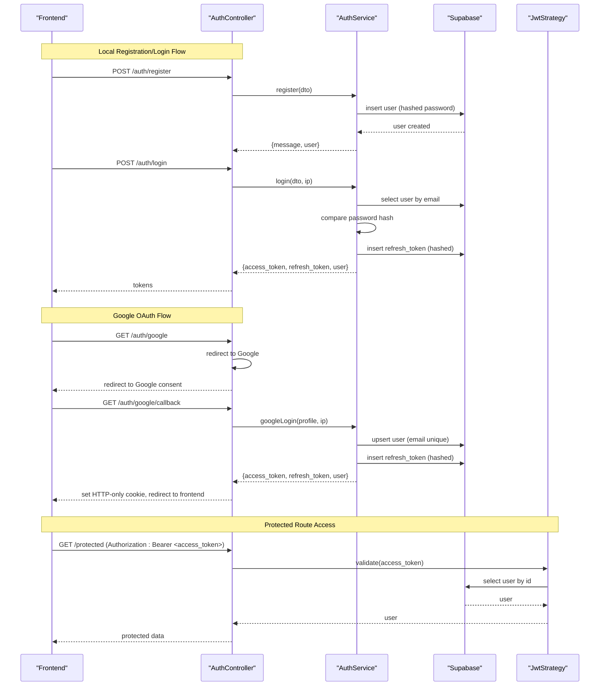
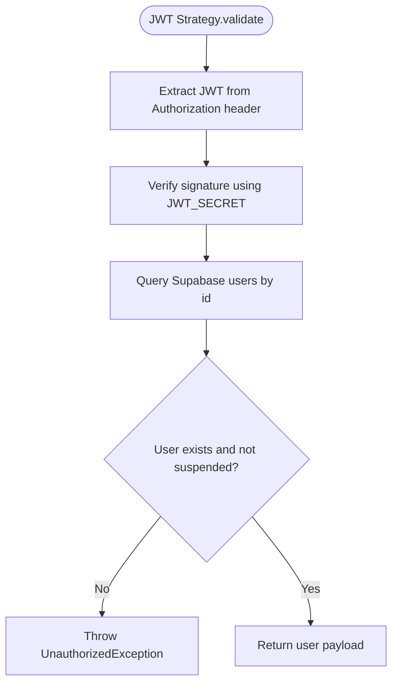
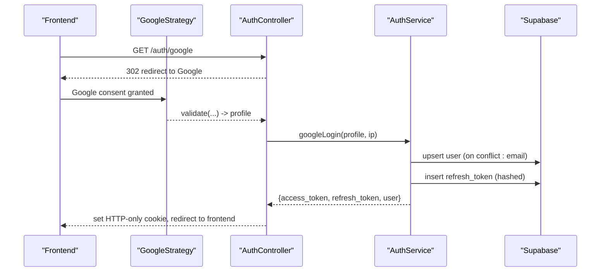
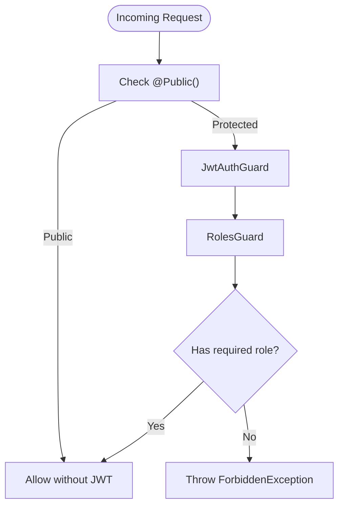
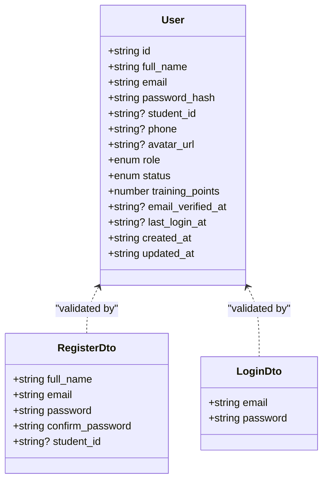
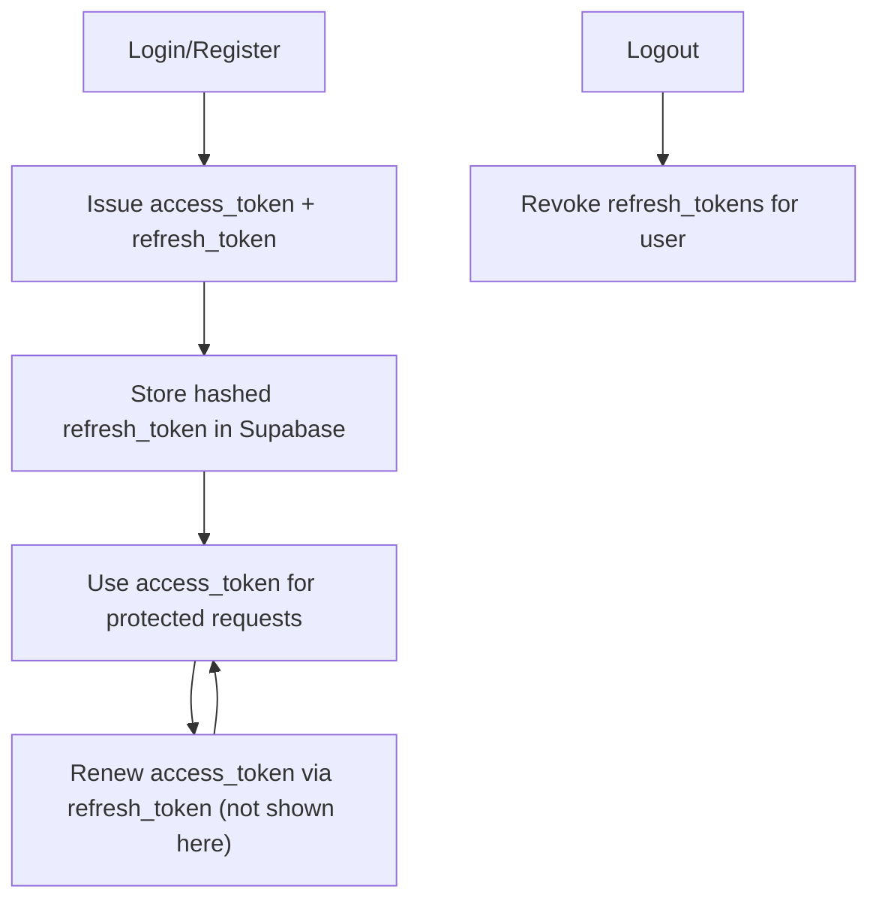
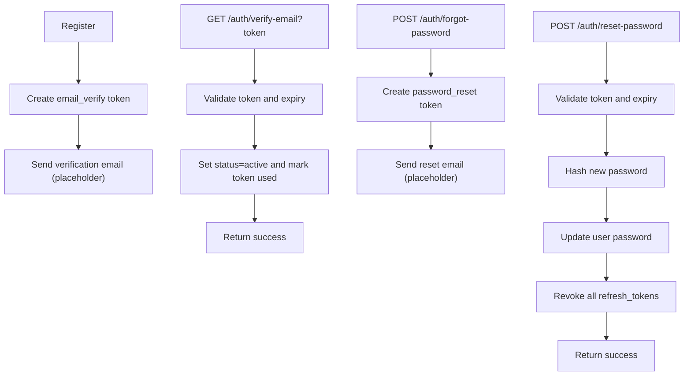
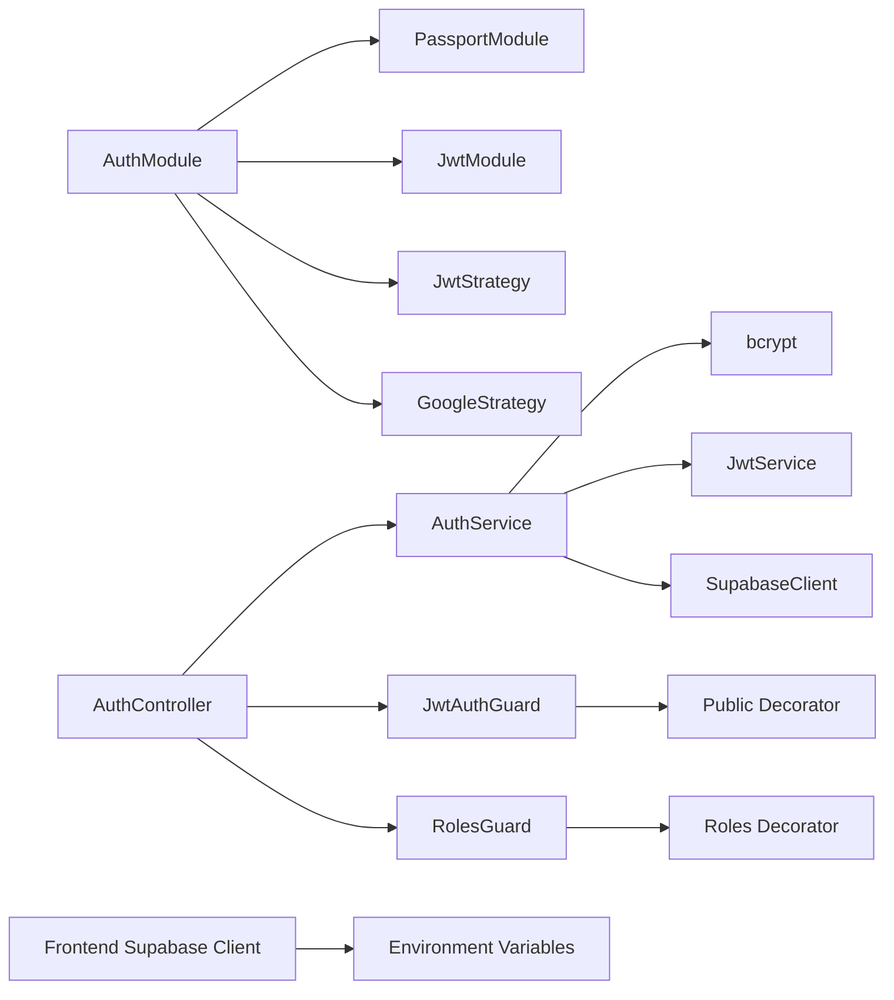

# User Authentication & Authorization

<cite>
**Referenced Files in This Document**
- [auth.module.ts](file://backend/src/modules/auth/auth.module.ts)
- [auth.service.ts](file://backend/src/modules/auth/auth.service.ts)
- [auth.controller.ts](file://backend/src/modules/auth/auth.controller.ts)
- [user.entity.ts](file://backend/src/modules/auth/entities/user.entity.ts)
- [jwt.strategy.ts](file://backend/src/modules/auth/strategies/jwt.strategy.ts)
- [google.strategy.ts](file://backend/src/modules/auth/strategies/google.strategy.ts)
- [register.dto.ts](file://backend/src/modules/auth/dto/register.dto.ts)
- [login.dto.ts](file://backend/src/modules/auth/dto/login.dto.ts)
- [jwt-auth.guard.ts](file://backend/src/common/guards/jwt-auth.guard.ts)
- [roles.guard.ts](file://backend/src/common/guards/roles.guard.ts)
- [roles.decorator.ts](file://backend/src/common/decorators/roles.decorator.ts)
- [current-user.decorator.ts](file://backend/src/common/decorators/current-user.decorator.ts)
- [supabase.config.ts](file://backend/src/config/supabase.config.ts)
- [supabase.ts](file://frontend/app/lib/supabase.ts)
- [GOOGLE_OAUTH_SETUP.md](file://GOOGLE_OAUTH_SETUP.md)
- [app.exception.ts](file://backend/src/common/exceptions/app.exception.ts)
</cite>

## Table of Contents
1. [Introduction](#introduction)
2. [Project Structure](#project-structure)
3. [Core Components](#core-components)
4. [Architecture Overview](#architecture-overview)
5. [Detailed Component Analysis](#detailed-component-analysis)
6. [Dependency Analysis](#dependency-analysis)
7. [Performance Considerations](#performance-considerations)
8. [Troubleshooting Guide](#troubleshooting-guide)
9. [Conclusion](#conclusion)
10. [Appendices](#appendices)

## Introduction
This document explains the User Authentication & Authorization system of the platform, focusing on:
- Dual authentication approach: JWT-based sessions and Google OAuth integration
- Registration, login, logout, and session lifecycle
- Role-based access control (RBAC) with user roles and permissions
- JWT strategy, token signing and refresh mechanisms
- Google OAuth setup, callback handling, and account linking
- User entity structure, password hashing, and credential validation
- Practical authentication flows, error handling, and security best practices

## Project Structure
The authentication system spans the backend NestJS modules and shared guards, strategies, and DTOs. It integrates with Supabase for persistence and with the frontend Next.js application.

**Diagram sources**
- [auth.module.ts:11-35](file://backend/src/modules/auth/auth.module.ts#L11-L35)
- [auth.controller.ts:27-130](file://backend/src/modules/auth/auth.controller.ts#L27-L130)
- [auth.service.ts:17-274](file://backend/src/modules/auth/auth.service.ts#L17-L274)
- [jwt.strategy.ts:16-40](file://backend/src/modules/auth/strategies/jwt.strategy.ts#L16-L40)
- [google.strategy.ts:6-38](file://backend/src/modules/auth/strategies/google.strategy.ts#L6-L38)
- [jwt-auth.guard.ts:7-29](file://backend/src/common/guards/jwt-auth.guard.ts#L7-L29)
- [roles.guard.ts:6-28](file://backend/src/common/guards/roles.guard.ts#L6-L28)
- [roles.decorator.ts:1-5](file://backend/src/common/decorators/roles.decorator.ts#L1-L5)
- [current-user.decorator.ts:1-9](file://backend/src/common/decorators/current-user.decorator.ts#L1-L9)
- [user.entity.ts:1-19](file://backend/src/modules/auth/entities/user.entity.ts#L1-L19)
- [supabase.config.ts:7-25](file://backend/src/config/supabase.config.ts#L7-L25)
- [supabase.ts:1-18](file://frontend/app/lib/supabase.ts#L1-L18)
- [app.exception.ts:1-46](file://backend/src/common/exceptions/app.exception.ts#L1-L46)

**Section sources**
- [auth.module.ts:11-35](file://backend/src/modules/auth/auth.module.ts#L11-L35)
- [auth.controller.ts:27-130](file://backend/src/modules/auth/auth.controller.ts#L27-L130)
- [auth.service.ts:17-274](file://backend/src/modules/auth/auth.service.ts#L17-L274)
- [jwt.strategy.ts:16-40](file://backend/src/modules/auth/strategies/jwt.strategy.ts#L16-L40)
- [google.strategy.ts:6-38](file://backend/src/modules/auth/strategies/google.strategy.ts#L6-L38)
- [jwt-auth.guard.ts:7-29](file://backend/src/common/guards/jwt-auth.guard.ts#L7-L29)
- [roles.guard.ts:6-28](file://backend/src/common/guards/roles.guard.ts#L6-L28)
- [roles.decorator.ts:1-5](file://backend/src/common/decorators/roles.decorator.ts#L1-L5)
- [current-user.decorator.ts:1-9](file://backend/src/common/decorators/current-user.decorator.ts#L1-L9)
- [user.entity.ts:1-19](file://backend/src/modules/auth/entities/user.entity.ts#L1-L19)
- [supabase.config.ts:7-25](file://backend/src/config/supabase.config.ts#L7-L25)
- [supabase.ts:1-18](file://frontend/app/lib/supabase.ts#L1-L18)
- [app.exception.ts:1-46](file://backend/src/common/exceptions/app.exception.ts#L1-L46)

## Core Components
- AuthModule initializes Passport, JWT module, and registers strategies and providers.
- AuthService encapsulates business logic for registration, login, logout, email verification, password reset, and Google OAuth login.
- AuthController exposes endpoints for registration, login, logout, email verification, password reset, and Google OAuth routes.
- JwtStrategy validates JWT tokens against Supabase users and enforces account status checks.
- GoogleStrategy handles Google OAuth profile extraction and returns a normalized user object.
- Guards enforce JWT authentication and RBAC via role metadata.
- DTOs define request validation for registration and login.
- User entity defines persisted user attributes and roles/statuses.
- Supabase configuration centralizes client creation and environment checks.
- Frontend Supabase client sets Authorization header and disables automatic token refresh.

**Section sources**
- [auth.module.ts:11-35](file://backend/src/modules/auth/auth.module.ts#L11-L35)
- [auth.service.ts:17-274](file://backend/src/modules/auth/auth.service.ts#L17-L274)
- [auth.controller.ts:27-130](file://backend/src/modules/auth/auth.controller.ts#L27-L130)
- [jwt.strategy.ts:16-40](file://backend/src/modules/auth/strategies/jwt.strategy.ts#L16-L40)
- [google.strategy.ts:6-38](file://backend/src/modules/auth/strategies/google.strategy.ts#L6-L38)
- [jwt-auth.guard.ts:7-29](file://backend/src/common/guards/jwt-auth.guard.ts#L7-L29)
- [roles.guard.ts:6-28](file://backend/src/common/guards/roles.guard.ts#L6-L28)
- [register.dto.ts:1-30](file://backend/src/modules/auth/dto/register.dto.ts#L1-L30)
- [login.dto.ts:1-13](file://backend/src/modules/auth/dto/login.dto.ts#L1-L13)
- [user.entity.ts:1-19](file://backend/src/modules/auth/entities/user.entity.ts#L1-L19)
- [supabase.config.ts:7-25](file://backend/src/config/supabase.config.ts#L7-L25)
- [supabase.ts:1-18](file://frontend/app/lib/supabase.ts#L1-L18)

## Architecture Overview
The system uses a dual authentication approach:
- Local credentials with JWT for session management and refresh tokens stored hashed in Supabase
- Google OAuth for federated login with profile upsert and JWT issuance

**Diagram sources**
- [auth.controller.ts:31-128](file://backend/src/modules/auth/auth.controller.ts#L31-L128)
- [auth.service.ts:22-167](file://backend/src/modules/auth/auth.service.ts#L22-L167)
- [jwt.strategy.ts:26-38](file://backend/src/modules/auth/strategies/jwt.strategy.ts#L26-L38)

## Detailed Component Analysis

### JWT Strategy Implementation
- Validates JWT from Authorization header
- Fetches user from Supabase and checks account status
- Returns user object for downstream guards and controllers

**Diagram sources**
- [jwt.strategy.ts:17-39](file://backend/src/modules/auth/strategies/jwt.strategy.ts#L17-L39)

**Section sources**
- [jwt.strategy.ts:16-40](file://backend/src/modules/auth/strategies/jwt.strategy.ts#L16-L40)
- [jwt-auth.guard.ts:7-29](file://backend/src/common/guards/jwt-auth.guard.ts#L7-L29)

### Google OAuth Integration
- GoogleStrategy extracts profile fields and normalizes a user object
- AuthController routes handle redirect and callback
- googleLogin upserts user by email, updates last login, issues JWT and refresh token

**Diagram sources**
- [google.strategy.ts:17-36](file://backend/src/modules/auth/strategies/google.strategy.ts#L17-L36)
- [auth.controller.ts:86-128](file://backend/src/modules/auth/auth.controller.ts#L86-L128)
- [auth.service.ts:113-167](file://backend/src/modules/auth/auth.service.ts#L113-L167)

**Section sources**
- [google.strategy.ts:6-38](file://backend/src/modules/auth/strategies/google.strategy.ts#L6-L38)
- [auth.controller.ts:86-128](file://backend/src/modules/auth/auth.controller.ts#L86-L128)
- [auth.service.ts:113-167](file://backend/src/modules/auth/auth.service.ts#L113-L167)
- [GOOGLE_OAUTH_SETUP.md:1-118](file://GOOGLE_OAUTH_SETUP.md#L1-L118)

### Role-Based Access Control (RBAC)
- Roles decorator declares required roles per endpoint
- RolesGuard enforces role checks against request.user
- JwtAuthGuard allows bypass for public endpoints

**Diagram sources**
- [roles.decorator.ts:1-5](file://backend/src/common/decorators/roles.decorator.ts#L1-L5)
- [roles.guard.ts:6-28](file://backend/src/common/guards/roles.guard.ts#L6-L28)
- [jwt-auth.guard.ts:7-29](file://backend/src/common/guards/jwt-auth.guard.ts#L7-L29)

**Section sources**
- [roles.decorator.ts:1-5](file://backend/src/common/decorators/roles.decorator.ts#L1-L5)
- [roles.guard.ts:6-28](file://backend/src/common/guards/roles.guard.ts#L6-L28)
- [jwt-auth.guard.ts:7-29](file://backend/src/common/guards/jwt-auth.guard.ts#L7-L29)

### User Entity and Credential Validation
- User entity defines fields, roles, and statuses
- DTOs validate registration and login requests
- Password hashing uses bcrypt with configurable rounds

**Diagram sources**
- [user.entity.ts:1-19](file://backend/src/modules/auth/entities/user.entity.ts#L1-L19)
- [register.dto.ts:1-30](file://backend/src/modules/auth/dto/register.dto.ts#L1-L30)
- [login.dto.ts:1-13](file://backend/src/modules/auth/dto/login.dto.ts#L1-L13)

**Section sources**
- [user.entity.ts:1-19](file://backend/src/modules/auth/entities/user.entity.ts#L1-L19)
- [register.dto.ts:1-30](file://backend/src/modules/auth/dto/register.dto.ts#L1-L30)
- [login.dto.ts:1-13](file://backend/src/modules/auth/dto/login.dto.ts#L1-L13)
- [auth.service.ts:37-52](file://backend/src/modules/auth/auth.service.ts#L37-L52)

### Session Management and Token Lifecycle
- Access tokens are short-lived JWTs signed with a secret
- Refresh tokens are UUIDs hashed with bcrypt and stored in Supabase
- Logout revokes refresh tokens for the user
- Frontend Supabase client sets Authorization header manually and disables auto-refresh

**Diagram sources**
- [auth.service.ts:94-103](file://backend/src/modules/auth/auth.service.ts#L94-L103)
- [auth.service.ts:169-178](file://backend/src/modules/auth/auth.service.ts#L169-L178)
- [supabase.ts:7-17](file://frontend/app/lib/supabase.ts#L7-L17)

**Section sources**
- [auth.service.ts:94-103](file://backend/src/modules/auth/auth.service.ts#L94-L103)
- [auth.service.ts:169-178](file://backend/src/modules/auth/auth.service.ts#L169-L178)
- [supabase.ts:7-17](file://frontend/app/lib/supabase.ts#L7-L17)

### Email Verification and Password Reset
- Registration creates an email verification token with expiration
- Verification updates user status and marks token used
- Password reset uses a time-limited token and revokes refresh tokens upon success

**Diagram sources**
- [auth.service.ts:54-68](file://backend/src/modules/auth/auth.service.ts#L54-L68)
- [auth.service.ts:181-208](file://backend/src/modules/auth/auth.service.ts#L181-L208)
- [auth.service.ts:211-234](file://backend/src/modules/auth/auth.service.ts#L211-L234)
- [auth.service.ts:237-272](file://backend/src/modules/auth/auth.service.ts#L237-L272)

**Section sources**
- [auth.service.ts:54-68](file://backend/src/modules/auth/auth.service.ts#L54-L68)
- [auth.service.ts:181-208](file://backend/src/modules/auth/auth.service.ts#L181-L208)
- [auth.service.ts:211-234](file://backend/src/modules/auth/auth.service.ts#L211-L234)
- [auth.service.ts:237-272](file://backend/src/modules/auth/auth.service.ts#L237-L272)

## Dependency Analysis
- AuthModule depends on Passport, JwtModule, and strategy providers
- AuthController depends on AuthService and guards
- AuthService depends on Supabase client and bcrypt/JWT services
- Guards depend on decorators and request context
- Frontend Supabase client depends on environment variables and Authorization header

**Diagram sources**
- [auth.module.ts:11-35](file://backend/src/modules/auth/auth.module.ts#L11-L35)
- [auth.controller.ts:27-130](file://backend/src/modules/auth/auth.controller.ts#L27-L130)
- [auth.service.ts:17-274](file://backend/src/modules/auth/auth.service.ts#L17-L274)
- [jwt-auth.guard.ts:7-29](file://backend/src/common/guards/jwt-auth.guard.ts#L7-L29)
- [roles.guard.ts:6-28](file://backend/src/common/guards/roles.guard.ts#L6-L28)
- [supabase.ts:1-18](file://frontend/app/lib/supabase.ts#L1-L18)

**Section sources**
- [auth.module.ts:11-35](file://backend/src/modules/auth/auth.module.ts#L11-L35)
- [auth.controller.ts:27-130](file://backend/src/modules/auth/auth.controller.ts#L27-L130)
- [auth.service.ts:17-274](file://backend/src/modules/auth/auth.service.ts#L17-L274)
- [jwt-auth.guard.ts:7-29](file://backend/src/common/guards/jwt-auth.guard.ts#L7-L29)
- [roles.guard.ts:6-28](file://backend/src/common/guards/roles.guard.ts#L6-L28)
- [supabase.ts:1-18](file://frontend/app/lib/supabase.ts#L1-L18)

## Performance Considerations
- Keep JWT payload minimal (sub, email, role) to reduce token size and parsing overhead
- Use bcrypt cost appropriate for deployment capacity; adjust rounds if needed
- Cache frequently accessed user roles/status in memory only if acceptable for consistency
- Avoid heavy synchronous work in JwtStrategy.validate; keep database queries efficient
- Use Supabase connection pooling and avoid creating clients per request unnecessarily

## Troubleshooting Guide
Common issues and resolutions:
- Missing JWT_SECRET or invalid configuration
  - Symptom: JWT module fails to initialize
  - Resolution: Ensure environment variable is present and valid
  - Section sources
    - [auth.module.ts:14-28](file://backend/src/modules/auth/auth.module.ts#L14-L28)
- UnauthorizedException during JWT validation
  - Symptom: Invalid token or suspended account
  - Resolution: Verify token validity and user status
  - Section sources
    - [jwt.strategy.ts:26-38](file://backend/src/modules/auth/strategies/jwt.strategy.ts#L26-L38)
- Google OAuth redirect_uri_mismatch
  - Symptom: OAuth callback fails with mismatch
  - Resolution: Match callback URL exactly in Google Console and environment
  - Section sources
    - [GOOGLE_OAUTH_SETUP.md:96-101](file://GOOGLE_OAUTH_SETUP.md#L96-L101)
- invalid_client errors
  - Symptom: Incorrect client credentials
  - Resolution: Verify client ID and secret in environment
  - Section sources
    - [GOOGLE_OAUTH_SETUP.md:102-104](file://GOOGLE_OAUTH_SETUP.md#L102-L104)
- Users cannot log in with Google
  - Symptom: Login blocked in testing mode
  - Resolution: Publish app or add test users to OAuth consent screen
  - Section sources
    - [GOOGLE_OAUTH_SETUP.md:106-109](file://GOOGLE_OAUTH_SETUP.md#L106-L109)
- Email verification token expired or invalid
  - Symptom: Token validation fails
  - Resolution: Regenerate token and ensure expiry handling
  - Section sources
    - [auth.service.ts:192-195](file://backend/src/modules/auth/auth.service.ts#L192-L195)
- Password reset token expired or invalid
  - Symptom: Reset fails
  - Resolution: Enforce token expiry and revocation of refresh tokens
  - Section sources
    - [auth.service.ts:252-255](file://backend/src/modules/auth/auth.service.ts#L252-L255)
- Frontend cannot authenticate
  - Symptom: Missing Authorization header or auto-refresh conflicts
  - Resolution: Disable auto-refresh and set Authorization header manually
  - Section sources
    - [supabase.ts:7-17](file://frontend/app/lib/supabase.ts#L7-L17)

## Conclusion
The platform implements a robust dual authentication system combining JWT-based sessions and Google OAuth. It emphasizes secure credential handling, role-based access control, and resilient token lifecycle management. Proper environment configuration, strict validation, and defensive error handling ensure a reliable and secure user experience.

## Appendices
- Security best practices
  - Never commit environment files containing secrets
  - Use separate OAuth clients for development and production
  - Rotate client secrets periodically
  - Monitor Google Cloud Console usage
  - Keep JWT_SECRET and other secrets out of client-side code
  - Section sources
    - [GOOGLE_OAUTH_SETUP.md:111-118](file://GOOGLE_OAUTH_SETUP.md#L111-L118)