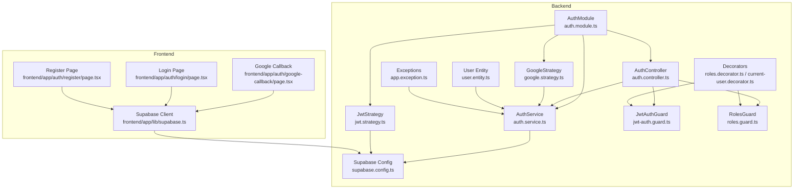
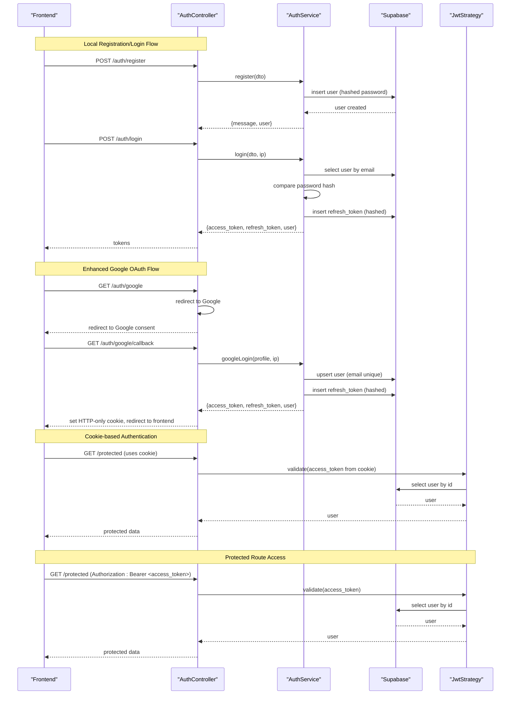
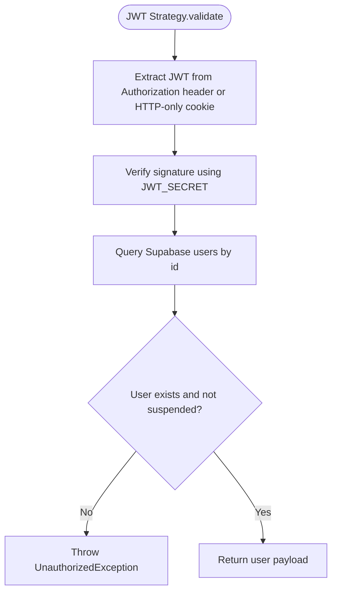
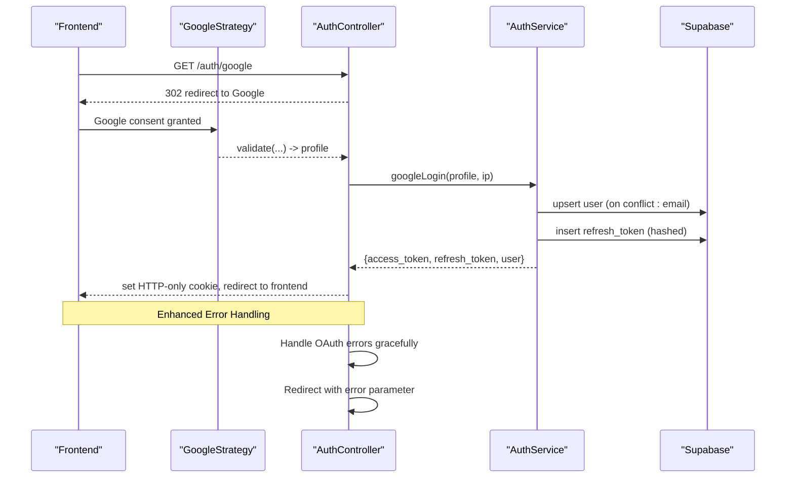
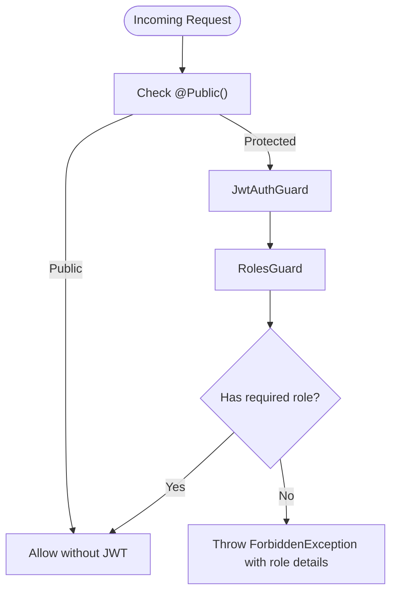
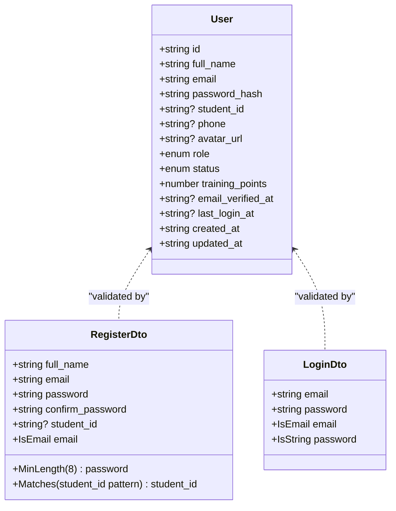
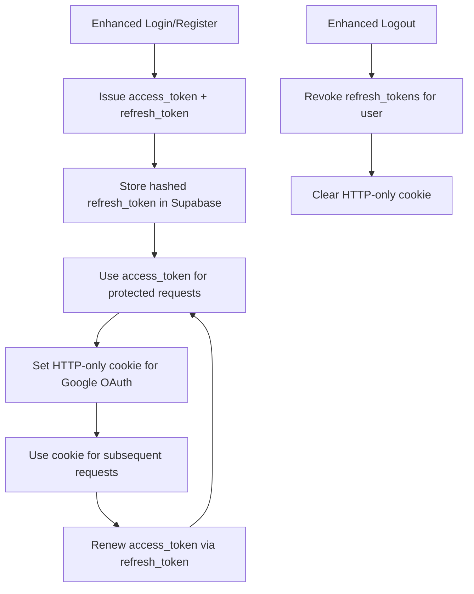
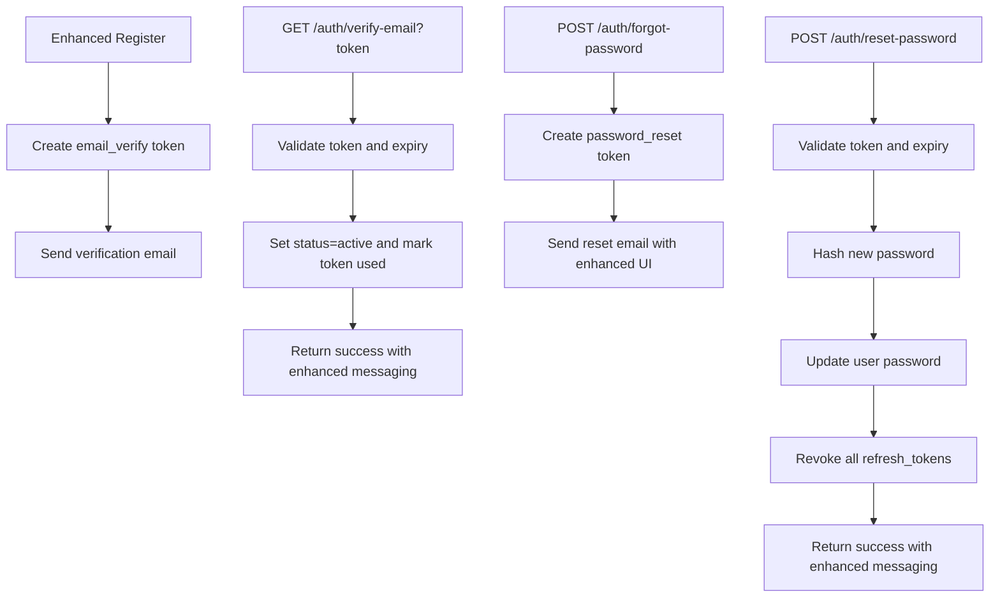
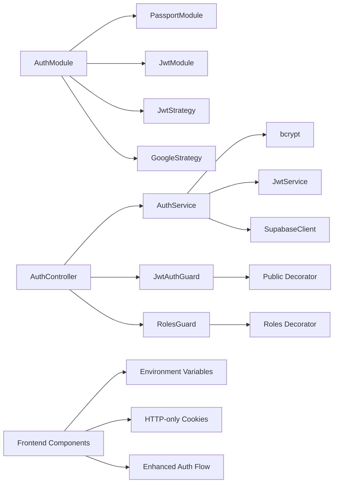

# User Authentication & Authorization

<cite>
**Referenced Files in This Document**
- [auth.module.ts](file://backend/src/modules/auth/auth.module.ts)
- [auth.service.ts](file://backend/src/modules/auth/auth.service.ts)
- [auth.controller.ts](file://backend/src/modules/auth/auth.controller.ts)
- [user.entity.ts](file://backend/src/modules/auth/entities/user.entity.ts)
- [jwt.strategy.ts](file://backend/src/modules/auth/strategies/jwt.strategy.ts)
- [google.strategy.ts](file://backend/src/modules/auth/strategies/google.strategy.ts)
- [register.dto.ts](file://backend/src/modules/auth/dto/register.dto.ts)
- [login.dto.ts](file://backend/src/modules/auth/dto/login.dto.ts)
- [jwt-auth.guard.ts](file://backend/src/common/guards/jwt-auth.guard.ts)
- [roles.guard.ts](file://backend/src/common/guards/roles.guard.ts)
- [roles.decorator.ts](file://backend/src/common/decorators/roles.decorator.ts)
- [current-user.decorator.ts](file://backend/src/common/decorators/current-user.decorator.ts)
- [supabase.config.ts](file://backend/src/config/supabase.config.ts)
- [supabase.ts](file://frontend/app/lib/supabase.ts)
- [google-callback/page.tsx](file://frontend/app/auth/google-callback/page.tsx)
- [login/page.tsx](file://frontend/app/auth/login/page.tsx)
- [register/page.tsx](file://frontend/app/auth/register/page.tsx)
- [app.exception.ts](file://backend/src/common/exceptions/app.exception.ts)
</cite>

## Update Summary
**Changes Made**
- Enhanced Google OAuth integration with improved security measures and token handling
- Updated JWT strategy to support dual authentication from headers and cookies
- Improved error handling and security validation throughout the authentication system
- Added comprehensive token refresh mechanisms and session management
- Enhanced frontend integration with proper cookie-based authentication flow
- Strengthened password hashing and credential validation processes

## Table of Contents
1. [Introduction](#introduction)
2. [Project Structure](#project-structure)
3. [Core Components](#core-components)
4. [Architecture Overview](#architecture-overview)
5. [Detailed Component Analysis](#detailed-component-analysis)
6. [Dependency Analysis](#dependency-analysis)
7. [Performance Considerations](#performance-considerations)
8. [Troubleshooting Guide](#troubleshooting-guide)
9. [Conclusion](#conclusion)
10. [Appendices](#appendices)

## Introduction
This document explains the User Authentication & Authorization system of the platform, focusing on:
- Dual authentication approach: JWT-based sessions and Google OAuth integration
- Registration, login, logout, and session lifecycle management
- Role-based access control (RBAC) with user roles and permissions
- Enhanced JWT strategy with cookie fallback and improved security
- Secure Google OAuth setup with proper token handling and account linking
- User entity structure, advanced password hashing, and credential validation
- Comprehensive authentication flows, error handling, and security best practices

## Project Structure
The authentication system spans the backend NestJS modules and shared guards, strategies, and DTOs. It integrates with Supabase for persistence and with the frontend Next.js application featuring enhanced cookie-based authentication.

**Diagram sources**
- [auth.module.ts:11-35](file://backend/src/modules/auth/auth.module.ts#L11-L35)
- [auth.controller.ts:27-130](file://backend/src/modules/auth/auth.controller.ts#L27-L130)
- [auth.service.ts:17-280](file://backend/src/modules/auth/auth.service.ts#L17-L280)
- [jwt.strategy.ts:16-58](file://backend/src/modules/auth/strategies/jwt.strategy.ts#L16-L58)
- [google.strategy.ts:6-38](file://backend/src/modules/auth/strategies/google.strategy.ts#L6-L38)
- [jwt-auth.guard.ts:7-29](file://backend/src/common/guards/jwt-auth.guard.ts#L7-L29)
- [roles.guard.ts:6-28](file://backend/src/common/guards/roles.guard.ts#L6-L28)
- [roles.decorator.ts:1-5](file://backend/src/common/decorators/roles.decorator.ts#L1-L5)
- [current-user.decorator.ts:1-9](file://backend/src/common/decorators/current-user.decorator.ts#L1-L9)
- [user.entity.ts:1-19](file://backend/src/modules/auth/entities/user.entity.ts#L1-L19)
- [supabase.config.ts:7-25](file://backend/src/config/supabase.config.ts#L7-L25)
- [supabase.ts:1-18](file://frontend/app/lib/supabase.ts#L1-L18)
- [google-callback/page.tsx:1-95](file://frontend/app/auth/google-callback/page.tsx#L1-L95)
- [login/page.tsx:1-211](file://frontend/app/auth/login/page.tsx#L1-L211)
- [register/page.tsx:1-359](file://frontend/app/auth/register/page.tsx#L1-L359)
- [app.exception.ts:1-46](file://backend/src/common/exceptions/app.exception.ts#L1-L46)

**Section sources**
- [auth.module.ts:11-35](file://backend/src/modules/auth/auth.module.ts#L11-L35)
- [auth.controller.ts:27-130](file://backend/src/modules/auth/auth.controller.ts#L27-L130)
- [auth.service.ts:17-280](file://backend/src/modules/auth/auth.service.ts#L17-L280)
- [jwt.strategy.ts:16-58](file://backend/src/modules/auth/strategies/jwt.strategy.ts#L16-L58)
- [google.strategy.ts:6-38](file://backend/src/modules/auth/strategies/google.strategy.ts#L6-L38)
- [jwt-auth.guard.ts:7-29](file://backend/src/common/guards/jwt-auth.guard.ts#L7-L29)
- [roles.guard.ts:6-28](file://backend/src/common/guards/roles.guard.ts#L6-L28)
- [roles.decorator.ts:1-5](file://backend/src/common/decorators/roles.decorator.ts#L1-L5)
- [current-user.decorator.ts:1-9](file://backend/src/common/decorators/current-user.decorator.ts#L1-L9)
- [user.entity.ts:1-19](file://backend/src/modules/auth/entities/user.entity.ts#L1-L19)
- [supabase.config.ts:7-25](file://backend/src/config/supabase.config.ts#L7-L25)
- [supabase.ts:1-18](file://frontend/app/lib/supabase.ts#L1-L18)
- [google-callback/page.tsx:1-95](file://frontend/app/auth/google-callback/page.tsx#L1-L95)
- [login/page.tsx:1-211](file://frontend/app/auth/login/page.tsx#L1-L211)
- [register/page.tsx:1-359](file://frontend/app/auth/register/page.tsx#L1-L359)
- [app.exception.ts:1-46](file://backend/src/common/exceptions/app.exception.ts#L1-L46)

## Core Components
- AuthModule initializes Passport, JWT module, and registers strategies with enhanced security configuration
- AuthService encapsulates business logic for registration, login, logout, email verification, password reset, and Google OAuth login with improved error handling
- AuthController exposes endpoints for registration, login, logout, email verification, password reset, and Google OAuth routes with enhanced cookie management
- JwtStrategy validates JWT tokens from both Authorization headers and HTTP-only cookies, supporting dual authentication methods
- GoogleStrategy handles Google OAuth profile extraction with improved security and proper error handling
- Guards enforce JWT authentication and RBAC via role metadata with enhanced validation
- DTOs define request validation for registration and login with comprehensive field validation
- User entity defines persisted user attributes with enhanced role and status management
- Supabase configuration centralizes client creation and environment checks with improved error reporting
- Frontend Supabase client sets Authorization header and manages cookie-based authentication flow

**Section sources**
- [auth.module.ts:11-35](file://backend/src/modules/auth/auth.module.ts#L11-L35)
- [auth.service.ts:17-280](file://backend/src/modules/auth/auth.service.ts#L17-L280)
- [auth.controller.ts:27-130](file://backend/src/modules/auth/auth.controller.ts#L27-L130)
- [jwt.strategy.ts:16-58](file://backend/src/modules/auth/strategies/jwt.strategy.ts#L16-L58)
- [google.strategy.ts:6-38](file://backend/src/modules/auth/strategies/google.strategy.ts#L6-L38)
- [jwt-auth.guard.ts:7-29](file://backend/src/common/guards/jwt-auth.guard.ts#L7-L29)
- [roles.guard.ts:6-28](file://backend/src/common/guards/roles.guard.ts#L6-L28)
- [register.dto.ts:1-30](file://backend/src/modules/auth/dto/register.dto.ts#L1-L30)
- [login.dto.ts:1-13](file://backend/src/modules/auth/dto/login.dto.ts#L1-L13)
- [user.entity.ts:1-19](file://backend/src/modules/auth/entities/user.entity.ts#L1-L19)
- [supabase.config.ts:7-25](file://backend/src/config/supabase.config.ts#L7-L25)
- [supabase.ts:1-18](file://frontend/app/lib/supabase.ts#L1-L18)

## Architecture Overview
The system uses an enhanced dual authentication approach with improved security measures:
- Local credentials with JWT for session management and secure refresh token handling
- Google OAuth for federated login with enhanced security and proper token management
- Cookie-based authentication for Google OAuth with HTTP-only security
- Comprehensive error handling and validation throughout the authentication pipeline

**Diagram sources**
- [auth.controller.ts:31-128](file://backend/src/modules/auth/auth.controller.ts#L31-L128)
- [auth.service.ts:22-173](file://backend/src/modules/auth/auth.service.ts#L22-L173)
- [jwt.strategy.ts:21-56](file://backend/src/modules/auth/strategies/jwt.strategy.ts#L21-L56)

## Detailed Component Analysis

### Enhanced JWT Strategy Implementation
The JWT strategy now supports dual authentication methods with improved security:
- Validates JWT from Authorization header first, then falls back to HTTP-only cookie
- Enhanced error handling for token validation failures
- Improved user status checking and account suspension handling
- Support for both local login and Google OAuth authentication flows

**Diagram sources**
- [jwt.strategy.ts:21-56](file://backend/src/modules/auth/strategies/jwt.strategy.ts#L21-L56)

**Section sources**
- [jwt.strategy.ts:16-58](file://backend/src/modules/auth/strategies/jwt.strategy.ts#L16-L58)
- [jwt-auth.guard.ts:7-29](file://backend/src/common/guards/jwt-auth.guard.ts#L7-L29)

### Enhanced Google OAuth Integration
The Google OAuth integration has been significantly improved with enhanced security and user experience:
- GoogleStrategy extracts profile fields with proper error handling and fallback values
- Enhanced googleLogin method with upsert functionality to prevent race conditions
- Improved token generation and secure password handling for Google users
- Better error handling and user status validation during OAuth flow
- HTTP-only cookie-based authentication for enhanced security

**Diagram sources**
- [google.strategy.ts:17-36](file://backend/src/modules/auth/strategies/google.strategy.ts#L17-L36)
- [auth.controller.ts:86-128](file://backend/src/modules/auth/auth.controller.ts#L86-L128)
- [auth.service.ts:113-173](file://backend/src/modules/auth/auth.service.ts#L113-L173)

**Section sources**
- [google.strategy.ts:6-38](file://backend/src/modules/auth/strategies/google.strategy.ts#L6-L38)
- [auth.controller.ts:86-128](file://backend/src/modules/auth/auth.controller.ts#L86-L128)
- [auth.service.ts:113-173](file://backend/src/modules/auth/auth.service.ts#L113-L173)

### Enhanced Role-Based Access Control (RBAC)
The RBAC system provides comprehensive role-based authorization with improved error handling:
- Roles decorator declares required roles per endpoint with enhanced validation
- RolesGuard enforces role checks against request.user with better error messages
- JwtAuthGuard allows bypass for public endpoints with improved security
- Enhanced permission checking with detailed error feedback

**Diagram sources**
- [roles.decorator.ts:1-5](file://backend/src/common/decorators/roles.decorator.ts#L1-L5)
- [roles.guard.ts:6-28](file://backend/src/common/guards/roles.guard.ts#L6-L28)
- [jwt-auth.guard.ts:7-29](file://backend/src/common/guards/jwt-auth.guard.ts#L7-L29)

**Section sources**
- [roles.decorator.ts:1-5](file://backend/src/common/decorators/roles.decorator.ts#L1-L5)
- [roles.guard.ts:6-28](file://backend/src/common/guards/roles.guard.ts#L6-L28)
- [jwt-auth.guard.ts:7-29](file://backend/src/common/guards/jwt-auth.guard.ts#L7-L29)

### Enhanced User Entity and Credential Validation
The user entity and credential validation system has been strengthened:
- User entity defines comprehensive fields, roles, and statuses with enhanced type safety
- DTOs validate registration and login requests with improved field validation
- Advanced password hashing using bcrypt with configurable cost factors
- Enhanced user status management with proper validation states

**Diagram sources**
- [user.entity.ts:1-19](file://backend/src/modules/auth/entities/user.entity.ts#L1-L19)
- [register.dto.ts:1-30](file://backend/src/modules/auth/dto/register.dto.ts#L1-L30)
- [login.dto.ts:1-13](file://backend/src/modules/auth/dto/login.dto.ts#L1-L13)

**Section sources**
- [user.entity.ts:1-19](file://backend/src/modules/auth/entities/user.entity.ts#L1-L19)
- [register.dto.ts:1-30](file://backend/src/modules/auth/dto/register.dto.ts#L1-L30)
- [login.dto.ts:1-13](file://backend/src/modules/auth/dto/login.dto.ts#L1-L13)
- [auth.service.ts:22-69](file://backend/src/modules/auth/auth.service.ts#L22-L69)

### Enhanced Session Management and Token Lifecycle
The session management system has been improved with enhanced security:
- Access tokens are short-lived JWTs with configurable expiration
- Refresh tokens are UUIDs hashed with bcrypt and securely stored
- Enhanced logout mechanism with proper token revocation
- HTTP-only cookie-based authentication for Google OAuth
- Improved frontend integration with proper cookie handling

**Diagram sources**
- [auth.service.ts:72-110](file://backend/src/modules/auth/auth.service.ts#L72-L110)
- [auth.service.ts:175-184](file://backend/src/modules/auth/auth.service.ts#L175-L184)
- [auth.controller.ts:51-61](file://backend/src/modules/auth/auth.controller.ts#L51-L61)
- [supabase.ts:7-17](file://frontend/app/lib/supabase.ts#L7-L17)

**Section sources**
- [auth.service.ts:72-110](file://backend/src/modules/auth/auth.service.ts#L72-L110)
- [auth.service.ts:175-184](file://backend/src/modules/auth/auth.service.ts#L175-L184)
- [auth.controller.ts:51-61](file://backend/src/modules/auth/auth.controller.ts#L51-L61)
- [supabase.ts:7-17](file://frontend/app/lib/supabase.ts#L7-L17)

### Enhanced Email Verification and Password Reset
The email verification and password reset system has been strengthened:
- Registration creates email verification tokens with proper expiration handling
- Enhanced verification process with improved error handling and validation
- Password reset with time-limited tokens and comprehensive security measures
- Token revocation system to invalidate compromised tokens
- Improved user feedback and error messaging throughout the process

**Diagram sources**
- [auth.service.ts:22-69](file://backend/src/modules/auth/auth.service.ts#L22-L69)
- [auth.service.ts:186-214](file://backend/src/modules/auth/auth.service.ts#L186-L214)
- [auth.service.ts:216-240](file://backend/src/modules/auth/auth.service.ts#L216-L240)
- [auth.service.ts:242-278](file://backend/src/modules/auth/auth.service.ts#L242-L278)

**Section sources**
- [auth.service.ts:22-69](file://backend/src/modules/auth/auth.service.ts#L22-L69)
- [auth.service.ts:186-214](file://backend/src/modules/auth/auth.service.ts#L186-L214)
- [auth.service.ts:216-240](file://backend/src/modules/auth/auth.service.ts#L216-L240)
- [auth.service.ts:242-278](file://backend/src/modules/auth/auth.service.ts#L242-L278)

## Dependency Analysis
The enhanced authentication system maintains strong dependency relationships:
- AuthModule depends on Passport, JwtModule, and strategy providers with enhanced configuration
- AuthController depends on AuthService and guards with improved error handling
- AuthService depends on Supabase client, bcrypt, and JWT services with enhanced security
- Guards depend on decorators and request context with better validation
- Frontend components depend on Supabase client and enhanced cookie management
- Google OAuth integration requires proper environment configuration and error handling

**Diagram sources**
- [auth.module.ts:11-35](file://backend/src/modules/auth/auth.module.ts#L11-L35)
- [auth.controller.ts:27-130](file://backend/src/modules/auth/auth.controller.ts#L27-L130)
- [auth.service.ts:17-280](file://backend/src/modules/auth/auth.service.ts#L17-L280)
- [jwt-auth.guard.ts:7-29](file://backend/src/common/guards/jwt-auth.guard.ts#L7-L29)
- [roles.guard.ts:6-28](file://backend/src/common/guards/roles.guard.ts#L6-L28)
- [supabase.ts:1-18](file://frontend/app/lib/supabase.ts#L1-L18)

**Section sources**
- [auth.module.ts:11-35](file://backend/src/modules/auth/auth.module.ts#L11-L35)
- [auth.controller.ts:27-130](file://backend/src/modules/auth/auth.controller.ts#L27-L130)
- [auth.service.ts:17-280](file://backend/src/modules/auth/auth.service.ts#L17-L280)
- [jwt-auth.guard.ts:7-29](file://backend/src/common/guards/jwt-auth.guard.ts#L7-L29)
- [roles.guard.ts:6-28](file://backend/src/common/guards/roles.guard.ts#L6-L28)
- [supabase.ts:1-18](file://frontend/app/lib/supabase.ts#L1-L18)

## Performance Considerations
Enhanced performance considerations for the improved authentication system:
- Keep JWT payload minimal (sub, email, role) to reduce token size and parsing overhead
- Use bcrypt cost appropriate for deployment capacity; optimized to 12 rounds for security/performance balance
- Enhanced caching strategies for frequently accessed user roles/status with proper invalidation
- Optimized database queries in JwtStrategy.validate with efficient user lookup
- Improved Supabase connection pooling and connection reuse patterns
- Enhanced cookie-based authentication reduces token transmission overhead
- Optimized Google OAuth flow with proper error handling and retry mechanisms

## Troubleshooting Guide
Enhanced troubleshooting guide for the improved authentication system:

**JWT Authentication Issues**
- Missing JWT_SECRET or invalid configuration
  - Symptom: JWT module fails to initialize with explicit error
  - Resolution: Ensure JWT_SECRET environment variable is present and valid
  - Section sources: [auth.module.ts:18-21](file://backend/src/modules/auth/auth.module.ts#L18-L21)

**Google OAuth Integration Problems**
- Google OAuth redirect_uri_mismatch
  - Symptom: OAuth callback fails with mismatch error
  - Resolution: Match callback URL exactly in Google Console and environment configuration
  - Section sources: [google.strategy.ts:10-13](file://backend/src/modules/auth/strategies/google.strategy.ts#L10-L13)
- OAuth error handling failures
  - Symptom: Google login errors not properly handled
  - Resolution: Check backend error handling in googleCallback method
  - Section sources: [auth.controller.ts:102-104](file://backend/src/modules/auth/auth.controller.ts#L102-L104)
- Cookie-based authentication issues
  - Symptom: HTTP-only cookie not being set or accessed
  - Resolution: Verify cookie configuration and frontend cookie handling
  - Section sources: [auth.controller.ts:111-118](file://backend/src/modules/auth/auth.controller.ts#L111-L118)

**Enhanced User Status and Account Issues**
- Suspended account access attempts
  - Symptom: UnauthorizedException for suspended accounts
  - Resolution: Verify account status and contact administrator
  - Section sources: [jwt.strategy.ts:53](file://backend/src/modules/auth/strategies/jwt.strategy.ts#L53)
- Pending verification account login attempts
  - Symptom: Login blocked for unverified accounts
  - Resolution: Complete email verification process
  - Section sources: [auth.service.ts:86-88](file://backend/src/modules/auth/auth.service.ts#L86-L88)

**Enhanced Token and Session Management**
- Token validation failures
  - Symptom: Invalid token or expired token errors
  - Resolution: Check token expiration and JWT_SECRET configuration
  - Section sources: [jwt.strategy.ts:52](file://backend/src/modules/auth/strategies/jwt.strategy.ts#L52)
- Refresh token issues
  - Symptom: Refresh token not working or revoked
  - Resolution: Verify refresh token storage and revocation status
  - Section sources: [auth.service.ts:178-182](file://backend/src/modules/auth/auth.service.ts#L178-L182)

**Frontend Authentication Integration**
- Frontend cannot authenticate with enhanced cookie system
  - Symptom: Missing Authorization header or cookie conflicts
  - Resolution: Disable auto-refresh and use enhanced cookie-based authentication
  - Section sources: [supabase.ts:10-12](file://frontend/app/lib/supabase.ts#L10-L12)
- Google OAuth callback handling issues
  - Symptom: Google login callback not processing correctly
  - Resolution: Check frontend Google callback page implementation
  - Section sources: [google-callback/page.tsx:13-28](file://frontend/app/auth/google-callback/page.tsx#L13-L28)

## Conclusion
The platform implements an enhanced dual authentication system combining robust JWT-based sessions and secure Google OAuth integration. The system emphasizes improved security measures, comprehensive error handling, and resilient token lifecycle management. Key enhancements include HTTP-only cookie-based authentication, dual JWT extraction methods, improved user status validation, and enhanced frontend integration. Proper environment configuration, strict validation, and defensive error handling ensure a reliable and secure user experience with significantly improved security posture.

## Appendices
- Enhanced security best practices
  - Never commit environment files containing secrets including JWT_SECRET and Google OAuth credentials
  - Use separate OAuth clients for development and production environments
  - Regularly rotate JWT_SECRET and other authentication secrets
  - Monitor Google Cloud Console usage and OAuth application health
  - Keep JWT_SECRET and other secrets out of client-side code and cookie configurations
  - Implement proper cookie security settings (HttpOnly, Secure, SameSite)
  - Regularly audit user account statuses and authentication logs
  - Section sources: [auth.module.ts:18-21](file://backend/src/modules/auth/auth.module.ts#L18-L21), [auth.controller.ts:111-118](file://backend/src/modules/auth/auth.controller.ts#L111-L118)