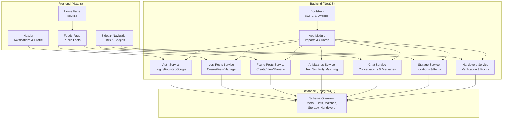
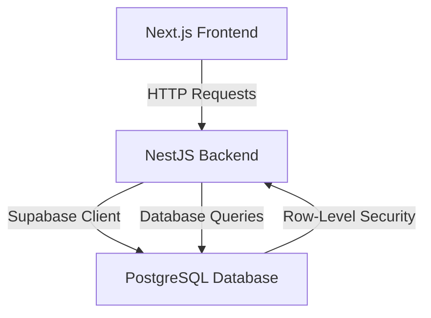
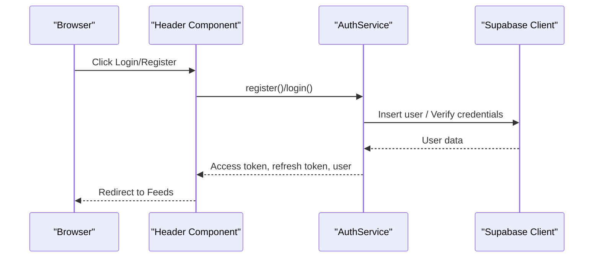
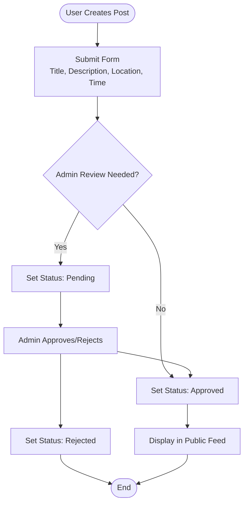
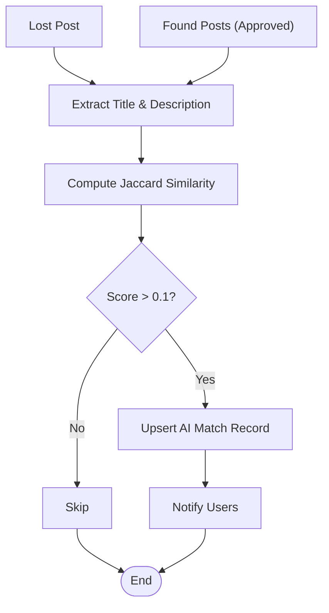
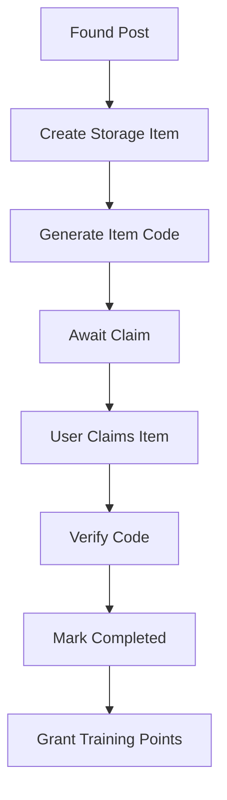
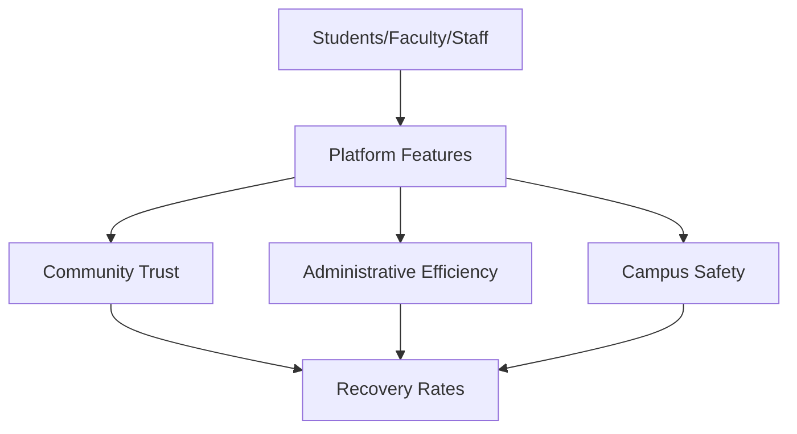

# Introduction and Purpose

<cite>
**Referenced Files in This Document**
- [README.md](file://README.md)
- [OVERVIEW.md](file://OVERVIEW.md)
- [backend/src/main.ts](file://backend/src/main.ts)
- [backend/src/app.module.ts](file://backend/src/app.module.ts)
- [backend/src/modules/auth/auth.service.ts](file://backend/src/modules/auth/auth.service.ts)
- [backend/src/modules/lost-posts/lost-posts.service.ts](file://backend/src/modules/lost-posts/lost-posts.service.ts)
- [backend/src/modules/found-posts/found-posts.service.ts](file://backend/src/modules/found-posts/found-posts.service.ts)
- [backend/src/modules/chat/chat.service.ts](file://backend/src/modules/chat/chat.service.ts)
- [backend/src/modules/storage/storage.service.ts](file://backend/src/modules/storage/storage.service.ts)
- [backend/src/modules/ai-matches/ai-matches.service.ts](file://backend/src/modules/ai-matches/ai-matches.service.ts)
- [backend/src/modules/handovers/handovers.service.ts](file://backend/src/modules/handovers/handovers.service.ts)
- [frontend/app/layout.tsx](file://frontend/app/layout.tsx)
- [frontend/app/page.tsx](file://frontend/app/page.tsx)
- [frontend/app/feeds/page.tsx](file://frontend/app/feeds/page.tsx)
- [frontend/app/components/Header.tsx](file://frontend/app/components/Header.tsx)
- [frontend/app/components/SideNavBar.tsx](file://frontend/app/components/SideNavBar.tsx)
- [frontend/app/lib/supabase.ts](file://frontend/app/lib/supabase.ts)
</cite>

## Table of Contents
1. [Introduction](#introduction)
2. [Project Structure](#project-structure)
3. [Core Components](#core-components)
4. [Architecture Overview](#architecture-overview)
5. [Detailed Component Analysis](#detailed-component-analysis)
6. [Dependency Analysis](#dependency-analysis)
7. [Performance Considerations](#performance-considerations)
8. [Troubleshooting Guide](#troubleshooting-guide)
9. [Conclusion](#conclusion)

## Introduction
MissLost is a dedicated lost and found community platform designed to strengthen connections within the University of Economics and Technology (UEH) campus. Its mission is to bridge the gap between individuals who have lost personal items and those who have found them, fostering a culture of trust, responsibility, and mutual support.

The platform addresses real-life challenges on campus:
- Difficulties recovering lost items due to fragmented communication channels
- Lack of a centralized system for tracking lost and found reports
- Limited mechanisms to verify trust between parties during handovers
- Administrative overhead in managing item recovery processes

By offering a unified digital space, MissLost enables seamless reporting, discovery, and resolution of lost items while reinforcing campus safety and community spirit. It supports students, faculty, and staff by streamlining item recovery, encouraging responsible behavior, and introducing gamified incentives through a trust score and training points system.

## Project Structure
MissLost follows a modern full-stack architecture:
- Frontend built with Next.js, implementing a responsive UI with glass morphism design and intuitive navigation
- Backend powered by NestJS, organized into modular services for authentication, posts, AI matching, chat, storage, handovers, and notifications
- Database layer leveraging PostgreSQL with row-level security and structured views for efficient querying
- Real-time capabilities through chat and polling-driven updates
- Authentication integrated with Supabase for secure user sessions

**Diagram sources**
- [backend/src/main.ts:1-45](file://backend/src/main.ts#L1-L45)
- [backend/src/app.module.ts:1-67](file://backend/src/app.module.ts#L1-L67)
- [frontend/app/layout.tsx:1-44](file://frontend/app/layout.tsx#L1-L44)
- [frontend/app/feeds/page.tsx:1-489](file://frontend/app/feeds/page.tsx#L1-L489)
- [OVERVIEW.md:644-695](file://OVERVIEW.md#L644-L695)

**Section sources**
- [README.md:1-10](file://README.md#L1-L10)
- [OVERVIEW.md:644-695](file://OVERVIEW.md#L644-L695)
- [backend/src/main.ts:1-45](file://backend/src/main.ts#L1-L45)
- [backend/src/app.module.ts:1-67](file://backend/src/app.module.ts#L1-L67)
- [frontend/app/layout.tsx:1-44](file://frontend/app/layout.tsx#L1-L44)

## Core Components
MissLost’s core components work together to deliver a cohesive user experience:

- Authentication and User Management
  - Secure login and registration with email/password and Google OAuth
  - Role-based permissions (user, admin, storage staff)
  - Session and refresh token handling

- Lost and Found Posts
  - Public feeds of approved posts for both lost and found items
  - Submission forms with optional images and categorization
  - Pending review workflow with admin oversight

- AI-Powered Matching
  - Text-based similarity matching between lost and found posts
  - Confidence scoring to surface relevant matches automatically

- Messaging and Conversations
  - Private messaging between parties involved in a potential recovery
  - Unread indicators and real-time-like updates

- Storage and Handover
  - Centralized storage locations for items awaiting retrieval
  - Secure verification codes for handovers and automatic training points

- Trust and Community Incentives
  - Trust score visibility and community tips
  - Training points awarded upon successful handovers

**Section sources**
- [backend/src/modules/auth/auth.service.ts:1-274](file://backend/src/modules/auth/auth.service.ts#L1-L274)
- [backend/src/modules/lost-posts/lost-posts.service.ts:1-189](file://backend/src/modules/lost-posts/lost-posts.service.ts#L1-L189)
- [backend/src/modules/found-posts/found-posts.service.ts:1-162](file://backend/src/modules/found-posts/found-posts.service.ts#L1-L162)
- [backend/src/modules/ai-matches/ai-matches.service.ts:1-367](file://backend/src/modules/ai-matches/ai-matches.service.ts#L1-L367)
- [backend/src/modules/chat/chat.service.ts:1-151](file://backend/src/modules/chat/chat.service.ts#L1-L151)
- [backend/src/modules/storage/storage.service.ts:1-117](file://backend/src/modules/storage/storage.service.ts#L1-L117)
- [backend/src/modules/handovers/handovers.service.ts:1-147](file://backend/src/modules/handovers/handovers.service.ts#L1-L147)
- [frontend/app/feeds/page.tsx:1-489](file://frontend/app/feeds/page.tsx#L1-L489)
- [frontend/app/components/SideNavBar.tsx:1-151](file://frontend/app/components/SideNavBar.tsx#L1-L151)

## Architecture Overview
The platform integrates frontend, backend, and database layers with clear separation of concerns:

- Frontend
  - Next.js app shell with theme provider, route guard, and client-side routing
  - Pages for feeds, messaging, storage, and user settings
  - Components for header, navigation, and post composition

- Backend
  - NestJS application bootstrapped with CORS, validation pipes, and Swagger documentation
  - Modular services for auth, posts, AI matching, chat, storage, and handovers
  - Global guards and interceptors for consistent request handling

- Database
  - PostgreSQL schema with enums, tables, indexes, and views
  - Row-level security policies for user-scoped access
  - Stored procedures for automated point granting and status updates

**Diagram sources**
- [frontend/app/layout.tsx:1-44](file://frontend/app/layout.tsx#L1-L44)
- [backend/src/main.ts:1-45](file://backend/src/main.ts#L1-L45)
- [frontend/app/lib/supabase.ts:1-18](file://frontend/app/lib/supabase.ts#L1-L18)
- [OVERVIEW.md:644-695](file://OVERVIEW.md#L644-L695)

**Section sources**
- [frontend/app/layout.tsx:1-44](file://frontend/app/layout.tsx#L1-L44)
- [backend/src/main.ts:1-45](file://backend/src/main.ts#L1-L45)
- [frontend/app/lib/supabase.ts:1-18](file://frontend/app/lib/supabase.ts#L1-L18)
- [OVERVIEW.md:644-695](file://OVERVIEW.md#L644-L695)

## Detailed Component Analysis

### Authentication Flow
The authentication service handles user registration, login, Google OAuth, and session management. It ensures secure access to protected resources and enforces account status checks.

**Diagram sources**
- [frontend/app/components/Header.tsx:1-265](file://frontend/app/components/Header.tsx#L1-L265)
- [backend/src/modules/auth/auth.service.ts:1-274](file://backend/src/modules/auth/auth.service.ts#L1-L274)
- [frontend/app/lib/supabase.ts:1-18](file://frontend/app/lib/supabase.ts#L1-L18)

**Section sources**
- [backend/src/modules/auth/auth.service.ts:1-274](file://backend/src/modules/auth/auth.service.ts#L1-L274)
- [frontend/app/components/Header.tsx:1-265](file://frontend/app/components/Header.tsx#L1-L265)
- [frontend/app/lib/supabase.ts:1-18](file://frontend/app/lib/supabase.ts#L1-L18)

### Lost and Found Post Lifecycle
Lost and found posts are central to the platform. They support creation, viewing, editing, deletion, and admin review. Approved posts appear in the public feed.

**Diagram sources**
- [backend/src/modules/lost-posts/lost-posts.service.ts:19-43](file://backend/src/modules/lost-posts/lost-posts.service.ts#L19-L43)
- [backend/src/modules/found-posts/found-posts.service.ts:19-38](file://backend/src/modules/found-posts/found-posts.service.ts#L19-L38)
- [frontend/app/feeds/page.tsx:72-113](file://frontend/app/feeds/page.tsx#L72-L113)

**Section sources**
- [backend/src/modules/lost-posts/lost-posts.service.ts:1-189](file://backend/src/modules/lost-posts/lost-posts.service.ts#L1-L189)
- [backend/src/modules/found-posts/found-posts.service.ts:1-162](file://backend/src/modules/found-posts/found-posts.service.ts#L1-L162)
- [frontend/app/feeds/page.tsx:1-489](file://frontend/app/feeds/page.tsx#L1-L489)

### AI Matching for Recovery
The AI matching service computes text similarity between lost and found posts to suggest relevant matches, reducing manual effort and increasing recovery rates.

**Diagram sources**
- [backend/src/modules/ai-matches/ai-matches.service.ts:45-96](file://backend/src/modules/ai-matches/ai-matches.service.ts#L45-L96)
- [backend/src/modules/ai-matches/ai-matches.service.ts:144-153](file://backend/src/modules/ai-matches/ai-matches.service.ts#L144-L153)

**Section sources**
- [backend/src/modules/ai-matches/ai-matches.service.ts:1-367](file://backend/src/modules/ai-matches/ai-matches.service.ts#L1-L367)

### Messaging and Conversations
Messaging enables direct communication between parties. The chat service manages conversations, messages, and unread counters.

```mermaid
sequenceDiagram
participant UserA as "Owner of Lost Post"
participant UserB as "Finder of Found Post"
participant ChatSvc as "ChatService"
participant DB as "PostgreSQL"
UserA->>ChatSvc : Create/Get Conversation
ChatSvc->>DB : Insert/Select Conversation
UserB->>ChatSvc : Send Message
ChatSvc->>DB : Insert Message
DB-->>ChatSvc : Last Message Timestamp
ChatSvc-->>UserA : Messages List
ChatSvc-->>UserB : Messages List
```

**Diagram sources**
- [backend/src/modules/chat/chat.service.ts:38-66](file://backend/src/modules/chat/chat.service.ts#L38-L66)
- [backend/src/modules/chat/chat.service.ts:102-126](file://backend/src/modules/chat/chat.service.ts#L102-L126)

**Section sources**
- [backend/src/modules/chat/chat.service.ts:1-151](file://backend/src/modules/chat/chat.service.ts#L1-L151)

### Storage and Handover
When items are turned in, they are recorded in storage with a unique item code. Handovers require verification codes and award training points upon completion.

**Diagram sources**
- [backend/src/modules/storage/storage.service.ts:53-78](file://backend/src/modules/storage/storage.service.ts#L53-L78)
- [backend/src/modules/handovers/handovers.service.ts:12-32](file://backend/src/modules/handovers/handovers.service.ts#L12-L32)
- [backend/src/modules/handovers/handovers.service.ts:117-131](file://backend/src/modules/handovers/handovers.service.ts#L117-L131)

**Section sources**
- [backend/src/modules/storage/storage.service.ts:1-117](file://backend/src/modules/storage/storage.service.ts#L1-L117)
- [backend/src/modules/handovers/handovers.service.ts:1-147](file://backend/src/modules/handovers/handovers.service.ts#L1-L147)

### Conceptual Overview
MissLost enhances campus life by:
- Building trust through transparent profiles, trust scores, and verified handovers
- Reducing administrative burden with automated matching and status workflows
- Improving safety by centralizing reporting and providing clear communication channels
- Encouraging community participation through gamification and recognition

[No sources needed since this diagram shows conceptual workflow, not actual code structure]

[No sources needed since this section doesn't analyze specific source files]

## Dependency Analysis
The application’s module dependencies reflect a layered architecture with clear boundaries:

```mermaid
graph TB
AppModule["AppModule"]
AuthModule["AuthModule"]
UsersModule["UsersModule"]
CategoriesModule["CategoriesModule"]
LostPostsModule["LostPostsModule"]
FoundPostsModule["FoundPostsModule"]
AiMatchesModule["AiMatchesModule"]
StorageModule["StorageModule"]
ChatModule["ChatModule"]
HandoversModule["HandoversModule"]
NotificationsModule["NotificationsModule"]
UploadModule["UploadModule"]
TriggersModule["TriggersModule"]
AppModule --> AuthModule
AppModule --> UsersModule
AppModule --> CategoriesModule
AppModule --> LostPostsModule
AppModule --> FoundPostsModule
AppModule --> AiMatchesModule
AppModule --> StorageModule
AppModule --> ChatModule
AppModule --> HandoversModule
AppModule --> NotificationsModule
AppModule --> UploadModule
AppModule --> TriggersModule
```

**Diagram sources**
- [backend/src/app.module.ts:28-44](file://backend/src/app.module.ts#L28-L44)

**Section sources**
- [backend/src/app.module.ts:1-67](file://backend/src/app.module.ts#L1-L67)

## Performance Considerations
- Database indexing and full-text search improve query performance for post feeds and admin dashboards
- Pagination and infinite scrolling reduce memory usage on the frontend
- Background tasks and stored procedures handle automation (e.g., training points) efficiently
- Client-side caching and prefetching enhance navigation responsiveness

[No sources needed since this section provides general guidance]

## Troubleshooting Guide
Common issues and resolutions:
- Authentication failures: Verify email status and account suspension; ensure correct credentials and token validity
- Post submission errors: Check required fields and category selection; confirm admin review settings
- Chat unread counts: Polling intervals and token presence affect accuracy; ensure proper session handling
- Storage item claims: Validate item codes and statuses; confirm storage availability

**Section sources**
- [backend/src/modules/auth/auth.service.ts:86-91](file://backend/src/modules/auth/auth.service.ts#L86-L91)
- [backend/src/modules/chat/chat.service.ts:128-136](file://backend/src/modules/chat/chat.service.ts#L128-L136)
- [backend/src/modules/storage/storage.service.ts:80-99](file://backend/src/modules/storage/storage.service.ts#L80-L99)

## Conclusion
MissLost transforms campus item recovery by connecting people, automating processes, and rewarding positive behavior. It strengthens community bonds, reduces administrative overhead, and contributes to a safer, more supportive university environment. Designed for students, faculty, and staff, the platform offers a practical solution to everyday challenges while promoting trust and responsibility across the UEH community.