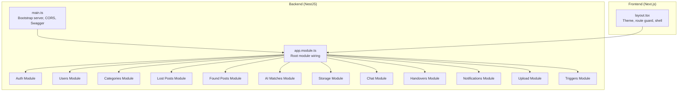
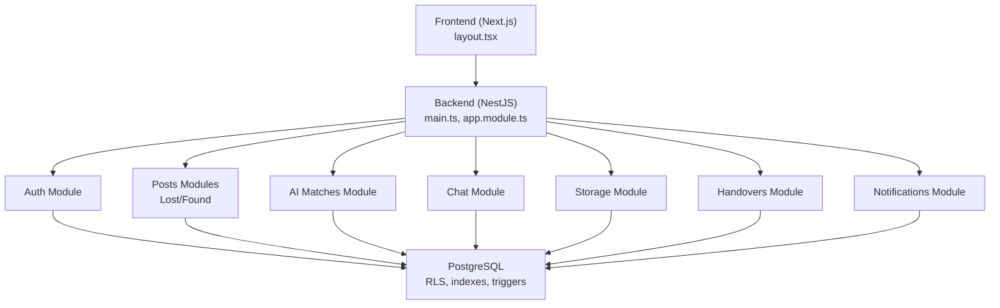
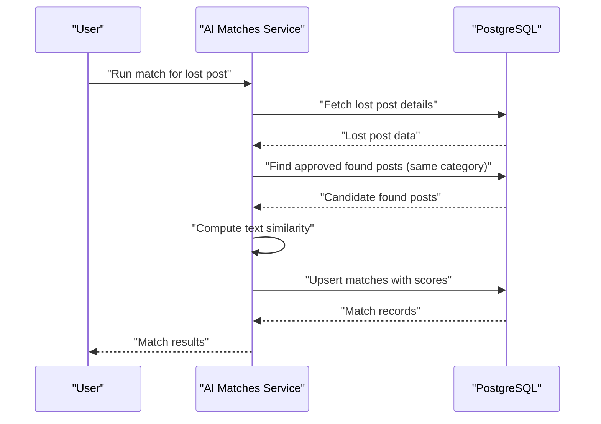
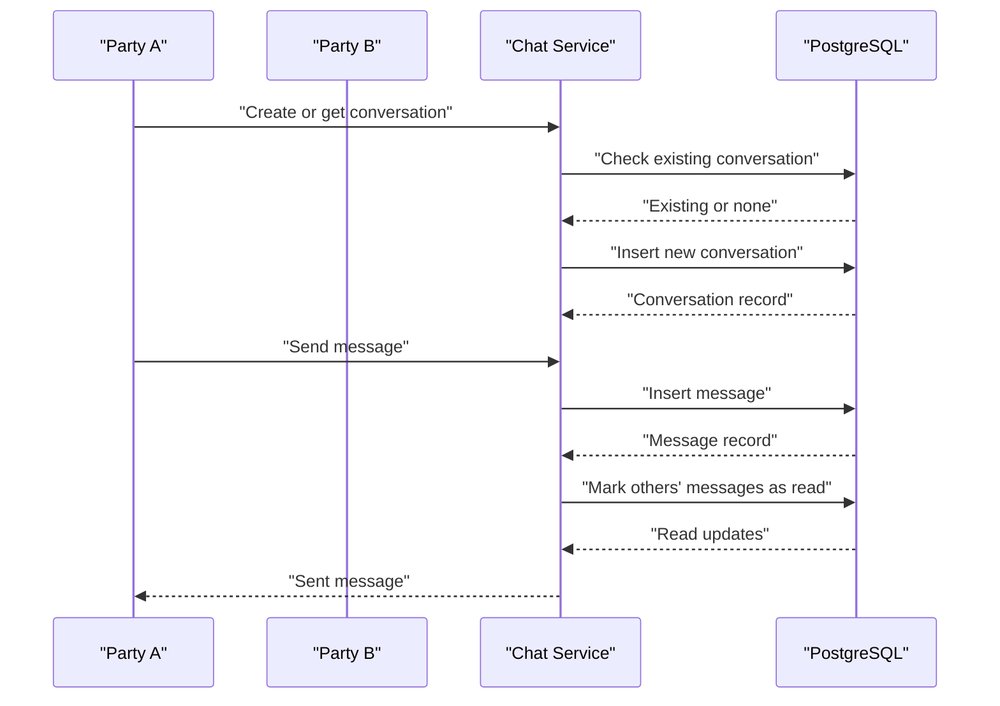
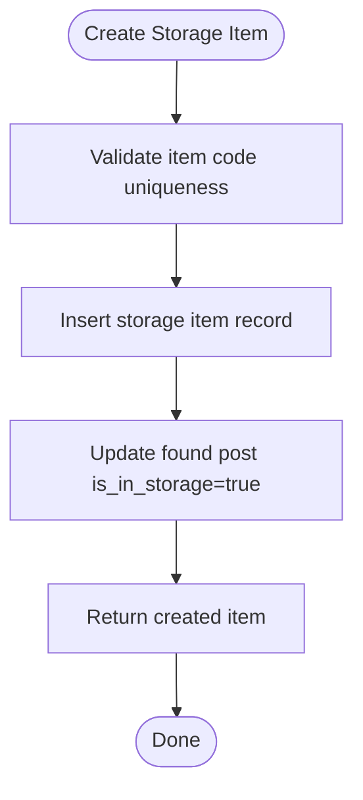
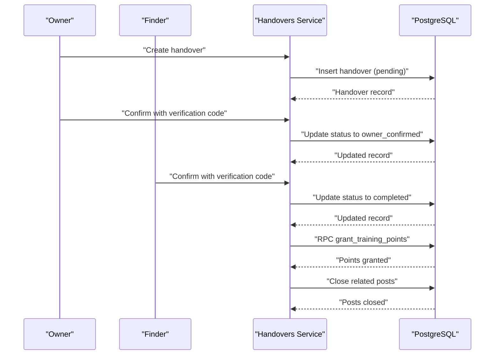
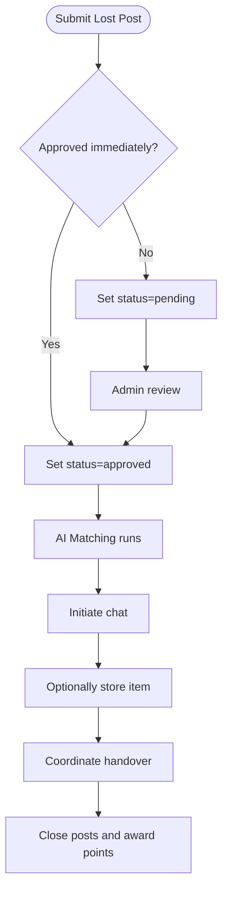
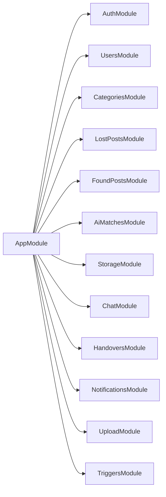

# Project Overview

<cite>
**Referenced Files in This Document**
- [README.md](file://README.md)
- [OVERVIEW.md](file://OVERVIEW.md)
- [backend/src/main.ts](file://backend/src/main.ts)
- [backend/src/app.module.ts](file://backend/src/app.module.ts)
- [backend/src/modules/ai-matches/ai-matches.module.ts](file://backend/src/modules/ai-matches/ai-matches.module.ts)
- [backend/src/modules/ai-matches/ai-matches.service.ts](file://backend/src/modules/ai-matches/ai-matches.service.ts)
- [backend/src/modules/chat/chat.module.ts](file://backend/src/modules/chat/chat.module.ts)
- [backend/src/modules/chat/chat.service.ts](file://backend/src/modules/chat/chat.service.ts)
- [backend/src/modules/storage/storage.module.ts](file://backend/src/modules/storage/storage.module.ts)
- [backend/src/modules/storage/storage.service.ts](file://backend/src/modules/storage/storage.service.ts)
- [backend/src/modules/handovers/handovers.module.ts](file://backend/src/modules/handovers/handovers.module.ts)
- [backend/src/modules/handovers/handovers.service.ts](file://backend/src/modules/handovers/handovers.service.ts)
- [backend/src/modules/lost-posts/lost-posts.module.ts](file://backend/src/modules/lost-posts/lost-posts.module.ts)
- [backend/src/modules/lost-posts/lost-posts.service.ts](file://backend/src/modules/lost-posts/lost-posts.service.ts)
- [frontend/app/layout.tsx](file://frontend/app/layout.tsx)
</cite>

## Table of Contents
1. [Introduction](#introduction)
2. [Project Structure](#project-structure)
3. [Core Components](#core-components)
4. [Architecture Overview](#architecture-overview)
5. [Detailed Component Analysis](#detailed-component-analysis)
6. [Dependency Analysis](#dependency-analysis)
7. [Performance Considerations](#performance-considerations)
8. [Troubleshooting Guide](#troubleshooting-guide)
9. [Conclusion](#conclusion)
10. [Appendices](#appendices)

## Introduction
MissLost is a blog-style web application designed to support the University of Economics and Technology (UEH) campus community by helping students and staff report lost items and find found items. It integrates modern features such as AI-powered matching, real-time chat, centralized storage management, and a training points system to encourage responsible handover and community participation. The platform aims to streamline item recovery, reduce administrative overhead, and foster trust and collaboration among community members.

The application’s purpose aligns with the university’s mission to build a connected and supportive campus life. It provides a structured workflow for reporting, reviewing, matching, communicating, storing, and completing handovers, while rewarding positive contributions through a points system.

**Section sources**
- [README.md:1-10](file://README.md#L1-L10)

## Project Structure
The project follows a modular backend architecture built with NestJS and a Next.js frontend. The backend exposes RESTful APIs organized by domain modules (authentication, posts, AI matching, chat, storage, handovers, notifications, uploads, triggers). The frontend organizes pages and components under an app directory, with routing, theming, and guard mechanisms to manage access and UX.

**Diagram sources**
- [backend/src/main.ts:1-41](file://backend/src/main.ts#L1-L41)
- [backend/src/app.module.ts:1-67](file://backend/src/app.module.ts#L1-L67)
- [frontend/app/layout.tsx:1-44](file://frontend/app/layout.tsx#L1-L44)

**Section sources**
- [backend/src/main.ts:1-41](file://backend/src/main.ts#L1-L41)
- [backend/src/app.module.ts:1-67](file://backend/src/app.module.ts#L1-L67)
- [frontend/app/layout.tsx:1-44](file://frontend/app/layout.tsx#L1-L44)

## Core Components
This section outlines the primary functional domains and their responsibilities:

- Authentication and Authorization
  - Handles user registration, login, role-based access, and session management.
  - Integrates JWT and role guards for protected routes.

- Lost and Found Posts
  - Supports creation, querying, editing, deletion, and admin review of posts.
  - Implements status lifecycle (pending, approved, rejected, matched, closed).

- AI-Powered Matching
  - Computes text similarity between lost and found posts to propose matches.
  - Tracks match outcomes and supports manual confirmation by parties.

- Real-Time Chat
  - Manages conversations and messages between parties associated with a match.
  - Enforces participant checks and marks messages as read.

- Storage Management
  - Tracks items stored on campus, assigns item codes, and manages claims.
  - Links found posts to storage records and updates statuses accordingly.

- Handover and Training Points
  - Coordinates verified handovers with offline verification codes.
  - Automatically grants training points upon successful completion and closes related posts.

- Notifications
  - Emits real-time notifications for key events such as approvals, matches, messages, and completions.

- Uploads and Triggers
  - Provides upload capabilities and database triggers for operational automation.

Practical examples:
- Item registration: A user submits a lost post with title, description, images, and category; the post transitions to approved immediately or pending depending on policy.
- Matching process: The system computes text similarity against approved found posts and proposes matches; both parties confirm to finalize.
- Handover procedure: Parties coordinate offline using a verification code; upon confirmation, the system awards points and closes the posts.

**Section sources**
- [OVERVIEW.md:42-62](file://OVERVIEW.md#L42-L62)
- [backend/src/modules/lost-posts/lost-posts.service.ts:19-43](file://backend/src/modules/lost-posts/lost-posts.service.ts#L19-L43)
- [backend/src/modules/ai-matches/ai-matches.service.ts:45-96](file://backend/src/modules/ai-matches/ai-matches.service.ts#L45-L96)
- [backend/src/modules/chat/chat.service.ts:12-36](file://backend/src/modules/chat/chat.service.ts#L12-L36)
- [backend/src/modules/storage/storage.service.ts:53-78](file://backend/src/modules/storage/storage.service.ts#L53-L78)
- [backend/src/modules/handovers/handovers.service.ts:12-32](file://backend/src/modules/handovers/handovers.service.ts#L12-L32)

## Architecture Overview
The system architecture is layered and event-driven:

- Presentation Layer (Next.js)
  - Renders UI, enforces route protection, and orchestrates user interactions.
- Application Layer (NestJS)
  - Exposes REST endpoints via domain modules; applies guards, interceptors, and filters.
- Data Access Layer
  - Uses Supabase client for database operations and triggers for automation.
- Database Layer (PostgreSQL)
  - Maintains normalized schemas for users, posts, matches, storage, handovers, and notifications with row-level security and indexes.

**Diagram sources**
- [backend/src/main.ts:1-41](file://backend/src/main.ts#L1-L41)
- [backend/src/app.module.ts:1-67](file://backend/src/app.module.ts#L1-L67)
- [frontend/app/layout.tsx:1-44](file://frontend/app/layout.tsx#L1-L44)

## Detailed Component Analysis

### AI Matching Workflow
The AI matching service computes text similarity between lost and found posts to propose matches. It supports:
- Retrieving existing matches for a lost post
- Running a new matching computation
- Confirming matches by either party
- Aggregating statistics for admin dashboards

**Diagram sources**
- [backend/src/modules/ai-matches/ai-matches.service.ts:45-96](file://backend/src/modules/ai-matches/ai-matches.service.ts#L45-L96)

**Section sources**
- [backend/src/modules/ai-matches/ai-matches.service.ts:15-40](file://backend/src/modules/ai-matches/ai-matches.service.ts#L15-L40)
- [backend/src/modules/ai-matches/ai-matches.service.ts:101-141](file://backend/src/modules/ai-matches/ai-matches.service.ts#L101-L141)
- [backend/src/modules/ai-matches/ai-matches.module.ts:1-11](file://backend/src/modules/ai-matches/ai-matches.module.ts#L1-L11)

### Chat and Conversation Flow
The chat service enables secure messaging between parties involved in a potential handover. It ensures participants are legitimate and automatically marks messages as read.

**Diagram sources**
- [backend/src/modules/chat/chat.service.ts:38-66](file://backend/src/modules/chat/chat.service.ts#L38-L66)
- [backend/src/modules/chat/chat.service.ts:102-126](file://backend/src/modules/chat/chat.service.ts#L102-L126)

**Section sources**
- [backend/src/modules/chat/chat.service.ts:12-36](file://backend/src/modules/chat/chat.service.ts#L12-L36)
- [backend/src/modules/chat/chat.module.ts:1-11](file://backend/src/modules/chat/chat.module.ts#L1-L11)

### Storage and Item Lifecycle
Storage management links found items to physical storage locations and tracks claims. It also updates the associated found post to reflect storage status.

**Diagram sources**
- [backend/src/modules/storage/storage.service.ts:53-78](file://backend/src/modules/storage/storage.service.ts#L53-L78)

**Section sources**
- [backend/src/modules/storage/storage.service.ts:21-36](file://backend/src/modules/storage/storage.service.ts#L21-L36)
- [backend/src/modules/storage/storage.module.ts:1-11](file://backend/src/modules/storage/storage.module.ts#L1-L11)

### Handover and Points Automation
The handover service coordinates offline verification and automates point granting and post closure upon completion.

**Diagram sources**
- [backend/src/modules/handovers/handovers.service.ts:12-32](file://backend/src/modules/handovers/handovers.service.ts#L12-L32)
- [backend/src/modules/handovers/handovers.service.ts:50-84](file://backend/src/modules/handovers/handovers.service.ts#L50-L84)
- [backend/src/modules/handovers/handovers.service.ts:86-115](file://backend/src/modules/handovers/handovers.service.ts#L86-L115)
- [backend/src/modules/handovers/handovers.service.ts:117-131](file://backend/src/modules/handovers/handovers.service.ts#L117-L131)

**Section sources**
- [backend/src/modules/handovers/handovers.service.ts:133-147](file://backend/src/modules/handovers/handovers.service.ts#L133-L147)
- [backend/src/modules/handovers/handovers.module.ts:1-11](file://backend/src/modules/handovers/handovers.module.ts#L1-L11)

### Lost Posts Lifecycle
Lost posts are created with a status and tracked through approval, matching, and closure after a successful handover.

**Diagram sources**
- [backend/src/modules/lost-posts/lost-posts.service.ts:19-43](file://backend/src/modules/lost-posts/lost-posts.service.ts#L19-L43)
- [backend/src/modules/lost-posts/lost-posts.service.ts:139-171](file://backend/src/modules/lost-posts/lost-posts.service.ts#L139-L171)

**Section sources**
- [backend/src/modules/lost-posts/lost-posts.service.ts:45-73](file://backend/src/modules/lost-posts/lost-posts.service.ts#L45-L73)
- [backend/src/modules/lost-posts/lost-posts.module.ts:1-11](file://backend/src/modules/lost-posts/lost-posts.module.ts#L1-L11)

## Dependency Analysis
The backend module graph demonstrates how features depend on shared infrastructure and each other.

**Diagram sources**
- [backend/src/app.module.ts:28-44](file://backend/src/app.module.ts#L28-L44)

**Section sources**
- [backend/src/app.module.ts:1-67](file://backend/src/app.module.ts#L1-L67)

## Performance Considerations
- Database indexing and full-text search
  - Indexes on status, timestamps, and full-text vectors improve query performance for feeds and searches.
- Efficient pagination
  - Services implement range-based pagination to limit payload sizes.
- Asynchronous operations
  - View count increments and status history logging are fire-and-forget to avoid blocking responses.
- RLS and row-level policies
  - Policies ensure minimal data exposure and efficient filtering per user context.

[No sources needed since this section provides general guidance]

## Troubleshooting Guide
Common issues and resolutions:
- Authentication failures
  - Ensure proper JWT bearer tokens and role guards are applied to protected routes.
- Permission errors
  - Verify user ownership or admin privileges when modifying posts or performing admin actions.
- Validation errors
  - Check DTO constraints and required fields for posts, chats, storage, and handovers.
- Notification delivery
  - Confirm notification types and references are correctly populated for events.

**Section sources**
- [backend/src/modules/lost-posts/lost-posts.service.ts:105-125](file://backend/src/modules/lost-posts/lost-posts.service.ts#L105-L125)
- [backend/src/modules/chat/chat.service.ts:102-126](file://backend/src/modules/chat/chat.service.ts#L102-L126)
- [backend/src/modules/storage/storage.service.ts:53-78](file://backend/src/modules/storage/storage.service.ts#L53-L78)
- [backend/src/modules/handovers/handovers.service.ts:12-32](file://backend/src/modules/handovers/handovers.service.ts#L12-L32)

## Conclusion
MissLost enhances campus life at UEH by providing a robust, transparent, and community-focused platform for reporting and recovering lost items. Its modular backend, real-time communication, intelligent matching, and automated points system collectively promote trust, efficiency, and engagement. By integrating seamlessly with university workflows—such as storage and administrative oversight—the platform strengthens the broader ecosystem of campus support services.

[No sources needed since this section summarizes without analyzing specific files]

## Appendices
- System-wide status lifecycle
  - Posts progress through pending, approved, matched, closed with audit trails and notifications.
- Training points mechanics
  - Points are awarded automatically upon successful handover completion and recorded for transparency.

**Section sources**
- [OVERVIEW.md:183-189](file://OVERVIEW.md#L183-L189)
- [OVERVIEW.md:526-555](file://OVERVIEW.md#L526-L555)