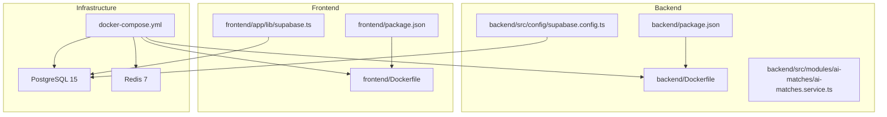
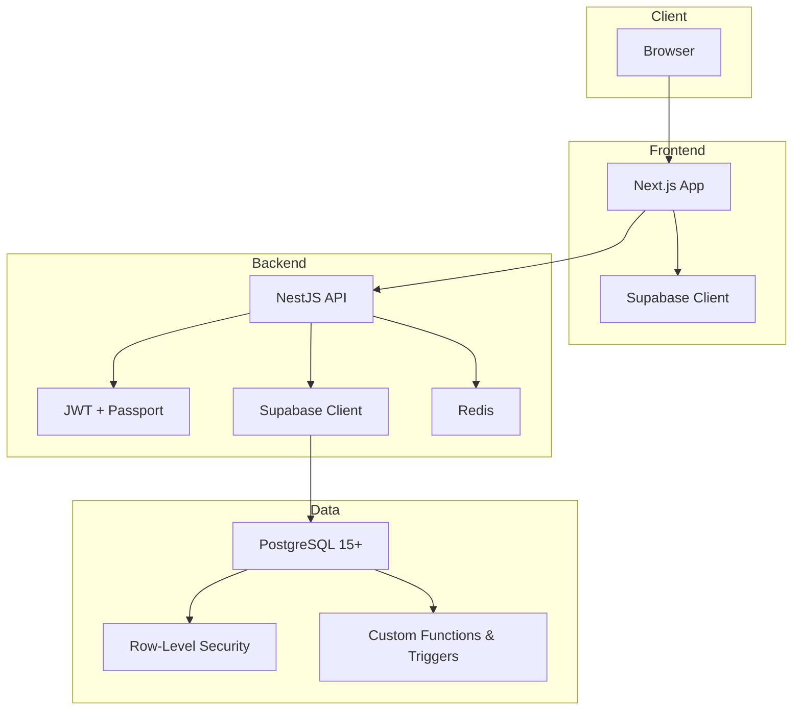
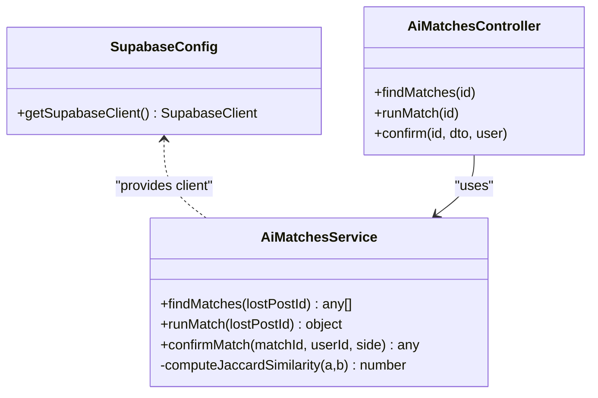
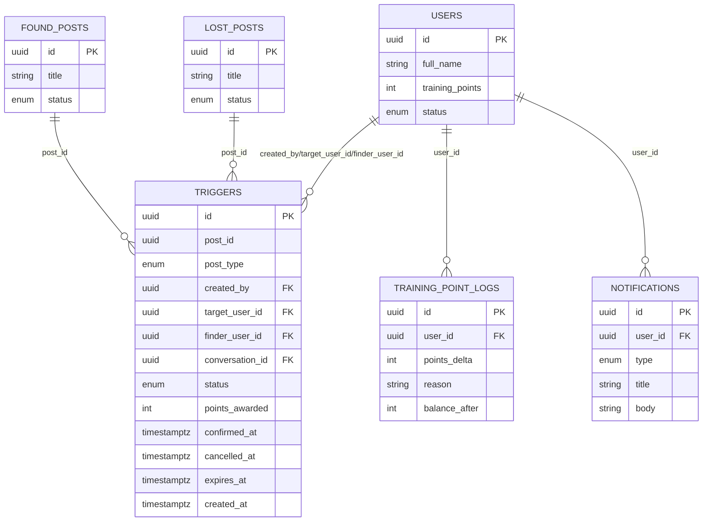
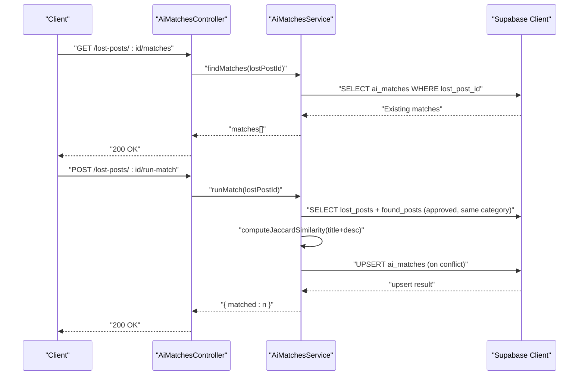
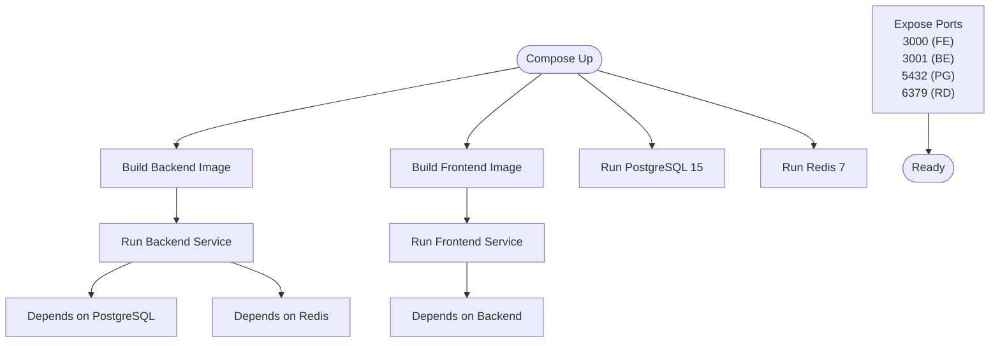
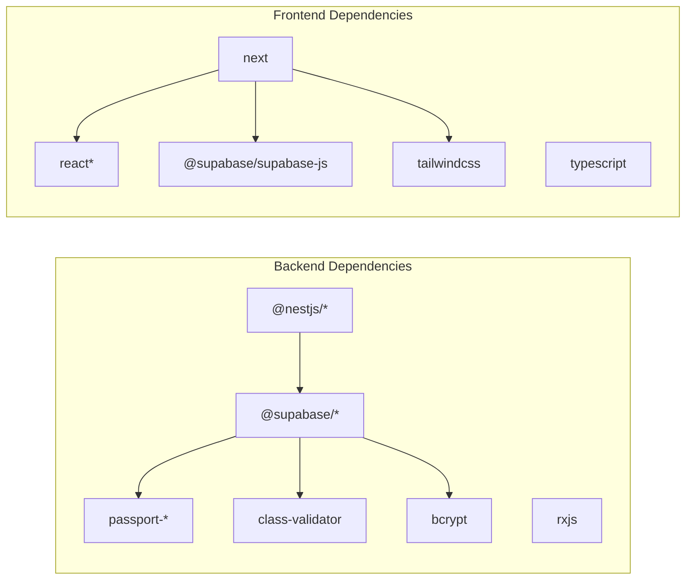

# Technology Stack

<cite>
**Referenced Files in This Document**
- [backend/package.json](file://backend/package.json)
- [frontend/package.json](file://frontend/package.json)
- [docker-compose.yml](file://docker-compose.yml)
- [backend/Dockerfile](file://backend/Dockerfile)
- [frontend/Dockerfile](file://frontend/Dockerfile)
- [backend/src/config/supabase.config.ts](file://backend/src/config/supabase.config.ts)
- [frontend/app/lib/supabase.ts](file://frontend/app/lib/supabase.ts)
- [backend/eslint.config.mjs](file://backend/eslint.config.mjs)
- [frontend/eslint.config.mjs](file://frontend/eslint.config.mjs)
- [backend/sql/triggers_permissions.sql](file://backend/sql/triggers_permissions.sql)
- [backend/sql/triggers_migration.sql](file://backend/sql/triggers_migration.sql)
- [backend/sql/update_trigger_points.sql](file://backend/sql/update_trigger_points.sql)
- [backend/src/modules/ai-matches/ai-matches.service.ts](file://backend/src/modules/ai-matches/ai-matches.service.ts)
- [backend/src/modules/ai-matches/ai-matches.controller.ts](file://backend/src/modules/ai-matches/ai-matches.controller.ts)
- [backend/src/modules/ai-matches/ai-matches.module.ts](file://backend/src/modules/ai-matches/ai-matches.module.ts)
</cite>

## Table of Contents
1. [Introduction](#introduction)
2. [Project Structure](#project-structure)
3. [Core Components](#core-components)
4. [Architecture Overview](#architecture-overview)
5. [Detailed Component Analysis](#detailed-component-analysis)
6. [Dependency Analysis](#dependency-analysis)
7. [Performance Considerations](#performance-considerations)
8. [Troubleshooting Guide](#troubleshooting-guide)
9. [Conclusion](#conclusion)

## Introduction
This document presents the complete technical foundation of the MissLost platform, covering backend and frontend stacks, database technologies, AI integration, containerization, development tools, and deployment infrastructure. It consolidates version compatibility and explains the rationale behind technology choices to support maintainability, scalability, and developer productivity.

## Project Structure
The repository is organized into two primary applications:
- Backend: NestJS application with TypeScript, PostgreSQL integration via Supabase, Redis caching, and bcrypt password hashing.
- Frontend: Next.js application with React, TypeScript, and Tailwind CSS.

Containerization is handled via Docker Compose with multi-stage builds for both backend and frontend.

**Diagram sources**
- [backend/package.json:1-94](file://backend/package.json#L1-L94)
- [frontend/package.json:1-29](file://frontend/package.json#L1-L29)
- [docker-compose.yml:1-61](file://docker-compose.yml#L1-L61)
- [backend/Dockerfile:1-14](file://backend/Dockerfile#L1-L14)
- [frontend/Dockerfile:1-14](file://frontend/Dockerfile#L1-L14)
- [backend/src/config/supabase.config.ts:1-25](file://backend/src/config/supabase.config.ts#L1-L25)
- [frontend/app/lib/supabase.ts:1-18](file://frontend/app/lib/supabase.ts#L1-L18)

**Section sources**
- [backend/package.json:1-94](file://backend/package.json#L1-L94)
- [frontend/package.json:1-29](file://frontend/package.json#L1-L29)
- [docker-compose.yml:1-61](file://docker-compose.yml#L1-L61)

## Core Components
- Backend framework and runtime
  - NestJS 11.0.1 with TypeScript for structured server-side architecture.
  - Node.js runtime aligned with Docker base images.
- Authentication and real-time
  - Supabase client libraries for SSR and client-side operations.
  - JWT guard and Passport strategies for secure routes.
- Database and caching
  - PostgreSQL 15+ integrated via Supabase.
  - Redis 7 for caching and session-like features.
- Security and validation
  - bcrypt for password hashing.
  - Class-validator and class-transformer for DTO validation.
- Frontend framework and styling
  - Next.js 16.2.3 with React 19.x and TypeScript.
  - Tailwind CSS 4.x for utility-first styling.
- AI and matching
  - Text similarity algorithms for item categorization and post matching.
- Development tools
  - ESLint with TypeScript and Prettier configurations for code quality.

**Section sources**
- [backend/package.json:22-46](file://backend/package.json#L22-L46)
- [frontend/package.json:11-27](file://frontend/package.json#L11-L27)
- [backend/src/config/supabase.config.ts:1-25](file://backend/src/config/supabase.config.ts#L1-L25)
- [frontend/app/lib/supabase.ts:1-18](file://frontend/app/lib/supabase.ts#L1-L18)
- [backend/eslint.config.mjs:1-36](file://backend/eslint.config.mjs#L1-L36)
- [frontend/eslint.config.mjs:1-19](file://frontend/eslint.config.mjs#L1-L19)

## Architecture Overview
The system follows a modern full-stack architecture:
- Frontend (Next.js) communicates with backend (NestJS) via REST APIs.
- Backend integrates with Supabase for authentication, real-time features, and database operations.
- PostgreSQL 15+ powers relational data with row-level security and custom functions.
- Redis 7 provides caching and session management.
- Docker Compose orchestrates containers for backend, frontend, PostgreSQL, and Redis.

**Diagram sources**
- [docker-compose.yml:3-47](file://docker-compose.yml#L3-L47)
- [backend/src/config/supabase.config.ts:1-25](file://backend/src/config/supabase.config.ts#L1-L25)
- [frontend/app/lib/supabase.ts:1-18](file://frontend/app/lib/supabase.ts#L1-L18)
- [backend/sql/triggers_permissions.sql:6-57](file://backend/sql/triggers_permissions.sql#L6-L57)
- [backend/sql/triggers_migration.sql:31-57](file://backend/sql/triggers_migration.sql#L31-L57)

## Detailed Component Analysis

### Backend Technology Stack
- Framework and language
  - NestJS 11.0.1 with core, common, and platform-express packages.
  - TypeScript 5.7.x for type safety and maintainability.
- Authentication and security
  - JWT and Passport strategies for Google OAuth and JWT-based sessions.
  - bcrypt 6.x for password hashing.
- Real-time and database
  - Supabase client libraries for SSR and client-side operations.
  - Custom database functions and policies for trigger management and row-level security.
- Caching
  - Redis client configured for caching and session-like behavior.
- Development and testing
  - Jest for unit and integration tests.
  - ESLint with TypeScript and Prettier for code quality.

**Diagram sources**
- [backend/src/config/supabase.config.ts:7-23](file://backend/src/config/supabase.config.ts#L7-L23)
- [backend/src/modules/ai-matches/ai-matches.service.ts:5-153](file://backend/src/modules/ai-matches/ai-matches.service.ts#L5-L153)
- [backend/src/modules/ai-matches/ai-matches.controller.ts:21-71](file://backend/src/modules/ai-matches/ai-matches.controller.ts#L21-L71)

**Section sources**
- [backend/package.json:22-46](file://backend/package.json#L22-L46)
- [backend/src/config/supabase.config.ts:1-25](file://backend/src/config/supabase.config.ts#L1-L25)
- [backend/src/modules/ai-matches/ai-matches.service.ts:1-367](file://backend/src/modules/ai-matches/ai-matches.service.ts#L1-L367)
- [backend/src/modules/ai-matches/ai-matches.controller.ts:1-72](file://backend/src/modules/ai-matches/ai-matches.controller.ts#L1-L72)
- [backend/src/modules/ai-matches/ai-matches.module.ts:1-11](file://backend/src/modules/ai-matches/ai-matches.module.ts#L1-L11)

### Database Technologies
- PostgreSQL 15+ with Supabase
  - Row-level security enabled and enforced via policies.
  - Custom functions and triggers for trigger lifecycle management.
  - Indexes optimized for frequent queries and status filtering.
- Full-text search capabilities
  - Supabase’s built-in ILIKE and native text search features are leveraged for post discovery.
- Audit logging
  - Training point logs and notifications tables capture user actions and system events.

**Diagram sources**
- [backend/sql/triggers_migration.sql:31-46](file://backend/sql/triggers_migration.sql#L31-L46)
- [backend/sql/triggers_permissions.sql:25-56](file://backend/sql/triggers_permissions.sql#L25-L56)
- [backend/sql/update_trigger_points.sql:13-131](file://backend/sql/update_trigger_points.sql#L13-L131)

**Section sources**
- [docker-compose.yml:27-44](file://docker-compose.yml#L27-L44)
- [backend/sql/triggers_permissions.sql:6-57](file://backend/sql/triggers_permissions.sql#L6-L57)
- [backend/sql/triggers_migration.sql:31-57](file://backend/sql/triggers_migration.sql#L31-L57)
- [backend/sql/update_trigger_points.sql:6-132](file://backend/sql/update_trigger_points.sql#L6-L132)

### AI Integration Stack
- Text similarity matching
  - Jaccard similarity algorithm computes textual similarity between lost and found post titles/descriptions.
  - Matches are stored with scores and statuses, enabling owner/founder confirmation workflows.
- Item categorization
  - Category-based filtering ensures candidate posts belong to the same category as the lost post.
- Admin dashboards
  - Comprehensive statistics and recent activity feeds for operational insights.

**Diagram sources**
- [backend/src/modules/ai-matches/ai-matches.controller.ts:24-40](file://backend/src/modules/ai-matches/ai-matches.controller.ts#L24-L40)
- [backend/src/modules/ai-matches/ai-matches.service.ts:15-96](file://backend/src/modules/ai-matches/ai-matches.service.ts#L15-L96)

**Section sources**
- [backend/src/modules/ai-matches/ai-matches.service.ts:11-153](file://backend/src/modules/ai-matches/ai-matches.service.ts#L11-L153)
- [backend/src/modules/ai-matches/ai-matches.controller.ts:1-72](file://backend/src/modules/ai-matches/ai-matches.controller.ts#L1-L72)

### Containerization and Deployment Infrastructure
- Multi-stage Docker builds
  - Base image: node:20 for both backend and frontend.
  - Build and production commands executed via npm scripts.
- Docker Compose orchestration
  - Services: backend, frontend, PostgreSQL 15, Redis 7.
  - Environment variables loaded from .env files per service.
- Ports and dependencies
  - Backend exposes port 3001; frontend exposes port 3000.
  - Frontend depends on backend; backend depends on PostgreSQL and Redis.

**Diagram sources**
- [docker-compose.yml:3-47](file://docker-compose.yml#L3-L47)
- [backend/Dockerfile:1-14](file://backend/Dockerfile#L1-L14)
- [frontend/Dockerfile:1-14](file://frontend/Dockerfile#L1-L14)

**Section sources**
- [docker-compose.yml:1-61](file://docker-compose.yml#L1-L61)
- [backend/Dockerfile:1-14](file://backend/Dockerfile#L1-L14)
- [frontend/Dockerfile:1-14](file://frontend/Dockerfile#L1-L14)

### Development Tools and Code Quality
- Backend
  - ESLint with TypeScript and Prettier recommended rules.
  - Type-checked configuration with tsconfig and globals for Node and Jest.
- Frontend
  - Next.js ESLint configuration for core web vitals and TypeScript.
  - Overrides to customize default ignores for build artifacts.

**Section sources**
- [backend/eslint.config.mjs:1-36](file://backend/eslint.config.mjs#L1-L36)
- [frontend/eslint.config.mjs:1-19](file://frontend/eslint.config.mjs#L1-L19)

## Dependency Analysis
- Backend dependencies
  - NestJS core modules and Swagger for API documentation.
  - Supabase client libraries for SSR and client-side operations.
  - Passport strategies and JWT for authentication.
  - Class-validator and class-transformer for DTO validation.
  - Bcrypt for password hashing.
- Frontend dependencies
  - Next.js 16.2.3 with React 19.x and TypeScript.
  - Supabase client library for frontend authentication and data fetching.
  - Tailwind CSS 4.x for styling.

**Diagram sources**
- [backend/package.json:22-46](file://backend/package.json#L22-L46)
- [frontend/package.json:11-27](file://frontend/package.json#L11-L27)

**Section sources**
- [backend/package.json:22-46](file://backend/package.json#L22-L46)
- [frontend/package.json:11-27](file://frontend/package.json#L11-L27)

## Performance Considerations
- Database optimization
  - Use indexes on frequently filtered columns (e.g., status, target_user_id).
  - Leverage Supabase policies to minimize unnecessary data retrieval.
- Caching strategy
  - Cache low-churn resources (categories, static lists) in Redis to reduce database load.
- API design
  - Paginate admin endpoints and limit result sets to avoid heavy payloads.
- Container resource allocation
  - Scale Redis and PostgreSQL according to concurrent users and write volume.

## Troubleshooting Guide
- Authentication and Supabase
  - Ensure SUPABASE_URL and SUPABASE_SERVICE_ROLE_KEY (or ANON key) are present in backend environment.
  - Verify NEXT_PUBLIC_SUPABASE_URL and NEXT_PUBLIC_SUPABASE_ANON_KEY in frontend environment.
- Database permissions
  - Confirm row-level security is enabled and policies are applied for the triggers table.
  - Validate function grants for authenticated and service_role.
- Matching service errors
  - Check for missing lost post IDs and category mismatches.
  - Review Jaccard similarity thresholds and upsert conflicts.
- Container connectivity
  - Verify port mappings and service dependencies in Docker Compose.
  - Confirm environment files (.env and .env.local) are correctly mounted.

**Section sources**
- [backend/src/config/supabase.config.ts:8-20](file://backend/src/config/supabase.config.ts#L8-L20)
- [frontend/app/lib/supabase.ts:3-17](file://frontend/app/lib/supabase.ts#L3-L17)
- [backend/sql/triggers_permissions.sql:6-57](file://backend/sql/triggers_permissions.sql#L6-L57)
- [backend/src/modules/ai-matches/ai-matches.service.ts:25-140](file://backend/src/modules/ai-matches/ai-matches.service.ts#L25-L140)
- [docker-compose.yml:12-25](file://docker-compose.yml#L12-L25)

## Conclusion
MissLost leverages a cohesive technology stack designed for reliability, scalability, and developer productivity. The backend (NestJS 11.0.1, TypeScript, Supabase, Redis, bcrypt) integrates seamlessly with the frontend (Next.js 16.2.3, React, Tailwind CSS, Supabase client) and is containerized for straightforward deployment. The database layer benefits from row-level security, custom functions, and indexing, while the AI matching pipeline uses text similarity to enhance user experience. Adhering to the outlined practices ensures maintainability and performance across environments.