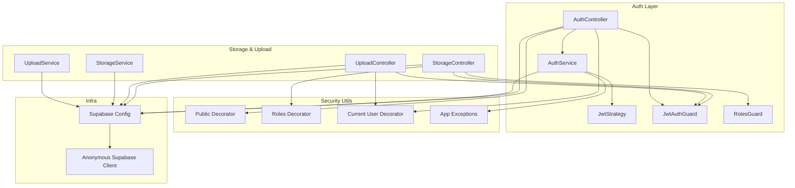
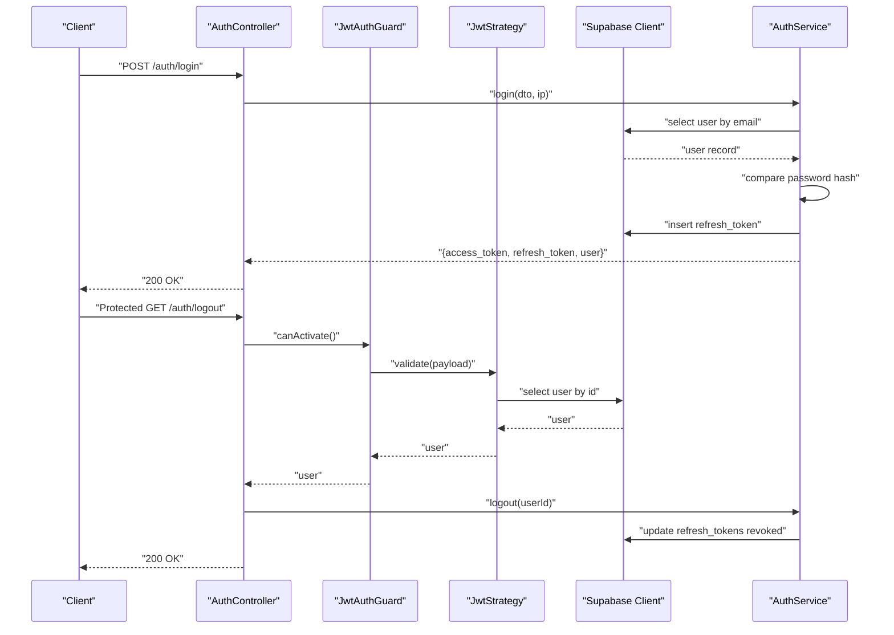
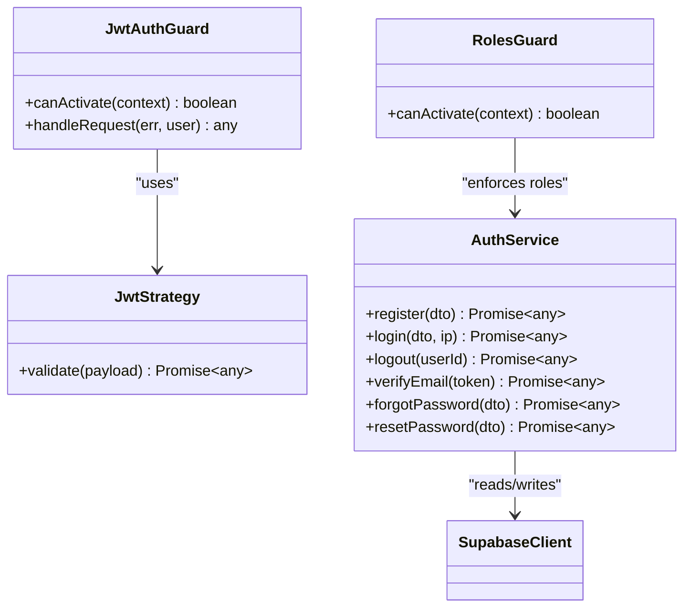
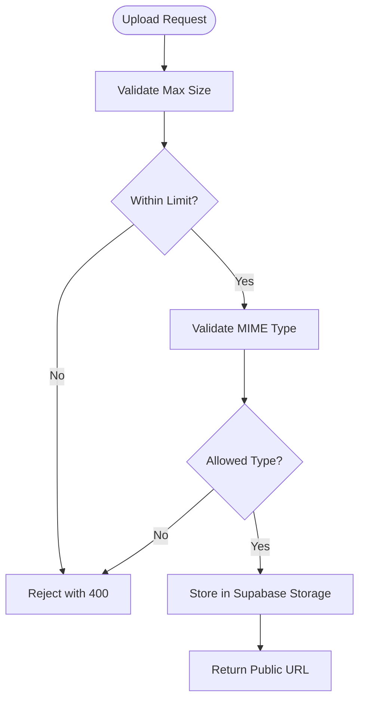
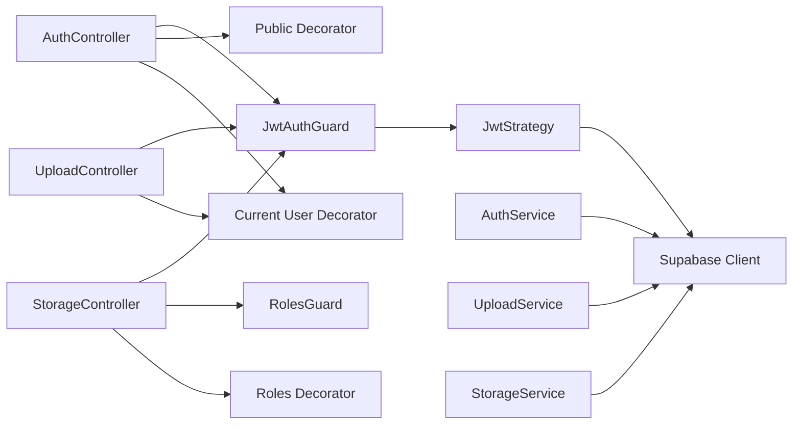

# Security Considerations

<cite>
**Referenced Files in This Document**
- [jwt-auth.guard.ts](file://backend/src/common/guards/jwt-auth.guard.ts)
- [roles.guard.ts](file://backend/src/common/guards/roles.guard.ts)
- [jwt.strategy.ts](file://backend/src/modules/auth/strategies/jwt.strategy.ts)
- [auth.service.ts](file://backend/src/modules/auth/auth.service.ts)
- [auth.controller.ts](file://backend/src/modules/auth/auth.controller.ts)
- [app.exception.ts](file://backend/src/common/exceptions/app.exception.ts)
- [supabase.config.ts](file://backend/src/config/supabase.config.ts)
- [client.ts](file://backend/src/utils/supabase/client.ts)
- [upload.controller.ts](file://backend/src/modules/upload/upload.controller.ts)
- [upload.service.ts](file://backend/src/modules/upload/upload.service.ts)
- [storage.controller.ts](file://backend/src/modules/storage/storage.controller.ts)
- [storage.service.ts](file://backend/src/modules/storage/storage.service.ts)
- [current-user.decorator.ts](file://backend/src/common/decorators/current-user.decorator.ts)
- [roles.decorator.ts](file://backend/src/common/decorators/roles.decorator.ts)
- [public.decorator.ts](file://backend/src/common/decorators/public.decorator.ts)
</cite>

## Table of Contents
1. [Introduction](#introduction)
2. [Project Structure](#project-structure)
3. [Core Components](#core-components)
4. [Architecture Overview](#architecture-overview)
5. [Detailed Component Analysis](#detailed-component-analysis)
6. [Dependency Analysis](#dependency-analysis)
7. [Performance Considerations](#performance-considerations)
8. [Troubleshooting Guide](#troubleshooting-guide)
9. [Conclusion](#conclusion)
10. [Appendices](#appendices)

## Introduction
This document provides comprehensive security documentation for the MissLost application. It focuses on authentication and authorization mechanisms, session management, input validation, SQL injection prevention via ORM usage, data privacy, security middleware, secure file upload handling, cloud storage access controls, WebSocket and real-time chat security considerations, database access patterns, common vulnerability mitigations, and production monitoring approaches.

## Project Structure
Security-related components are organized across:
- Guards for JWT authentication and role-based access control
- Authentication service and controller implementing registration, login, logout, email verification, and password reset flows
- Supabase configuration and clients for secure database and storage access
- Upload and storage modules enforcing validated file uploads and controlled storage access
- Decorators for public routes, current user extraction, and role metadata

**Diagram sources**
- [auth.controller.ts:1-101](file://backend/src/modules/auth/auth.controller.ts#L1-L101)
- [auth.service.ts:1-274](file://backend/src/modules/auth/auth.service.ts#L1-L274)
- [jwt.strategy.ts:1-40](file://backend/src/modules/auth/strategies/jwt.strategy.ts#L1-L40)
- [jwt-auth.guard.ts:1-29](file://backend/src/common/guards/jwt-auth.guard.ts#L1-L29)
- [roles.guard.ts:1-28](file://backend/src/common/guards/roles.guard.ts#L1-L28)
- [upload.controller.ts:1-80](file://backend/src/modules/upload/upload.controller.ts#L1-L80)
- [upload.service.ts:1-172](file://backend/src/modules/upload/upload.service.ts#L1-L172)
- [storage.controller.ts:1-60](file://backend/src/modules/storage/storage.controller.ts#L1-L60)
- [storage.service.ts:1-117](file://backend/src/modules/storage/storage.service.ts#L1-L117)
- [supabase.config.ts:1-25](file://backend/src/config/supabase.config.ts#L1-L25)
- [client.ts:1-19](file://backend/src/utils/supabase/client.ts#L1-L19)

**Section sources**
- [auth.controller.ts:1-101](file://backend/src/modules/auth/auth.controller.ts#L1-L101)
- [auth.service.ts:1-274](file://backend/src/modules/auth/auth.service.ts#L1-L274)
- [jwt-auth.guard.ts:1-29](file://backend/src/common/guards/jwt-auth.guard.ts#L1-L29)
- [roles.guard.ts:1-28](file://backend/src/common/guards/roles.guard.ts#L1-L28)
- [jwt.strategy.ts:1-40](file://backend/src/modules/auth/strategies/jwt.strategy.ts#L1-L40)
- [supabase.config.ts:1-25](file://backend/src/config/supabase.config.ts#L1-L25)
- [client.ts:1-19](file://backend/src/utils/supabase/client.ts#L1-L19)
- [upload.controller.ts:1-80](file://backend/src/modules/upload/upload.controller.ts#L1-L80)
- [upload.service.ts:1-172](file://backend/src/modules/upload/upload.service.ts#L1-L172)
- [storage.controller.ts:1-60](file://backend/src/modules/storage/storage.controller.ts#L1-L60)
- [storage.service.ts:1-117](file://backend/src/modules/storage/storage.service.ts#L1-L117)

## Core Components
- JWT authentication guard validates bearer tokens and bypasses for public routes
- Role-based guard enforces admin/moderator permissions
- JWT strategy validates tokens against Supabase users and checks account status
- Authentication service handles registration, login, logout, email verification, and password reset with secure hashing and token lifecycle management
- Supabase configuration enforces secure client initialization and disables persistent sessions
- Upload and storage modules validate file types and sizes, enforce unique filenames, and manage storage access
- Decorators enable public routes, role metadata, and current user extraction

**Section sources**
- [jwt-auth.guard.ts:1-29](file://backend/src/common/guards/jwt-auth.guard.ts#L1-L29)
- [roles.guard.ts:1-28](file://backend/src/common/guards/roles.guard.ts#L1-L28)
- [jwt.strategy.ts:1-40](file://backend/src/modules/auth/strategies/jwt.strategy.ts#L1-L40)
- [auth.service.ts:1-274](file://backend/src/modules/auth/auth.service.ts#L1-L274)
- [supabase.config.ts:1-25](file://backend/src/config/supabase.config.ts#L1-L25)
- [upload.controller.ts:1-80](file://backend/src/modules/upload/upload.controller.ts#L1-L80)
- [upload.service.ts:1-172](file://backend/src/modules/upload/upload.service.ts#L1-L172)
- [storage.controller.ts:1-60](file://backend/src/modules/storage/storage.controller.ts#L1-L60)
- [storage.service.ts:1-117](file://backend/src/modules/storage/storage.service.ts#L1-L117)
- [current-user.decorator.ts:1-9](file://backend/src/common/decorators/current-user.decorator.ts#L1-L9)
- [roles.decorator.ts:1-5](file://backend/src/common/decorators/roles.decorator.ts#L1-L5)
- [public.decorator.ts:1-5](file://backend/src/common/decorators/public.decorator.ts#L1-L5)

## Architecture Overview
The authentication and authorization pipeline integrates NestJS guards, Passport strategies, and Supabase for secure user validation and role enforcement. File uploads leverage validated pipes and Supabase Storage with strict MIME and size limits. Storage endpoints apply role-based guards for privileged actions.

**Diagram sources**
- [auth.controller.ts:1-101](file://backend/src/modules/auth/auth.controller.ts#L1-L101)
- [auth.service.ts:72-110](file://backend/src/modules/auth/auth.service.ts#L72-L110)
- [jwt-auth.guard.ts:13-27](file://backend/src/common/guards/jwt-auth.guard.ts#L13-L27)
- [jwt.strategy.ts:26-38](file://backend/src/modules/auth/strategies/jwt.strategy.ts#L26-L38)
- [supabase.config.ts:7-23](file://backend/src/config/supabase.config.ts#L7-L23)

## Detailed Component Analysis

### Authentication and Authorization Pipeline
- JWT authentication guard supports public routes via metadata and delegates token validation to Passport
- JWT strategy validates token claims, fetches user from Supabase, and rejects suspended accounts
- Authentication service manages secure password hashing, token lifecycles, and robust error handling
- Role-based guard enforces admin/moderator permissions for protected endpoints

**Diagram sources**
- [jwt-auth.guard.ts:1-29](file://backend/src/common/guards/jwt-auth.guard.ts#L1-L29)
- [roles.guard.ts:1-28](file://backend/src/common/guards/roles.guard.ts#L1-L28)
- [jwt.strategy.ts:1-40](file://backend/src/modules/auth/strategies/jwt.strategy.ts#L1-L40)
- [auth.service.ts:1-274](file://backend/src/modules/auth/auth.service.ts#L1-L274)
- [supabase.config.ts:1-25](file://backend/src/config/supabase.config.ts#L1-L25)

**Section sources**
- [jwt-auth.guard.ts:1-29](file://backend/src/common/guards/jwt-auth.guard.ts#L1-L29)
- [roles.guard.ts:1-28](file://backend/src/common/guards/roles.guard.ts#L1-L28)
- [jwt.strategy.ts:1-40](file://backend/src/modules/auth/strategies/jwt.strategy.ts#L1-L40)
- [auth.service.ts:72-110](file://backend/src/modules/auth/auth.service.ts#L72-L110)
- [auth.controller.ts:46-53](file://backend/src/modules/auth/auth.controller.ts#L46-L53)

### Session Management
- Supabase client is configured with session persistence disabled to avoid browser session leakage
- Refresh tokens are stored server-side with hashed values and expiration, enabling centralized revocation
- Access tokens are short-lived JWTs validated by the strategy against Supabase users

**Section sources**
- [supabase.config.ts:16-18](file://backend/src/config/supabase.config.ts#L16-L18)
- [auth.service.ts:95-103](file://backend/src/modules/auth/auth.service.ts#L95-L103)
- [auth.service.ts:170-178](file://backend/src/modules/auth/auth.service.ts#L170-L178)

### Input Validation and SQL Injection Prevention
- Supabase ORM is used for all database queries, preventing raw SQL injection
- DTOs and validation pipes enforce field constraints and types
- File upload endpoints use validated pipes to restrict file size and MIME types

**Diagram sources**
- [upload.controller.ts:36-51](file://backend/src/modules/upload/upload.controller.ts#L36-L51)
- [upload.controller.ts:63-78](file://backend/src/modules/upload/upload.controller.ts#L63-L78)
- [upload.service.ts:53-81](file://backend/src/modules/upload/upload.service.ts#L53-L81)
- [upload.service.ts:94-170](file://backend/src/modules/upload/upload.service.ts#L94-L170)

**Section sources**
- [upload.controller.ts:36-78](file://backend/src/modules/upload/upload.controller.ts#L36-L78)
- [upload.service.ts:53-170](file://backend/src/modules/upload/upload.service.ts#L53-L170)
- [storage.service.ts:21-78](file://backend/src/modules/storage/storage.service.ts#L21-L78)

### Data Privacy and GDPR Considerations
- Passwords are hashed with strong algorithms before storage
- Personal data exposure is minimized by returning sanitized user objects
- Email verification and status checks prevent unauthorized access
- Token lifecycles and revocation support user control over sessions

**Section sources**
- [auth.service.ts:37-52](file://backend/src/modules/auth/auth.service.ts#L37-L52)
- [auth.service.ts:83-91](file://backend/src/modules/auth/auth.service.ts#L83-L91)
- [auth.service.ts:105-109](file://backend/src/modules/auth/auth.service.ts#L105-L109)
- [auth.service.ts:180-208](file://backend/src/modules/auth/auth.service.ts#L180-L208)
- [auth.service.ts:237-272](file://backend/src/modules/auth/auth.service.ts#L237-L272)

### Security Middleware and Exception Handling
- Guards centralize authentication and authorization logic
- Custom exceptions standardize error responses with structured payloads
- Public decorator allows selective bypass of authentication

**Section sources**
- [jwt-auth.guard.ts:13-27](file://backend/src/common/guards/jwt-auth.guard.ts#L13-L27)
- [roles.guard.ts:10-26](file://backend/src/common/guards/roles.guard.ts#L10-L26)
- [app.exception.ts:23-45](file://backend/src/common/exceptions/app.exception.ts#L23-L45)
- [public.decorator.ts:1-5](file://backend/src/common/decorators/public.decorator.ts#L1-L5)

### Secure File Upload and Cloud Storage Access
- Upload endpoints enforce file size and type constraints
- Unique filenames and per-user paths reduce collision and improve organization
- Storage buckets are ensured to exist with strict limits and allowed MIME types
- Avatar updates follow a rollback-safe flow to prevent orphaned files

**Section sources**
- [upload.controller.ts:26-51](file://backend/src/modules/upload/upload.controller.ts#L26-L51)
- [upload.controller.ts:53-78](file://backend/src/modules/upload/upload.controller.ts#L53-L78)
- [upload.service.ts:19-46](file://backend/src/modules/upload/upload.service.ts#L19-L46)
- [upload.service.ts:53-81](file://backend/src/modules/upload/upload.service.ts#L53-L81)
- [upload.service.ts:94-170](file://backend/src/modules/upload/upload.service.ts#L94-L170)

### WebSocket and Real-Time Chat Security
- Real-time features are not present in the provided backend modules
- Recommendations:
  - Enforce JWT-based authentication for WebSocket connections
  - Apply role-based authorization guards for chat rooms or channels
  - Sanitize and validate incoming messages
  - Use encrypted transport (WSS/TLS) and origin checks
  - Rate-limit message throughput and implement message size caps

[No sources needed since this section provides general guidance]

### Database Access Patterns and Supabase Security
- Supabase client is initialized securely with environment variables and session persistence disabled
- Anonymous client is separated for frontend-like usage scenarios
- Queries use ORM methods to prevent injection and maintain type safety

**Section sources**
- [supabase.config.ts:7-23](file://backend/src/config/supabase.config.ts#L7-L23)
- [client.ts:9-18](file://backend/src/utils/supabase/client.ts#L9-L18)
- [auth.service.ts:27-52](file://backend/src/modules/auth/auth.service.ts#L27-L52)
- [storage.service.ts:12-36](file://backend/src/modules/storage/storage.service.ts#L12-L36)

## Dependency Analysis

**Diagram sources**
- [auth.controller.ts:1-101](file://backend/src/modules/auth/auth.controller.ts#L1-L101)
- [jwt-auth.guard.ts:1-29](file://backend/src/common/guards/jwt-auth.guard.ts#L1-L29)
- [jwt.strategy.ts:1-40](file://backend/src/modules/auth/strategies/jwt.strategy.ts#L1-L40)
- [supabase.config.ts:1-25](file://backend/src/config/supabase.config.ts#L1-L25)
- [upload.controller.ts:1-80](file://backend/src/modules/upload/upload.controller.ts#L1-L80)
- [upload.service.ts:1-172](file://backend/src/modules/upload/upload.service.ts#L1-L172)
- [storage.controller.ts:1-60](file://backend/src/modules/storage/storage.controller.ts#L1-L60)
- [roles.guard.ts:1-28](file://backend/src/common/guards/roles.guard.ts#L1-L28)
- [storage.service.ts:1-117](file://backend/src/modules/storage/storage.service.ts#L1-L117)

**Section sources**
- [auth.controller.ts:1-101](file://backend/src/modules/auth/auth.controller.ts#L1-L101)
- [jwt-auth.guard.ts:1-29](file://backend/src/common/guards/jwt-auth.guard.ts#L1-L29)
- [roles.guard.ts:1-28](file://backend/src/common/guards/roles.guard.ts#L1-L28)
- [upload.controller.ts:1-80](file://backend/src/modules/upload/upload.controller.ts#L1-L80)
- [storage.controller.ts:1-60](file://backend/src/modules/storage/storage.controller.ts#L1-L60)

## Performance Considerations
- Prefer short-lived access tokens and efficient refresh token storage
- Use Supabase Storage CDN for optimized image delivery
- Apply pagination and indexing for frequently accessed endpoints
- Monitor guard and strategy performance in high-throughput scenarios

[No sources needed since this section provides general guidance]

## Troubleshooting Guide
- Unauthorized access errors indicate invalid or expired tokens or suspended accounts
- Forbidden errors suggest insufficient roles for protected endpoints
- Validation errors occur on mismatched passwords, invalid tokens, or exceeded limits
- Upload failures typically stem from MIME/type restrictions or storage errors

**Section sources**
- [app.exception.ts:23-45](file://backend/src/common/exceptions/app.exception.ts#L23-L45)
- [jwt.strategy.ts:34-35](file://backend/src/modules/auth/strategies/jwt.strategy.ts#L34-L35)
- [upload.controller.ts:39-44](file://backend/src/modules/upload/upload.controller.ts#L39-L44)
- [upload.service.ts:71-74](file://backend/src/modules/upload/upload.service.ts#L71-L74)

## Conclusion
MissLost implements a layered security model centered on JWT authentication, role-based access control, validated file uploads, and secure Supabase integrations. By enforcing strict input validation, minimizing data exposure, and leveraging Supabase’s built-in protections, the application achieves robust security posture suitable for production deployment.

## Appendices
- Environment variables to configure:
  - SUPABASE_URL
  - SUPABASE_SERVICE_ROLE_KEY or SUPABASE_ANON_KEY
  - JWT_SECRET

**Section sources**
- [supabase.config.ts:9-14](file://backend/src/config/supabase.config.ts#L9-L14)
- [jwt.strategy.ts:22-23](file://backend/src/modules/auth/strategies/jwt.strategy.ts#L22-L23)