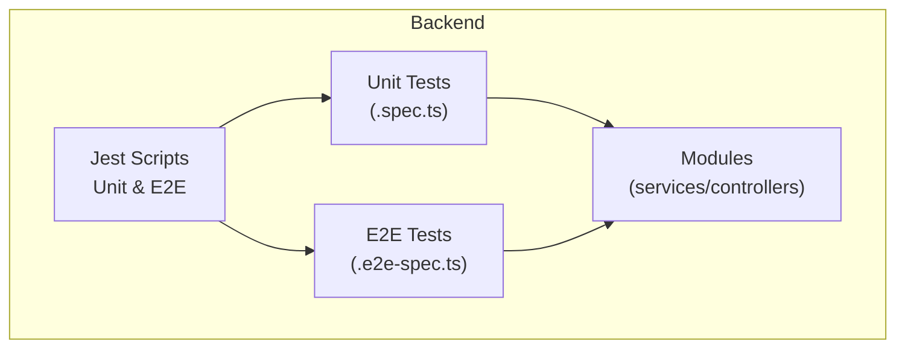
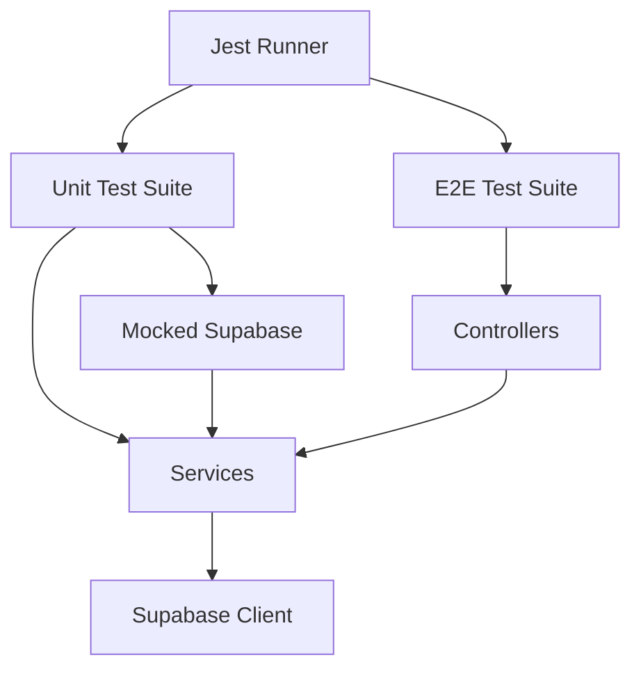
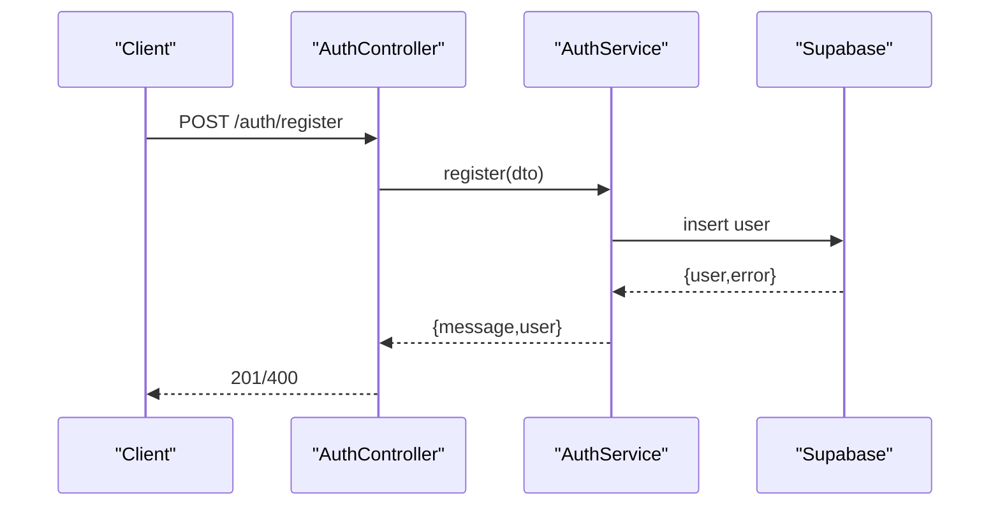
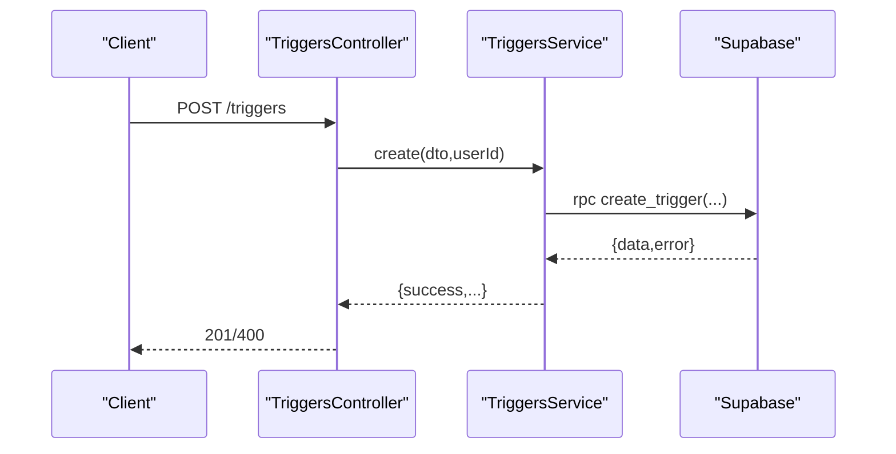
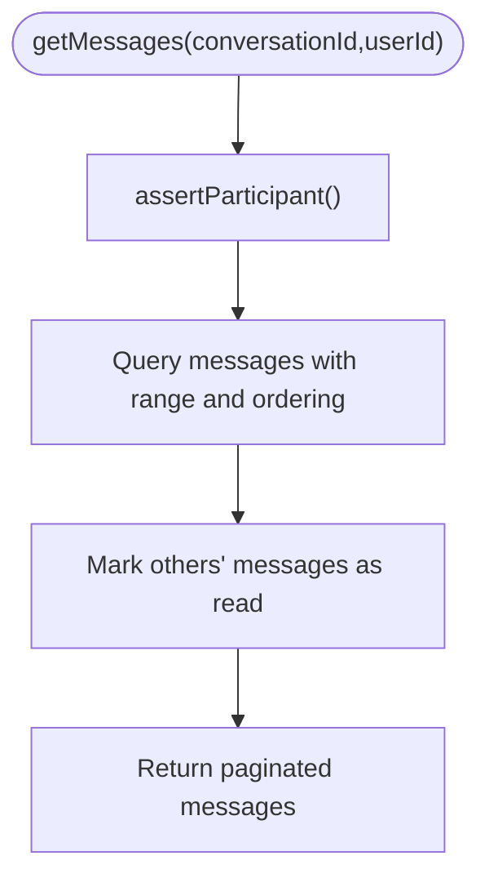
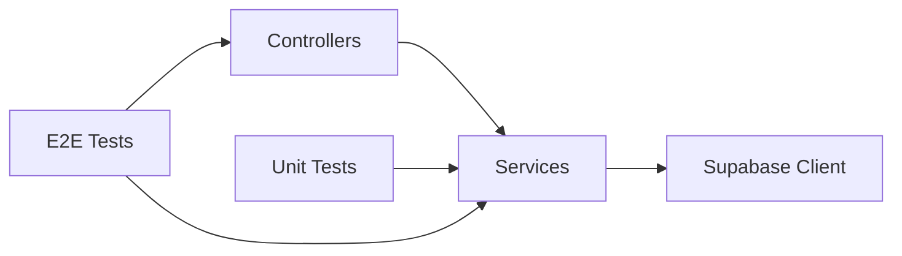
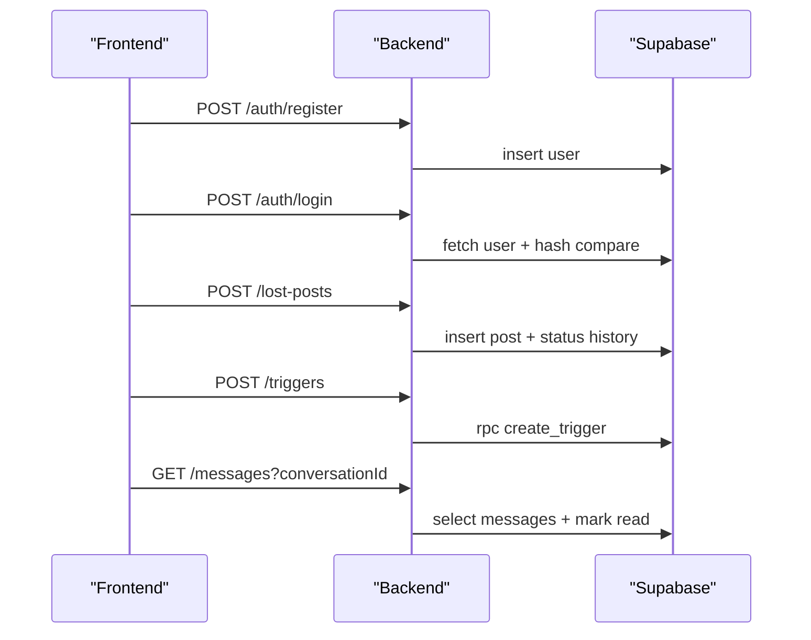

# Testing Strategy

<cite>
**Referenced Files in This Document**
- [package.json](file://backend/package.json)
- [jest-e2e.json](file://backend/test/jest-e2e.json)
- [app.controller.spec.ts](file://backend/src/app.controller.spec.ts)
- [app.e2e-spec.ts](file://backend/test/app.e2e-spec.ts)
- [triggers.e2e-spec.ts](file://backend/test/triggers.e2e-spec.ts)
- [triggers.service.spec.ts](file://backend/src/modules/triggers/triggers.service.spec.ts)
- [triggers.service.ts](file://backend/src/modules/triggers/triggers.service.ts)
- [auth.service.ts](file://backend/src/modules/auth/auth.service.ts)
- [auth.controller.ts](file://backend/src/modules/auth/auth.controller.ts)
- [chat.service.ts](file://backend/src/modules/chat/chat.service.ts)
- [lost-posts.service.ts](file://backend/src/modules/lost-posts/lost-posts.service.ts)
- [found-posts.service.ts](file://backend/src/modules/found-posts/found-posts.service.ts)
- [users.service.ts](file://backend/src/modules/users/users.service.ts)
- [categories.service.ts](file://backend/src/modules/categories/categories.service.ts)
</cite>

## Table of Contents
1. [Introduction](#introduction)
2. [Project Structure](#project-structure)
3. [Core Components](#core-components)
4. [Architecture Overview](#architecture-overview)
5. [Detailed Component Analysis](#detailed-component-analysis)
6. [Dependency Analysis](#dependency-analysis)
7. [Performance Considerations](#performance-considerations)
8. [Security Testing Approaches](#security-testing-approaches)
9. [End-to-End Testing Procedures](#end-to-end-testing-procedures)
10. [Frontend Testing Strategies](#frontend-testing-strategies)
11. [Best Practices and Mock Strategies](#best-practices-and-mock-strategies)
12. [Continuous Integration Setup](#continuous-integration-setup)
13. [Test Data Management](#test-data-management)
14. [Automated Testing Pipelines](#automated-testing-pipelines)
15. [Regression Testing Strategies](#regression-testing-strategies)
16. [Troubleshooting Guide](#troubleshooting-guide)
17. [Conclusion](#conclusion)

## Introduction
This document defines a comprehensive testing strategy for the MissLost application using the Jest framework. It covers unit testing for backend services and controllers, integration testing for API endpoints and database triggers, end-to-end testing for complete user workflows, and frontend testing strategies. It also includes best practices for mocking external services, CI setup, performance and security testing, and regression testing to maintain code quality.

## Project Structure
The testing infrastructure is organized around:
- Backend Jest configuration and scripts for unit and e2e tests
- Unit tests for individual services and controllers
- E2E tests for API endpoints and trigger workflows
- Frontend testing setup and configuration

**Diagram sources**
- [package.json:16-20](file://backend/package.json#L16-L20)
- [jest-e2e.json:1-10](file://backend/test/jest-e2e.json#L1-L10)

**Section sources**
- [package.json:16-20](file://backend/package.json#L16-L20)
- [jest-e2e.json:1-10](file://backend/test/jest-e2e.json#L1-L10)

## Core Components
Key backend components to test:
- Authentication service and controller (registration, login, logout, OAuth, password reset)
- Triggers service and controller (create, confirm, cancel, list by conversation)
- Chat service (conversations, messages, unread counts)
- Posts services (lost and found posts CRUD and admin review)
- Users and categories services

These components interact with Supabase for persistence and rely on DTO validation, guards, and interceptors.

**Section sources**
- [auth.service.ts:1-274](file://backend/src/modules/auth/auth.service.ts#L1-L274)
- [auth.controller.ts:1-121](file://backend/src/modules/auth/auth.controller.ts#L1-L121)
- [triggers.service.ts:1-163](file://backend/src/modules/triggers/triggers.service.ts#L1-L163)
- [chat.service.ts:1-151](file://backend/src/modules/chat/chat.service.ts#L1-L151)
- [lost-posts.service.ts:1-189](file://backend/src/modules/lost-posts/lost-posts.service.ts#L1-L189)
- [found-posts.service.ts:1-162](file://backend/src/modules/found-posts/found-posts.service.ts#L1-L162)
- [users.service.ts:1-136](file://backend/src/modules/users/users.service.ts#L1-L136)
- [categories.service.ts:1-32](file://backend/src/modules/categories/categories.service.ts#L1-L32)

## Architecture Overview
The testing architecture separates concerns:
- Unit tests isolate services behind mocked Supabase clients
- E2E tests boot NestJS modules, override guards for controlled auth, and mock service dependencies
- Frontend tests validate UI behavior against backend APIs

**Diagram sources**
- [package.json:16-20](file://backend/package.json#L16-L20)
- [triggers.service.spec.ts:1-454](file://backend/src/modules/triggers/triggers.service.spec.ts#L1-L454)
- [triggers.e2e-spec.ts:1-345](file://backend/test/triggers.e2e-spec.ts#L1-L345)

## Detailed Component Analysis

### Authentication Module Testing
- Unit tests validate registration, login, logout, email verification, forgot/reset password flows
- Controller tests ensure proper guard usage and endpoint behavior
- Mock Supabase client to avoid real DB calls while asserting DTO validation and error conditions

**Diagram sources**
- [auth.controller.ts:31-36](file://backend/src/modules/auth/auth.controller.ts#L31-L36)
- [auth.service.ts:22-69](file://backend/src/modules/auth/auth.service.ts#L22-L69)

**Section sources**
- [auth.controller.ts:1-121](file://backend/src/modules/auth/auth.controller.ts#L1-L121)
- [auth.service.ts:1-274](file://backend/src/modules/auth/auth.service.ts#L1-L274)

### Triggers Module Testing
- Unit tests cover create, confirm, cancel, getByConversation, and cron expiration
- E2E tests validate HTTP endpoints, guard bypass, and error propagation
- Mock Supabase RPC and table queries; use a test guard to inject user context

**Diagram sources**
- [triggers.e2e-spec.ts:95-118](file://backend/test/triggers.e2e-spec.ts#L95-L118)
- [triggers.service.ts:30-48](file://backend/src/modules/triggers/triggers.service.ts#L30-L48)

**Section sources**
- [triggers.service.spec.ts:1-454](file://backend/src/modules/triggers/triggers.service.spec.ts#L1-L454)
- [triggers.service.ts:1-163](file://backend/src/modules/triggers/triggers.service.ts#L1-L163)
- [triggers.e2e-spec.ts:1-345](file://backend/test/triggers.e2e-spec.ts#L1-L345)

### Chat Module Testing
- Unit tests cover conversation retrieval, creation, message retrieval with pagination, sending messages, and unread counts
- Validate participant checks and error conditions

**Diagram sources**
- [chat.service.ts:68-100](file://backend/src/modules/chat/chat.service.ts#L68-L100)

**Section sources**
- [chat.service.ts:1-151](file://backend/src/modules/chat/chat.service.ts#L1-L151)

### Posts Services Testing
- Lost and found posts services include create, list, find, update, remove, admin review, and pending lists
- Validate role-based permissions, status transitions, and DTO constraints

**Section sources**
- [lost-posts.service.ts:1-189](file://backend/src/modules/lost-posts/lost-posts.service.ts#L1-L189)
- [found-posts.service.ts:1-162](file://backend/src/modules/found-posts/found-posts.service.ts#L1-L162)

### Users and Categories Services Testing
- Users service: profile updates, training score/history, admin user listing and status updates
- Categories service: active categories and single category lookup

**Section sources**
- [users.service.ts:1-136](file://backend/src/modules/users/users.service.ts#L1-L136)
- [categories.service.ts:1-32](file://backend/src/modules/categories/categories.service.ts#L1-L32)

## Dependency Analysis
Testing dependencies and coupling:
- Services depend on Supabase client; mock via spy on client factory
- Controllers depend on services; test via Nest testing module
- Guards and interceptors can be overridden in tests for controlled auth and validation

**Diagram sources**
- [triggers.service.spec.ts:70-80](file://backend/src/modules/triggers/triggers.service.spec.ts#L70-L80)
- [triggers.e2e-spec.ts:57-74](file://backend/test/triggers.e2e-spec.ts#L57-L74)

**Section sources**
- [triggers.service.spec.ts:1-454](file://backend/src/modules/triggers/triggers.service.spec.ts#L1-L454)
- [triggers.e2e-spec.ts:1-345](file://backend/test/triggers.e2e-spec.ts#L1-L345)

## Performance Considerations
- Use Jest worker threads and test concurrency sparingly
- Mock heavy DB calls; prefer batched assertions
- Limit database roundtrips in unit tests; validate method calls instead of full transactions
- For e2e tests, reuse a single app instance per describe block and clear mocks between tests

## Security Testing Approaches
- Validate guard enforcement for protected routes
- Test forbidden and unauthorized scenarios (non-participants, wrong users)
- Verify token handling and cookie policies in OAuth flows
- Validate DTO validation prevents injection and malformed requests

## End-to-End Testing Procedures
Recommended e2e workflows:
- Authentication: register, verify email, login, logout, Google OAuth callback
- Post creation: create lost/found posts, admin review, status transitions
- Matching: create triggers, confirm/cancel, list by conversation
- Chat: create conversation, send messages, mark as read, unread count
- Admin: manage users, suspend/activate, review pending posts

**Diagram sources**
- [auth.service.ts:22-110](file://backend/src/modules/auth/auth.service.ts#L22-L110)
- [lost-posts.service.ts:19-43](file://backend/src/modules/lost-posts/lost-posts.service.ts#L19-L43)
- [triggers.service.ts:30-48](file://backend/src/modules/triggers/triggers.service.ts#L30-L48)
- [chat.service.ts:68-100](file://backend/src/modules/chat/chat.service.ts#L68-L100)

**Section sources**
- [app.e2e-spec.ts:1-30](file://backend/test/app.e2e-spec.ts#L1-L30)
- [triggers.e2e-spec.ts:1-345](file://backend/test/triggers.e2e-spec.ts#L1-L345)

## Frontend Testing Strategies
- Component testing: validate UI rendering and event handlers
- Integration testing: mock API endpoints and assert network calls
- User interface validation: snapshot tests for static components, interaction tests for dynamic behavior
- Use Next.js app dir conventions; organize tests alongside components

[No sources needed since this section provides general guidance]

## Best Practices and Mock Strategies
- Mock Supabase client globally in unit tests; restore mocks after each test
- Use guard overrides in e2e tests to simulate authenticated users
- Validate DTO transformations and validation pipes behavior
- Prefer deterministic test data and explicit headers for user identity in e2e tests
- Keep tests isolated; avoid shared mutable state

**Section sources**
- [triggers.service.spec.ts:66-80](file://backend/src/modules/triggers/triggers.service.spec.ts#L66-L80)
- [triggers.e2e-spec.ts:36-44](file://backend/test/triggers.e2e-spec.ts#L36-L44)

## Continuous Integration Setup
- Configure Jest scripts for unit and e2e coverage
- Run unit tests with coverage collection
- Run e2e tests targeting specific suites
- Integrate with containerized Supabase for reliable DB state

**Section sources**
- [package.json:16-20](file://backend/package.json#L16-L20)
- [jest-e2e.json:1-10](file://backend/test/jest-e2e.json#L1-L10)

## Test Data Management
- Define reusable test fixtures for users, posts, conversations, and triggers
- Use UUID constants for deterministic identifiers in e2e tests
- Clear test data between runs or use transaction rollbacks in CI databases

**Section sources**
- [triggers.e2e-spec.ts:28-33](file://backend/test/triggers.e2e-spec.ts#L28-L33)

## Automated Testing Pipelines
- Unit tests: run on every PR to ensure fast feedback
- E2E tests: run on PRs with ephemeral DB; cache dependencies for speed
- Coverage thresholds: enforce minimum coverage for critical modules

[No sources needed since this section provides general guidance]

## Regression Testing Strategies
- Maintain a comprehensive suite of e2e tests covering core workflows
- Add regression tests for bug fixes and security patches
- Use snapshot tests for UI components to detect unintended visual changes

[No sources needed since this section provides general guidance]

## Troubleshooting Guide
Common issues and resolutions:
- Supabase client not mocked: ensure spy is set up before instantiating services
- Guards blocking e2e tests: override guards with a test implementation that injects user context
- Validation errors: verify DTOs match expected schemas and validation pipes are applied
- Cron jobs: test background logic separately from scheduled execution

**Section sources**
- [triggers.service.spec.ts:70-72](file://backend/src/modules/triggers/triggers.service.spec.ts#L70-L72)
- [triggers.e2e-spec.ts:65-66](file://backend/test/triggers.e2e-spec.ts#L65-L66)

## Conclusion
This testing strategy leverages Jest to deliver robust unit, integration, and end-to-end coverage across MissLost’s backend and frontend. By mocking external dependencies, validating guards and DTOs, and structuring e2e tests around realistic user workflows, teams can maintain high-quality code with strong reliability and security.