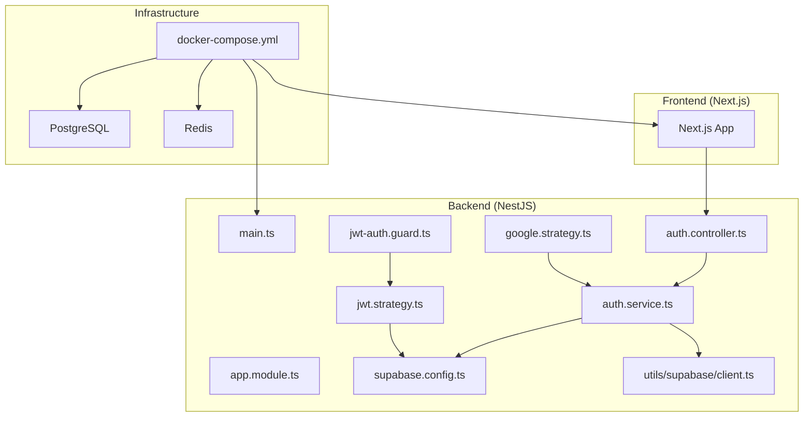
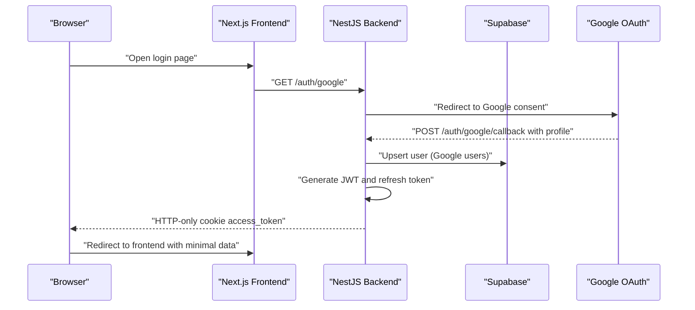
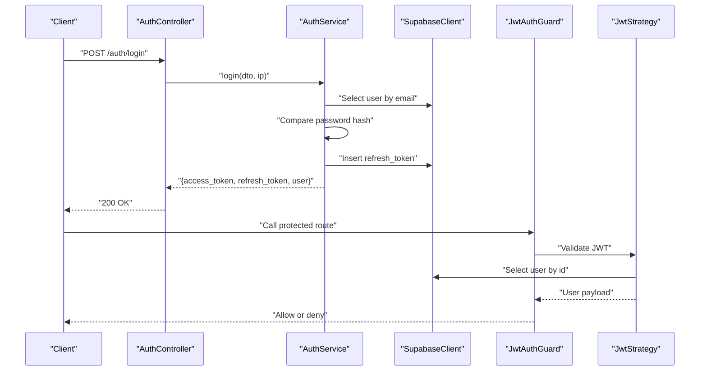
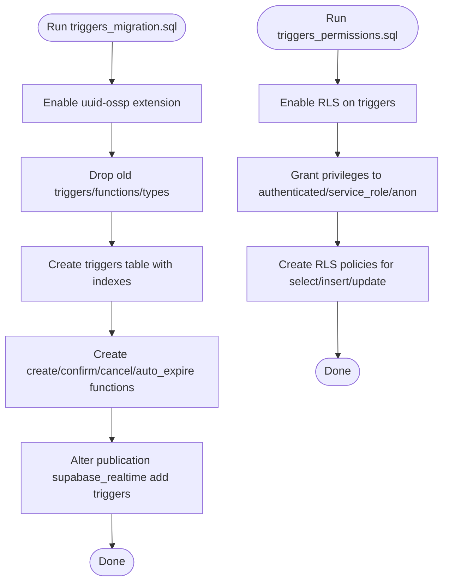
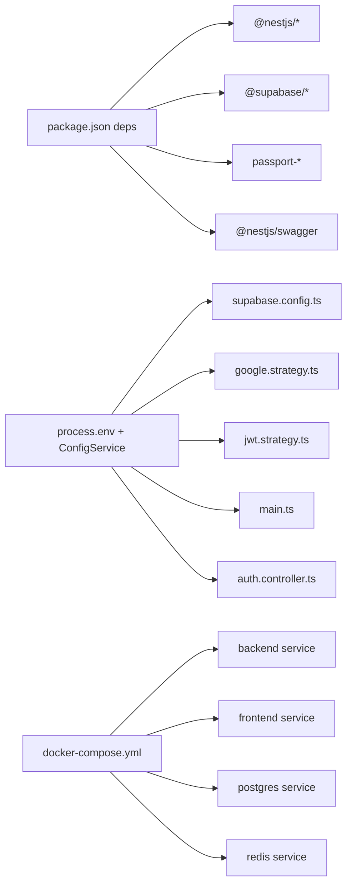

# Troubleshooting and FAQ

<cite>
**Referenced Files in This Document**
- [backend/src/main.ts](file://backend/src/main.ts)
- [backend/src/app.module.ts](file://backend/src/app.module.ts)
- [backend/src/config/supabase.config.ts](file://backend/src/config/supabase.config.ts)
- [backend/src/utils/supabase/client.ts](file://backend/src/utils/supabase/client.ts)
- [backend/src/modules/auth/auth.service.ts](file://backend/src/modules/auth/auth.service.ts)
- [backend/src/modules/auth/auth.controller.ts](file://backend/src/modules/auth/auth.controller.ts)
- [backend/src/modules/auth/strategies/jwt.strategy.ts](file://backend/src/modules/auth/strategies/jwt.strategy.ts)
- [backend/src/modules/auth/strategies/google.strategy.ts](file://backend/src/modules/auth/strategies/google.strategy.ts)
- [backend/src/common/guards/jwt-auth.guard.ts](file://backend/src/common/guards/jwt-auth.guard.ts)
- [backend/src/common/exceptions/app.exception.ts](file://backend/src/common/exceptions/app.exception.ts)
- [backend/package.json](file://backend/package.json)
- [docker-compose.yml](file://docker-compose.yml)
- [GOOGLE_OAUTH_SETUP.md](file://GOOGLE_OAUTH_SETUP.md)
- [backend/sql/triggers_migration.sql](file://backend/sql/triggers_migration.sql)
- [backend/sql/triggers_permissions.sql](file://backend/sql/triggers_permissions.sql)
</cite>

## Table of Contents
1. [Introduction](#introduction)
2. [Project Structure](#project-structure)
3. [Core Components](#core-components)
4. [Architecture Overview](#architecture-overview)
5. [Detailed Component Analysis](#detailed-component-analysis)
6. [Dependency Analysis](#dependency-analysis)
7. [Performance Considerations](#performance-considerations)
8. [Troubleshooting Guide](#troubleshooting-guide)
9. [Conclusion](#conclusion)
10. [Appendices](#appendices)

## Introduction
This document provides comprehensive troubleshooting guidance for the MissLost application. It focuses on:
- Authentication issues related to JWT tokens and Google OAuth
- Database connection and PostgreSQL extension concerns via Supabase
- Performance optimization and scaling considerations
- Debugging procedures, error analysis, and log management
- Frequently asked questions covering installation, configuration, and runtime issues
- Step-by-step resolutions for common scenarios such as failed migrations, authentication failures, and API connectivity issues
- Monitoring, alerting, and maintenance strategies for production

## Project Structure
The application follows a modular NestJS backend architecture with Supabase integration for authentication and data persistence. The frontend is a Next.js application. Docker Compose orchestrates backend, frontend, PostgreSQL, and Redis services.

**Diagram sources**
- [backend/src/main.ts:1-45](file://backend/src/main.ts#L1-L45)
- [backend/src/app.module.ts:1-67](file://backend/src/app.module.ts#L1-L67)
- [backend/src/config/supabase.config.ts:1-25](file://backend/src/config/supabase.config.ts#L1-L25)
- [backend/src/utils/supabase/client.ts:1-19](file://backend/src/utils/supabase/client.ts#L1-L19)
- [backend/src/modules/auth/auth.service.ts:1-274](file://backend/src/modules/auth/auth.service.ts#L1-L274)
- [backend/src/modules/auth/auth.controller.ts:1-128](file://backend/src/modules/auth/auth.controller.ts#L1-L128)
- [backend/src/modules/auth/strategies/jwt.strategy.ts:1-40](file://backend/src/modules/auth/strategies/jwt.strategy.ts#L1-L40)
- [backend/src/modules/auth/strategies/google.strategy.ts:1-38](file://backend/src/modules/auth/strategies/google.strategy.ts#L1-L38)
- [backend/src/common/guards/jwt-auth.guard.ts:1-29](file://backend/src/common/guards/jwt-auth.guard.ts#L1-L29)
- [docker-compose.yml:1-61](file://docker-compose.yml#L1-L61)

**Section sources**
- [backend/src/main.ts:1-45](file://backend/src/main.ts#L1-L45)
- [backend/src/app.module.ts:1-67](file://backend/src/app.module.ts#L1-L67)
- [docker-compose.yml:1-61](file://docker-compose.yml#L1-L61)

## Core Components
- Bootstrap and middleware: Cookie parsing, CORS, Swagger, global validation pipe, and port configuration.
- Supabase client initialization with environment checks for URL and keys.
- Authentication module: Registration, login, logout, email verification, forgot/reset password, and Google OAuth.
- Guards and strategies: JWT guard and strategy, Google OAuth strategy.
- Database triggers and permissions: Migration script enabling uuid extension, triggers table, indexes, functions, and RLS policies.

**Section sources**
- [backend/src/main.ts:7-43](file://backend/src/main.ts#L7-L43)
- [backend/src/config/supabase.config.ts:7-23](file://backend/src/config/supabase.config.ts#L7-L23)
- [backend/src/modules/auth/auth.service.ts:21-167](file://backend/src/modules/auth/auth.service.ts#L21-L167)
- [backend/src/modules/auth/auth.controller.ts:31-126](file://backend/src/modules/auth/auth.controller.ts#L31-L126)
- [backend/src/modules/auth/strategies/jwt.strategy.ts:16-38](file://backend/src/modules/auth/strategies/jwt.strategy.ts#L16-L38)
- [backend/src/modules/auth/strategies/google.strategy.ts:6-36](file://backend/src/modules/auth/strategies/google.strategy.ts#L6-L36)
- [backend/src/common/guards/jwt-auth.guard.ts:7-27](file://backend/src/common/guards/jwt-auth.guard.ts#L7-L27)
- [backend/sql/triggers_migration.sql:1-338](file://backend/sql/triggers_migration.sql#L1-L338)
- [backend/sql/triggers_permissions.sql:1-57](file://backend/sql/triggers_permissions.sql#L1-L57)

## Architecture Overview
The backend exposes authentication endpoints and integrates with Supabase for user data and sessions. Google OAuth redirects to Google, then back to the backend, which issues an HTTP-only cookie and redirects to the frontend. JWT guard enforces protected routes.

**Diagram sources**
- [backend/src/modules/auth/auth.controller.ts:85-126](file://backend/src/modules/auth/auth.controller.ts#L85-L126)
- [backend/src/modules/auth/auth.service.ts:112-167](file://backend/src/modules/auth/auth.service.ts#L112-L167)
- [backend/src/modules/auth/strategies/google.strategy.ts:17-36](file://backend/src/modules/auth/strategies/google.strategy.ts#L17-L36)
- [backend/src/modules/auth/strategies/jwt.strategy.ts:26-38](file://backend/src/modules/auth/strategies/jwt.strategy.ts#L26-L38)

## Detailed Component Analysis

### Authentication Flow (JWT and Google OAuth)
- JWT Strategy validates tokens against Supabase users and checks account status.
- Google Strategy extracts profile info and constructs a safe user object.
- Auth Controller handles redirects, cookie setting, and error propagation.
- Auth Service manages registration, login/logout, email verification, and password reset flows.

**Diagram sources**
- [backend/src/modules/auth/auth.controller.ts:38-60](file://backend/src/modules/auth/auth.controller.ts#L38-L60)
- [backend/src/modules/auth/auth.service.ts:71-110](file://backend/src/modules/auth/auth.service.ts#L71-L110)
- [backend/src/modules/auth/strategies/jwt.strategy.ts:26-38](file://backend/src/modules/auth/strategies/jwt.strategy.ts#L26-L38)
- [backend/src/common/guards/jwt-auth.guard.ts:13-27](file://backend/src/common/guards/jwt-auth.guard.ts#L13-L27)

**Section sources**
- [backend/src/modules/auth/auth.controller.ts:38-126](file://backend/src/modules/auth/auth.controller.ts#L38-L126)
- [backend/src/modules/auth/auth.service.ts:21-274](file://backend/src/modules/auth/auth.service.ts#L21-L274)
- [backend/src/modules/auth/strategies/jwt.strategy.ts:16-38](file://backend/src/modules/auth/strategies/jwt.strategy.ts#L16-L38)
- [backend/src/modules/auth/strategies/google.strategy.ts:6-36](file://backend/src/modules/auth/strategies/google.strategy.ts#L6-L36)
- [backend/src/common/guards/jwt-auth.guard.ts:7-27](file://backend/src/common/guards/jwt-auth.guard.ts#L7-L27)

### Database Triggers and Permissions
- Migration script ensures uuid extension exists, drops old artifacts, creates triggers table, indexes, and functions.
- Permissions script enables RLS, grants table/function privileges, and defines policies for authenticated users and service_role.

**Diagram sources**
- [backend/sql/triggers_migration.sql:1-338](file://backend/sql/triggers_migration.sql#L1-L338)
- [backend/sql/triggers_permissions.sql:1-57](file://backend/sql/triggers_permissions.sql#L1-L57)

**Section sources**
- [backend/sql/triggers_migration.sql:1-338](file://backend/sql/triggers_migration.sql#L1-L338)
- [backend/sql/triggers_permissions.sql:1-57](file://backend/sql/triggers_permissions.sql#L1-L57)

## Dependency Analysis
- Runtime dependencies include NestJS core, Supabase JS client, Passport strategies, JWT, and Swagger.
- Environment variables are consumed via ConfigService and process.env.
- Docker Compose defines services for backend, frontend, PostgreSQL, and Redis.

**Diagram sources**
- [backend/package.json:22-46](file://backend/package.json#L22-L46)
- [backend/src/config/supabase.config.ts:9-14](file://backend/src/config/supabase.config.ts#L9-L14)
- [backend/src/modules/auth/strategies/google.strategy.ts:8-14](file://backend/src/modules/auth/strategies/google.strategy.ts#L8-L14)
- [backend/src/modules/auth/strategies/jwt.strategy.ts:18-24](file://backend/src/modules/auth/strategies/jwt.strategy.ts#L18-L24)
- [backend/src/main.ts:24-27](file://backend/src/main.ts#L24-L27)
- [backend/src/modules/auth/auth.controller.ts:52-58](file://backend/src/modules/auth/auth.controller.ts#L52-L58)
- [docker-compose.yml:3-47](file://docker-compose.yml#L3-L47)

**Section sources**
- [backend/package.json:22-46](file://backend/package.json#L22-L46)
- [docker-compose.yml:1-61](file://docker-compose.yml#L1-L61)

## Performance Considerations
- Token hashing cost: bcrypt cost is set in multiple places; tune for acceptable latency vs. security.
- Database queries: Prefer selective fields and indexes; avoid N+1 queries.
- Supabase client reuse: Clients are lazily initialized; ensure environment variables are present to avoid repeated reinitialization overhead.
- Background tasks: ScheduleModule is enabled; use it judiciously to avoid contention.
- CORS and cookies: Ensure correct SameSite and secure flags to reduce preflight and CSRF overhead.
- Container resources: Scale backend and database according to traffic; monitor CPU/memory and disk I/O.

[No sources needed since this section provides general guidance]

## Troubleshooting Guide

### Authentication Problems

#### JWT Token Issues
Symptoms:
- 401 Unauthorized on protected routes
- “Invalid token” or “account suspended” errors

Root causes and fixes:
- Missing or invalid JWT_SECRET environment variable. Ensure a strong secret is set and consistent across deployments.
- Token expiration: Adjust JWT expiry and align cookie maxAge with token lifetime.
- Account status: Suspended or pending accounts are rejected by the JWT strategy; verify user status in the database.

Debug steps:
- Confirm JWT_SECRET is present and loaded by ConfigService.
- Inspect Supabase users table for user status and id matching the token payload.
- Use browser dev tools to verify presence of HTTP-only access_token cookie and correct SameSite/secure flags.

**Section sources**
- [backend/src/modules/auth/strategies/jwt.strategy.ts:18-24](file://backend/src/modules/auth/strategies/jwt.strategy.ts#L18-L24)
- [backend/src/modules/auth/strategies/jwt.strategy.ts:26-38](file://backend/src/modules/auth/strategies/jwt.strategy.ts#L26-L38)
- [backend/src/common/guards/jwt-auth.guard.ts:22-27](file://backend/src/common/guards/jwt-auth.guard.ts#L22-L27)

#### Google OAuth Failures
Symptoms:
- Redirect_uri_mismatch
- invalid_client
- Users cannot log in

Root causes and fixes:
- Mismatched redirect URI in Google Console vs. GOOGLE_CALLBACK_URL.
- Incorrect GOOGLE_CLIENT_ID or GOOGLE_CLIENT_SECRET.
- App in testing mode without approved users.

Resolution steps:
- Match Authorized redirect URIs exactly with GOOGLE_CALLBACK_URL (including trailing slash).
- Verify credentials in .env and remove extra spaces.
- Publish the OAuth app if public access is required.

**Section sources**
- [GOOGLE_OAUTH_SETUP.md:96-118](file://GOOGLE_OAUTH_SETUP.md#L96-L118)
- [backend/src/modules/auth/strategies/google.strategy.ts:8-14](file://backend/src/modules/auth/strategies/google.strategy.ts#L8-L14)
- [backend/src/modules/auth/auth.controller.ts:94-126](file://backend/src/modules/auth/auth.controller.ts#L94-L126)

#### Logout and Cookie Handling
Symptoms:
- Stale session after logout
- Cookie not cleared

Fixes:
- Ensure logout endpoint clears the HTTP-only cookie with correct secure/sameSite/path.
- Align cookie expiry with JWT expiry.

**Section sources**
- [backend/src/modules/auth/auth.controller.ts:46-60](file://backend/src/modules/auth/auth.controller.ts#L46-L60)
- [backend/src/modules/auth/auth.controller.ts:52-58](file://backend/src/modules/auth/auth.controller.ts#L52-L58)

### Database Connection and PostgreSQL Extensions

#### Missing uuid-ossp Extension
Symptoms:
- Errors when creating triggers table or generating UUIDs

Fix:
- Run the migration script to enable the uuid-ossp extension before creating tables.

**Section sources**
- [backend/sql/triggers_migration.sql:1-2](file://backend/sql/triggers_migration.sql#L1-L2)

#### Supabase Client Initialization Errors
Symptoms:
- “Missing SUPABASE_URL or SUPABASE_SERVICE_ROLE_KEY” errors

Fix:
- Set SUPABASE_URL and SUPABASE_SERVICE_ROLE_KEY (or SUPABASE_ANON_KEY for anonymous client) in the backend environment.

**Section sources**
- [backend/src/config/supabase.config.ts:9-14](file://backend/src/config/supabase.config.ts#L9-L14)
- [backend/src/utils/supabase/client.ts:10-16](file://backend/src/utils/supabase/client.ts#L10-L16)

#### Triggers Table and Permissions
Symptoms:
- Access denied or insufficient privileges
- Functions not executable

Fix:
- Apply triggers_permissions.sql to enable RLS, grant privileges, and define policies.
- Ensure the triggers table exists and indexes are created.

**Section sources**
- [backend/sql/triggers_permissions.sql:6-57](file://backend/sql/triggers_permissions.sql#L6-L57)
- [backend/sql/triggers_migration.sql:30-57](file://backend/sql/triggers_migration.sql#L30-L57)

### API Connectivity and CORS Issues
Symptoms:
- Preflight failures or blocked requests
- CORS errors in browser console

Fix:
- Ensure FRONTEND_URL matches the origin sending credentials.
- Confirm credentials: true and appropriate allowed origins.

**Section sources**
- [backend/src/main.ts:24-27](file://backend/src/main.ts#L24-L27)

### Docker Container Networking Problems
Symptoms:
- Backend cannot reach frontend or vice versa
- Database or Redis unreachable

Fix:
- Confirm services are on the same network and use service names for internal communication.
- Check exposed ports and host bindings.
- Ensure depends_on order and health checks are respected.

**Section sources**
- [docker-compose.yml:3-25](file://docker-compose.yml#L3-L25)

### Environment Variable Misconfigurations
Symptoms:
- Application fails to start or throws missing env errors
- Authentication endpoints behave unexpectedly

Fix:
- Validate all required environment variables are present in the correct .env files.
- For Supabase: SUPABASE_URL, SUPABASE_SERVICE_ROLE_KEY (or SUPABASE_ANON_KEY).
- For OAuth: GOOGLE_CLIENT_ID, GOOGLE_CLIENT_SECRET, GOOGLE_CALLBACK_URL, FRONTEND_URL.
- For JWT: JWT_SECRET.

**Section sources**
- [backend/src/config/supabase.config.ts:9-14](file://backend/src/config/supabase.config.ts#L9-L14)
- [backend/src/utils/supabase/client.ts:10-16](file://backend/src/utils/supabase/client.ts#L10-L16)
- [backend/src/modules/auth/strategies/google.strategy.ts:8-14](file://backend/src/modules/auth/strategies/google.strategy.ts#L8-L14)
- [backend/src/modules/auth/strategies/jwt.strategy.ts:18-24](file://backend/src/modules/auth/strategies/jwt.strategy.ts#L18-L24)
- [GOOGLE_OAUTH_SETUP.md:55-63](file://GOOGLE_OAUTH_SETUP.md#L55-L63)

### Service Dependency Failures
Symptoms:
- Application starts but database-dependent features fail
- Redis-related features unavailable

Fix:
- Verify database and Redis containers are healthy and reachable.
- Confirm backend waits for dependencies if needed.

**Section sources**
- [docker-compose.yml:9-11](file://docker-compose.yml#L9-L11)
- [docker-compose.yml:21-23](file://docker-compose.yml#L21-L23)

### Step-by-Step Resolution Guides

#### Failed Migrations (Triggers)
1. Connect to the database and run triggers_migration.sql to create tables, indexes, and functions.
2. Apply triggers_permissions.sql to enable RLS and grant privileges.
3. Verify the triggers table exists and has required indexes.

**Section sources**
- [backend/sql/triggers_migration.sql:1-338](file://backend/sql/triggers_migration.sql#L1-L338)
- [backend/sql/triggers_permissions.sql:1-57](file://backend/sql/triggers_permissions.sql#L1-L57)

#### Authentication Failures (JWT)
1. Confirm JWT_SECRET is set and consistent.
2. Verify user exists and status is active.
3. Regenerate tokens and ensure cookies are HTTP-only and secure.

**Section sources**
- [backend/src/modules/auth/strategies/jwt.strategy.ts:18-24](file://backend/src/modules/auth/strategies/jwt.strategy.ts#L18-L24)
- [backend/src/modules/auth/auth.service.ts:93-110](file://backend/src/modules/auth/auth.service.ts#L93-L110)
- [backend/src/modules/auth/auth.controller.ts:52-58](file://backend/src/modules/auth/auth.controller.ts#L52-L58)

#### Google OAuth Redirect Issues
1. Match Authorized redirect URIs with GOOGLE_CALLBACK_URL.
2. Recheck GOOGLE_CLIENT_ID and GOOGLE_CLIENT_SECRET.
3. Publish the OAuth app if public access is required.

**Section sources**
- [GOOGLE_OAUTH_SETUP.md:96-118](file://GOOGLE_OAUTH_SETUP.md#L96-L118)
- [backend/src/modules/auth/strategies/google.strategy.ts:8-14](file://backend/src/modules/auth/strategies/google.strategy.ts#L8-L14)

#### API Connectivity Issues
1. Verify FRONTEND_URL and allowed origins.
2. Enable credentials and ensure SameSite/lax behavior.
3. Check CORS configuration in main.ts.

**Section sources**
- [backend/src/main.ts:24-27](file://backend/src/main.ts#L24-L27)

### Debugging Procedures and Error Analysis
- Development tools:
  - Use start:dev and start:debug scripts for hot reload and debugging.
  - Enable NestJS logging and inspect console logs for startup and runtime errors.
- Error handling:
  - Centralized exceptions via AppException subclasses.
  - Unauthorized/Forbidden/Conflict/Validation exceptions provide structured responses.
- Log management:
  - Capture console logs from containers.
  - For production, integrate structured logging and centralized log aggregation.

**Section sources**
- [backend/package.json:8-20](file://backend/package.json#L8-L20)
- [backend/src/common/exceptions/app.exception.ts:3-45](file://backend/src/common/exceptions/app.exception.ts#L3-L45)

### Frequently Asked Questions

Q: How do I fix “redirect_uri_mismatch”?
A: Ensure the redirect URI in Google Console exactly matches GOOGLE_CALLBACK_URL, including trailing slash.

Q: Why does login fail with “invalid_client”?
A: Verify GOOGLE_CLIENT_ID and GOOGLE_CLIENT_SECRET are correct and free of extra spaces.

Q: My frontend cannot connect to the backend. What should I check?
A: Confirm CORS origin and credentials settings, and ensure the backend is listening on the expected port.

Q: How do I enable Supabase triggers?
A: Run triggers_migration.sql and triggers_permissions.sql on the database.

Q: How do I configure environment variables?
A: Set SUPABASE_URL, SUPABASE_SERVICE_ROLE_KEY, GOOGLE_* variables, JWT_SECRET, and FRONTEND_URL in the backend .env.

Q: How do I scale the application?
A: Scale backend pods horizontally and provision read replicas for PostgreSQL if needed. Monitor CPU and memory usage.

**Section sources**
- [GOOGLE_OAUTH_SETUP.md:96-118](file://GOOGLE_OAUTH_SETUP.md#L96-L118)
- [backend/src/main.ts:24-27](file://backend/src/main.ts#L24-L27)
- [backend/sql/triggers_migration.sql:1-338](file://backend/sql/triggers_migration.sql#L1-L338)
- [backend/sql/triggers_permissions.sql:1-57](file://backend/sql/triggers_permissions.sql#L1-L57)
- [GOOGLE_OAUTH_SETUP.md:55-63](file://GOOGLE_OAUTH_SETUP.md#L55-L63)

## Conclusion
By validating environment variables, ensuring correct OAuth configuration, applying database migrations and permissions, and leveraging structured logging and guards, most issues in MissLost can be resolved quickly. Use the provided step-by-step guides and monitoring strategies to maintain reliability and performance in production.

[No sources needed since this section summarizes without analyzing specific files]

## Appendices

### Monitoring and Alerting Strategies
- Metrics: Track request latency, error rates, database query duration, and queue sizes.
- Logs: Centralize application logs and correlate with request IDs.
- Health checks: Expose readiness/liveness endpoints and integrate with Kubernetes or container orchestration.
- Alerts: Notify on elevated error rates, slow endpoints, and database connectivity issues.

[No sources needed since this section provides general guidance]

### Maintenance Procedures
- Database cleanup: Archive or prune old records in auth_tokens and refresh_tokens periodically.
- Index tuning: Monitor slow queries and add/remove indexes based on usage patterns.
- Supabase maintenance: Keep RLS policies and function grants aligned with schema changes.

[No sources needed since this section provides general guidance]